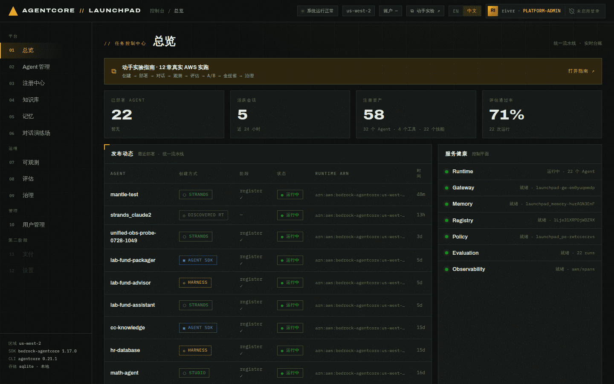

# 第 01 章 · 实验环境准备与控制台导览

> **目标**：把 AgentCore Launchpad 跑在本地，确认它已经连上你自己 AWS 账号里的真实
> AgentCore 服务，并认识控制台的 11 个模块分别对应哪个 AgentCore 能力。
>
> **前置条件**：一个开启了 Bedrock AgentCore 预览的 AWS 账号（`us-west-2`）、管理员级凭证、
> `uv ≥ 0.8`、`Node.js ≥ 20`、AWS CDK CLI v2、Docker（仅方式A 容器路径需要）。
>
> **预计耗时**：首次约 15–20 分钟（其中 `make bootstrap` 约 8–12 分钟）；已引导过的环境约 2 分钟。
>
> **本章将创建的 AWS 资源**：`make bootstrap` 创建的共享基础设施（S3 产物桶、ECR 仓库、
> CodeBuild 项目、Cognito 用户池、IAM 执行角色、AgentCore Registry / Memory / Gateway /
> Policy Engine 单例）。**本章不创建任何 Agent。**

---

## 1.1 确认前置工具与 AWS 凭证

```bash
uv --version          # ≥ 0.8
node --version        # ≥ 20
cdk --version         # v2
docker --version      # 仅方式A 需要
aws sts get-caller-identity
```

**预期结果**：`get-caller-identity` 返回你的账号与角色，例如：

```json
{
    "UserId": "AROAWKJXDSGK5D7ZWT4CB:i-0785d8d0b8b950448",
    "Account": "12345678900",
    "Arn": "arn:aws:sts::12345678900:assumed-role/admin_role_for_workshop/i-0785d8d0b8b950448"
}
```

> 本实验全程在 `us-west-2`。如果你的默认区域不是它，请显式设置
> `export AWS_REGION=us-west-2`，否则 bootstrap 会在错误区域建资源。

每个账号/区域还需要执行一次 CDK bootstrap（已做过可跳过）：

```bash
cdk bootstrap aws://<ACCOUNT_ID>/us-west-2
```

## 1.2 安装依赖

```bash
cd backend  && uv sync && cd ..
cd frontend && npm install && cd ..
cd infra    && uv sync && cd ..
```

**预期结果**：三个目录各自完成依赖安装；后端与 infra 生成 `.venv`，前端生成 `node_modules`。
本仓库所有 Python 命令都通过 `uv run` 执行，**不要**直接用 `python` / `pip`。

## 1.3 一次性引导：`make bootstrap`

```bash
make bootstrap        # = cd backend && uv run python ../scripts/bootstrap.py
```

这个命令可以重复执行：CDK 栈只在缺失时部署，AgentCore 单例只创建一次，重跑会打印
`reused`。它创建/复用下列资源，并把结果写入 `config/launchpad.yaml`：

| 资源类别 | 名称（本次实验环境的实际值） |
|---|---|
| S3 产物桶 | `launchpad-artifacts-<ACCOUNT_ID>-us-west-2` |
| ECR 仓库 | `launchpad-agents` |
| CodeBuild（ARM64） | `launchpad-agent-builder` |
| IAM 执行角色 | `launchpad-agent-execution-role` |
| Cognito 用户池 | `launchpad-users`（含演示用户 `river` / `demo`） |
| AgentCore Registry | `launchpad-registry` |
| AgentCore Memory | `launchpad_memory`（短期事件 + 语义/用户偏好长期策略） |
| AgentCore Gateway | `launchpad-gw-<suffix>`（把 REST API 与 Lambda 暴露成 MCP 工具） |
| AgentCore Policy Engine | `launchpad-pe-<suffix>` |

**预期结果**：命令结束后 `config/launchpad.yaml` 存在，且包含 `region`、`account_id`、
`resources.*`（gateway_id / registry_id / memory_id / execution_role_arn …）。这个文件
**已被 gitignore**，其中含演示用户密码，按本地机密对待。

> **注意**：编写本指南时**没有重跑**本章的 bootstrap（实验环境早已完成引导，重跑不会
> 产生新信息）。命令与产物清单依据 `docs/setup.zh-CN.md` 以及当前 `config/launchpad.yaml`
> 中实际存在的键值校对。

## 1.4 启动本地栈

两种方式，任选其一：

```bash
./start.py            # 后台开发模式，日志与进程记录在 .run/
make dev              # 前台模式，占用当前终端（本指南使用这种）
```

健康检查：

```bash
curl -s http://127.0.0.1:8000/api/health
# {"status":"ok","version":"0.1.0","region":"us-west-2"}
```

| 服务 | 地址 | 端口覆盖变量 |
|---|---|---|
| 平台后端（FastAPI） | http://127.0.0.1:8000 | `PLATFORM_API_PORT` |
| 平台控制台（Vite） | http://127.0.0.1:5173 | `PLATFORM_UI_PORT` |
| API 文档（经前端代理） | http://127.0.0.1:5173/api/docs | — |

**预期结果**：浏览器打开 `http://localhost:5173` 出现控制台；右上角显示
`● 系统运行正常`、`us-west-2`。

## 1.5 控制台导览

打开控制台后先点右上角 **中文** 切换语言（本指南所有截图均为中文界面）。


*图 1-1：总览页。左侧是 12 个模块，右侧「服务健康」逐项反映真实 AgentCore 资源状态。
顶部那条「动手实验指南」横幅就是本指南的入口。列表里的 `AGENT SDK` 角标对应第 03 章的
容器方式（原先叫 `CLAUDE SDK`）。*

先看三块信息：

1. **左侧导航 = 实验路线图**
   `01 总览` → `02 Agent 管理`（创建/部署/重新发布） → `03 注册中心`（Registry 资产）
   → `04 知识库` → `05 记忆` → `06 对话演练场` → `07 可观测` → `08 评估` → `09 治理`。
   `10 用户管理` 是管理员账号维护，`11 支付` / `12 设置` 属第二阶段，三者本实验都不涉及。
2. **服务健康面板**：Runtime / Gateway / Memory / Registry / Policy / Evaluation /
   Observability 七项。其中 Gateway / Memory / Registry / Policy / Observability 由
   bootstrap 创建，显示 `就绪` 与真实资源 id（如 `launchpad_memory-hurAGN3EnF`）；
   不是绿色就说明 bootstrap 未完成或权限不足，先解决它再往下做。
   Runtime 与 Evaluation 统计的是**你自己创建的东西**（已部署 Agent、已完成评估），
   全新账号上显示空心灯 + `尚未创建 · 部署首个 Agent 后点亮` / `运行首次评估后点亮`，
   这是预期状态，不是故障。
3. **左下角环境信息**：`区域 us-west-2`、`SDK bedrock-agentcore 1.17.0`、
   `CLI agentcore 0.21.1`、`存储 sqlite · 本地`。

> 顶部四个统计卡（已部署 Agent / 活跃会话 / 注册资产 / 评估通过率）读的是**本地台账 +
> AWS 真实状态**。如果你的账号是全新的，这些数字都是 0，属正常现象；完成后续章节后，
> 数字会随资源和流量一起变化。

## 1.6 认识后端 API（可选但建议）

打开 http://127.0.0.1:5173/api/docs ，这里列出了控制台所用的 FastAPI 接口。实验中会用到的
关键路由：

| 路由 | 用途 | 对应章节 |
|---|---|---|
| `POST /api/agents` | 创建并部署 Agent（返回 `202` + `job_id`） | 02 / 03 |
| `GET /api/jobs/{id}` | 部署任务的逐阶段 JSONL 事件 | 02 |
| `POST /api/chat/{agent_id}` | 控制台对话入口 | 05 |
| `POST /v1/agents/{id}/invoke` | 公共 API（`X-Api-Key` 鉴权） | 06（可选） |
| `GET /api/observability/*` | 仪表盘 / 会话 / 追踪 | 07 |
| `POST /api/eval/runs` | 批量评估与洞察 | 08 |
| `POST /api/experiments/{id}/action` | A/B 实验分步动作 | 09 |

> `/api/*` 是控制台内部接口，`/v1/*` 是给外部系统的公共接口。两者共用同一条 invoke
> 链路，差别只在鉴权。第 06 章会验证这一点。

---

## 本章验证清单

- [ ] `aws sts get-caller-identity` 返回正确账号，区域为 `us-west-2`
- [ ] `config/launchpad.yaml` 存在且含 `resources.gateway_id` / `memory_id` / `registry_id`
- [ ] `curl http://127.0.0.1:8000/api/health` 返回 `status: ok`
- [ ] 控制台可打开，右上角显示 `● 系统运行正常`
- [ ] 「服务健康」面板中 Gateway / Memory / Registry / Policy / Observability 五项为绿色
      「就绪」；Runtime 与 Evaluation 显示「尚未创建」（全新账号的预期状态）
- [ ] 界面已切换到中文

## 常见问题

| 现象 | 原因 | 处理 |
|---|---|---|
| 控制台打不开，端口 5173 无监听 | Vite 端口被占用后会自动漂移到 5174 | 看 `make dev` 输出里的实际端口，或用 `PLATFORM_UI_PORT` 指定 |
| 「服务健康」中 bootstrap 类某项显示「等待引导初始化」 | bootstrap 未跑完，或该 AgentCore 预览未在账号开通 | 重跑 `make bootstrap`（幂等），仍失败查 `docs/troubleshooting.zh-CN.md` |
| Runtime / Evaluation 显示「尚未创建」 | 这两项统计你自己创建的资源，全新账号本来就是空的 | 正常，第 02 章部署 Agent、第 08 章跑评估后自动点亮 |
| 页面能开但所有列表为空、统计为 0 | 账号是全新的，还没有任何 Agent | 正常，继续第 02 章 |
| `make bootstrap` 报 CDK 未 bootstrap | 账号/区域缺少 CDK 引导 | `cdk bootstrap aws://<ACCOUNT_ID>/us-west-2` 后重跑 |
| 后端起不来，报 `config` 相关 KeyError | 缺少 `config/launchpad.yaml` | 先执行 `make bootstrap` |

---

下一章：[第 02 章 · 部署第一个 Agent（Strands ZIP 快速通道）](02-deploy-runtime.md)
