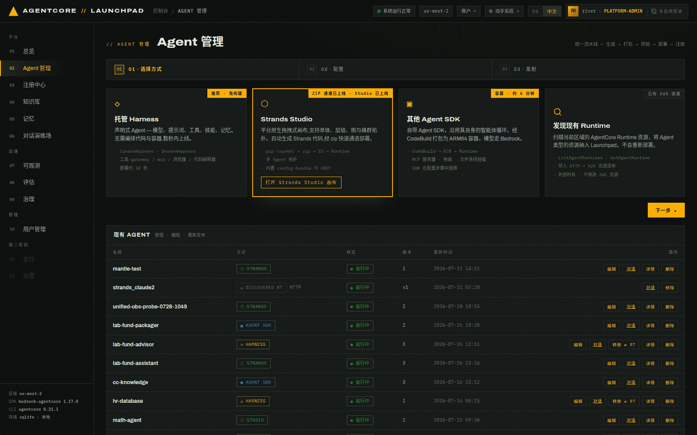
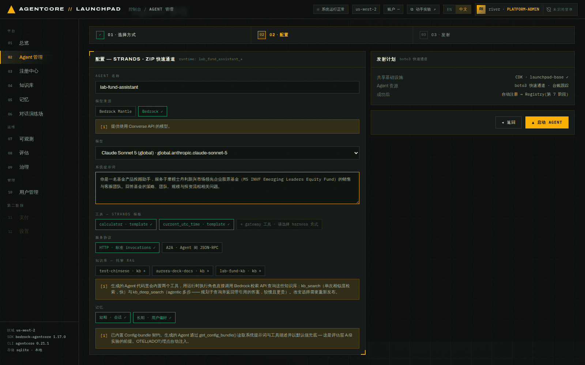
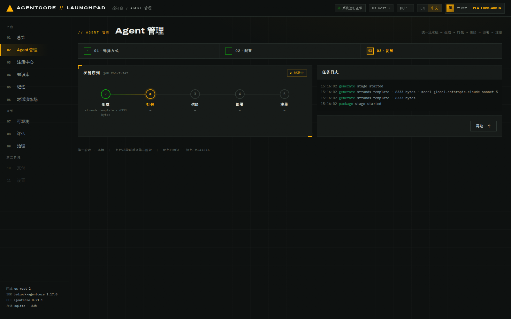
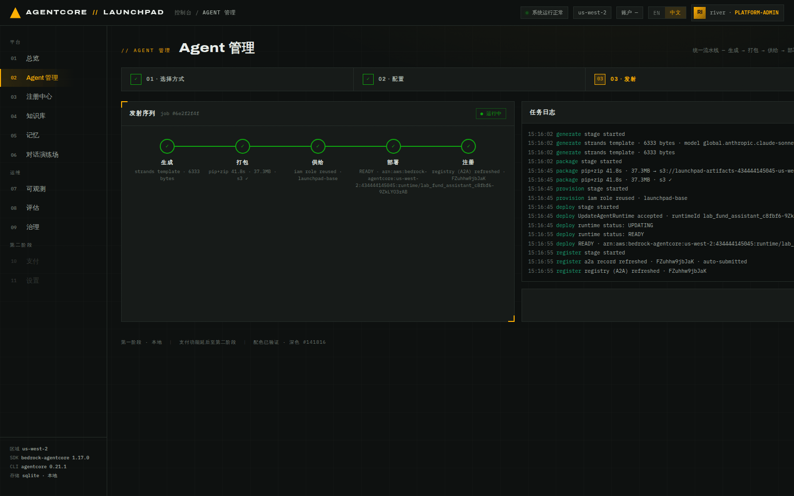
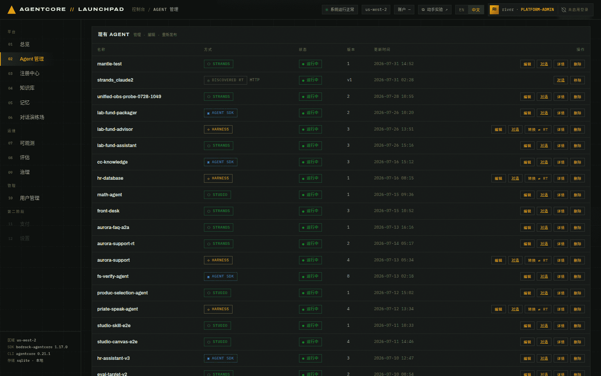

# 第 02 章 · 部署第一个 Agent（Strands · ZIP 快速通道）

> **目标**：用「Strands Studio / ZIP 快速通道」方式创建并部署本实验的主线 Agent
> `lab-fund-assistant`，走完统一五阶段流水线，理解每个阶段到底对 AWS 做了什么。
>
> **前置条件**：完成[第 01 章](01-environment.md)，服务健康里 bootstrap 类五项全绿
> （Runtime 此时仍是「尚未创建」，本章结束后点亮）。
>
> **本章将创建的 AWS 资源**：1 个 AgentCore Runtime、1 个 S3 部署包对象、1 条
> AgentCore Registry A2A 记录。

---

## 2.0 为什么主线 Agent 用 ZIP 通道

平台有三种创建方式，能力**不等价**。后面章节要用的高级能力对方式有硬性要求，先看下面这张表
（这也是本实验要建两个 Agent 的原因）。表格列序与 `/create` 页上的卡片顺序一致；页面上还有
第四张卡片 `发现现有 Runtime`，它不是创建方式，而是把账号里已存在的 Runtime 纳管进来：

| 能力 | 托管 Harness（方式B） | Strands ZIP（方式C · 表单） | Strands 画布（方式C · Studio） | 其他 Agent SDK · 容器（方式A） |
|---|---|---|---|---|
| 部署特点 | 无构建产物 | 本地打包后上传 S3 | 本地打包后上传 S3 | CodeBuild 构建并推送 ECR |
| 挂载知识库（托管 RAG） | 支持：网关 `Retrieve` + `AgenticRetrieveStream` | 支持：`kb_search`（单次）+ `kb_deep_search`（agentic 多步） | 不支持 | 支持：`kb_search`（单次）+ `kb_deep_search`（agentic 多步） |
| 挂载 Registry 技能 / MCP | 支持 | 模板内置工具 | 画布节点 | 支持 |
| 可被评估（第 08 章） | 支持 | 支持 | 支持 | 支持 |
| **配置包 A/B 实验**（第 09 章） | 明确不支持 | **支持，仅此方式** | 不支持 | 不支持 |
| **Runtime 金丝雀**（第 10 章） | 不支持 | 支持 | 支持 | 暂不支持 |
| `模型来源` 选择器 | 有（默认 Mantle） | 有（默认 Mantle；A2A 子模式固定 Bedrock） | 画布上按节点选 provider | 无，固定 Bedrock Converse，只提供 Claude 模型 |

> Harness 不能做配置包 A/B，原因有两个：它背后的 Runtime 是「被 Harness 托管」的，
> 不允许直接 `InvokeAgentRuntime`；而且导出的 Harness 代码里没有读取配置包的逻辑，
> A/B 变体对它是空操作。所以第 09/10 章必须落在 ZIP 通道生成的 Agent 上。

> **Harness、其他 Agent SDK 容器和 Strands ZIP 都能挂载托管知识库，也都支持单次检索与多步
> agentic 检索。**底层分为两条挂载通道（第 04 章会实际跑一遍）：
> Harness 走专用 MCP 网关 `launchpad-kb-gw`，拿到逐库 `…___Retrieve` 和跨库多步的
> `…___AgenticRetrieveStream` 两类工具；容器与 ZIP 是自己写代码的 Runtime，没有网关的
> OAuth 通道，平台改为在生成的代码里内置**两个**工具，用**运行时执行角色的 IAM 权限**
> 直接调 Bedrock 检索数据面：
>
> - `kb_search` → `Retrieve`：一次相似度检索，不消耗模型调用。
> - `kb_deep_search` → `AgenticRetrieveStream`：由基础模型驱动的规划循环，拆子查询、
>   跨库多轮检索（必要时整篇拉取文档），返回带引用的答案 + 支撑段落。每轮规划都会调用模型，
>   因此通常明显慢于单次检索。
>
> 生成的系统提示词会告诉模型该用哪个（比对/列举/汇总走深检索，单点事实走快检索）。
> 两条通道的**检索能力现在等价**，剩下的差别是形态：Harness 的工具由网关托管、绑定哪些库
> 由平台在 target 上配；容器/ZIP 的检索逻辑就写在你能看到、能改的生成代码里。
> 画布方式暂不支持：它的代码由 Studio 生成，平台没有注入检索工具的位置。

因此主线 Agent 选 **Strands · ZIP 快速通道**：它由平台生成代码，**内置 config-bundle 契约**
（通过 `get_config_bundle()` 读系统提示词与工具描述）与 ADOT 埋点，是 A/B 与金丝雀的前提。

## 2.1 进入创建向导

1. **打开** 控制台 → `02 Agent 管理`（`/create`）。
2. **观察** 页面顶部的三步导航：`01 · 选择方式` → `02 · 配置` → `03 · 发射`。
3. **选择** 第二张卡片 **Strands Studio**（角标 `ZIP 通道已上线 · Studio 已上线`），
   然后点右侧 **下一步 ▸**。


*图 2-1：创建入口卡片。卡片上直接标注了各自的 AWS 调用链路与部署耗时。*

> 四个入口从左到右是 **托管 Harness → Strands Studio → 其他 Agent SDK →
> 发现现有 Runtime**。第三张是原来的「Claude Agent SDK」卡片，现在它是一个**类别**，
> Claude Agent SDK 作为其二级选项（见[第 03 章 3.2](03-deploy-harness.md#32-方式a其他-agent-sdk--容器lab-fund-packager)）；
> 第四张不是创建方式，而是把账号里已存在的 Runtime 纳管进来。

> 卡片里的「打开 Strands Studio 画布」进入的是拖拽式多 Agent 编排画布（`/create/studio`），
> 生成的也是 zip runtime。本章走表单路径，配置更直观。

## 2.2 配置 Agent

按下表填写，其余保持默认：

| 字段 | 本实验取值 |
|---|---|
| AGENT 名称 | `lab-fund-assistant` |
| 模型来源 | 点 `Bedrock`（**默认是 `Bedrock Mantle`，本实验要改成 `Bedrock`**） |
| 模型 | `Claude Sonnet 5 (global) · global.anthropic.claude-sonnet-5` |
| 系统提示词 | `你是一名基金产品投顾助手，服务于摩根士丹利新兴市场领先企业股票基金（MS INVF Emerging Leaders Equity Fund）的销售与客服团队。回答基金的策略、团队、规模与投资流程相关问题。` |
| 工具 | `calculator`、`current_utc_time`（模板内置，默认勾选） |
| 服务协议 | `HTTP · 标准 invocations` |
| 记忆 | `短期 · 会话` + `长期 · 用户偏好`（都保持开启） |


*图 2-2：配置页。底部提示 Config-bundle 契约与 OTEL(ADOT) 埋点已自动注入。
第 07 章的追踪和第 09 章的 A/B 都依赖这两项能力。*

> **为什么要手动切回 `Bedrock`**：`模型来源` 决定模型走哪个托管面，
> `Bedrock Mantle`（Responses / Chat Completions API）或 `Bedrock`（Converse API）。
> ZIP 与 Harness 两个入口的表单默认值现在是 Mantle 的 `openai.gpt-5.6-terra`。
> 本实验统一使用 `claude-sonnet-5`，便于在后续章节比较 trace、评估和 A/B 结果。
> Mantle 侧无需任何 API Key
> （用运行时执行角色的 IAM 权限换取短时 token），你也可以自己另建一个 Agent 试。
> 注意 Mantle 的可用模型按区域不同：`openai.gpt-5.6-sol` 与 `openai.gpt-5.5`
> 只在 us-east-1 提供，而 Harness 只能在自己所在区域解析 Mantle 模型（请求体里
> 没有 region 字段），所以在 us-west-2 上给 Harness 选这两个会在首次调用时报 404。

> **刻意写一个"普通"的提示词**。第 09 章的优化推荐会分析它并给出改进版本，做成 A/B 对照。
> 如果这里就写得非常完善，那一章的对比就没什么可看的了。

**预期结果**：`▲ 启动 AGENT` 按钮从灰色变为可点击（名称为空时它是禁用的）。

## 2.3 部署并观察五阶段流水线

点击 **▲ 启动 AGENT**。页面跳到 `03 · 发射`，出现「发射序列」与「任务日志」两块面板。


*图 2-3：部署进行中。`生成` 已完成（绿勾），`打包` 正在执行（黄色高亮），后三个阶段待执行。
右侧任务日志实时追加事件。*

这五个阶段对所有创建方式都是同一条流水线（`backend/app/deployer/pipeline.py`）：

| 阶段 | ZIP 通道做的事 | 观察重点 |
|---|---|---|
| `生成 generate` | 渲染 Strands 代码模板 | 日志显示选定的模型 |
| `打包 package` | 安装 ARM64 wheel、生成 zip 并上传 S3 | 首次下载依赖时可能较慢 |
| `供给 provision` | 复用共享 IAM 执行角色（`launchpad-base`） | 角色被复用 |
| `部署 deploy` | `CreateAgentRuntime`，轮询至 `READY` | 状态从 `CREATING` 变为 `READY` |
| `注册 register` | 创建 A2A Registry 记录并自动提交 | 日志显示记录已创建 |


*图 2-4：五阶段全部完成。日志里可以看到 runtimeId、Runtime ARN 与 Registry 记录 id。*

> 图 2-3 / 2-4 展示的是**重新发布**，所以 `deploy` 行是 `UpdateAgentRuntime`。
> 首次创建时这一行会显示 `CreateAgentRuntime`，其余四个阶段相同。

**预期结果**：五个节点全绿，右上角状态变为 `● 运行中`。

## 2.4 用 API 复核部署结果

控制台是壳，真实状态在 AWS 与台账里。查一下：

```bash
# 列出已创建的 Agent
curl -s http://127.0.0.1:8000/api/agents | python3 -m json.tool | head -30
```

在返回结果中找到 `lab-fund-assistant`。字段形态如下，具体标识符以你的环境为准：

```json
{
  "id": "<ASSISTANT_ID>",
  "name": "lab-fund-assistant",
  "method": "zip_runtime",
  "status": "active",
  "arn": "arn:aws:bedrock-agentcore:us-west-2:<ACCT>:runtime/<RUNTIME_ID>",
  "resource_id": "<RUNTIME_ID>",
  "registry_record_id": "<RECORD_ID>",
  "version": "1"
}
```

> **记录**：记下返回的 `id`，后面章节记作 `<ASSISTANT_ID>`。

发射页会显示 job id。调用 `GET /api/jobs/{job_id}` 后，事件流应包含以下关键节点：

```json
{"stage":"generate","msg":"strands template · <SIZE> bytes · model global.anthropic.claude-sonnet-5"}
{"stage":"package","msg":"pip+zip <DURATION> · <SIZE> → s3://launchpad-artifacts-<ACCT>-us-west-2/agents/lab-fund-assistant/deployment_package.zip"}
{"stage":"provision","msg":"iam role reused · launchpad-base"}
{"stage":"deploy","msg":"CreateAgentRuntime accepted · runtimeId <RUNTIME_ID>"}
{"stage":"deploy","msg":"runtime status: READY"}
{"stage":"register","msg":"a2a record created · <RECORD_ID> · auto-submitted"}
```

> 重新发布会把 `CreateAgentRuntime` 换成 `UpdateAgentRuntime`，状态先变为 `UPDATING`，
> 再回到 `READY`。Runtime 不会重建，Registry 记录会刷新。

这套部署机制有三个要点：

- **异步可恢复**：`POST /api/agents` 立刻返回 `202` 和 `job_id`，部署在后台线程跑。
  后端重启时，`resume_pending_jobs()` 会从第一个未成功的阶段继续，因此每个阶段都必须幂等。
- **自动注册**：部署成功即在 AgentCore Registry 建一条 A2A 记录并自动提交，
  第 03 / 11 章会在注册中心看到它的审批状态。
- **AWS 才是事实来源**：本地 SQLite 台账只存标识符和派生进度，Runtime 状态每次都回读 AWS。

## 2.5 确认 Agent 出现在列表里

回到 `02 Agent 管理` 页面底部的「现有 AGENT」表格。


*图 2-5：表格按更新时间倒序，`lab-fund-assistant` 方式 `STRANDS`、状态 `运行中`。
每行右侧提供 编辑 / 对话 / 详情 / 删除；Harness 方式还多一个「转换 ⇄ RT」，
`发现现有 Runtime` 导入的行（`DISCOVERED RT`）因为不归平台所有，只有 对话 / 移除。
方式角标 `AGENT SDK` 就是第 03 章的容器方式（原来叫 `CLAUDE SDK`）。*

---

## 本章验证清单

- [ ] `lab-fund-assistant` 状态为 `运行中` / `active`
- [ ] `arn` 形如 `arn:aws:bedrock-agentcore:us-west-2:<ACCT>:runtime/lab_fund_assistant_...`
- [ ] `registry_record_id` 非空（自动注册成功）
- [ ] 五阶段面板全绿，任务日志包含 `runtime status: READY`
- [ ] 已记录 `<ASSISTANT_ID>`

## 常见问题

| 现象 | 原因 | 处理 |
|---|---|---|
| `打包` 阶段卡住 3 分钟以上 | ARM64 wheel 首次下载慢 | 耐心等待；日志会显示 `pip+zip <秒数>` |
| `部署` 阶段失败，报角色/权限 | 共享执行角色缺失 | 重跑 `make bootstrap` 修复 `launchpad-agent-execution-role` |
| 页面刷新后发射面板空了 | 前端状态不持久 | 用 `GET /api/agents/{id}` 或列表页查看真实状态，部署不受影响 |
| 状态停在 `deploying` 很久 | Runtime 仍在 `CREATING` | `GET /api/jobs/{job_id}` 看最后一条事件；正常约 20–60 秒 |
| 想改提示词 | 编辑后需重新发布 | 列表行「编辑」→ 重新发布；已有会话会继续用旧版本，验证时要开新会话 |
| 容器 / ZIP Agent 挂了知识库，但 `kb_search` / `kb_deep_search` 每次都回 `AccessDeniedException` | 执行角色还没有 `bedrock:Retrieve` / `bedrock:AgenticRetrieveStream`；**`make bootstrap` 只在栈不存在时才 `cdk deploy`**，老环境不会自动更新 | `cd infra && uv run cdk deploy --require-approval never`，然后重新提问，不必重新发布 Agent |

---

上一章：[第 01 章 · 环境准备](01-environment.md) ｜
下一章：[第 03 章 · 托管 Harness 与容器方式](03-deploy-harness.md)
