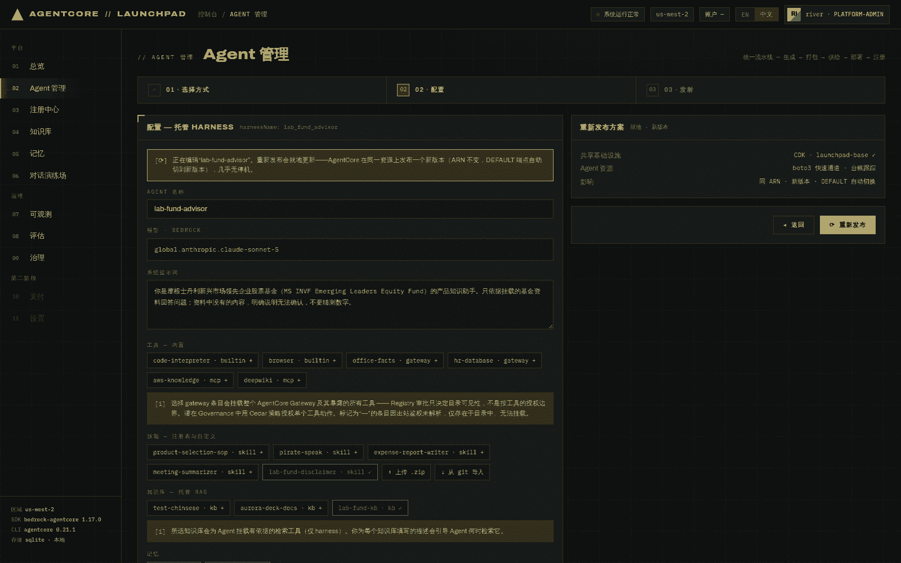
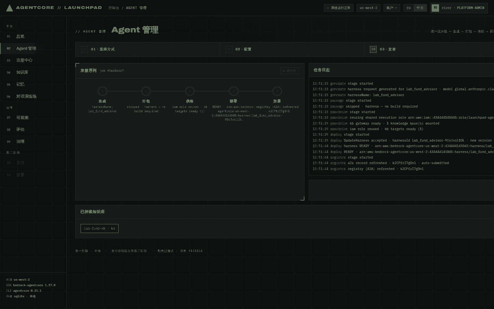
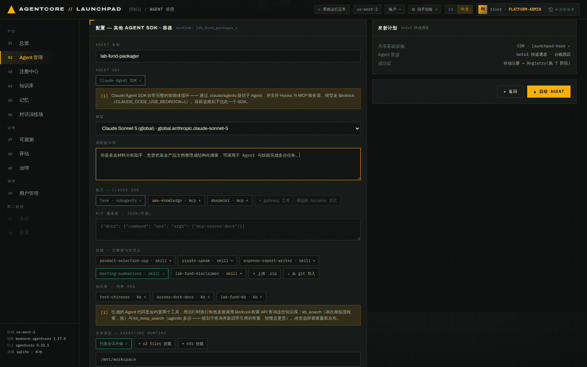
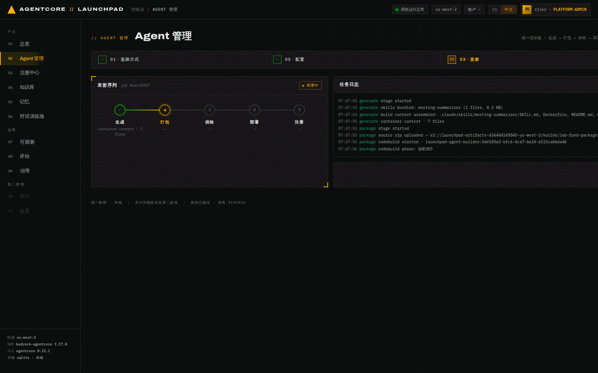
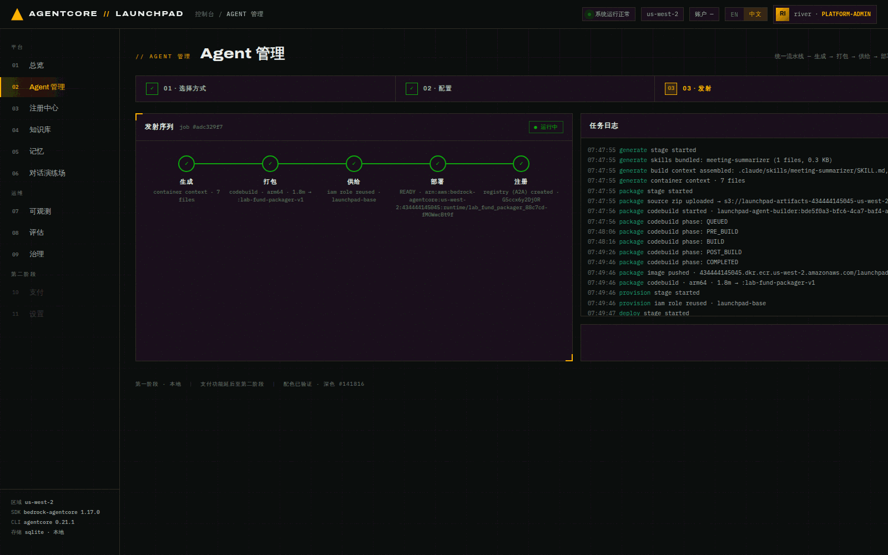

# 第 03 章 · 另外两种创建方式：托管 Harness 与 Claude SDK 容器

> **目标**：亲手体验另外两条创建路径——免构建的**托管 Harness**（方式B）与经 CodeBuild
> 打包的 **Claude Agent SDK 容器**（方式A），并理解「同一条五阶段流水线、不同阶段实现」。
>
> **前置条件**：完成[第 02 章](02-deploy-runtime.md)。容器方式需要账号里有
> `launchpad-agent-builder` CodeBuild 项目（`make bootstrap` 已创建）。
>
> **预计耗时**：约 10 分钟（本次实测 Harness **18 秒**、容器 **125 秒**）。
>
> **本章将创建的 AWS 资源**：1 个 AgentCore Harness、1 个 AgentCore Runtime（容器）、
> 1 个 ECR 镜像 tag、1 次 CodeBuild 构建、2 条 Registry A2A 记录。

---

## 3.1 方式B：托管 Harness（`lab-fund-advisor`）

Harness 是**声明式**的：你给出模型、提示词、工具、技能、知识库、记忆开关，AgentCore 直接托管
运行，没有任何构建产物。本实验用它承载「基金资料问答」，因为**只有 Harness 能挂载托管知识库**。

1. **打开** `02 Agent 管理`，选择第一张卡片 **托管 Harness**，点 **下一步 ▸**。
2. **填写**：

   | 字段 | 取值 |
   |---|---|
   | AGENT 名称 | `lab-fund-advisor` |
   | 模型 | `global.anthropic.claude-sonnet-5`（默认） |
   | 系统提示词 | `你是摩根士丹利新兴市场领先企业股票基金（MS INVF Emerging Leaders Equity Fund）的产品知识助手。只依据挂载的基金资料回答问题；资料中没有的内容，明确说明无法确认，不要猜测数字。` |
   | 工具 / 技能 / 知识库 | **本章都不选**——第 04 章再挂载 |
   | 记忆 | 短期 + 长期都开启 |


*图 3-1：Harness 配置页。工具区直接列出账号里可挂载的 gateway 工具（`office-facts`、
`hr-database`）与 MCP 服务器（`aws-knowledge`、`deepwiki`），技能区列出 Registry 里已审批的
技能，知识库区列出 ACTIVE 的托管 KB。*

> 注意工具区那条提示：**选择一个 gateway 条目会挂载整个 AgentCore Gateway 及其全部工具**。
> Registry 审批只决定「目录可见性」，不是按工具的授权边界；按动作授权要用第 11 章的 Cedar 策略。

3. **点击** `▲ 启动 AGENT`。


*图 3-2：Harness 部署完成。注意 `打包` 阶段显示 `skipped · harness — no build required`。*

本次实测事件流（**18 秒**完成）：

```json
{"stage":"generate","msg":"harness request generated for lab_fund_advisor · model global.anthropic.claude-sonnet-4-6"}
{"stage":"package","msg":"skipped · harness — no build required"}
{"stage":"provision","msg":"reusing shared execution role arn:aws:iam::…:role/launchpad-agent-execution-role"}
{"stage":"deploy","msg":"CreateHarness accepted · harnessId lab_fund_advisor-9IoJvol1OL"}
{"stage":"deploy","msg":"harness READY · arn:aws:bedrock-agentcore:us-west-2:…:harness/lab_fund_advisor-9IoJvol1OL"}
{"stage":"register","msg":"a2a record created · k2CPfzI7gOn1 · auto-submitted"}
```

> 同样，这份日志录于首次创建时（当时默认 `claude-sonnet-4-6`）。切到当前默认 `claude-sonnet-5`
> 的那次重新发布实测 **21 秒**，`deploy` 行为 `UpdateHarness accepted · … · new version 3`，
> `generate` 行为 `harness request generated for lab_fund_advisor · model
> global.anthropic.claude-sonnet-5`。

本次实验结果：

```json
{
  "id": "26f7707c0d964f988360e6a5b4f161e1",
  "name": "lab-fund-advisor",
  "method": "harness",
  "status": "active",
  "arn": "arn:aws:bedrock-agentcore:us-west-2:434444145045:harness/lab_fund_advisor-9IoJvol1OL",
  "registry_record_id": "k2CPfzI7gOn1"
}
```

> 📌 记下这个 id，后面记作 `<ADVISOR_ID>`。

**关于 Harness 的两个重要事实**（第 08–10 章会用到）：

- Harness 背后确实有一个 Runtime（名字形如 `harness_lab_fund_advisor`），但它是**被托管的**：
  直接 `InvokeAgentRuntime` 会报 `ValidationException … managed by a harness`，必须走
  `InvokeHarness`。
- 它的日志组只在**第一次被调用之后**才存在。所以第 08 章评估它之前，必须先在第 05 章跟它聊过一次，
  否则评估会报 `eval.harness_no_telemetry`。

## 3.2 方式A：Claude Agent SDK 容器（`lab-fund-packager`）

方式A 生成一个完整的 Claude Agent SDK 应用（支持子 Agent、Hooks、MCP 服务器），经 CodeBuild
打成 **ARM64** 镜像推到 ECR，再创建 Runtime。它是唯一能把 **Registry 技能物理打进镜像**
（`.claude/skills/`）的方式。

1. **打开** `02 Agent 管理`，选择 **Claude Agent SDK** 卡片，点 **下一步 ▸**。
2. **填写**：

   | 字段 | 取值 |
   |---|---|
   | AGENT 名称 | `lab-fund-packager` |
   | 系统提示词 | `你是基金材料分析助手，负责把基金产品文档整理成结构化摘要，可调用子 Agent 与技能完成多步任务。` |
   | 技能 | 勾选**任意一个已发布（APPROVED）的技能**（本次实跑勾的是 `meeting-summarizer`；
     你环境里可能是别的名字——第 04 章会自己登记一个，这里只是演示技能会被物理打进镜像） |
   | 文件系统 | 保持 `托管会话存储 ✓`，挂载路径 `/mnt/workspace` |


*图 3-3：容器配置页。除了技能，这里还能填自定义 MCP 服务器 JSON、挂载 S3 Files 或 EFS。
「托管会话存储」让同一会话在停止/恢复之间保留 `/mnt` 文件（闲置 14 天过期）。*

3. **点击** `▲ 启动 AGENT`，然后观察 `打包` 阶段——这次它真的在构建。


*图 3-4：`打包` 阶段逐步打印 CodeBuild 的 phase：`QUEUED → PRE_BUILD → BUILD → POST_BUILD
→ COMPLETED`。生成阶段的日志显示技能已被打进 `.claude/skills/meeting-summarizer/SKILL.md`。*


*图 3-5：容器方式五阶段完成，镜像 tag 为 `launchpad-agents:lab-fund-packager-v1`。*

本次实测事件流（**125 秒**完成，其中 CodeBuild 1.8 分钟）：

```json
{"stage":"generate","msg":"skills bundled: meeting-summarizer (1 files, 0.3 KB)"}
{"stage":"generate","msg":"build context assembled: .claude/skills/meeting-summarizer/SKILL.md, Dockerfile, README.md, buildspec.yml, main.py, requirements.txt, tracing.py"}
{"stage":"package","msg":"source zip uploaded → s3://launchpad-artifacts-…/builds/lab-fund-packager/source.zip"}
{"stage":"package","msg":"codebuild started · launchpad-agent-builder:bde5f0a3-…"}
{"stage":"package","msg":"codebuild phase: QUEUED → PRE_BUILD → BUILD → POST_BUILD → COMPLETED"}
{"stage":"package","msg":"image pushed · …dkr.ecr.us-west-2.amazonaws.com/launchpad-agents:lab-fund-packager-v1"}
{"stage":"package","msg":"codebuild · arm64 · 1.8m → :lab-fund-packager-v1"}
{"stage":"deploy","msg":"CreateAgentRuntime accepted · runtimeId lab_fund_packager_88c7cd-fMOWwcBt9f"}
{"stage":"register","msg":"a2a record created · G5ccx6y2DjOR · auto-submitted"}
```

> `tracing.py` 出现在构建上下文里是有原因的：Claude SDK 容器把 `claude` CLI 当子进程跑，
> ADOT 自动埋点看不见它，所以生成的 Agent **手工发射** gen_ai 遥测（`invoke_agent` 根 span、
> 每次工具调用一个 `execute_tool`、一个聚合 `chat` span 带 token 用量）。这就是第 07 章
> 容器 Agent 也能出现在追踪瀑布图里的原因。

> ⚠️ **容器方式部署完成后，务必手工调一次再往下走。** 五阶段全绿只说明镜像推上去了、
> Runtime 到了 `READY`，**不代表容器进程能起来**——平台目前没有部署后探活。本次实跑就在这里
> 撞到一个真实缺陷（依赖漂移导致容器启动即崩，已修复），过程见[第 05 章末](05-chat-memory.md#关于容器-agent-调用失败本次实测)。

## 3.3 三种方式对照（实测数据）

| | 方式B 托管 Harness | 方式A Claude SDK 容器 | 方式C Strands ZIP |
|---|---|---|---|
| 本实验 Agent | `lab-fund-advisor` | `lab-fund-packager` | `lab-fund-assistant` |
| **本次实测耗时** | **18 秒** | **125 秒** | **69 秒** |
| `generate` | 组装 `CreateHarness` 请求 | 组装 ARM64 构建上下文（7 文件） | 渲染 Strands 模板（6.3 KB） |
| `package` | **跳过**（无产物） | zip → S3 → CodeBuild → ECR | pip(arm64) → zip(37.3MB) → S3 |
| `provision` | 复用共享执行角色 | 复用共享执行角色 | 复用共享执行角色 |
| `deploy` | `CreateHarness` | `CreateAgentRuntime(containerConfiguration)` | `CreateAgentRuntime` |
| `register` | A2A 记录，自动提交 | A2A 记录，自动提交 | A2A 记录，自动提交 |
| 落在哪 | Harness 服务 | AgentCore Runtime | AgentCore Runtime |
| 挂知识库 | ✅ | ❌ | ❌ |
| 技能进镜像 | 声明式挂载 | ✅ `.claude/skills/` | ❌ |
| 配置包 A/B | ❌ | ❌ | ✅ |
| 金丝雀 | ❌ | ❌（后续支持） | ✅ |

**本章结束时，三个 Agent 应该都是 `运行中`**：

```bash
curl -s http://127.0.0.1:8000/api/agents | python3 -c "
import sys,json
for a in json.load(sys.stdin)['agents']:
  if a['name'].startswith('lab-'): print(a['id'],a['name'],a['method'],a['status'])"
```

```
3ca0341b0d354f63a64f6ae81598c9ba lab-fund-packager  container    active
26f7707c0d964f988360e6a5b4f161e1 lab-fund-advisor   harness      active
600f1e6695e64d408e2778b74209f7db lab-fund-assistant zip_runtime  active
```

---

## 本章验证清单

- [ ] `lab-fund-advisor`（harness）状态 active，ARN 里是 `:harness/`
- [ ] Harness 的 `打包` 阶段显示 `skipped`
- [ ] `lab-fund-packager`（container）状态 active，ARN 里是 `:runtime/`
- [ ] 容器日志出现 `image pushed · …/launchpad-agents:lab-fund-packager-v1`
- [ ] 容器生成日志出现 `skills bundled: <你勾选的技能名>`
- [ ] 三个 Agent 各自都有 `registry_record_id`

## 常见问题

| 现象 | 原因 | 处理 |
|---|---|---|
| 容器 `打包` 阶段停在 `QUEUED` 很久 | CodeBuild 并发排队 | 等待；本次 QUEUED→COMPLETED 共 1.8 分钟 |
| 容器构建失败在 `BUILD` | Dockerfile 依赖拉取失败或 ECR 权限 | 去 CodeBuild 控制台看 `launchpad-agent-builder` 的完整日志 |
| Harness 创建报模型不可用 | 该模型未在账号/区域开通 | 换成账号已开通的 Bedrock 模型 id |
| Harness 评估报 `eval.harness_no_telemetry` | 还没被调用过，日志组不存在 | 先完成第 05 章的对话，再回来评估 |
| 想把 Harness 变成可做 A/B 的 Runtime | 列表行有「转换 ⇄ RT」 | 转换会导出代码并植入 config-bundle graft，转换后就能做 A/B（本实验不走这条路） |
| 容器部署成功但**调用**报 `RuntimeClientError` | 修复前的依赖漂移缺陷（模板未锁 OTEL 小版本） | **已于 2026-07-26 修复并真机复验**；现象、根因与修复见[第 05 章末](05-chat-memory.md#关于容器-agent-调用失败本次实测)。若在旧检出上复现，先更新代码再重新发布 |

---

上一章：[第 02 章 · 部署第一个 Agent](02-deploy-runtime.md) ｜
下一章：[第 04 章 · 挂载能力：Registry 资产与知识库](04-capabilities.md)
