# 第 04 章 · 挂载能力：Registry 资产与托管知识库

> **目标**：给 `lab-fund-advisor` 装上"业务知识"和"行为规范"：把基金产品 PDF 做成托管知识库
> （AgentCore 之外的 Bedrock Managed RAG），把一份技能登记进 AgentCore Registry 并走完
> `DRAFT → 提交 → 批准`，最后两者一起挂到 Harness 上并重新发布。
>
> **前置条件**：完成[第 03 章](03-deploy-harness.md)，`lab-fund-advisor` 为 active。
> 准备好实验素材 PDF：[`assets/Morgan_Stanley_Oct_21_(EMEA).pdf`](assets/Morgan_Stanley_Oct_21_%28EMEA%29.pdf)
> （MS INVF Emerging Leaders Equity Fund 2021 年 8 月产品资料，40+ 页，含团队、AUM、投资流程、
> 持仓与业绩数据；第 08 章的评估基准答案就从这份材料里来）。
>
> **预计耗时**：约 15 分钟（本次实测：KB 创建到 ACTIVE 约 2 分钟，ingestion 2 分 15 秒，
> 技能登记+审批 < 1 分钟，Harness 重新发布 28 秒）。
>
> **本章将创建的 AWS 资源**：1 个 Bedrock 托管知识库（含向量库）、1 个 S3 数据源 + 上传的 PDF、
> 1 条 AgentCore Registry AGENT_SKILLS 记录、`launchpad-kb-gw` 上的 KB 连接器 target。

---

## 4.1 创建托管知识库并摄取 PDF

1. **打开** `04 知识库`。页面列出账号里已有的托管 KB 及其状态、数据源数、被几个 Agent 挂载。

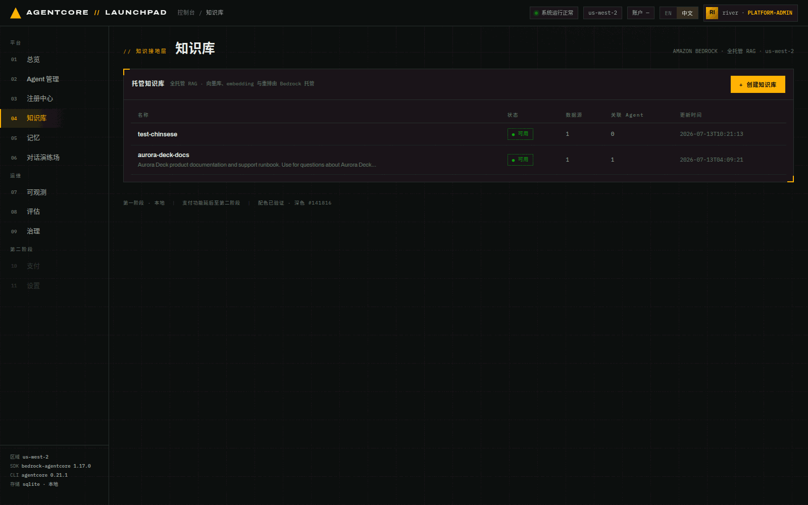
*图 4-1：托管知识库列表。向量库、embedding 与重排都由 Bedrock 托管，无需自建基础设施。*

2. **点击** `+ 创建知识库`，填写：

   | 字段 | 取值 |
   |---|---|
   | 名称 | `lab-fund-kb` |
   | 描述 | `摩根士丹利新兴市场领先企业股票基金（MS INVF Emerging Leaders Equity Fund）2021 年 8 月产品资料：投资团队、各策略资产规模、投资流程与组合构建规则、业绩与前十大持仓、ESG 与风险提示。回答该基金的团队、规模、流程、持仓与业绩问题时查询本知识库。` |
   | 数据源 | `上传文件` |
   | 文件 | `Morgan_Stanley_Oct_21_(EMEA).pdf` |

   > **注意**：描述会影响 Agent 何时查询这个知识库。写清楚
   > 「里面有什么、什么问题该查它」，检索命中率会明显不同。

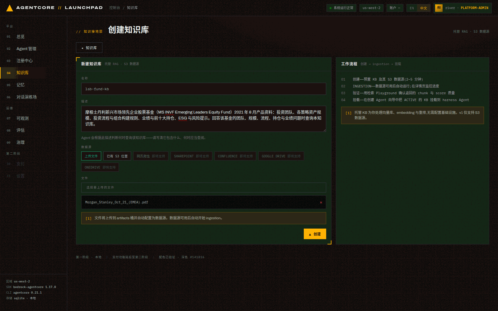
*图 4-2：创建表单。右侧「工作流程」说明了四步：创建（2–5 分钟）→ ingestion 自动运行 →
用检索 Playground 验证 → 在创建 Agent 向导里挂载到 harness。v1 只支持 S3 数据源。*

3. **点击** `▲ 创建`。

**预期结果**：KB 进入 `CREATING`，几分钟后变 `ACTIVE`；文件被上传到制品桶
`s3://launchpad-artifacts-<ACCT>-us-west-2/kb/<KB_ID>/`，数据源可用后**自动**触发 ingestion。

```bash
curl -s http://127.0.0.1:8000/api/knowledge-bases | python3 -c "
import sys,json
for k in json.load(sys.stdin)['items']: print(k['kb_id'],k['name'],k['status'],k['data_source_count'])"
# 2MBGUNVMS4 lab-fund-kb ACTIVE 1
```

> **记录**：记下 KB id，本次是 `2MBGUNVMS4`，后面记作 `<KB_ID>`。

## 4.2 确认 ingestion 与文档索引状态

**打开** KB 详情页（点列表行）。这一页有四块：概览、关联 Agent、数据源（含 ingestion 任务统计）、
检索 Playground。

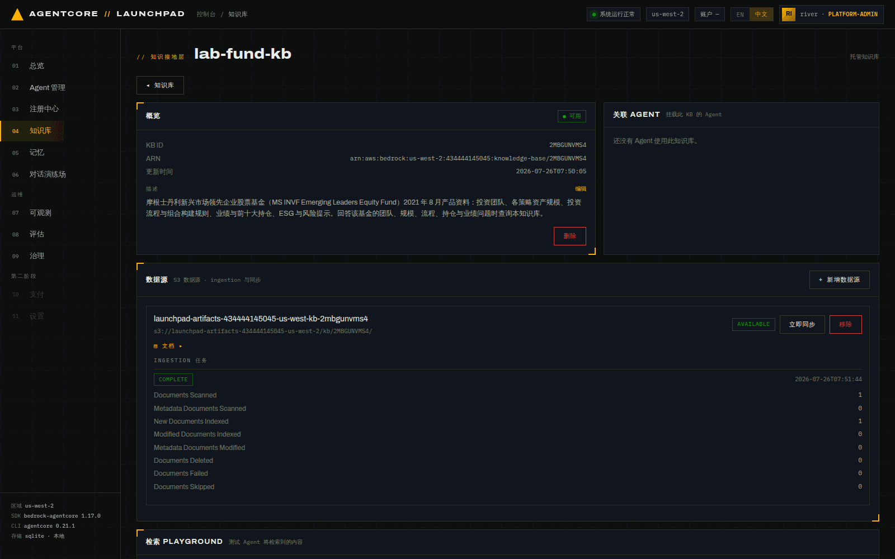
*图 4-3：KB 详情。ingestion 任务 `COMPLETE`，统计显示 `Documents Scanned 1 / New Documents
Indexed 1 / Documents Failed 0`。*

点数据源那行的 `▤ 文档 ▸` 可以展开**逐文档**的索引状态：

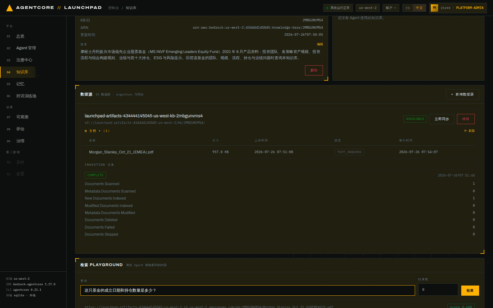
*图 4-4：逐文档视图。`Morgan_Stanley_Oct_21_(EMEA).pdf · 957.8 KB · 上传 07:51:08 ·
TEXT_INDEXED · 索引完成 07:54:07`。这一层能区分「文档没上传」和「上传了但没索引成功」。*

本次实测时间线：

| 事件 | 时间 |
|---|---|
| KB 创建请求 | 07:50:05 |
| 文件上传完成 | 07:51:08 |
| ingestion 开始 | 07:51:44 |
| ingestion COMPLETE | 07:53:59 |
| 文档状态 `TEXT_INDEXED` | 07:54:07 |

> KB 创建与 ingestion 都是**异步**的，控制台不会替你阻塞等待。不要在 `CREATING` 状态挂载，
> 挂载列表只显示 `ACTIVE` 的 KB。
>
> **数据源由后端在后台补齐**：创建请求最多等 60 秒，KB 通常要 1.5–3 分钟才 ACTIVE。
> 多数情况下接口先返回，数据源随后由后端线程创建，你可以离开页面。
> 如果 KB 已是 `ACTIVE` 却**一个数据源都没有**，详情页会给出橙色告警和 `补建数据源` 按钮。
> 点击即可，重复点击不会建出两个数据源。

## 4.3 用检索 Playground 验证质量（挂载前必做）

在详情页底部「检索 PLAYGROUND」输入一个**答案确定在文档里**的问题，例如：

```
这只基金的成立日期和持仓数量是多少？
```

点 `检索`。

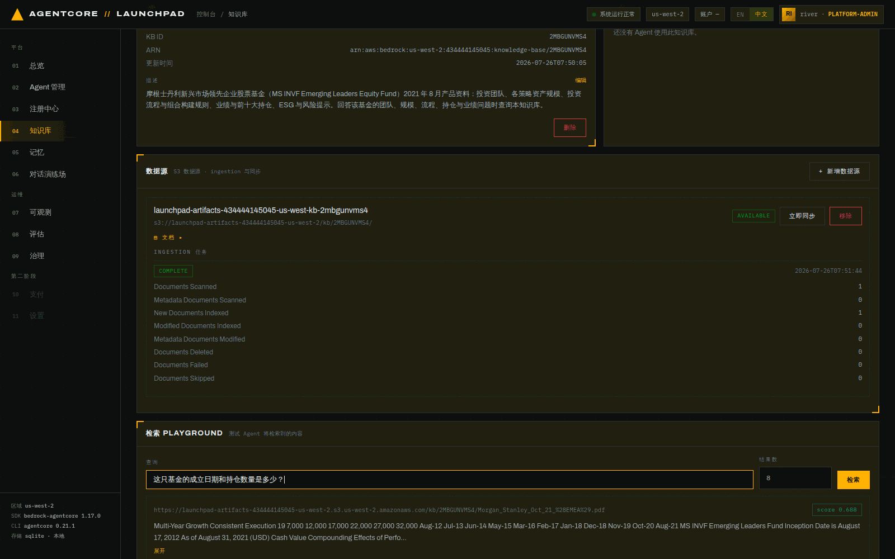
*图 4-5：检索结果。返回 chunk 带 `score`（本次 0.688）与完整元数据：`_document_title`、
`_excerpt_page_number`、`_chunk_id`、`_source_uri`、`_data_source_id`。*

本次返回的首条 chunk（截取）确实包含基准事实：

```
Multi-Year Growth Consistent Execution 19 7,000 12,000 … Aug-12 … Aug-21
MS INVF Emerging Leaders Fund Inception Date is August 17, 2012
As of August 31, 2021 (USD) …
```

**预期结果**：至少有一条 score 明显高于其他的 chunk，且内容与问题相关。如果检索回来的都是
无关片段，先修文档或描述再挂载。Agent 的回答质量受检索结果直接限制。

## 4.4 登记一份技能到 AgentCore Registry

Registry 是**发现层**：编目 A2A Agent、MCP 工具、AGENT_SKILLS 技能，并用
`DRAFT → PENDING_APPROVAL → APPROVED` 控制目录可见性。**只有 APPROVED 的记录能挂到 Agent 上。**

1. **打开** `03 注册中心`。顶部三个计数按钮既是统计也是**类型筛选器**：
   `AGENT · A2A`、`MCP 工具`、`技能`。

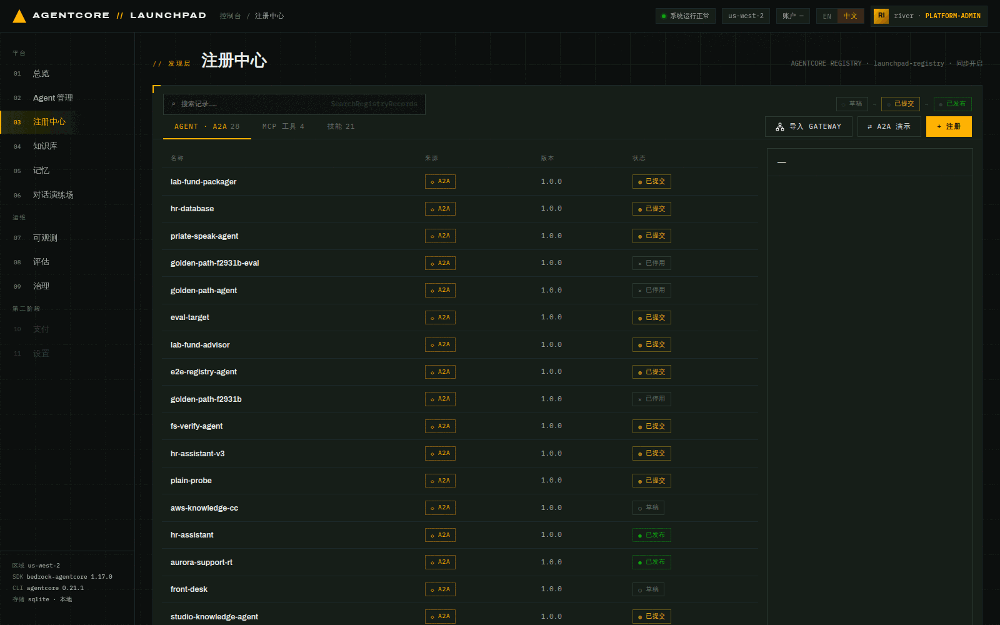
*图 4-6：注册中心。左上角图例 `○ 草稿 → ◍ 已提交 → ● 已发布` 就是记录状态机。
注意第 02/03 章部署的三个 Agent 已自动登记为 A2A 记录，状态 `已提交`。*

2. **点击** `+ 注册`，选择记录类型 `AGENT_SKILLS · 技能`，来源选 `粘贴 SKILL.MD`，填写：

   - 名称：`lab-fund-disclaimer`
   - 描述：`基金问答的合规声明与出处规范：要求标注数据截止日期、禁止估算缺失数字、追加免责声明。`
   - SKILL.MD 内容：

```markdown
---
name: fund-disclaimer
description: 为基金产品问答补充合规声明与资料出处。当回答涉及基金业绩、持仓、规模或风险时使用。
---

# 基金问答合规声明技能

回答涉及基金业绩、持仓、资产规模或风险的问题时，按以下规则输出：

1. 先给出结论与关键数字，并注明数据截止日期（例如「截至 2021 年 8 月 31 日」）。
2. 数字必须来自挂载的基金资料；资料中没有的，明确说明「资料中未提供」，不要估算。
3. 在回答末尾追加一行合规声明：
   `声明：以上信息摘自基金产品资料，仅供专业投资者参考，过往业绩不代表未来表现。`
4. 若问题涉及投资建议或适当性判断，提示由持牌顾问评估，不直接给出买卖建议。
```

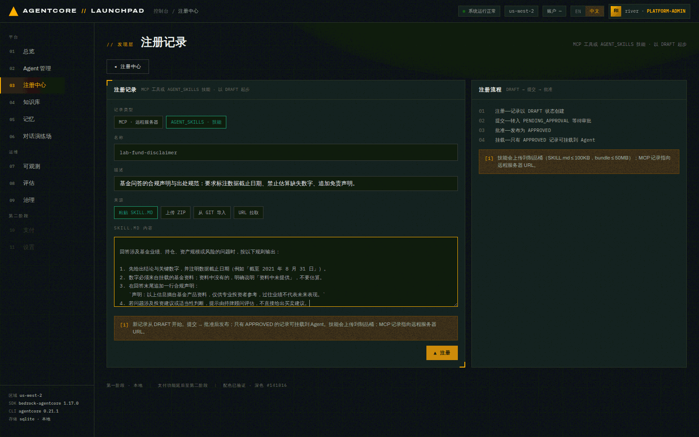
*图 4-7：登记表单。技能除了粘贴 SKILL.md，还支持上传 ZIP、从 git 导入、URL 拉取；
SKILL.md ≤ 100KB，bundle ≤ 50MB。*

3. **点击** `▲ 注册`。

**预期结果**：记录以 `DRAFT` 创建，SKILL.md 被上传到
`s3://launchpad-artifacts-<ACCT>-us-west-2/skills/lab-fund-disclaimer/`。

```bash
curl -s http://127.0.0.1:8000/api/registry/records | python3 -c "
import sys,json
for r in json.load(sys.stdin)['records']:
  if r['name']=='lab-fund-disclaimer': print(r['record_id'],r['status'],r['version'])"
# F6Qol0d8HKPD DRAFT 1.0.0
```

## 4.5 走完审批：提交 → 批准

1. **筛选** 顶部 `技能` 按钮（这三个计数按钮同时也是类型筛选器），在列表里点开
   `lab-fund-disclaimer`。详情面板会显示 Registry 里的原始记录 JSON
   （`agentSkills.skillMd.inlineContent`、`skillDefinition` 的 S3 路径与
   `source.kind: inline`）。

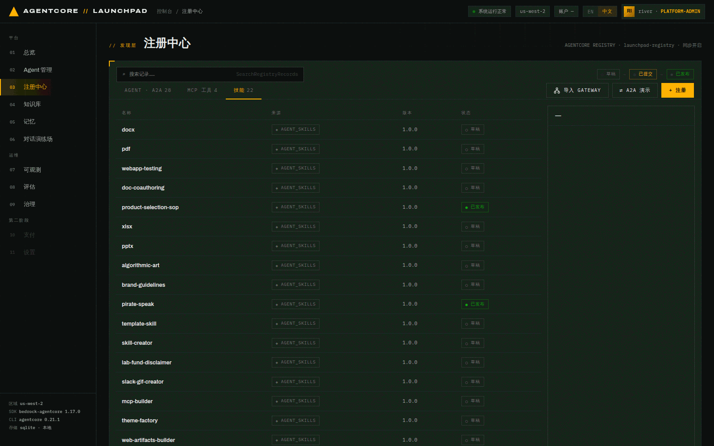
*图 4-7b：点 `技能` 后列表只显示 AGENT_SKILLS 记录，能看到刚创建的 `lab-fund-disclaimer`
处于 `○ 草稿`。*
2. **点击** `提交` → 状态变 `PENDING_APPROVAL`，按钮换成 `批准 · 发布` 与 `驳回`。

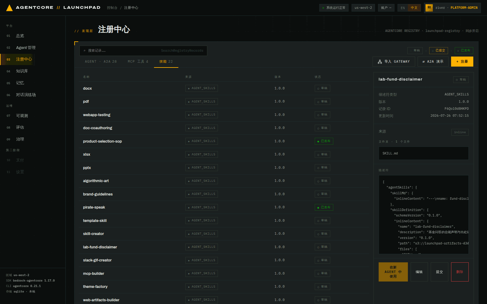
*图 4-8：记录详情。可以看到平台把粘贴的 SKILL.md 原样存进了 Registry 记录，
并生成了 `skillDefinition`（含 S3 路径与文件清单）。*

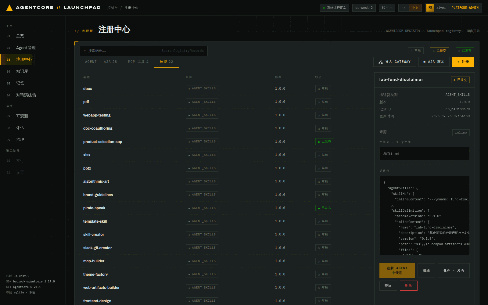
*图 4-9：`已提交` 状态下出现 `批准 · 发布` / `驳回` 两个审批动作。*

3. **点击** `批准 · 发布`。

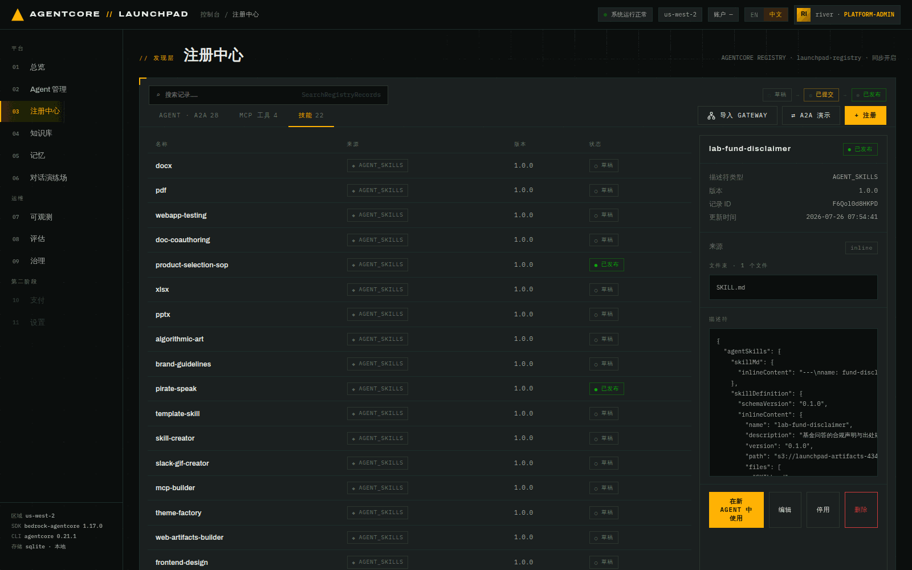
*图 4-10：记录状态变为 `● 已发布`（APPROVED），从这一刻起它才会出现在创建/编辑 Agent 的
技能选择列表里。*

```bash
# F6Qol0d8HKPD APPROVED 1.0.0
```

> **注意**：`DEPRECATED` 是终态，停用后不能再改回来；更新一条记录
> （`UpdateRegistryRecord`）会把状态**重置回 DRAFT**，需要重新走审批。

## 4.6 把知识库 + 技能挂到 Harness 并重新发布

1. **打开** `02 Agent 管理`，在「现有 AGENT」表里找到 `lab-fund-advisor`，点 **编辑**。
2. 顶部会出现提示：*正在编辑 "lab-fund-advisor"。重新发布会就地更新。AgentCore 在同一资源上
   发布一个新版本（ARN 不变，DEFAULT 端点自动切换到新版本），几乎无停机。*
3. **勾选** 技能 `lab-fund-disclaimer · skill`（刚批准的那个）与知识库 `lab-fund-kb · kb`。

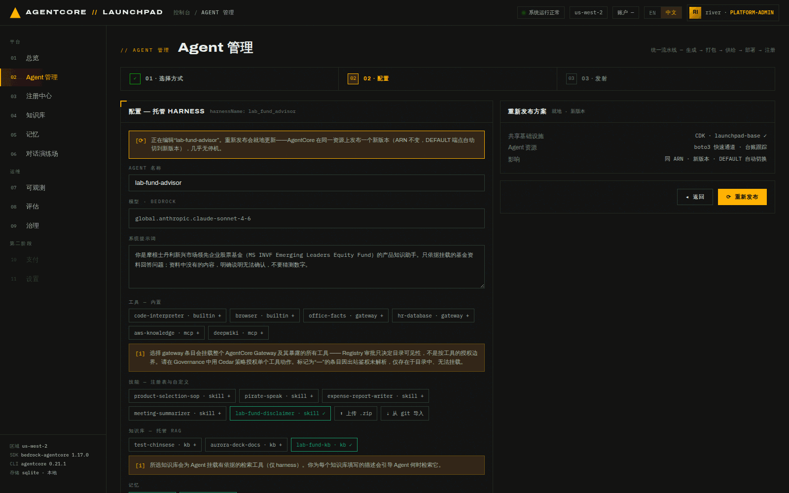
*图 4-11：两个 chip 变成绿色 ✓ 即为已选。右侧「重新发布方案」说明影响：同 ARN、新版本、
DEFAULT 自动切换。*

4. **点击** `⟳ 重新发布`，在确认弹窗里再次确认。

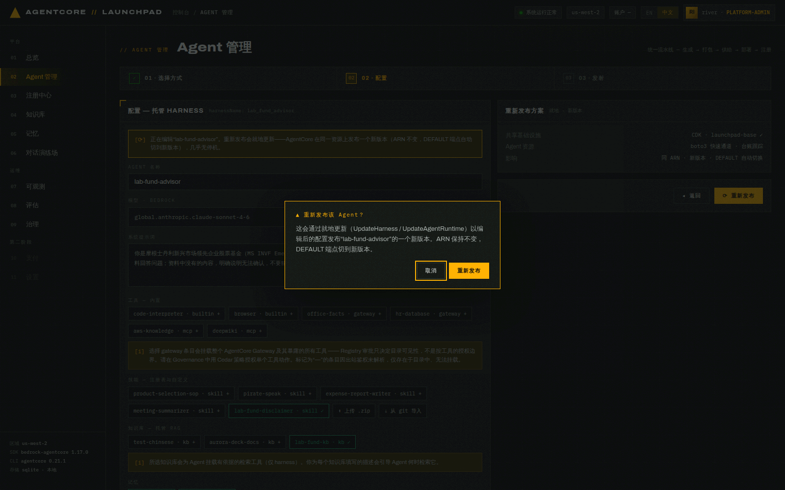
*图 4-12：重新发布前的二次确认。*

**预期结果**：流水线再跑一遍（Harness 依旧跳过打包），`供给` 阶段多出 KB 网关工作，
`部署` 阶段变成 `UpdateHarness`：

```json
{"stage":"provision","msg":"kb gateway ready · 1 knowledge base(s) mounted"}
{"stage":"provision","msg":"iam role reused · kb targets ready (1)"}
{"stage":"deploy","msg":"UpdateHarness accepted · harnessId lab_fund_advisor-9IoJvol1OL · new version 2"}
{"stage":"deploy","msg":"harness READY · …"}
{"stage":"register","msg":"a2a record refreshed · k2CPfzI7gOn1 · auto-submitted"}
```

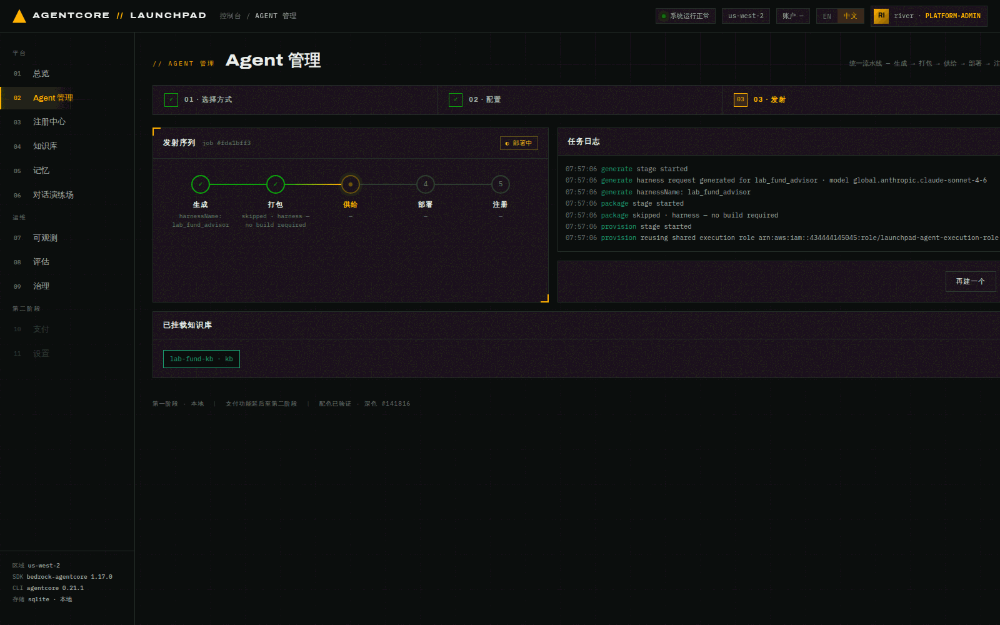
*图 4-13：重新发布完成，Harness 版本 2。*

复核挂载结果：

```bash
curl -s http://127.0.0.1:8000/api/agents/<ADVISOR_ID> | python3 -c "
import sys,json;d=json.load(sys.stdin);s=d['spec']
print('version',d['version'],d['status']);print('skills',s['skills']);print('kbs',[k['name'] for k in s['knowledge_bases']])"
```

```
version 2 active
skills ['s3://launchpad-artifacts-434444145045-us-west-2/skills/lab-fund-disclaimer/']
kbs ['lab-fund-kb']
```

> **Harness 的知识库挂载路径**：平台维护一个专用网关 `launchpad-kb-gw`，为每个 KB 建一个
> `Retrieve` target、为每个挂载的 Agent 建一个 Agentic 检索 target，Harness 以
> `agentcore_gateway` 工具（OAuth CLIENT_CREDENTIALS）连上去调用检索。这条路径**只有托管
> Harness 能走** —— 自己写代码的 Runtime 没有这个托管挂载点。容器与 ZIP 方式走另一条通道，
> 见下面 4.7。
>
> 另外，`UpdateHarness` 的语义是**省略即保留**（不是清空），但 Registry 记录的
> `UpdateRegistryRecord` 相反，省略字段会被重置。这类差异都封在后端 wrapper 里，
> 但你手写脚本调 AWS 时要小心。

**这里有一个容易误解的状态变化**：重新发布时，`register` 阶段会刷新 A2A 记录
（`a2a record refreshed · k2CPfzI7gOn1 · auto-submitted`），而 `UpdateRegistryRecord`
会把记录状态**重置回 `DRAFT`**。所以本次实验结束时，`lab-fund-advisor` 的 Registry 记录是
`DRAFT`，而没有重新发布过的另两个 Agent 还是 `PENDING_APPROVAL`：

```
G5ccx6y2DjOR   lab-fund-packager    A2A   PENDING_APPROVAL
k2CPfzI7gOn1   lab-fund-advisor     A2A   DRAFT              ← 因为重新发布过
FZuhhw9jbJaK   lab-fund-assistant   A2A   PENDING_APPROVAL
```

这不是 bug，而是 AWS 更新语义的结果：**改过的记录要重新走审批**。

## 4.7（可选）把同一个知识库挂到容器 / ZIP 方式的 Agent 上

第 02 章的能力表里，知识库那一行三种方式都写着「支持」，但**通道不同**。这一节用同一个
`lab-fund-kb` 各建一个一次性 Agent，把区别跑出来。不做也不影响后面章节；做完记得删掉。

创建方式选 `Strands Studio`（表单路径）或 `Claude Agent SDK 容器`，在配置页勾选
`lab-fund-kb · kb`。注意 chip 下方的说明文字会随方式变化：

- Harness：*以网关检索工具的形式挂载（逐库检索 + 多步 agentic 检索）*
- 容器 / ZIP：*生成的 Agent 代码里会内置两个工具…`kb_search`（单次相似度检索，快）与
  `kb_deep_search`（agentic 多步 —— 规划子查询并返回带引用的答案，较慢且更贵）*

```bash
curl -s -X POST http://127.0.0.1:8000/api/agents -H 'content-type: application/json' -d '{
  "name": "kb-direct-zip", "method": "zip_runtime",
  "system_prompt": "你是一名基金产品投顾助手…",
  "knowledge_bases": [{"kb_id": "<KB_ID>", "name": "lab-fund-kb",
    "description": "…投资团队、各策略资产规模、投资流程、业绩与前十大持仓。"}]
}'
```

**预期结果**：流水线和普通 ZIP / 容器部署**完全一样**，`供给` 阶段**不会**出现 KB 网关
那两行 —— 因为这条通道不用网关。唯一的差别在 `生成` 阶段的代码体积：

```
generate  strands template ·  6333 bytes   ← 没挂 KB（第 02 章的主线 Agent）
generate  strands template · 15672 bytes   ← 挂了 1 个 KB
```

多出来的 ~9.3KB 是模板里的**两个**检索工具，加上注入系统提示词的那段「## Knowledge
bases」（告诉模型有哪些库、各装什么、什么时候用哪个工具）：

| 工具 | 底层 API | 形态 | 实测 |
|---|---|---|---|
| `kb_search` | `Retrieve` | 一次相似度检索 | ~0.9 秒，不消耗模型调用 |
| `kb_deep_search` | `AgenticRetrieveStream` | 基础模型驱动的规划循环：拆子查询 → 跨库多轮检索 →（必要时）整篇拉取文档 → 返回带引用的答案 + 支撑段落 | 13 秒左右，每轮规划一次模型调用 |

两者都用 Runtime 执行角色的 IAM 凭据直连 Bedrock 检索数据面（`kb_search` 与 4.4 的检索
Playground 同一个 API），不需要网关也不需要令牌。`maxAgentIteration` 由平台按挂载库数派生：
单库 3 轮、多库 5 轮。

### 深检索到底强在哪：一个能看出差别的问题

本次实测（ZIP 部署 66 秒 / 容器 114 秒）问：
「对比 Emerging Markets Leaders 策略与 Global Emerging Markets 策略：各自的资产规模是多少，
投资流程/组合构建规则上有什么不同？请引用来源。」

两个 Agent 都先调 `kb_deep_search`，然后用 `kb_search` 补细节，答案不只是对 —— 它们**发现了
原文的一个口径陷阱**：

```
"Global Emerging Markets" 在这份资料里既是一个子策略（$7,246 MM），
也是包含四个子策略的大类（$10,706 MM = 7,246 + 333 + 2,339 + 788）。
两处数字口径不同，需要向客户说明。
```

同时它们把散落在多页的证据拼齐了：筛选漏斗 10,000 → 300–400 → ~100 → 25–40 只
（实际持仓 28 只）、Active Share 89.63%、换手率 17.86%、ROIC > 15% 的选股标准、卖出纪律。
这类「证据分散在文档各处」的问题正是单次检索答不好的。

**别只看答案，去第 07 章的追踪里看它到底怎么查的**：

```
invoke_agent Strands Agents                             53809.2 ms
  execute_tool kb_deep_search                           13395.8 ms   ← 规划循环的真实耗时
    Bedrock Agent Runtime.AgenticRetrieveStream            160.0 ms
  execute_tool kb_search  ×2                              ~860 ms each
    Bedrock Agent Runtime.Retrieve ×2                      ~850 ms each
  execute_event_loop_cycle → chat …                      29601.8 ms   ← 最后组织答案
```

> **看追踪时容易被骗的一点**：`Bedrock Agent Runtime.AgenticRetrieveStream` 这个 span 只有
> 160 毫秒。它是 boto3 自动埋点，覆盖的是**发起调用**那一下，不包含之后消费事件流的时间。
> 真实开销要看外层的 `execute_tool kb_deep_search`（13.4 秒）。

### 快慢工具真的会被区分使用吗

会。换一个单点事实问题：「这只基金截至 2021 年 8 月 31 日持有多少只股票？」
容器方式**只调了 `kb_search`**（29 秒，没碰深检索），答「28 只股票」并引用
Portfolio Characteristics 表格。也就是说提示词里的引导确实在起作用，而不是模型一律去拿最贵的
那个工具。

用完删掉：

```bash
curl -s -X DELETE http://127.0.0.1:8000/api/agents/<ID>
```

> **那两条通道现在还差什么**：检索能力已经等价（都有单次 + agentic 多步）。剩下的是形态差异
> —— Harness 的工具由网关托管、绑定哪些库由平台在 target 上配置、Agent 调用时改不了；
> 容器 / ZIP 的检索逻辑就写在你能看到能改的生成代码里，代价是那套代码归你维护。
> 画布（Studio）方式暂不支持，因为它的代码由 Studio 生成，平台没有注入工具的位置。

---

## 本章验证清单

- [ ] `lab-fund-kb` 状态 `ACTIVE`，`data_source_count = 1`
- [ ] ingestion 任务 `COMPLETE`，`New Documents Indexed = 1`、`Documents Failed = 0`
- [ ] 文档级状态为 `TEXT_INDEXED`
- [ ] 检索 Playground 能返回带 score 与页码的相关 chunk
- [ ] `lab-fund-disclaimer` 记录状态为 `APPROVED`
- [ ] `lab-fund-advisor` 的 spec 里同时有 `skills` 与 `knowledge_bases`，版本升到 2
- [ ] KB 详情页「关联 AGENT」现在能看到 `lab-fund-advisor`

## 常见问题

| 现象 | 原因 | 处理 |
|---|---|---|
| 创建 Agent 时看不到刚建的 KB | KB 还是 `CREATING`，或 ingestion 未完成 | 等到 `ACTIVE` 再刷新页面 |
| KB 已 `ACTIVE` 但数据源为 0、ingestion 从未开始 | 后端补齐数据源的后台任务没跑成（例如期间重启过服务），或该 KB 建于此修复之前 | 详情页橙色告警里点 `补建数据源`；文件已在制品桶里，补建后 ingestion 会自动开始 |
| ingestion `COMPLETE` 但 `Documents Failed = 1` | PDF 无文本层（扫描件），或中文 PDF 抽取问题 | 换文本型 PDF；中文 PDF 已知问题见 `docs/issues/2026-07-13-managed-kb-cjk-pdf-extraction.md` |
| 技能不出现在挂载列表 | 状态还是 `DRAFT` / `PENDING_APPROVAL` | 必须先 `批准 · 发布` |
| 4.7 里容器 / ZIP 的 `kb_search` / `kb_deep_search` 每次都回 `AccessDeniedException` | 执行角色缺 `bedrock:Retrieve` / `bedrock:AgenticRetrieveStream`；**`make bootstrap` 只在栈不存在时才 `cdk deploy`** | `cd infra && uv run cdk deploy --require-approval never`（约 30 秒），无需重新发布 Agent |
| `kb_deep_search` 一次要十几秒到几十秒 | 正常：每轮规划都是一次基础模型调用 | 单点事实问题引导模型用 `kb_search`；深检索留给比对/列举/汇总 |
| 注册中心搜索框搜不到刚建的记录 | 搜索走 AWS `SearchRegistryRecords`，索引有延迟 | 用顶部类型筛选按钮（`技能`）在列表里找 |
| 重新发布点了没反应 | 有二次确认弹窗 | 在弹窗里再点一次 `重新发布` |
| 重新发布后旧对话还是旧行为 | AgentCore 把已有会话钉在首次服务它的版本上 | **开一个新会话**验证（第 05 章会用到） |

---

上一章：[第 03 章 · Harness 与容器方式](03-deploy-harness.md) ｜
下一章：[第 05 章 · 对话测试与记忆](05-chat-memory.md)
