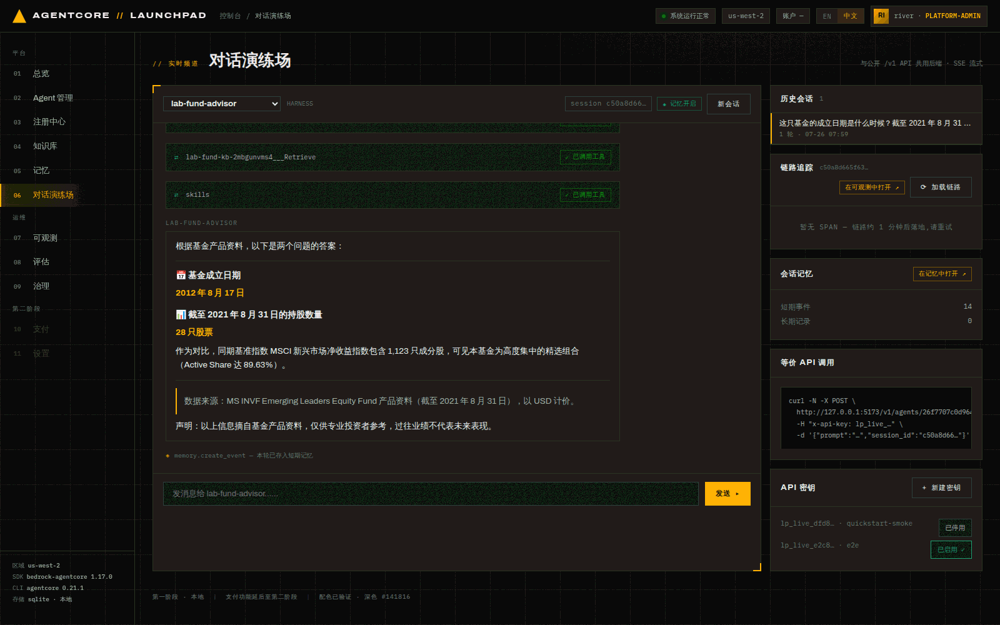
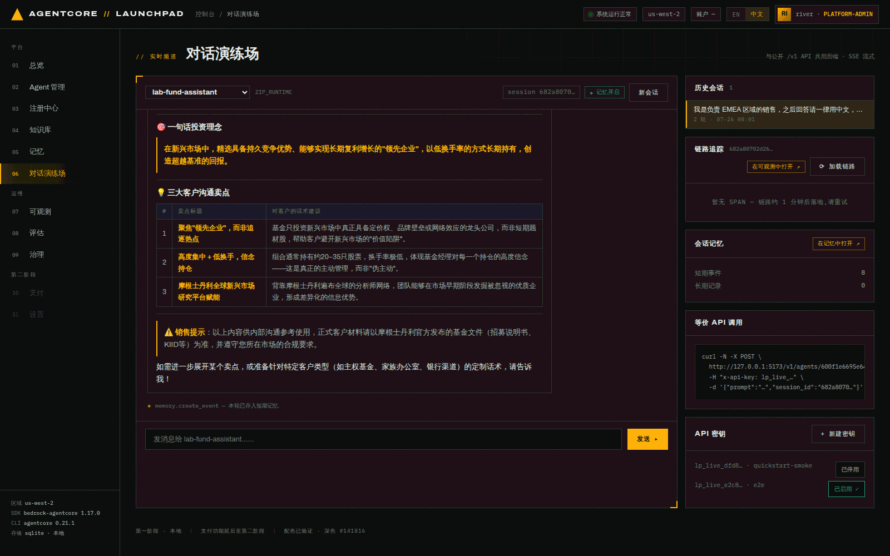
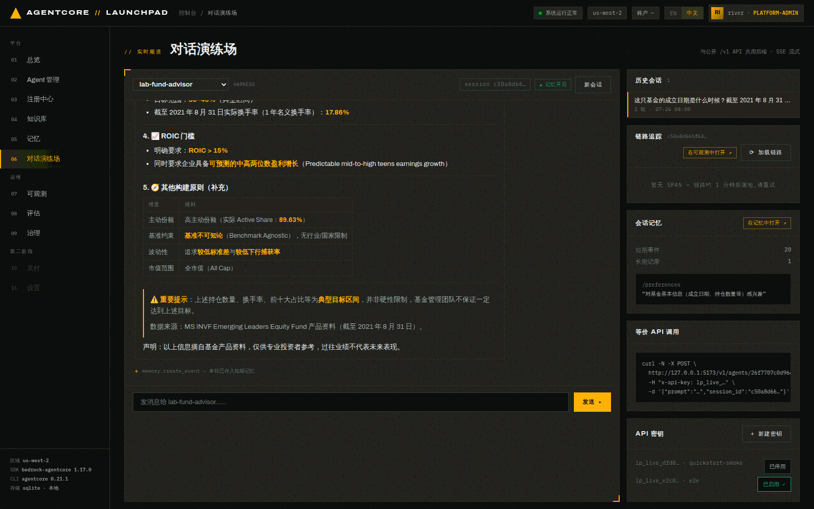
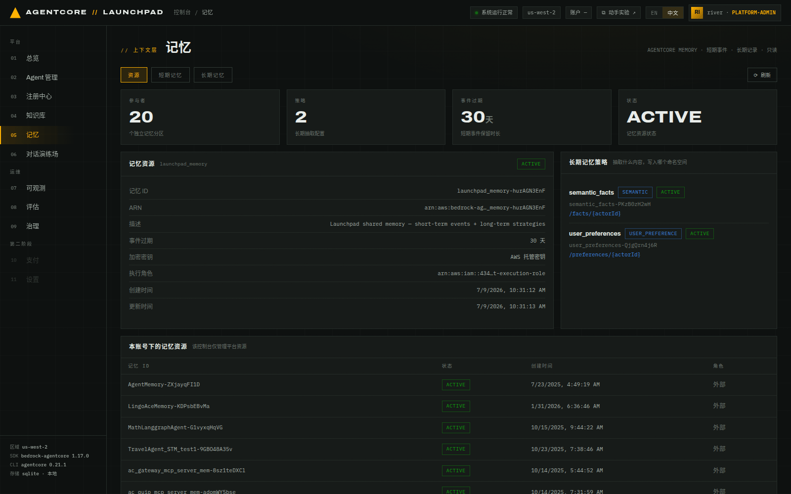
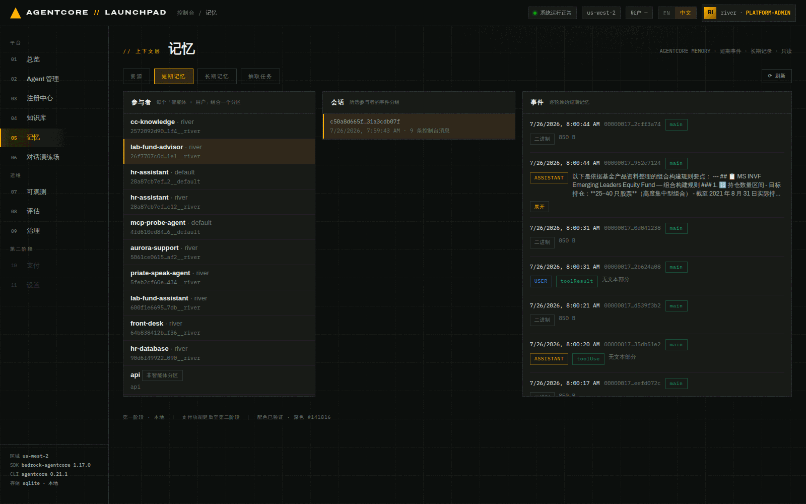
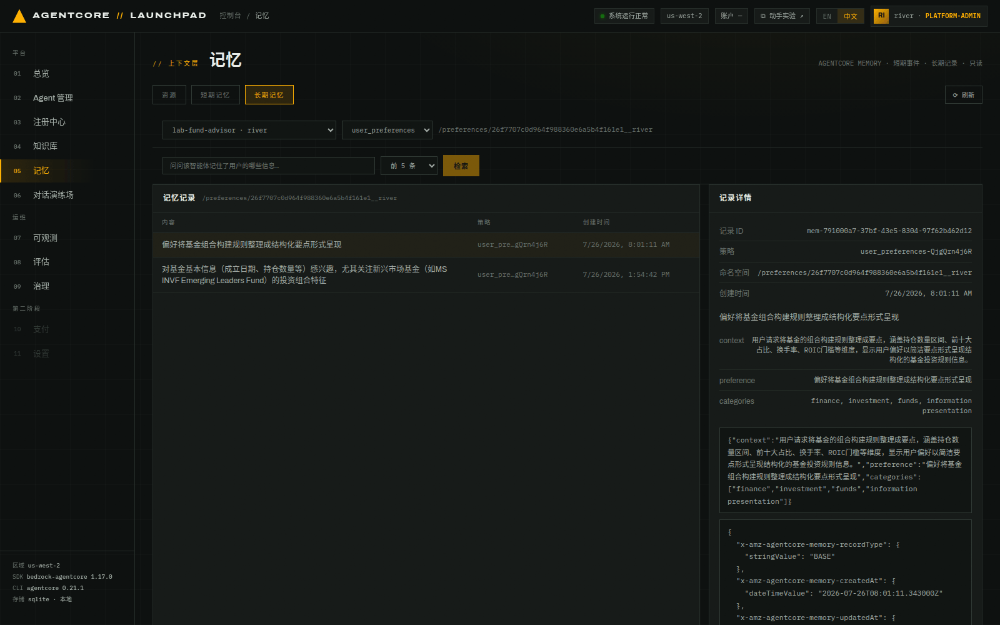

# 第 05 章 · 对话测试与记忆（Chat Playground + Memory 控制台）

> **目标**：在对话演练场里比较两个 Agent 的行为（有知识库 vs 无知识库），确认技能生效，
> 然后到 Memory 控制台看清「短期事件」与「长期记录」到底存了什么、按什么分区存。
>
> **前置条件**：完成[第 04 章](04-capabilities.md)。`lab-fund-advisor` 版本 2（已挂 KB + 技能）。
>
> **本章将创建的 AWS 资源**：AgentCore Memory 中的短期事件与长期记录（写入共享
> `launchpad_memory`，按 Agent 分区）；不创建新的计算资源。

---

## 5.1 与「有知识库」的 Agent 对话

1. **打开** `06 对话演练场`，在顶部下拉里选择 `lab-fund-advisor`。
2. **提问**（答案确定在 PDF 里）：

```
这只基金的成立日期是什么时候？截至 2021 年 8 月 31 日持有多少只股票？
```


*图 5-1：流式回答。中间的工具调用轨迹显示 `lab-fund-kb-…___Retrieve` 被调用、
`skills` 被调用一次，可以确认知识库检索与技能都已生效。*

**预期回答**应包含以下信息：

> 📅 基金成立日期：**2012 年 8 月 17 日**
> 📊 截至 2021 年 8 月 31 日的持股数量：**28 只股票**
> 作为对比，同期基准指数 MSCI 新兴市场净收益指数包含 1,123 只成分股，可见本基金为高度集中的
> 精选组合（Active Share 达 89.63%）。
> 数据来源：MS INVF Emerging Leaders Equity Fund 产品资料（截至 2021 年 8 月 31 日）。
> **声明：以上信息摘自基金产品资料，仅供专业投资者参考，过往业绩不代表未来表现。**

核对结果：

- **数字全部正确**，且与 PDF 一致（成立日 2012-08-17、持仓 28 只、Active Share 89.63%）。
- **最后一行合规声明**来自第 04 章挂载的 `lab-fund-disclaimer` 技能，说明技能改变了输出格式。
- 回答里主动标注了**数据截止日期**，也是技能里写的规则。

3. **再问一轮**（验证多轮上下文）：

```
帮我把它的组合构建规则整理成要点：持仓数量区间、前十大占比、换手率、ROIC 门槛。
```

Agent 用「它」指代上一轮的基金，答出：目标持仓 25–40 只 / 实际 28 只、前十大约 50–60%、
换手率目标 30–40%（实际 17.86%）、ROIC > 15%。**这些都能在 PDF 第 14 页与第 30 页核对。**

## 5.2 对照实验：与「无知识库」的 Agent 对话

切换到 `lab-fund-assistant`（第 02 章创建的 zip runtime，**没有挂知识库**）。

1. 第一轮先声明一个偏好：

```
我是负责 EMEA 区域的销售，之后回答请一律用中文，并且优先用表格呈现关键数字。
```

2. 第二轮考它业务问题：

```
这只基金的投资理念一句话怎么讲？再给我三个能对客户说的卖点。
```


*图 5-2：assistant 遵守了上一轮的格式偏好（中文 + 表格），但具体数字没有任何资料支撑。*

观察它是否给出听起来专业却**没有出处**的数字。资料中的持仓数据是
**目标 25–40 只、实际 28 只**；没有知识库接地时，模型可能给出其他看似合理的范围。

> **这个现象不是每次都会出现**。同一个提示词下，模型也可能碰巧答对。如果没有看到明显错误，
> 追问一个资料里**根本不存在**的事实，效果更稳定：
>
> ```
> 这只基金 2024 年第三季度的净值涨幅是多少？请给出具体数字。
> ```
>
> 有 KB 的 `lab-fund-advisor` 会明确说资料截至 2021 年 8 月、无法确认；无 KB 的
> `lab-fund-assistant` 可能给出一个编造的数字或含糊回避。**无论它是否碰巧答对，都不影响
> 第 08 章。评估器比对的是真值，接地程度仍能被量化成分数。

| | `lab-fund-advisor`（有 KB + 技能） | `lab-fund-assistant`（无 KB） |
|---|---|---|
| 成立日期 | 2012 年 8 月 17 日（正确） | 未提及 |
| 持仓数量 | 28 只，目标 25–40（正确） | 可能给出无出处的范围，也可能碰巧答对 |
| 数据出处 | 标注资料与截止日期 | 无 |
| 合规声明 | 有（技能强制） | 无 |

> 第 08 章会用 PDF 里的事实做基准答案，让评估器自动量化这种差距；第 09 章再用提示词优化 +
> A/B 实验检验无接地 Agent 的表现能否改善。

## 5.3 右侧三条轨道：会话、追踪、记忆

对话页右侧有三块，是后面章节的**入口**：

- **历史会话**：同一个 Agent 的历史对话，按轮数与时间列出，可点回去继续。
- **链路追踪**：显示当前会话的 trace id 与 `在可观测中打开 ↗`。刚聊完常显示
  *「暂无 SPAN — 链路约 1 分钟后落地，请重试」*。CloudWatch Transaction Search 有摄取延迟，
  这是正常的（第 07 章详述）。
- **会话记忆**：短期事件数、长期记录数，以及 `在记忆中打开 ↗` 深链到 Memory 控制台。
- 面板底部还给出**等价 API 调用**（`curl -N … /v1/agents/<id>/invoke-stream`），第 06 章会执行它。


*图 5-3：完成多轮对话后，面板显示短期事件与长期记录数量，并直接展示抽取出的偏好。*

> 每轮回答下方那行 `◈ memory.create_event — 本轮已存入短期记忆` 说明这一轮的 USER/ASSISTANT
> 对已经**恰好一次**写入 Memory。

## 5.4 Memory 控制台：资源概览

**打开** `05 记忆`。这个控制台是**只读**的（后端根本没有实现写操作的包装函数），三个标签页：
`资源` / `短期记忆` / `长期记忆`。


*图 5-4：平台共享的 `launchpad_memory-…`：事件过期 30 天、AWS 托管密钥、执行角色，
以及两个长期策略：`semantic_facts`（SEMANTIC，命名空间 `/facts/{actorId}`）与
`user_preferences`（USER_PREFERENCE，命名空间 `/preferences/{actorId}`）。
下方还列出账号里其它 memory 资源，并标注哪个属于本平台（`平台` vs `外部`）。*

AgentCore 的命名空间模板里**没有 `{agentId}`**，只有 `{actorId}`。平台因此把 Agent id 折进
actor：`scoped_actor(agent_id, human)` → `<agent_id>__<human>`。同一个人与不同 Agent 聊天时，
短期事件和长期记录会落在不同分区，一个 Agent 学到的偏好不会串到另一个。

## 5.5 短期记忆：参与者 → 会话 → 事件

切到 `短期记忆` 标签。左列「参与者」就是上面说的复合 actor，控制台把它解码成
`Agent 名 · 用户名` 显示（原始值形如 `<ADVISOR_ID>__river`）。

1. **点击** `lab-fund-advisor · river`
2. **点击** 出现的会话
3. 右侧「事件」按轮次展开原始短期记忆


*图 5-5：事件时间线。可以看到 `ASSISTANT` 轮的完整原文。非会话型 payload
只显示字节数，不做解码。*

> 那些 `xxx 非智能体分区`（`api`、`default`、`river`…）来自直接以裸 actor 写入的数据，
> 或来自 `/v1` 调用等非控制台入口。控制台按第一个 `__` 分隔符解码，解不出 Agent 的就标为非智能体分区。

## 5.6 长期记忆：策略、命名空间与记录详情

切到 `长期记忆` 标签，选 参与者 `lab-fund-advisor · river`，策略选 `user_preferences`。


*图 5-6：命名空间被服务端解析成具体值 `/preferences/<ADVISOR_ID>__river`，
偏好记录由服务端从与这个 Agent 的对话里抽取。右侧记录详情展开了结构化内容。*

记录内容因对话而异，`USER_PREFERENCE` 记录的结构如下：

```json
{
  "context": "<从对话中识别出的上下文>",
  "preference": "<抽取出的用户偏好>",
  "categories": ["<分类>"]
}
```

> 两种策略的 payload 形状不同：`SEMANTIC` 存散文（`content.text`），
> `USER_PREFERENCE` / `SUMMARIZATION` 存上面这种 JSON 对象。控制台与对话页共用同一个解码函数，
> 所以两边都不会把序列化对象直接糊在界面上。

**关于「抽取」**：把短期事件变成长期记录的抽取任务是 **AgentCore Memory 服务自己跑的**，
按资源上配置的策略在事件写入后**异步**执行，平台既不触发也不排程。所以看到「短期事件有了、
长期记录还是 0」时，正常做法就是再聊 1–2 轮、等一会儿再刷新，而不是去找什么按钮。

> 控制台**没有**抽取任务视图。AWS 的 `ListMemoryExtractionJobs` 不是任务历史：它的状态枚举
> 只有 `FAILED` 一个值，列出的是可被 `StartMemoryExtractionJob` 重试的失败积压，健康资源查出来
> 永远是空的。如果把它做成标签页，反而容易让人误以为「什么都没抽取出来」。需要排查时用后端接口
> `GET /api/memory/extraction-jobs`。

---

## 本章验证清单

- [ ] `lab-fund-advisor` 回答里出现 KB 检索工具调用（`…___Retrieve`）
- [ ] 回答末尾有技能强制的合规声明
- [ ] 关键数字与 PDF 一致（成立日 2012-08-17、持仓 28 只）
- [ ] `lab-fund-assistant` 能遵守上一轮的格式偏好（多轮上下文生效）
- [ ] 记忆轨道显示短期事件 > 0
- [ ] Memory 控制台能看到 `<agent_id>__river` 形式的参与者分区
- [ ] 长期记忆里有 `/preferences/<agent_id>__river` 命名空间下的记录
- [ ] （为第 08 章准备）`lab-fund-advisor` 已被调用过，它的日志组现在才存在

## 常见问题

| 现象 | 原因 | 处理 |
|---|---|---|
| 长期记录一直是 0 | 服务侧抽取是异步的，且需要足够语义信息 | 多聊 1–2 轮，等一会儿再刷新 `长期记忆` 标签 |
| 追踪面板长时间「暂无 SPAN」 | Transaction Search 摄取延迟约 1 分钟起 | 等一会点 `⟳ 加载链路`；第 07 章统一看 |
| 重新发布后行为没变 | 已有会话被钉在旧版本 | 点 `新会话` 再验证 |
| 容器 Agent 调用报 `RuntimeClientError` | 容器进程未正常启动，旧检出还可能包含已修复的依赖问题 | 查看下方探活与排障说明 |

### 容器 Agent 部署后的探活

五阶段流水线全绿只证明资源已经创建，不能证明容器进程能够正常启动。平台目前没有部署后探活，
因此新部署 `lab-fund-packager` 后，请在对话演练场手工调用一次。

如果调用返回 `RuntimeClientError: An error occurred when starting the runtime.`，打开
`/aws/bedrock-agentcore/runtimes/lab_fund_packager_…-DEFAULT` 日志组查看启动错误。旧检出可能包含
已修复的 OpenTelemetry 依赖漂移问题；更新代码并重新发布后再验证。根因说明见
[docs/issues/2026-07-26-container-otel-events-import.md](../issues/2026-07-26-container-otel-events-import.md)。

---

上一章：[第 04 章 · 挂载能力](04-capabilities.md) ｜
下一章：[第 06 章 · 公共 /v1 API 调用](06-public-api.md)（**可选支线**）｜
跳过：[第 07 章 · 可观测性](07-observability.md)
