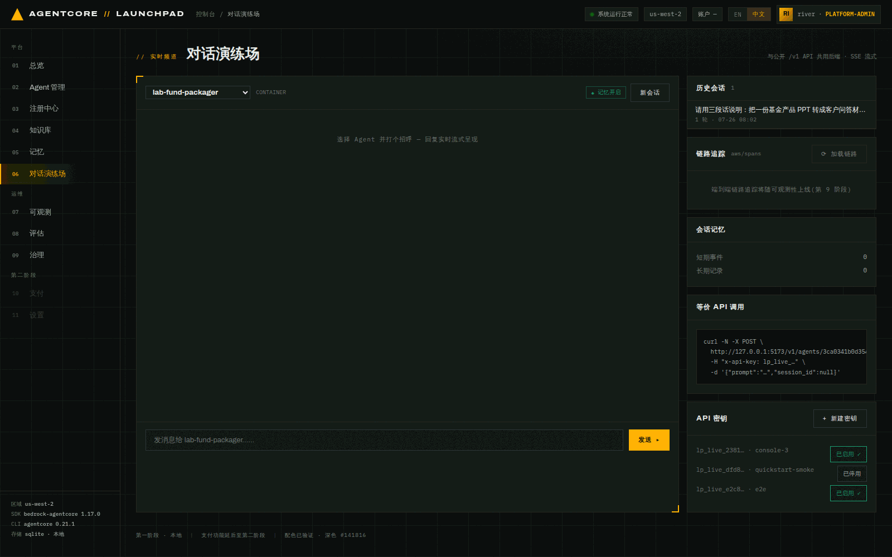

# 第 06 章 · 用公共 `/v1` API 调用 Agent（可选）

> 🔀 **本章可选**。它是一条**支线**：讲的是怎么把 Agent 接进你自己的系统，而不是平台链路上
> 的新环节。跳过它不影响任何后续章节——第 07 章起用到的 trace、数据集、实验对象都来自
> 第 02–05 章。时间紧张的场次可以直接从第 05 章跳到第 07 章。
>
> 唯一的副作用：跳过后第 06 章那两个 `curl` 会话不会出现在第 07 章的会话列表里，
> 那一节的截图里会少两行（不影响该章任何结论）。
>
> **目标**：签发一枚 API Key，用 `curl` 走公共 `/v1` 接口同步调用与流式调用同一个 Agent，
> 验证「控制台入口」与「系统集成入口」共用同一条 invoke 链路。
>
> **前置条件**：完成[第 05 章](05-chat-memory.md)，`lab-fund-assistant` 可正常对话。
>
> **预计耗时**：约 10 分钟。
>
> **本章将创建的 AWS 资源**：无（API Key 只存在本地台账，且只存 sha256 摘要）。

---

## 6.1 两个入口，一条链路

| | 控制台入口 | 公共入口 |
|---|---|---|
| 路径 | `POST /api/chat/{agent_id}` | `POST /v1/agents/{id}/invoke` · `/invoke-stream` |
| 鉴权 | 控制台会话（可选口令） | `X-Api-Key` 头 |
| 下游 | `invoke_agent_text` / `chat_stream` | **完全相同** |

也就是说：`/v1` 只多了一层鉴权，方式分派（harness → Harness 数据面；zip/studio/container →
Runtime 数据面）、记忆读写、工具调用、遥测都是同一份代码。所以你在控制台里验证过的行为，
集成方通过 `/v1` 会看到一致的结果。

## 6.2 签发 API Key

1. **打开** `06 对话演练场`，右下角「API 密钥」面板点 `+ 新建密钥`。
2. **立即复制**弹出的明文密钥——界面明确提示 *「立即复制 — 仅显示一次」*。


*图 6-1：密钥列表只保留前缀（`lp_live_2381…`）与备注名，并可 `已启用 / 已停用` 切换。
台账里存的是 sha256 摘要，明文不落库——所以丢了只能重新签发。*

> 上图是**刷新页面后**的样子（只剩前缀）。截图/录屏演示时请注意：新建那一刻的明文
> 会完整显示在界面上，别把它录进材料里。

3. 把密钥放进环境变量（不要写进脚本文件）：

```bash
export LP_KEY='lp_live_xxxxxxxxxxxxxxxxxxxxxxxxxxxxxxxx'
export AGENT_ID='600f1e6695e64d408e2778b74209f7db'   # <ASSISTANT_ID>
```

## 6.3 同步调用 `/v1/agents/{id}/invoke`

```bash
curl -s -X POST "http://127.0.0.1:8000/v1/agents/$AGENT_ID/invoke" \
  -H "x-api-key: $LP_KEY" -H 'content-type: application/json' \
  -d '{"prompt":"用一句话说明这只基金的投资理念。","session_id":null}' | python3 -m json.tool
```

本次实际返回（`text` 已转成中文显示，原始响应里是 `\uXXXX` 转义）：

```json
{
    "agent": "lab-fund-assistant",
    "text": "本基金的核心投资理念是：**在新兴市场中精选具有持续竞争优势、由优秀管理层驱动、能够实现长期复利增长的\"领先企业\"，以集中持股、长期持有的方式为投资者创造超额回报。**\n",
    "session_id": "45ef508626a94cbeb4ad526d1c5c369b143bedfe18d14e7186e2ecee0bf07ca4",
    "latency_ms": 9147
}
```

要点：

- `session_id: null` 表示**新建会话**，响应会回填服务端生成的 session id。
- 想做多轮，把上一次返回的 `session_id` 原样带回来即可（记忆按会话隔离）。
- `latency_ms` 是端到端耗时，本次 9.1 秒（含模型生成）。

## 6.4 流式调用 `/v1/agents/{id}/invoke-stream`

```bash
curl -sN -X POST "http://127.0.0.1:8000/v1/agents/$AGENT_ID/invoke-stream" \
  -H "x-api-key: $LP_KEY" -H 'content-type: application/json' \
  -d '{"prompt":"这只基金的持仓集中度有什么特点？两句话。","session_id":null}'
```

本次实际输出（SSE，截取前几帧）：

```
event: meta
data: {"session_id": "2dd5570a…9451", "agent": "lab-fund-assistant", "mode": "buffered"}

event: delta
data: {"text": "摩根士丹利新兴市场领先企业股票基金（MS INVF Emerging Leaders Equity Fund）采用**高"}

event: delta
data: {"text": "度集中的投资组合**策略，通常持有约**25–40只**精选个股，远低于基准指数的成分股数量。…"}
```

事件类型：

| event | 含义 |
|---|---|
| `meta` | 会话与 Agent 元信息，含 `mode` |
| `delta` | 增量文本 |
| `tool` | 工具调用（本次没触发） |
| `complete` | 结束 |

> `"mode": "buffered"` 是个有用的细节：**zip/studio runtime 走缓冲兼容路径**（先取回再切帧），
> 而 Harness 与 Claude SDK 容器能吐**原生**模型增量。所以同一个 SSE 契约下，
> 不同创建方式的"逐字"体感是不同的——这不是 bug，是数据面能力差异。
>
> 顺带一个观察：这次它答"约 25–40 只"，和第 05 章那次的"20–35 只"不一样——无知识库接地时，
> 同一事实的回答**并不稳定**。第 08 章的评估就是要把这种不稳定量化出来。

## 6.5 鉴权失败长什么样

```bash
curl -s -o /dev/null -w "%{http_code}\n" -X POST \
  "http://127.0.0.1:8000/v1/agents/$AGENT_ID/invoke" \
  -H "x-api-key: lp_live_wrong" -H 'content-type: application/json' -d '{"prompt":"hi"}'
```

```
401
{"code":"auth.invalid_api_key","message":"invalid or disabled API key","detail":null}
```

停用（而不是删除）一枚密钥也会得到同样的 401——面板上的 `已启用 / 已停用` 就是这个开关。

## 6.6 从对话页复制"等价 API 调用"

对话页右下角「等价 API 调用」面板会**按当前选中的 Agent 与会话**生成 curl 片段：

```bash
curl -N -X POST \
  http://127.0.0.1:5173/v1/agents/<AGENT_ID>/invoke-stream \
  -H "x-api-key: lp_live_…" \
  -d '{"prompt":"…","session_id":"<当前会话>"}'
```

演示时很好用：先在界面里聊，再把同一个会话用 curl 接着聊，直观说明"同一条链路、两个入口"。
（注意它写的是前端端口 `5173`，走 Vite 代理；直连后端用 `8000`，两者等价。）

---

## 本章验证清单

- [ ] 成功签发密钥，列表里只显示前缀
- [ ] 同步调用返回 `agent` / `text` / `session_id` / `latency_ms`
- [ ] 流式调用先收到 `event: meta`，随后是若干 `event: delta`
- [ ] 错误密钥返回 `401 auth.invalid_api_key`
- [ ] 把返回的 `session_id` 带回去能续上多轮

## 常见问题

| 现象 | 原因 | 处理 |
|---|---|---|
| `401 auth.invalid_api_key` | 密钥错、被停用，或复制时带了空格 | 重新签发；确认面板上是 `已启用 ✓` |
| `404` agent not found | agent id 写错，或 Agent 不是 active | `GET /api/agents` 复核 id 与状态 |
| 流式没有逐帧、一次性吐出 | zip/studio runtime 是缓冲兼容路径 | 属预期；要原生增量用 harness/容器 |
| 明文密钥丢了 | 只显示一次，台账只存摘要 | 重新签发，把旧的停用 |
| `curl` 一直挂着不返回 | 忘了 `-N`，或模型生成较慢 | 加 `-N` 关闭缓冲；同步接口正常 5–15 秒 |

---

上一章：[第 05 章 · 对话与记忆](05-chat-memory.md) ｜
下一章：[第 07 章 · 可观测性](07-observability.md)
