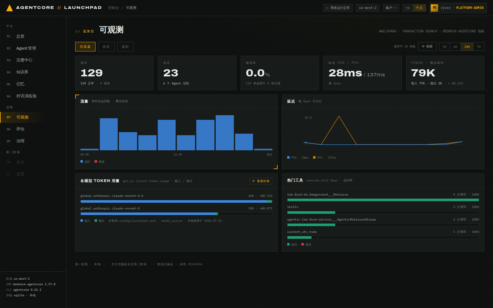
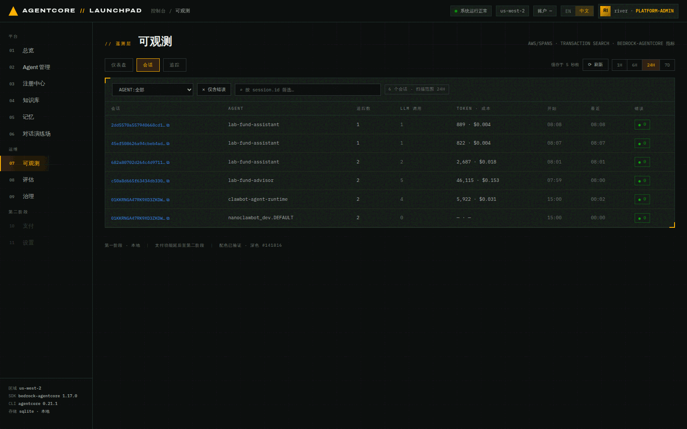
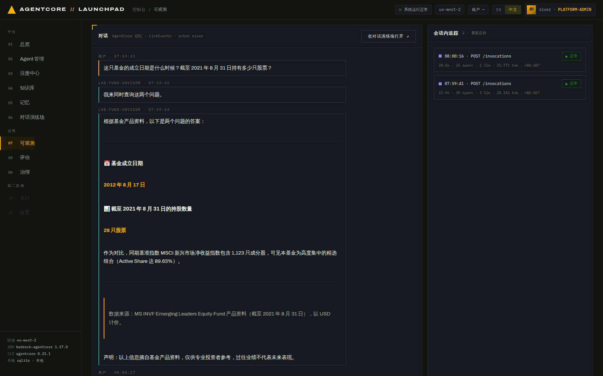
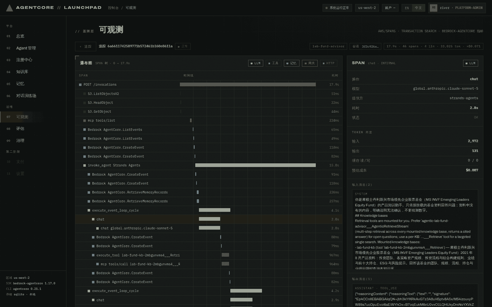

# 第 07 章 · 可观测性（Transaction Search · 追踪 · Token 与成本）

> **目标**：看懂平台的三层遥测视图：仪表盘（趋势与成本）、会话（业务视角的对话还原）、
> 追踪（技术视角的 span 瀑布图），并用它定位「一次回答慢在哪、花了多少 token」。
>
> **前置条件**：完成第 05、06 章，已经产生真实流量。**span 有摄取延迟**，刚聊完等 1–2 分钟。
>
> **预计耗时**：约 15 分钟。
>
> **本章将创建的 AWS 资源**：无（只读 CloudWatch Logs Insights 与 CloudWatch 指标；
> Logs Insights **按扫描量计费**）。

---

## 7.1 三个数据源，三个视图

| 视图 | 数据来自 | AgentCore/AWS 侧 |
|---|---|---|
| 仪表盘 | `aws/spans` 日志组 | CloudWatch Transaction Search（X-Ray → CloudWatch Logs） |
| 仪表盘的 Token 卡 | `bedrock-agentcore` 指标命名空间 | `ListMetrics` + `GetMetricData`（`gen_ai.client.token.usage`） |
| 会话对话还原 | AgentCore Memory `ListEvents` + 本地 ChatMessage 台账 | Memory 为主，台账用于修补滞后/不完整的分区 |

> 前置条件：账号需要开启 **CloudWatch Transaction Search**（把 X-Ray trace segment 目的地
> 设为 CloudWatch Logs）。没开的话这一章所有视图都会是空的。

## 7.2 仪表盘

**打开** `07 可观测` → `仪表盘`，右上角选时间范围（`1H / 6H / 24H / 7D`）。


*图 7-1：真实数据。5 个统计卡 + 4 张图。24H 窗口会把当天**所有** Agent 的调用都算进来，
本次截图里就同时含实验室之外的活动，以及切换默认模型前后的两种模型。*

本次实测读数（24H 范围）：

| 指标 | 值 | 说明 |
|---|---|---|
| 追踪 | 118（118 正常 / 0 错误） | 一次 invoke = 一条 trace |
| 会话 | 23（6 个 Agent 活跃） | 含实验室外的历史会话 |
| 错误率 | 0.0% | |
| 延迟 P50 / P95 | 28ms / 137ms | **根 span** 的分位数（大量短请求会把分位数拉低） |
| Token · 预估成本 | 79K（输入 77K / 输出 2K）· ≈ $0.224 | 按模型拆分：sonnet-4-6 46K ≈$0.153、sonnet-5 33K ≈$0.071 |

「热门工具」面板直接印证了第 04–05 章的挂载：

```
lab-fund-kb-2mbgunvms4___Retrieve                    4 次调用 · 100%
agentic-lab-fund-advisor___AgenticRetrieveStream     2 次调用 · 100%
skills                                               1 次调用 · 100%
```

读取仪表盘时注意：

- **60 秒 TTL 缓存**：视图按 (视图, 时间范围) 缓存 60 秒（右上角会显示 `缓存于 N 秒前`），
  因为 Logs Insights 按扫描量计费。点 `⟳ 刷新` 强制绕过缓存。
- **成本是估算**：token 数 × `config/launchpad.yaml` 里的 `model_prices`（USD / 1M tokens）。
  界面用 `≈ / EST` 标注。`⟳ 更新价格` 按钮会从 litellm 公共价格表拉取当前账号见到过的每个模型的
  精确价格（含区域溢价与缓存读写价）。未知模型只显示 token 数、成本显示 `—`。
- **Token 只统计末端 LLM 调用**（`chat` / `text_completion` / `generate_content`）。
  Agent 级的 `invoke_agent` span 会重复其子 span 的 `gen_ai.usage.*`，如果一并累加会翻倍。

## 7.3 会话视图：业务视角

切到 `会话` 标签。可以按 Agent 过滤、只看含错误的会话。


*图 7-2：每行一个会话：追踪数、LLM 调用数、token 与估算成本、起止时间、错误数。*

本次实测（摘录）：

```
2dd5570a…  lab-fund-assistant  1 trace  1 llm     889 tok  $0.004   08:08
45ef5086…  lab-fund-assistant  1 trace  1 llm     822 tok  $0.004   08:07
682a8070…  lab-fund-assistant  2 trace  2 llm   2,687 tok  $0.018   08:01
c50a8d66…  lab-fund-advisor    2 trace  5 llm  46,115 tok  $0.153   07:59
```

> 这组数据也反映了**知识库的成本**：`lab-fund-advisor` 两轮对话用了 46K token（$0.153），
> 没有 KB 的 `lab-fund-assistant` 两轮只用了 2.7K（$0.018）。检索回来的 chunk 会全部进入上下文。
> 第 08/09 章会继续用数据衡量这类"效果 vs 成本"的取舍。
>
> `45ef5086…` 与 `2dd5570a…` 这两个会话来自第 06 章的 `curl` 调用
> （跳过了那章就不会有这两行），
> **公共 API 的流量同样进遥测**，这也再次印证两个入口共用一条链路。

点开一个会话进入详情：


*图 7-3：会话详情。上半是**对话还原**（数据源标注为 `AgentCore 记忆 · ListEvents · actor river`），
带 `在对话演练场打开 ↗` 回跳；下半是「会话内追踪」卡片列表。*

本次「会话内追踪」实测：

```
08:00:16 · POST /invocations · 正常 · 28.0s · 25 spans · 2 llm · 25,773 tok · ≈$0.087
07:59:41 · POST /invocations · 正常 · 13.0s · 39 spans · 3 llm · 20,342 tok · ≈$0.067
```

## 7.4 追踪视图：技术视角（span 瀑布图）

点任意一条「会话内追踪」卡片，或切到 `追踪` 标签选一条 trace。


*图 7-4：瀑布图 + 右侧 span 抽屉。左侧按 `LLM / 工具 / 记忆 / 网关 / HTTP` 分色标注，
右侧是选中 span 的详情。*

本次这条 17.9s / 46 spans 的 trace（跑在当前默认模型 sonnet-5 上），把一次"有知识库的问答"
完整摊开了：

```
POST /invocations                                     17.9s
├─ S3.ListObjectsV2 / HeadObject / GetObject      51/22/44ms   ← 技能包从 S3 拉取
├─ mcp tools/list                                     224ms    ← 发现挂载的工具
├─ Bedrock AgentCore.ListEvents ×2                  65/49ms    ← 恢复短期记忆
├─ invoke_agent Strands Agents                        15.8s
│  ├─ RetrieveMemoryRecords ×2                    226/257ms    ← 注入长期记忆
│  ├─ execute_event_loop_cycle                         4.1s
│  │  └─ chat global.anthropic.claude-sonnet-5         2.8s    ← 第 1 次模型调用
│  ├─ execute_tool lab-fund-kb-…___Retrieve            967ms   ← KB 检索
│  ├─ execute_event_loop_cycle → chat                   2.9s   ← 第 2 次模型调用
│  ├─ execute_tool lab-fund-kb-…___Retrieve            900ms   ← KB 检索
│  ├─ execute_event_loop_cycle → chat                   2.0s   ← 第 3 次模型调用
│  ├─ execute_tool skills                                1ms   ← 技能加载
│  └─ execute_event_loop_cycle → chat                   4.4s   ← 第 4 次模型调用（成文）
└─ Bedrock AgentCore.GetResourceOauth2Token            743ms   ← 网关出站鉴权
```

从这条 trace 可以直接定位延迟：17.9 秒里有 15.8 秒在 Agent 循环，其中四次模型调用占 12.1 秒、
两次 KB 检索占 1.9 秒。要优化延迟，应先减少循环轮次，而不是先换向量库。

点某个 span 打开右侧抽屉：


*图 7-5：`chat` span 抽屉：操作、模型、提供方（`strands-agents`）、耗时、状态、
Token 用量（输入 2,972 / 输出 131 / 缓存读写 0）、预估成本 $0.007，
以及**完整的输入消息与输出消息**。*

抽屉里的输入消息包含平台自动注入的系统提示词增量，这段内容由知识库挂载生成：

```
## Knowledge bases
Retrieval tools are mounted for you. Prefer `agentic-lab-fund-advisor___AgenticRetrieveStream`
(multi-step retrieval across every mounted knowledge base, returns a cited answer) for open
questions; use a per-KB `…___Retrieve` tool for a targeted single search.
Mounted knowledge bases:
- lab-fund-kb (tool `lab-fund-kb-2mbgunvms4___Retrieve`) — 摩根士丹利新兴市场领先企业股票基金…
```

> 第 04 章填写的 KB 描述会被原样拼进系统提示词，用于引导 Agent 判断何时检索。

## 7.5 交叉跳转

三个方向都通：

- 对话页 → `在可观测中打开 ↗`（当前会话详情）
- 会话详情 → `在对话演练场打开 ↗`
- 深链：`/observability?trace=<TRACE_ID>` 与 `/observability?session=<SESSION_ID>`

`service.name`（如 `lab_fund_assistant_c8fbf6.DEFAULT`、`harness_lab_fund_advisor.DEFAULT`）
会通过台账映射回平台 Agent 名显示。

## 7.6 不同创建方式的遥测差异

| 方式 | 遥测来源 |
|---|---|
| Strands（zip / studio） | Strands 原生发射 gen_ai span |
| 托管 Harness | 内部 Strands 运行时，`service.name = harness_{name}.DEFAULT`，scope 为 `strands.telemetry.tracer` |
| Claude SDK 容器 | **手工发射**：`claude` CLI 是子进程，ADOT 自动埋点看不到它，所以模板里的 `tracing.py` 自己造 `invoke_agent` / `execute_tool` / `chat` span |

> 容器方式的 scope 名必须保持 `strands.telemetry.tracer`，AgentCore 只解析受支持的
> instrumentation scope 发出的 span/event。这个 `tracing.py` 也正是本次实跑撞到那个容器启动
> 失败缺陷的位置（已修复，见[第 05 章末](05-chat-memory.md#关于容器-agent-调用失败本次实测)）：
> 修复后它照样发出 `invoke_agent` 与 `chat` span，容器 Agent 在瀑布图里可见。

---

## 本章验证清单

- [ ] 仪表盘 5 个统计卡都有非零数据
- [ ] 「热门工具」里出现 `lab-fund-kb-…___Retrieve`
- [ ] 会话列表能看到 `lab-fund-advisor` 与 `lab-fund-assistant` 的会话
- [ ] 会话详情能还原完整对话，并显示「会话内追踪」
- [ ] 追踪瀑布图能看到 `invoke_agent` → `execute_event_loop_cycle` → `chat` / `execute_tool` 层级
- [ ] span 抽屉能看到 token 用量与预估成本
- [ ] 对话页 ↔ 可观测的双向跳转可用

## 常见问题

| 现象 | 原因 | 处理 |
|---|---|---|
| 所有视图都空 | 账号没开 CloudWatch Transaction Search | 开启 X-Ray → CloudWatch Logs 的 trace segment 目的地 |
| 刚聊完看不到 trace | 摄取延迟（约 1 分钟起） | 等一会点 `⟳ 刷新` |
| 数字过一会儿才变 | 60 秒 TTL 缓存 | 点 `⟳ 刷新` 绕过 |
| 成本显示 `—` | 该模型不在价格表里 | 点 `⟳ 更新价格` |
| Token 数看起来偏小/偏大 | 只统计末端 LLM span（避免 `invoke_agent` 重复累加） | 属预期设计 |
| 只有 Agent 名而没有会话 | 该 Agent 的调用没带会话（如某些 `/v1` 无状态调用） | 正常 |

---

上一章：[第 06 章 · 公共 API（可选）](06-public-api.md) ｜
下一章：[第 08 章 · 评估](08-evaluation.md)
