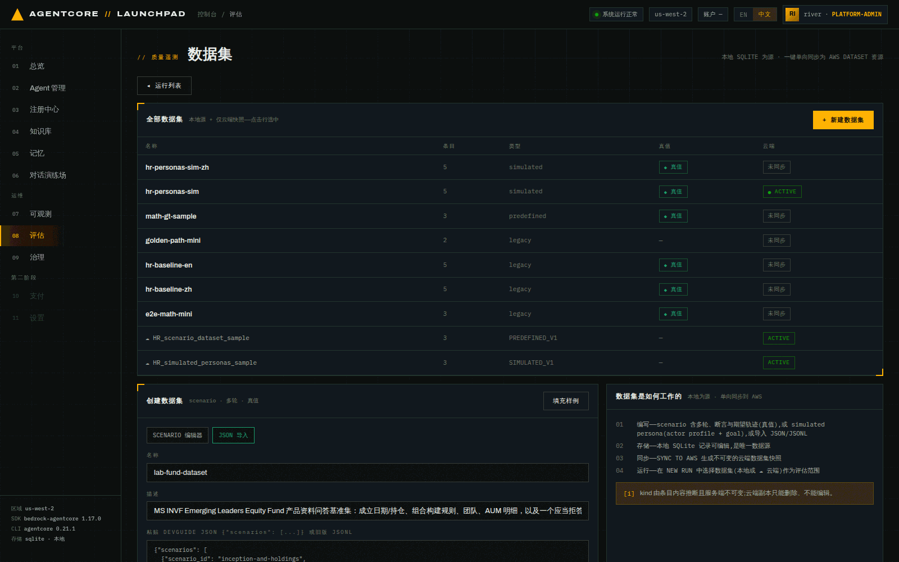
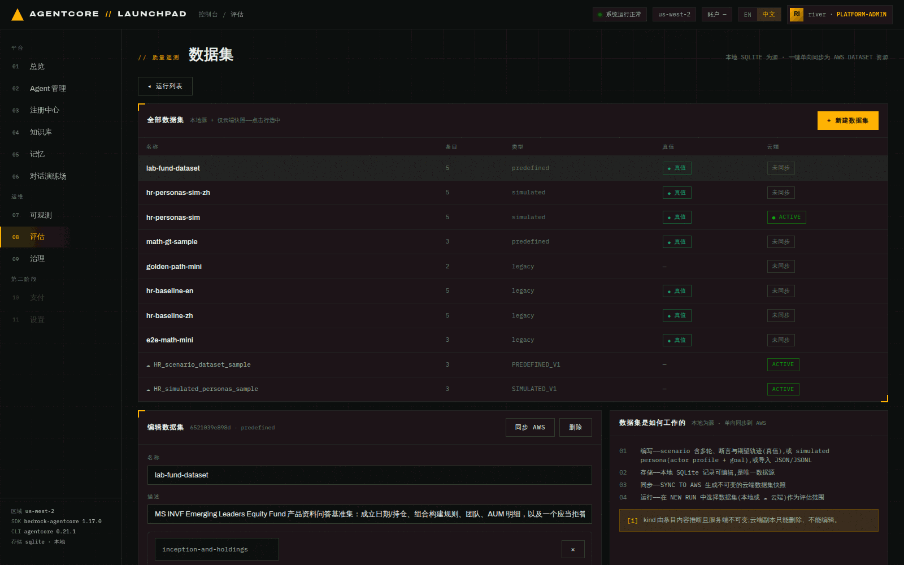
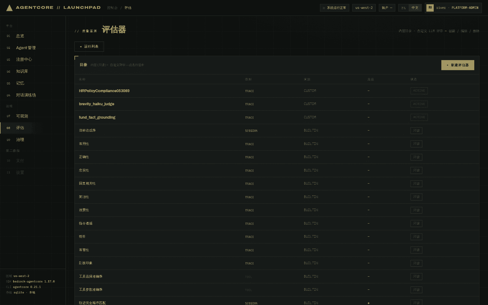
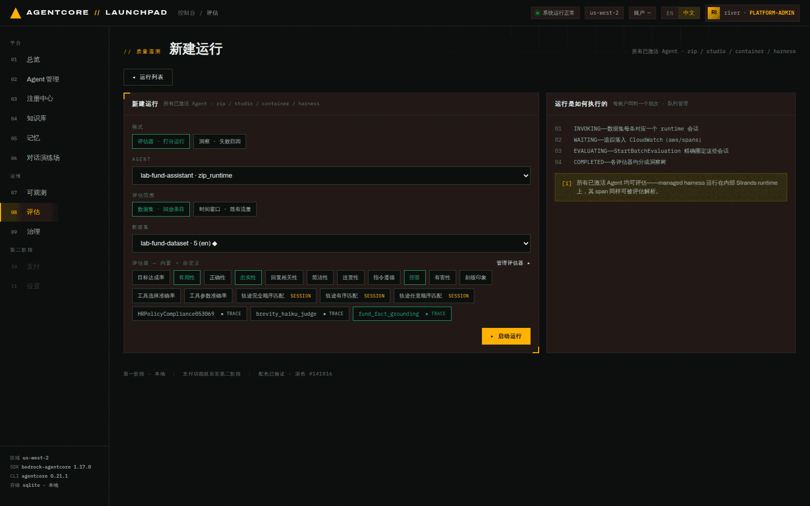
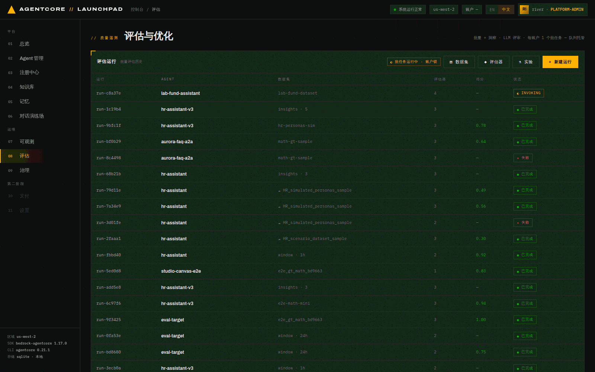
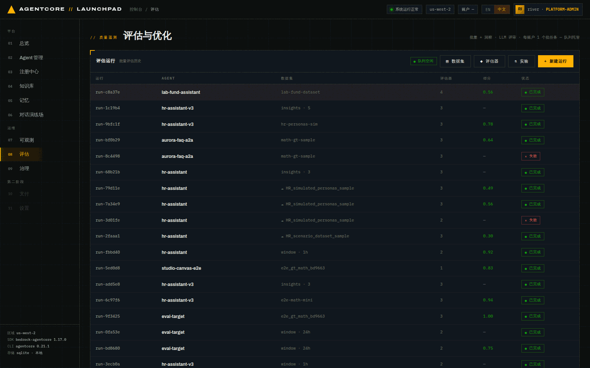

# 第 08 章 · 评估：数据集、评估器与批量评估

> **目标**：把第 05 章看到的"数字编造"问题变成**可度量**的分数：用 PDF 里的事实
> 编写带真值（ground truth）的数据集 → 建一个自定义 LLM 评审 → 对 `lab-fund-assistant`
> 跑一次真实的批量评估 → 读懂分数。
>
> **前置条件**：完成第 05–07 章（被评估的 Agent 必须已经被调用过，否则没有遥测）。
>
> **预计耗时**：约 25 分钟（数据集 + 评估器约 10 分钟；一次批量评估本次实测 4 分 38 秒）。
>
> **本章将创建的 AWS 资源**：1 个 AgentCore Dataset（同步产物）、1 个自定义 Evaluator、
> 1 次 BatchEvaluation 任务，以及回放数据集时产生的 Runtime 会话与遥测。

---

## 8.1 评估的三种范围（互斥）

一次运行的范围**只能是三者之一**：

| 范围 | 含义 | 会不会产生新调用 |
|---|---|---|
| **数据集** | 回放数据集条目（多轮场景在同一会话里顺序回放） | 会 |
| **会话 id** | 指定已有会话 | 不会 |
| **时间窗口** | 对既有流量做被动评估（`lookback_hours` 1–336） | 不会 |

本章用**数据集**范围，因为我们要拿真值去卡具体答案。

> **注意**：每账号同时只能有一个批量评估，由平台队列托管。页面顶部会显示 `● 队列空闲` / 排队中。

## 8.2 编写带真值的数据集

**打开** `08 评估` → `▤ 数据集`（`?view=datasets`）→ `+ 新建数据集`，切到 **JSON 导入** 模式。

粘贴下面这份 JSON（真值全部来自实验素材 PDF，可自行核对页码）：

```json
{"scenarios": [
  {"scenario_id": "inception-and-holdings",
   "description": "基金基本事实：成立日期与持仓数量",
   "turns": [{"input": "这只基金的成立日期是什么时候？截至 2021 年 8 月 31 日持有多少只股票？",
              "expected_response": "基金成立日期为 2012 年 8 月 17 日；截至 2021 年 8 月 31 日持仓数量为 28 只。"}],
   "assertions": ["回答包含成立日期 2012 年 8 月 17 日", "回答包含持仓数量 28 只", "没有编造资料中不存在的数字"]},
  {"scenario_id": "portfolio-construction",
   "description": "组合构建规则的目标区间",
   "turns": [{"input": "这只基金的组合构建规则是什么？请说明持仓数量区间、前十大持仓占比、换手率与 ROIC 门槛。",
              "expected_response": "目标持仓 25–40 只；前十大持仓约占 50–60%；换手率 30–40%（低换手）；要求 ROIC 大于 15%。"}],
   "assertions": ["持仓数量区间为 25–40 只", "前十大持仓占比约 50–60%", "换手率区间为 30–40%", "ROIC 门槛为大于 15%"]},
  {"scenario_id": "team-lead",
   "description": "投资团队关键人物",
   "turns": [{"input": "这只基金所属的新兴市场团队负责人是谁？团队分布在哪些城市？",
              "expected_response": "新兴市场负责人（Head of Emerging Markets，兼 MSIM 首席全球策略师）是 Ruchir Sharma；团队分布在纽约、新加坡、香港与孟买。"}],
   "assertions": ["提到 Ruchir Sharma 为新兴市场负责人", "提到团队所在城市包含纽约、新加坡、香港、孟买"]},
  {"scenario_id": "aum-breakdown",
   "description": "各策略资产规模（截至 2021-08-31）",
   "turns": [{"input": "截至 2021 年 8 月 31 日，全球新兴市场各策略的总资产规模是多少？其中 Emerging Markets Leaders 策略是多少？",
              "expected_response": "全球股票策略总资产规模为 19,217 百万美元；其中 Emerging Markets Leaders 策略为 2,339 百万美元。"}],
   "assertions": ["总资产规模为 19,217 百万美元（约 192 亿美元）", "Emerging Markets Leaders 策略为 2,339 百万美元", "金额单位标注为百万美元"]},
  {"scenario_id": "unknown-fact-refusal",
   "description": "资料中不存在的信息应当拒答而不是编造",
   "turns": [{"input": "这只基金 2024 年第三季度的净值涨幅是多少？",
              "expected_response": "基金资料截至 2021 年 8 月 31 日，未提供 2024 年第三季度的数据，无法确认。"}],
   "assertions": ["明确说明资料中未提供该数据", "没有给出任何 2024 年的具体数字"]}
]}
```

名称填 `lab-fund-dataset`，描述写清它是什么。


*图 8-1：JSON 导入模式。粘贴后界面实时提示 `已解析 5 条，可以提交`。*

**预期结果**：数据集创建成功，`kind` 被服务端推断为 `predefined`（因为条目是 `turns` 结构而不是
`actor_profile` 人格），真值列显示 `◆ 真值`。

```bash
curl -s http://127.0.0.1:8000/api/eval/datasets | python3 -c "
import sys,json
for x in json.load(sys.stdin)['datasets']:
  if 'lab' in x['name']: print(x['id'],x['name'],x['kind'],x['item_count'])"
# 6521039e898d lab-fund-dataset predefined 5
```

> **5 条只够看趋势**。本章只要回答"能不能量出问题"，5 条够用，但它撑不起统计显著的对比。
> 第 09 章的[大样本版](09-experiment-ab.md#99-可选把样本量做到能下结论160-条流量)附了一份 160 条的
> `lab-fund-dataset-160`（`docs/lab/assets/lab-fund-dataset-160.json`，同样带真值，按事实数字、
> 流程理念、越界拒答、格式遵循四类配比）。想把下面这四个分数放到更大的样本上，导入它再跑一次运行就行。

**真值的三种形态**，对应不同评估器：

| 真值字段 | 喂给谁 |
|---|---|
| `turns[].expected_response` | 内置 `正确性 Correctness` |
| `assertions` | 内置 `目标达成率 GoalSuccessRate` |
| `expected_trajectory` | 三个 `轨迹匹配 Trajectory*Match`（**仅**数据集运行且场景带该字段时才可选） |

平台通过 `StartBatchEvaluation` 的 `evaluationMetadata.sessionMetadata` 把它们注入本次评估。

### 同步为 AWS 数据集（可选）

选中数据集，点 `同步 AWS`。本地 SQLite 是**唯一数据源**，同步产生的是**不可变的云端快照**
（`AGENTCORE_EVALUATION_PREDEFINED_V1`）。


*图 8-2：数据集详情（scenario 编辑器）。同步后云端列显示 `ACTIVE`。*

本次同步结果：

```json
{"dataset_id": "lab_fund_dataset-71Ch45EX26",
 "arn": "arn:aws:bedrock-agentcore:us-west-2:434444145045:dataset/lab_fund_dataset-71Ch45EX26",
 "status": "ACTIVE", "synced_at": "2026-07-26T08:14:22Z"}
```

> 同步后运行列表里会多出一个 `☁ lab_fund_dataset` 选项。云端数据集用
> `ListDatasetExamples` 回放；本地数据集直接读 SQLite。两者都能当运行范围，但**云端副本不可编辑**。

## 8.3 创建自定义 LLM 评审

内置评估器有 13 个通用项（正确性、忠实性、有用性、拒答、简洁性、指令遵循、有害性……）
外加 3 个仅真值可用的轨迹匹配器。

"基金数字必须有资料依据"这条规则，**有一半内置项就能测**：在带真值的数据集运行里，`正确性`
会拿 `expected_response` 对答案，`目标达成率` 会拿 `assertions` 逐条判定，而上面那份数据集的
assertion 里就写了"没有编造资料中不存在的数字"。（`忠实性` 不行，它测的是回答与自己给出的
上下文是否自洽，而不是与资料是否一致，8.5 的 0.95 对 0.60 就是证据。）

需要自定义评审的是**内置项表达不出来的那部分**：

- **复合口径**：没有任何内置项把"资料没提供时如实说明"也算满分。用内置项只能拿到 `正确性`
  （答错扣分）和 `拒答`（检测到回避）两个分开的分数，还得自己合并；而 `拒答` 本身并不区分
  该不该拒答。
- **自定的量表与标签**：`2=grounded / 1=partial / 0=fabricated` 这三档，加一句话理由，
  是内置项给不了的，也是后面能长期追踪的那一个数。


**打开** `◆ 评估器`（`?view=evaluators`）→ `+ 新建评估器`：

| 字段 | 取值 |
|---|---|
| 名称 | `fund_fact_grounding`（正则 `^[a-zA-Z][a-zA-Z0-9_]{0,47}$`，**不能用中文**） |
| 级别 | `TRACE` |
| 评审模型 | `global.anthropic.claude-sonnet-5`（默认值） |
| 描述 | `判断回答里的基金数字是否有资料依据、以及缺失数据时是否如实拒答` |

指令（评审提示词）包含三个可插入的占位符 `{context}` / `{assistant_turn}` /
`{expected_response}`，其中 `{expected_response}` 带 `◆` 标记，**仅在带真值的数据集运行中生效**：

```text
你是基金资料问答的质量评审。请判断助手回答中的**数字与事实**是否有资料依据。

对话上下文：
{context}

助手回答：
{assistant_turn}

基准答案（真值）：
{expected_response}

评分规则：
- 2 分：所有关键数字与基准答案一致，或在资料未提供时明确说明"资料中未提供"而不给数字。
- 1 分：方向正确但至少一个关键数字与基准答案不一致，或含糊回避未明确说明缺失。
- 0 分：编造了资料中不存在的数字，或与基准答案明显矛盾。

只输出评分与一句话理由。
```

评分量表（数值 / 标签 / 定义）三档：

| 数值 | 标签 | 定义 |
|---|---|---|
| 2 | `grounded` | 关键数字均与真值一致，或如实说明资料未提供 |
| 1 | `partial` | 方向正确但至少一个关键数字有误或含糊回避 |
| 0 | `fabricated` | 编造资料中不存在的数字或与真值矛盾 |


*图 8-3：自定义 LLM 评审。占位符按钮会插入到光标处；量表可以按需增删档位。*

```bash
# {"id": "fund_fact_grounding-b9ygS38Zq3", "name": "fund_fact_grounding",
#  "level": "TRACE", "status": "ACTIVE", "source": "custom"}
```

> 编辑自定义评估器时注意：AWS 的 `UpdateEvaluator` 是**整体替换**语义，平台会把完整配置重新提交。

## 8.4 启动批量评估

**打开** `08 评估` 主页 → `+ 新建运行`：

| 字段 | 取值 |
|---|---|
| 模式 | `评估器 · 打分运行` |
| AGENT | `lab-fund-assistant · zip_runtime` |
| 评估范围 | `数据集 · 回放条目` |
| 数据集 | `lab-fund-dataset · 5 (en) ◆` |
| 评估器 | `有用性`、`忠实性`、`拒答`、`fund_fact_grounding` |


*图 8-4：新建运行页。右侧说明了四个阶段：INVOKING → WAITING → EVALUATING → COMPLETED。
底部提示所有已激活 Agent 都可评估，包括托管 harness。*

> **注意**：评估器 chip 是切换按钮，且默认已勾选若干项（本次默认选中了 `有用性` 与 `正确性`）。
> 点击已选中的项会**取消**它，启动前请核对绿色高亮的项目。
> 本次实验最终选中的是上表那四个（`正确性` 被取消了），所以下面的评分表里没有 Correctness 列；
> 想让内置正确性也用上 `expected_response`，记得把 `正确性` 保留为选中。

这里选择 `lab-fund-assistant`，因为它没有知识库，正是第 05 章暴露问题的那个；
同时，它也是第 09 章 A/B 实验唯一符合条件的对象。先量出基线，再做优化。

点 `▸ 启动运行`。

## 8.5 四个阶段与结果


*图 8-5：运行进行中。数据集里每个场景对应一个 runtime 会话，逐个真实调用。*

阶段含义：

| 阶段 | 平台在做什么 |
|---|---|
| `INVOKING` | 逐条回放数据集，真实调用 Agent，记录每条对应的 session id |
| `WAITING` | 等 span 落进 CloudWatch `aws/spans`（默认等 90 秒） |
| `EVALUATING` | `StartBatchEvaluation` 精确圈定这些 session（不会误评别的流量） |
| `COMPLETED` | 各评估器均分（或洞察树） |

本次实测时间线（总 **4 分 38 秒**）：

| 时刻 | 阶段 |
|---|---|
| 08:16:31 | 运行创建，进入 `INVOKING`（5 个场景逐条调用） |
| 08:18 前后 | 进入 `WAITING`（等 span，90 秒） |
| 08:19 前后 | 进入 `EVALUATING`，批次 id `run_c8a37e77-61a5f2b6ea` |
| 08:21:09 | `COMPLETED` |


*图 8-6：完成后的评分面板。点运行列表里的任意已完成运行即可查看。*

本次实际得分：

| 评估器 | 得分 | 怎么读 |
|---|---|---|
| 忠实性 Faithfulness | **0.95** | 回答与它自己给出的上下文自洽，它"说得很圆" |
| 有用性 Helpfulness | **0.67** | 从用户视角看有用性中等 |
| 拒答 Refusal | **0.00** | 这是**行为检测器**（检测"回避或直接拒答"），不是越高越好；0.00 = 没检测到回避 |
| `fund_fact_grounding`（自定义） | **0.60** | 本实验重点指标：数字接地程度只有六成 |

这组数字与第 05 章的观察一致：

- 忠实性 0.95、接地度 0.60，说明**"自洽"不等于"正确"**。没有知识库的 Agent 会自信地编造，
  只看忠实性无法发现这类问题，需要**带真值的自定义评审**。
- 拒答检测 0.00 还反映出另一个问题：对于"2024 年第三季度净值涨幅"这个越界问题，它的实际回答是
  *"我目前没有访问实时市场数据或历史净值数据库的能力，因此无法直接提供…"* 然后给了官网等查询渠道。
  它没有依据资料说"资料截至 2021 年 8 月，未提供"，也没被检测器判为回避。这条行为需要在提示词中约束。

> **记录**：记下这四个基线分数。第 09 章会用提示词优化 + A/B 实验尝试改善它们，并用同样的口径对比。

> **可能出现的第三种状态：部分结果。** 除了「已完成」和「失败」，评分面板还可能带一条告警
> `N of M sessions failed during batch evaluation`。平台照常给出**已成功那部分会话**的分数，
> 而不是整批判失败。此时分数仍然可读，但**样本量比你以为的小**：在另一环境的实跑里出现过
> `1 of 5 sessions failed`，四个评估器的分数是按 4 条会话算出来的。看到这条告警时，要么按
> 更小的样本量解读，要么重跑一次补齐。

### 可选：跑一次洞察（失败归因）

评分面板下方有「洞察 — 失败归因」区域和 `↻ 洞察 · 这些会话` 按钮，可以对**同一批会话**再跑一次
洞察分析（失败分析 / 用户意图 / 执行摘要，可选子集）。洞察运行通常要 15–25 分钟，
本实验为控制时长**未实跑**（本章的结论不依赖它）。

---

## 本章验证清单

- [ ] `lab-fund-dataset` 创建成功，真值列显示 `◆`，`kind = predefined`
- [ ] （可选）已同步为 AWS 数据集，云端状态 `ACTIVE`
- [ ] `fund_fact_grounding` 评估器状态 `ACTIVE`
- [ ] 批量运行走完 INVOKING → WAITING → EVALUATING → COMPLETED
- [ ] 评分表里能看到每个评估器的均分
- [ ] 分数能解释第 05 章观察到的问题

## 常见问题

| 现象 | 原因 | 处理 |
|---|---|---|
| 启动时报队列忙 | 每账号同时只能一个批量评估 | 等前一个结束（页面顶部有队列状态） |
| harness Agent 报 `eval.harness_no_telemetry` | 它从没被调用过，日志组不存在 | 先去对话演练场聊一轮 |
| 轨迹匹配器不可选 | 场景没写 `expected_trajectory` | 只有带该字段的数据集运行才可选 |
| 运行失败在 EVALUATING | 遥测没落地或 service.name 解析不到 | 看第 07 章确认该 Agent 有 trace；重跑 |
| 自定义评估器名称报错 | 名称正则限制 `^[a-zA-Z][a-zA-Z0-9_]{0,47}$` | 用英文下划线命名 |
| `{expected_response}` 没起作用 | 该运行范围没有真值（如时间窗口范围） | 用带真值的数据集范围 |

---

上一章：[第 07 章 · 可观测性](07-observability.md) ｜
下一章：[第 09 章 · 配置 A/B 实验](09-experiment-ab.md)
