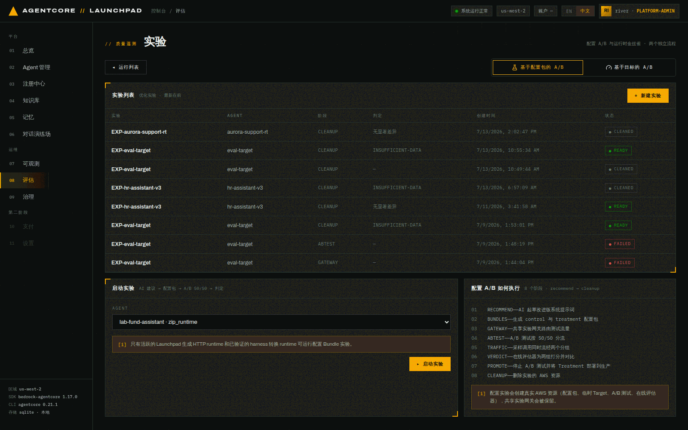
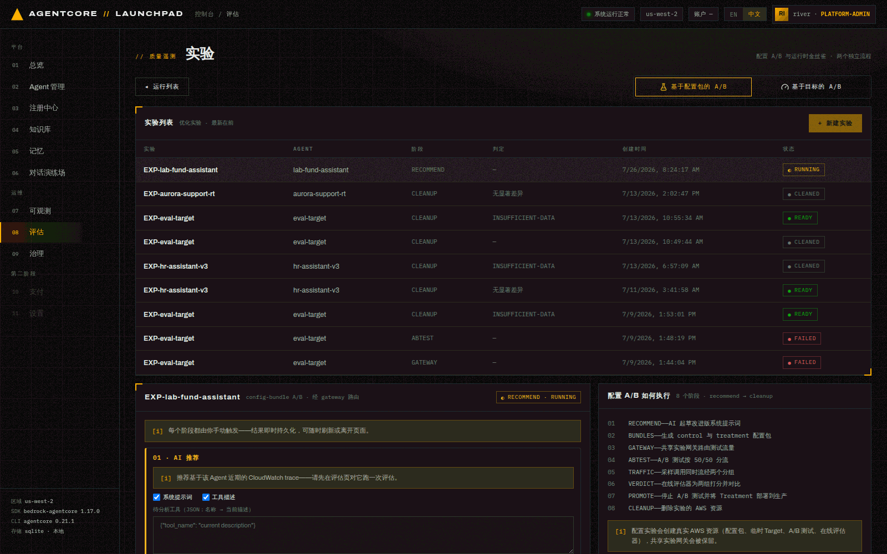
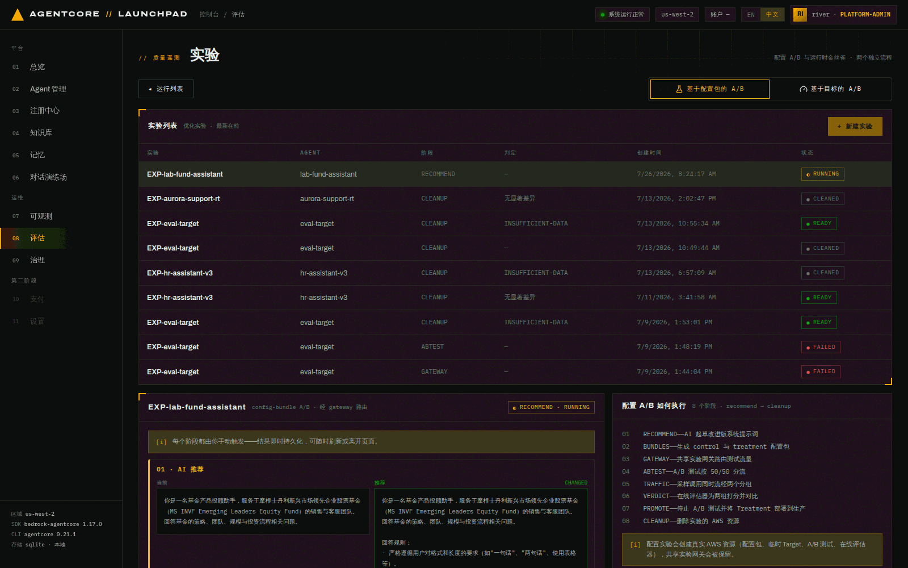
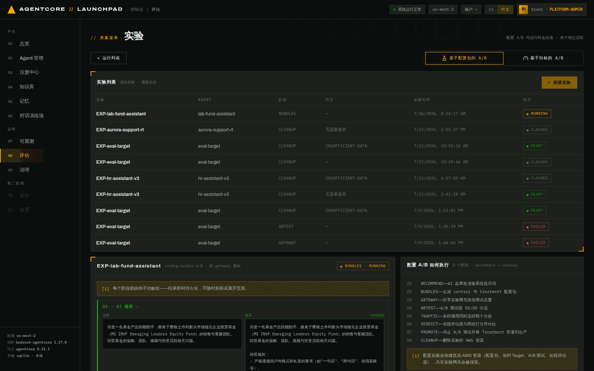
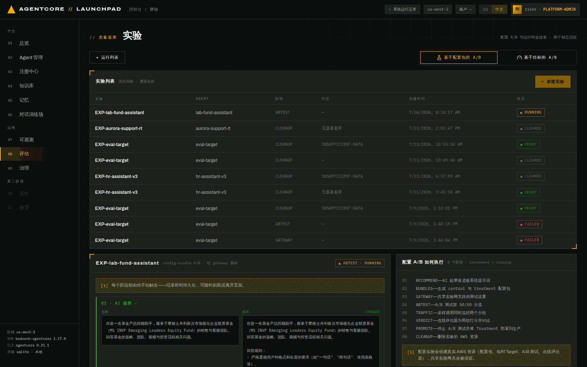
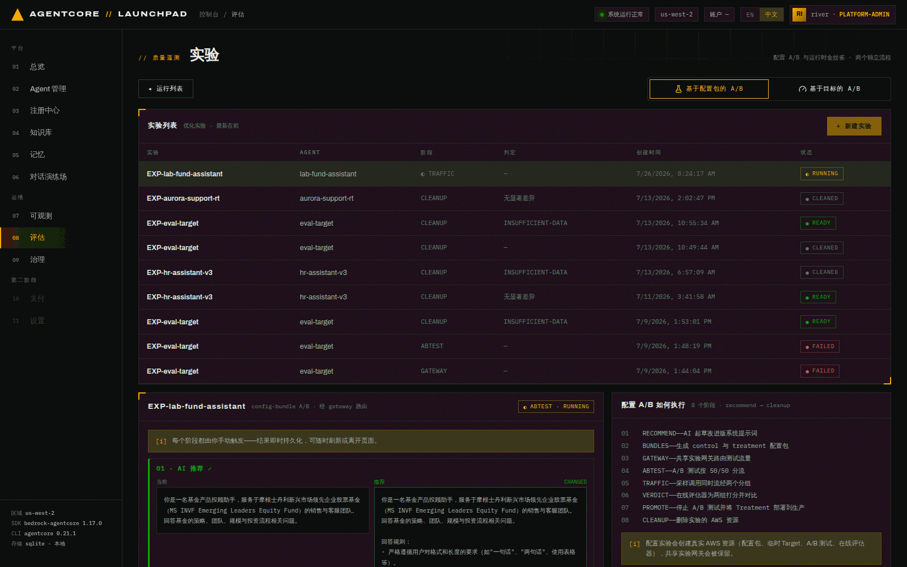
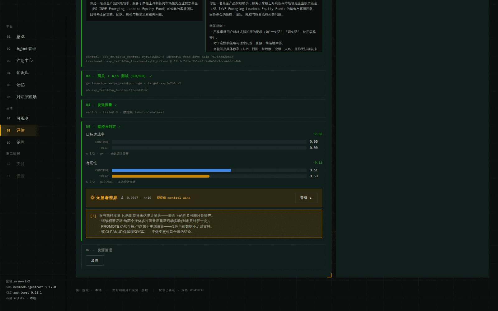
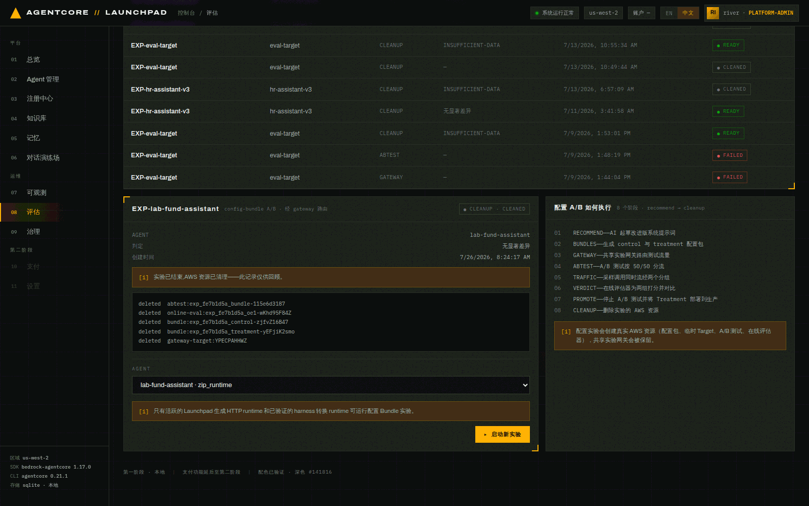

# 第 09 章 · 优化与配置包 A/B 实验

> **目标**：用第 08 章量化出来的问题驱动一次真实的 A/B 实验——让优化器分析 trace 生成改进版
> 系统提示词，做成 control / treatment 两个**配置包**，通过专属实验网关按 50/50 分流，
> 采样打分，得出判定，再决定晋升还是丢弃。
>
> **前置条件**：完成[第 08 章](08-evaluation.md)。**实验对象必须是 zip_runtime 方式的 Agent**
> （见 9.0）。同时满足：账号里没有其它 `running` 实验，共享网关未被别的实验占用。
>
> **预计耗时**：约 30 分钟（8 个阶段逐个手动触发，每步 10 秒到几分钟）。
>
> **本章将创建的 AWS 资源**：2 个 Configuration Bundle、1 个专属实验 Gateway（含 runtime target）、
> 1 个 A/B 测试、1–2 个在线评估配置。**这些都会在 `CLEANUP` 阶段被删除**。

---

## 9.0 为什么只能对 zip_runtime 做配置包实验

打开 `08 评估` → `⚗ 实验` → `+ 新建实验`，Agent 下拉里会**直接把不合格的原因写出来**：

```
lab-fund-assistant · zip_runtime          ← 可选
aurora-support-rt · zip_runtime           ← 可选
lab-fund-packager · container — 只有 Launchpad 托管的 HTTP runtime Agent 支持 config-bundle 实验
lab-fund-advisor · harness   — 只有 Launchpad 托管的 HTTP runtime Agent 支持 config-bundle 实验
```


*图 9-1：新建实验。右侧「配置 A/B 如何执行」列出 8 个阶段：recommend → bundles → gateway
→ abtest → traffic → verdict → promote → cleanup。*

原因是机制性的：

- **配置包要被 Agent 代码主动读取**。ZIP 通道生成的 Strands 运行时内置 `get_config_bundle()`
  契约（第 02 章配置页那条提示），会在启动时读取路由下发的系统提示词与工具描述。
- **Harness 不行**：它背后的 runtime 被托管、不能直接 invoke，而且导出的 harness 代码里没有任何
  配置包读取逻辑——A/B 变体对它是**空操作**。
- **容器不行**：同理，且候选版本铸造需要 CodeBuild 推镜像（属后续能力）。
- 自定义代码的 zip agent 也会被判为 `custom-source-unverified`——平台不能假设你的代码会读配置包。

> 所以本实验的对象是 `lab-fund-assistant`（第 02 章用表单创建、平台生成代码、无自定义源码）。

选中它，点 `▸ 启动实验`。实验以 `RECOMMEND` 阶段、`RUNNING` 状态创建。

> ⚠️ 每个阶段**都要你手动触发**——这不是流水线自动跑完，而是有意设计成人工闸门。
> 结果即时持久化，可以刷新页面或离开再回来。

## 9.1 RECOMMEND — 让优化器读 trace 提改进方案

实验创建后，详情面板里 8 个阶段依次列出，第一个动作按钮是 `▸ 生成 AI 推荐`。


*图 9-1b：实验详情。左侧是阶段卡片（当前 `RECOMMEND · RUNNING`），
提示语明确写着「每个阶段都由你手动触发——结果即时持久化，可随时刷新或离开页面」。*

点 `▸ 生成 AI 推荐`。进度条会显示 `generating system-prompt recommendation from recent traces…`。


*图 9-2：左「当前」右「推荐」并排 diff，右上角标 `CHANGED`。*

本次优化器给出的推荐提示词（在原提示词后追加了"回答规则"）：

```text
你是一名基金产品投顾助手，服务于摩根士丹利新兴市场领先企业股票基金（MS INVF Emerging
Leaders Equity Fund）的销售与客服团队。回答基金的策略、团队、规模与投资流程相关问题。

回答规则：
- 严格遵循用户对格式和长度的要求（如"一句话"、"两句话"、使用表格等）。
- 对于定性的策略与理念问题，直接、简洁地回答。
- 当被问及具体数字（AUM、日期、持股数、业绩、人名）且你无法确认来源时，明确告知用户你没有
  该数据，建议查阅官方 Factsheet 或联系 MSIM 团队，不得编造任何具体数值或人名。
- 在执行任何有实际影响的操作前，先用简明语言说明计划并等待用户明确确认，不得将沉默视为同意。
```

它给出的分析依据（节选，原文英文）：

> The optimizer examined eight trajectories — three with reward 1.0 and five with reward 0.0 —
> and identified a dominant failure pattern… Across every failed trace, the agent **fabricated
> precise factual data it had no verified source for**. In the trace asking about total AUM and
> the Emerging Leaders strategy size, the agent invented specific figures. In the trace asking
> about the fund's founding date and number of holdings, it produced a specific date and a
> holding count…

**这一段值得停下来看**：优化器读的是第 08 章那次评估回放产生的真实 trace，它独立地得出了
和我们自定义评审一致的结论——**编造数字**是主要失败模式。这就是"评估 → 优化"闭环真正闭上的地方。

> 旁边还有 `▸ 生成工具描述推荐`。本实验的 Agent 只用了模板内置工具、没有 gateway 工具，
> 所以它是禁用状态（`tool_status: no-tools`）。有工具的 Agent 可以同时优化工具描述。

## 9.2 ACCEPT — 人工确认

点 `▸ 接受并继续`。这一步是**同步**的（不起后台线程），把推荐的提示词固化为 treatment 的内容。


*图 9-3：接受后进入 `BUNDLES` 阶段。你也可以在接受前手工编辑推荐文本——这是人工闸门的意义。*

## 9.3 BUNDLES — 生成 control / treatment 配置包

点 `▸ 创建 CONTROL + TREATMENT`。


*图 9-4：两个真实的 AgentCore Configuration Bundle，各自带 bundle id 与 version。*

本次结果：

```json
{"control":  {"bundle_id": "exp_fe7b1d5a_control-zjfvZ16B47",
              "version": "1dedaf98-feab-4d9e-a41d-767eaad20d4a"},
 "treatment":{"bundle_id": "exp_fe7b1d5a_treatment-yEFjiK2smo",
              "version": "4fbfc7dd-c251-4157-8e54-1dca6653546b"}}
```

- **control** = 现状（原系统提示词）
- **treatment** = 接受的推荐提示词

> 创建是幂等的：如果同名包已存在，平台会通过 `ListConfigurationBundles` 冲突认领而不是报错——
> 所以中断后重试是安全的。

## 9.4 GATEWAY — 建专属实验网关与在线评估

点 `▸ 创建网关 + 在线评估`。进度显示 `creating v1 runtime target…`。


*图 9-5：为本次实验单独创建的网关与 runtime target，以及一个在线评估配置。*

本次结果：

```json
{"gateway_id": "launchpad-exp-gw-dskpucnugn",
 "gateway_url": "https://launchpad-exp-gw-dskpucnugn.gateway.bedrock-agentcore.us-west-2.amazonaws.com",
 "target_v1": "expfe7b1dv1", "target_id_v1": "YPECPAHHWZ",
 "online_eval_id": "exp_fe7b1d5a_oe1-wKhd95F84Z"}
```

> **共享网关互斥**：平台会检查共享实验网关是否已被别的实验占用（`assert_shared_gateway_available`）。
> 如果你看到相关报错，说明有实验没清理干净——先去把它 `清理` 掉。

## 9.5 ABTEST — 50/50 分流

点 `▸ 创建 A/B 测试 50/50`。


*图 9-6：A/B 测试创建完成，两个变体 `C`（control）与 `T1`（treatment）各占 50 权重，
每个变体绑定各自的配置包 ARN + 版本。*

```json
{"ab_test_id": "exp_fe7b1d5a_bundle-115e6d3187",
 "variants": [
   {"name": "C",  "weight": 50, "variantConfiguration": {"configurationBundle": {"bundleArn": "…control-zjfvZ16B47"}}},
   {"name": "T1", "weight": 50, "variantConfiguration": {"configurationBundle": {"bundleArn": "…treatment-yEFjiK2smo"}}}
 ]}
```

## 9.6 TRAFFIC — 采样调用，同时经过两个分组

选择流量来源，然后点 `▸ 发送流量`。可选：`内置演示提示词（12 条）` 或任意本地数据集——
**选 `lab-fund-dataset (5)`**，这样 A/B 用的问题和第 08 章评估口径一致。


*图 9-7：流量发送中，进度显示 `sent 3/5 (0 failed)`。请求经实验网关按权重路由到两个变体。*

本次结果：`sent 5 · failed 0 · 数据集 lab-fund-dataset`，产生 5 个会话 id。

> 注意样本量：5 个请求按 50/50 分流后，两组各只有 2–3 个样本。**这必然导致统计不显著**——
> 下一节会看到平台如何如实报告这一点。真实场景请用几十到几百条流量。

## 9.7 VERDICT — 判定（含统计显著性）

点 `▸ 监控结果`。进度显示 `aggregating · status RUNNING — results take ~10–15 min after the
last session`——在线评估器需要时间给两组打分。


*图 9-8：判定卡。每个评估器一行 control / treat 对比条，下方给出 `n`、`p` 值与显著性结论。*

本次实测判定（总耗时约 15 分钟）：

| 评估器 | control (C) | treatment (T1) | n | p | 显著 |
|---|---|---|---|---|---|
| 目标达成率 GoalSuccessRate | 0.00 | 0.00 | 3 / 2 | — | 否 |
| 有用性 Helpfulness | **0.61** | **0.50** | 3 / 2 | 0.945 | 否 |

```json
{"verdict": "control-wins", "avg_delta": -0.0567, "n": 10, "significant": false}
```

界面结论：**`◉ 无显著差异 · Δ -0.0567 · n=10 · 观察值: control-wins`**，并给出三条明确建议：

> 在当前样本量下，两组差异未达统计显著——表面上的胜者可能只是噪声。
> · 继续积累证据：给两个变体多打流量后重新启动实验（判定只计算一次）。
> · PROMOTE 仍然可用，但这属于主观决策——仅凭当前数据不足以支持。
> · 或 CLEANUP 保留现有冠军——不做变更也是合理的结论。

**这一屏是本章最该学的东西**，有三层含义：

1. **判定语义要分清**："观察值 control-wins" 只是**观察到的方向**，`significant: false` 才是结论。
   平台不会把噪声包装成胜利。
2. **treatment 反而略低不代表推荐没用**：更严格的提示词让模型在不确定时拒答，
   `Helpfulness` 这种"用户觉得有用吗"的指标本来就可能下降——**要用与你目标一致的评估器去判定**
   （比如第 08 章那个 `fund_fact_grounding`），否则会得出"越诚实越差"的错误结论。
3. **n=10 就是不够**。本实验为控制时长只打了 5 条流量；工程实践里应该先算样本量。

> ⚠️ `判定只计算一次`。想要更多证据，得重新打流量并重启实验，而不是反复点监控。

## 9.8 PROMOTE / CLEANUP — 做决定

两个出口：

- **`晋级 ▸`**：停掉 A/B，把 treatment 配置部署到生产（Agent 的系统提示词被替换成推荐版本）。
- **`清理`**：删除本次实验创建的全部 AWS 资源，保留现有冠军（不做变更）。

**本次实验选择 `清理`**——因为判定不显著，按上面第 2、3 条，晋级只会是主观决定。
（如果确实要晋级，界面会在实验记录上留下一条 `⚠ 已在未达统计显著时手动部署` 的警示，
像列表里那条历史实验 `EXP-aurora-support-rt` 一样。）


*图 9-9：清理完成，逐项列出删除结果。*

本次清理清单（**全部 deleted，幂等**）：

```
deleted  abtest:exp_fe7b1d5a_bundle-115e6d3187
deleted  online-eval:exp_fe7b1d5a_oe1-wKhd95F84Z
deleted  bundle:exp_fe7b1d5a_control-zjfvZ16B47
deleted  bundle:exp_fe7b1d5a_treatment-yEFjiK2smo
deleted  gateway-target:YPECPAHHWZ
```

> **一定要执行清理**：实验会占用共享实验网关的互斥锁，不清理会让下一次实验（或第 10 章的金丝雀）
> 直接失败。清理是幂等的，已删的项会显示 `skipped`。

---

## 本章验证清单

- [ ] 只有 zip_runtime Agent 可选，其它方式在下拉里显示不合格原因
- [ ] `RECOMMEND` 产出的推荐提示词与解释能对应到真实 trace 的失败模式
- [ ] `BUNDLES` 生成了两个真实的 Configuration Bundle（各带 version）
- [ ] `GATEWAY` 创建了本次实验专属的网关与在线评估配置
- [ ] `ABTEST` 的两个变体权重各 50，分别绑定 control / treatment 包
- [ ] `TRAFFIC` 成功发送且 failed = 0
- [ ] `VERDICT` 给出每个评估器的 control/treat 均值、n、p 值与显著性
- [ ] 判定不显著时界面明确提示"表面胜者可能是噪声"
- [ ] `CLEANUP` 后所有实验资源均为 `deleted`

## 常见问题

| 现象 | 原因 | 处理 |
|---|---|---|
| `+ 新建实验` 是禁用的 | 已有一个 `running` 实验 | 先把它 `清理` 或走到终态 |
| 报共享网关被占用 | 上一次实验没清理 | 找到那条实验执行 `清理` |
| Agent 下拉里选不到目标 Agent | 方式不支持（harness/container/A2A/自定义代码） | 用表单创建的 zip_runtime Agent |
| 判定一直 `INSUFFICIENT-DATA` | 样本太少或在线评估还没出分 | 多打流量；判定内部最多等 15 分钟 |
| `生成工具描述推荐` 是禁用的 | 该 Agent 没有可优化的工具 | 属预期（`tool_status: no-tools`） |
| 晋级后老会话行为没变 | 会话被钉在旧版本 | 开新会话验证 |

---

上一章：[第 08 章 · 评估](08-evaluation.md) ｜
下一章：[第 10 章 · Runtime 金丝雀](10-canary.md)
