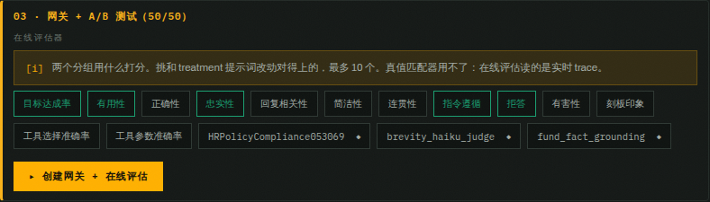
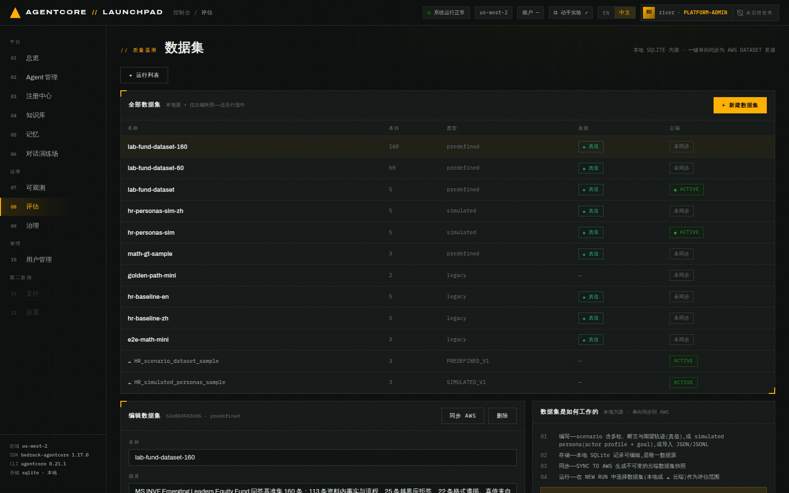
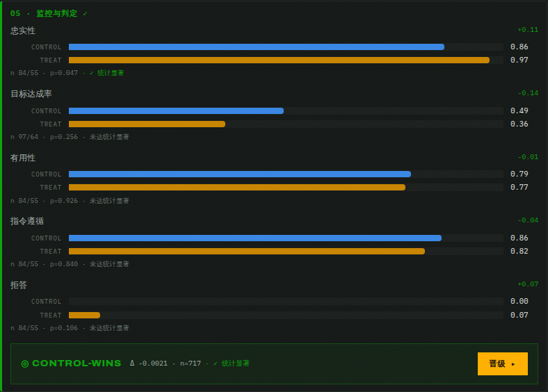

# 第 09 章 · 优化与配置包 A/B 实验

> **目标**：用第 08 章量化出来的问题驱动一次 A/B 实验：让优化器分析 trace 生成改进版
> 系统提示词，做成 control / treatment 两个**配置包**，通过专属实验网关按 50/50 分流，
> 采样打分，得出判定，再决定晋升还是丢弃。
>
> **前置条件**：完成[第 08 章](08-evaluation.md)。**实验对象必须是 zip_runtime 方式的 Agent**
> （见 9.0）。同时满足：账号里没有其它 `running` 实验，共享网关未被别的实验占用。
>
> 大样本实验的等待时间取决于单次调用速度和在线评估积压，见本章末的
> [9.9 大样本版](#99-可选把样本量做到能下结论160-条流量)。
>
> **本章将创建的 AWS 资源**：2 个 Configuration Bundle、1 个专属实验 Gateway（含 runtime target）、
> 1 个 A/B 测试、1–2 个在线评估配置。**这些都会在 `CLEANUP` 阶段被删除**。

---

## 9.0 为什么只能对 zip_runtime 做配置包实验

打开 `08 评估` → `⚗ 实验` → `+ 新建实验`，Agent 下拉里会**直接把不合格的原因写出来**：

```
lab-fund-assistant · zip_runtime          ← 可选
<OTHER_ZIP_AGENT> · zip_runtime           ← 可选
lab-fund-packager · container — 只有 Launchpad 托管的 HTTP runtime Agent 支持 config-bundle 实验
lab-fund-advisor · harness   — 只有 Launchpad 托管的 HTTP runtime Agent 支持 config-bundle 实验
```


*图 9-1：新建实验。右侧「配置 A/B 如何执行」列出 8 个阶段：recommend → bundles → gateway
→ abtest → traffic → verdict → promote → cleanup。*

限制来自实现方式：

- **配置包要被 Agent 代码主动读取**。ZIP 通道生成的 Strands 运行时内置 `get_config_bundle()`
  契约（第 02 章配置页那条提示），会在启动时读取路由下发的系统提示词与工具描述。
- **Harness 不行**：它背后的 runtime 被托管、不能直接 invoke，而且导出的 harness 代码里没有任何
  配置包读取逻辑，A/B 变体对它是**空操作**。
- **容器不行**：同理，且候选版本铸造需要 CodeBuild 推镜像（属后续能力）。
- 自定义代码的 zip agent 也会被判为 `custom-source-unverified`，平台不能假设你的代码会读配置包。

> 所以本实验的对象是 `lab-fund-assistant`（第 02 章用表单创建、平台生成代码、无自定义源码）。

选中它，点 `▸ 启动实验`。实验以 `RECOMMEND` 阶段、`RUNNING` 状态创建。

> 每个阶段都要手动触发。结果即时持久化，可以刷新页面或离开后再回来。

## 9.1 RECOMMEND — 让优化器读 trace 提改进方案

实验创建后，详情面板里 8 个阶段依次列出，第一个动作按钮是 `▸ 生成 AI 推荐`。

> **注意**：八个阶段都要手动点击按钮，平台不会自动串行执行。
> 而且顶部的 `<阶段> · RUNNING` 里的 `RUNNING` 是**这个实验整体还在进行中**，不代表该阶段
> 正在执行：停在 `BUNDLES · RUNNING` 通常只是在等你点 `▸ 创建 CONTROL + TREATMENT BUNDLE`。
> 真正在跑的阶段会显示 `◐ 运行中…` 加一行进度文字。


*图 9-1b：实验详情。左侧是阶段卡片（当前 `RECOMMEND · RUNNING`），
提示语说明每个阶段都由操作人手动触发，结果即时持久化。*

点 `▸ 生成 AI 推荐`。进度条会显示 `generating system-prompt recommendation from recent traces…`。


*图 9-2：左「当前」右「推荐」并排 diff，右上角标 `CHANGED`。*

检查推荐内容是否针对第 08 章发现的数字编造问题。你可以接受优化器的版本，也可以在文本框中
改成下面这份候选提示词：

```text
你是一名基金产品投顾助手，服务于摩根士丹利新兴市场领先企业股票基金（MS INVF Emerging
Leaders Equity Fund）的销售与客服团队。回答基金的策略、团队、规模与投资流程相关问题。

回答规则：
- 严格遵循用户对格式和长度的要求（如"一句话"、"两句话"、使用表格等）。
- 对于定性的策略与理念问题，直接、简洁地回答。
- 当被问及具体数字（AUM、日期、持股数、业绩、人名）且你无法确认来源时，明确告知用户你没有
  该数据，建议查阅官方 Factsheet 或联系 MSIM 团队，不得编造任何具体数值或人名。
- 在执行任何有实际影响的操作前，先用简明语言说明计划并等待用户明确确认，不得将沉默视为同意。
```

推荐卡片会列出分析依据和关联 trace。确认失败模式、推荐规则与 trace 内容一致，
尤其要检查它是否处理了无来源数字、格式要求和高影响操作确认。

> 旁边还有 `▸ 生成工具描述推荐`。本实验的 Agent 只用了模板内置工具、没有 gateway 工具，
> 所以它是禁用状态（`tool_status: no-tools`）。有工具的 Agent 可以同时优化工具描述。

> **推荐作业失败怎么办**：AgentCore 可能把作业判为 `FAILED`（常见原因是提示词或
> trace 被安全过滤器判定为潜在提示注入，报 `ValidationException`；trace 太少也会失败）。
> 这时卡片里显示红色失败提示（含 AWS 状态与原文错误），**不会**给出任何推荐文本，
> `▸ 接受并继续` 保持禁用。可以点 `▸ 生成提示词推荐` 重试；若确实要继续演练下游阶段，
> 就在下方文本框里自己写一版 treatment 提示词。只要与对照组提示词不同，按钮即可用。

## 9.2 ACCEPT — 人工确认

点 `▸ 接受并继续`。这一步是**同步**的（不起后台线程），把推荐的提示词固化为 treatment 的内容。


*图 9-3：接受后进入 `BUNDLES` 阶段。接受前仍可手工编辑推荐文本。*

## 9.3 BUNDLES — 生成 control / treatment 配置包

点 `▸ 创建 CONTROL + TREATMENT`。


*图 9-4：两个真实的 AgentCore Configuration Bundle，各自带 bundle id 与 version。*

- **control** = 现状（原系统提示词）
- **treatment** = 接受的推荐提示词

创建完成后，两个配置包都应显示各自的 bundle ID 和 version。

> 创建是幂等的：如果同名包已存在，平台会通过 `ListConfigurationBundles` 冲突认领而不是报错，
> 中断后可以重试。

## 9.4 GATEWAY — 建专属实验网关与在线评估

这一步先选**在线评估器**，也就是两个分组用什么打分，再点 `▸ 创建网关 + 在线评估`。
默认勾选 `目标达成率` + `有用性`。确认评估器后，进度会显示
`creating v1 runtime target…`。


*图 9-5a：GATEWAY 卡片上的评估器选择。13 个内置项加账号里的自定义评审（`◆`），最多 10 个。
真值匹配器（`Builtin.Trajectory*Match`）不在列表里，在线评估读的是实时 trace、没有真值。*

> **选它是有讲究的**：treatment 提示词改了什么，就用能测出那件事的评估器。默认那两个
> 未必对得上你的改动。[9.9](#99-可选把样本量做到能下结论160-条流量)会根据优化目标
> 重新选择评估器。选择会记在 `gateway` artifact 的 `online_evaluators` 里。


*图 9-5：实验专属网关、runtime target 和在线评估配置。*

完成后，核对卡片中的 Gateway ID、URL、runtime target 和在线评估配置 ID。

> **共享网关互斥**：平台会检查共享实验网关是否已被别的实验占用（`assert_shared_gateway_available`）。
> 如果看到相关报错，说明有实验没清理干净，先把它 `清理` 掉。
>
> **在线评估配置按名字幂等认领**：配置名是 `exp_<实验前 8 位>_oe1`。如果这一步中途失败、
> 重试时同名配置已经存在，平台会认领旧的那个，**旧配置的评估器集合不会被改写**。
> 想换评估器就得先把那个配置删掉再重试。

## 9.5 ABTEST — 50/50 分流

点 `▸ 创建 A/B 测试 50/50`。


*图 9-6：A/B 测试创建完成，两个变体 `C`（control）与 `T1`（treatment）各占 50 权重，
每个变体绑定各自的配置包 ARN + 版本。*

```json
{"ab_test_id": "<AB_TEST_ID>",
 "variants": [
   {"name": "C",  "weight": 50, "variantConfiguration": {"configurationBundle": {"bundleArn": "<CONTROL_BUNDLE_ARN>"}}},
   {"name": "T1", "weight": 50, "variantConfiguration": {"configurationBundle": {"bundleArn": "<TREATMENT_BUNDLE_ARN>"}}}
 ]}
```

## 9.6 TRAFFIC — 采样调用，同时经过两个分组

选择流量来源，然后点 `▸ 发送流量`。可选：`内置演示提示词（12 条）` 或任意本地数据集。
**选 `lab-fund-dataset (5)`**，这样 A/B 用的问题和第 08 章评估口径一致。


*图 9-7：流量发送时，进度会显示已发送数与失败数。请求经实验网关按权重路由到两个变体。*

发送完成后，卡片应显示 `sent`、`failed`、数据集名称和本轮产生的会话 ID。

> 注意样本量：5 个请求按 50/50 分流后，两组各只有 2–3 个样本，**必然无法达到统计显著**。
> 平台会在判定中明确标出这一点。实际使用时需要上百条流量；
> [9.9](#99-可选把样本量做到能下结论160-条流量)会说明如何按功率估算样本量。

## 9.7 VERDICT — 判定（含统计显著性）

点 `▸ 监控结果`。进度显示 `aggregating · status RUNNING — results take ~10–15 min after the
last session`。在线评估器需要时间给两组打分。


*图 9-8：判定卡。每个评估器一行 control / treat 对比条，下方给出 `n`、`p` 值与显著性结论。*

判定需要分三层读：

1. **先看显著性**：`control-wins` 或 `treatment-wins` 可能只是观察方向。只有显著性字段说明
   当前证据是否足以支持差异。
2. **再看评估器口径**：更严格的提示词可能降低 `Helpfulness`，因为模型在不确定时更常拒答。
   评估器必须对应 treatment 实际修改的行为。
3. **最后看样本量**：5 个请求按 50/50 分流后，每组通常只有 2–3 个样本，无法支撑稳定结论。
   需要更可靠的判定时，按 [9.9](#99-可选把样本量做到能下结论160-条流量) 估算样本量后重跑。

> **注意**：`判定只计算一次`。想要更多证据，需要重新打流量并重启实验，而不是反复点监控。

## 9.8 PROMOTE / CLEANUP — 做决定

两个出口：

- **`晋级 ▸`**：停掉 A/B，把 treatment 配置部署到生产（Agent 的系统提示词被替换成推荐版本）。
- **`清理`**：删除当前实验创建的全部 AWS 资源，保留现有冠军（不做变更）。

如果判定未达显著，选择 `清理`，保留现有冠军。只有在业务方明确接受证据不足的风险时才手动晋级；
界面会在实验记录上保留 `⚠ 已在未达统计显著时手动部署` 警示。


*图 9-9：清理完成，逐项列出删除结果。*

清理结果应覆盖以下资源类型：

```
deleted  abtest:<AB_TEST_ID>
deleted  online-eval:<ONLINE_EVAL_ID>
deleted  bundle:<CONTROL_BUNDLE_ID>
deleted  bundle:<TREATMENT_BUNDLE_ID>
deleted  gateway-target:<TARGET_ID>
```

> **必须执行清理**：实验会占用共享实验网关的互斥锁，不清理会让下一次实验（或第 10 章的金丝雀）
> 直接失败。清理是幂等的，已删的项会显示 `skipped`。

---

## 9.9 可选：把样本量做到能下结论（160 条流量）

9.6 只发了 5 条流量，两边谁高谁低都可能是噪声。想拿到一个能支持决策的
判定，有两件事要同时做对：**样本量够**，**评估器口径对得上 treatment 改的东西**。本节把两件事
一起做齐，再运行一个新实验。前置条件与 9.0 相同，账号里不能有别的 `running` 实验。

### 9.9.1 样本量要按功率算，不是随手加

两组均值差的粗算是每组 `n ≈ 2(z(α/2)+z(β))²σ²/δ²`。在 α=0.05、power=0.8 下：

| 想检出的差异 δ | 打分波动 σ | 每组需要 | 总流量 |
|---|---|---|---|
| 0.10 | 0.30 | 约 140 | 约 280 |
| 0.18 | 0.375 | 约 70 | 约 **140** |
| 0.20 | 0.30 | 约 35 | 约 70 |

`拒答` 这类接近 0/1 的检测器，均值落在 0.1–0.3 时 σ≈0.375，要抓 0.18 量级的行为差异就需要每组
70 条左右。**160 条**（每组期望 80）留了余量，也是控制台单个数据集 200 条上限内比较实用的量。

> 公式给的是 power=0.8 所需的量，不是显著性的固定门槛。功率不足会增加漏掉真实差异的概率。
> 如果结果未达显著，先确认有效样本量是否满足设计要求，再解释结果。

**打开** `08 评估` → `▤ 数据集` → `+ 新建数据集` → **JSON 导入**，粘贴
[`assets/lab-fund-dataset-160.json`](assets/lab-fund-dataset-160.json) 的**全部内容**，名称填
`lab-fund-dataset-160`。界面会提示 `已解析 160 条，可以提交`。

160 个 scenario 全部单轮、全部带真值（真值来自实验素材 PDF），按四类行为配比，覆盖不同的失败面。
同一个问题抄 160 遍是没用的，同质流量只会把同一种偏差放大：

| 组别 | 条数 | 问什么 | 想测什么 |
|---|---|---|---|
| 资料内事实数字 | 72 | 成立日期、持仓 28 只、前十大 55.81%、AUM 19,217 百万美元、P/E 52.19、夏普 1.24、逐只持仓的权重与买入月份…… | 该说得出的数字有没有说对 |
| 流程与理念 | 41 | 三步投资流程、覆盖漏斗、买卖纪律、三道风险防线、代理投票、团队与策略沿革 | 定性问题会不会因为怕出错而变得没用 |
| 越界应拒答 | 25 | 2024Q3 净值、当前 AUM、TER、ISIN、注册地、份额类别、税务、明年涨幅、买不买建议…… | 资料里没有的会不会硬答 |
| 格式遵循 | 22 | 一句话/两句话、Markdown 表格、JSON、只输出数字、字数上限、用英文答 | 长度与格式约束守不守 |


*图 9-10：`lab-fund-dataset-160` 创建完成，`160` 条、`predefined`、真值列 `◆ 真值`。
它只是本地 SQLite 数据集，A/B 流量不需要同步到 AWS。*

> 这份数据集带真值，所以也能直接拿去第 08 章跑批量评估。A/B 阶段用不到真值，
> 在线评估器不吃 `expected_response` / `assertions`。

### 9.9.2 评估器要对准 treatment 改了什么

`⚗ 实验` → `▸ 启动实验` → 选 `lab-fund-assistant`，`RECOMMEND` → `ACCEPT` → `BUNDLES` 和
9.1–9.3 一样。到 `GATEWAY`，把评估器从默认两个改成五个：

| 评估器 | 为什么选它 |
|---|---|
| `拒答 Refusal` | treatment 提示词直接改了"什么时候该拒答"，这是主指标 |
| `忠实性 Faithfulness` | 少拒答就可能多编造，用它盯住反面风险 |
| `目标达成率 GoalSuccessRate` | 会话级，看这一轮到底有没有把用户的问题解决 |
| `指令遵循 InstructionFollowing` | 数据集里 22 条格式题的对照指标 |
| `有用性 Helpfulness` | 保留默认项之一，作为总体体验的参照 |


*图 9-11：GATEWAY 卡片上的评估器选择。13 个内置项加账号里的自定义评审（`◆`），最多 10 个。*

> **自定义评审在这条路上用不了**：`fund_fact_grounding` 的评分规则依赖 `{expected_response}`，
> 而在线评估打的是实时 trace、没有真值，勾上它只会得到一个降级口径。要用真值判接地度，
> 回第 08 章的批量评估。
>
> **别忘了先读推荐**：每次 `RECOMMEND` 都重新分析 trace，方向可能和上一次相反。
> 如果推荐要求减少拒答并给出更多信息，就把 `拒答` 和 `忠实性` 作为关键指标，
> 同时检查回答是否开始编造。

### 9.9.3 发 160 条流量

`TRAFFIC` 阶段流量来源选 `lab-fund-dataset-160 (160)`，然后 `▸ 发送流量`。

卡片上会显示 `sent N/160 (M failed)` 进度，这个阶段跑在后台线程上，可以离开页面。
每条数据都会触发一次真实 Agent 调用，整体耗时取决于调用延迟和失败重试。

> **失败要到日志里查原因**：`failed` 只按 HTTP 状态码累加，不记录原因。去 Agent 的 runtime
> 日志组搜索 `Invocation failed`。Bedrock 瞬时错误可能显示为：
>
> ```
> ERROR Invocation failed  errorType: InternalServerException
> An error occurred (InternalServerException) when calling the ConverseStream operation
> (reached max retries: 4): The system encountered an unexpected error during processing.
> ```
>
> 先根据错误类型区分瞬时 5xx 与限流，不要仅凭 `failed` 数量判断原因。长时间连续发流量时可能出现
> 零星失败，因此样本量应在功率估算结果上留出余量。
>
> 失败调用也可能产生会话和 trace。会话级 `目标达成率` 会把这些调用算作未达成，
> trace 级评估器只评估产生回答的 trace，因此不同评估器的 `n` 可能不同。

### 9.9.4 判定

**先等打分追平再点 `▸ 监控结果`。** 在线评估逐个会话打分，明显滞后于流量，而**判定只算一次**，
按钮点过就从卡片上消失。流量发完立刻点，判定只会用到已经打完分的那部分会话。

在线评估通常会比流量发送晚一段时间。等待各评估器的样本数稳定后再点判定。
如果期间手工向网关发送了额外请求，这些请求也可能进入在线评估，因此 `n` 不一定与数据集条数完全一致。


*图 9-12：五个评估器各占一行，分别显示两组均值、样本量、差值、p 值与显著性。*

页面顶部的 `significant` 与 `verdict` 要分开读取：

- `significant: true` 表示**至少一个评估器**达到显著，平台会对各评估器的
  `isSignificant` 取或。
- `verdict` 表示所有评估器差值的平均方向，不代表每个指标都支持同一组。

因此，即使页面显示 `control-wins` 且 `significant: true`，也要逐行确认显著性来自哪个指标，
以及关键业务指标是否同方向。不能把顶部汇总直接读成"control 在所有指标上都显著更好"。

判定时依次检查：

1. 有效样本量是否达到 9.9.1 的设计目标，失败调用是否明显压低了样本数。
2. 出现显著差异的评估器是否对应 treatment 修改的行为。
3. `忠实性` 是否被误读为事实正确。`忠实性` 测的是
   回答与它自己给出的上下文是否自洽（[第 08 章 8.3](08-evaluation.md#83-创建自定义-llm-评审)）。
   要判断数字有没有依据，应回第 08 章使用带真值的批量评估和 `fund_fact_grounding`。
4. 关键指标是否互相冲突。如果 treatment 在某项显著改善，却在目标达成率或接地度上变差，
   不要仅凭汇总方向晋级。

完成判断后执行 `清理`。数据集不属于实验资源，不会被删除。清理列表应包含：

```
deleted  abtest:<AB_TEST_ID>
deleted  online-eval:<ONLINE_EVAL_ID>
deleted  bundle:<CONTROL_BUNDLE_ID>
deleted  bundle:<TREATMENT_BUNDLE_ID>
deleted  gateway-target:<TARGET_ID>
```

---

## 本章验证清单

- [ ] 只有 zip_runtime Agent 可选，其它方式在下拉里显示不合格原因
- [ ] `RECOMMEND` 产出的推荐提示词与解释能对应到真实 trace 的失败模式
- [ ] `BUNDLES` 生成了两个真实的 Configuration Bundle（各带 version）
- [ ] `GATEWAY` 创建了实验专属网关与在线评估配置
- [ ] `ABTEST` 的两个变体权重各 50，分别绑定 control / treatment 包
- [ ] `TRAFFIC` 发送完成，`failed` 的原因能在 runtime 日志里对上
- [ ] `VERDICT` 给出每个评估器的 control/treat 均值、n、p 值与显著性
- [ ] 判定不显著时界面明确提示"表面胜者可能是噪声"
- [ ] `CLEANUP` 后所有实验资源均为 `deleted`
- [ ]（可选，9.9）`lab-fund-dataset-160` 导入成功：`160` 条、`predefined`、带真值
- [ ]（可选，9.9）GATEWAY 卡片能勾选评估器，判定里每个勾选的评估器都有独立一行
- [ ]（可选，9.9）能按自己的判定结果说明 `significant` 与 `verdict` 的区别

## 常见问题

| 现象 | 原因 | 处理 |
|---|---|---|
| `+ 新建实验` 是禁用的 | 已有一个 `running` 实验 | 先把它 `清理` 或走到终态 |
| 报共享网关被占用 | 上一次实验没清理 | 找到那条实验执行 `清理` |
| Agent 下拉里选不到目标 Agent | 方式不支持（harness/container/A2A/自定义代码） | 用表单创建的 zip_runtime Agent |
| 判定一直 `INSUFFICIENT-DATA` | 样本太少或在线评估还没出分 | 多打流量；判定内部最多等 15 分钟 |
| 判定的 `n` 比会话数小很多 | 点判定时在线评估还没给所有会话打分，而判定只算一次 | 发完流量等 15 分钟以上再点（见 9.9.4） |
| 加大样本后还是不显著 | 效应本身太小，或评估器与优化目标不一致 | 按 9.9.1 粗算所需样本；再看评估器测的是不是 treatment 改的那件事（9.9.2） |
| 流量里出现零星 `failed` | Bedrock `ConverseStream` 瞬时 `InternalServerException` | 去 runtime 日志组核对原因；样本量要按 9.9.1 留余量 |
| `生成工具描述推荐` 是禁用的 | 该 Agent 没有可优化的工具 | 属预期（`tool_status: no-tools`） |
| 晋级后老会话行为没变 | 会话被钉在旧版本 | 开新会话验证 |

---

上一章：[第 08 章 · 评估](08-evaluation.md) ｜
下一章：[第 10 章 · Runtime 金丝雀](10-canary.md)
