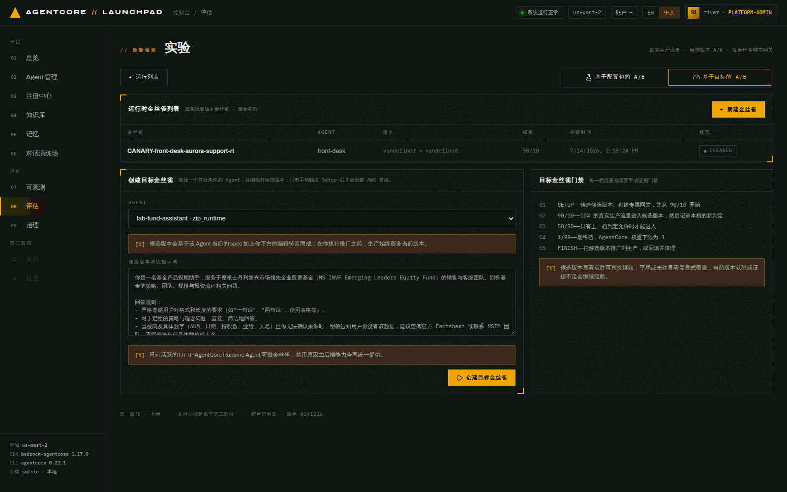
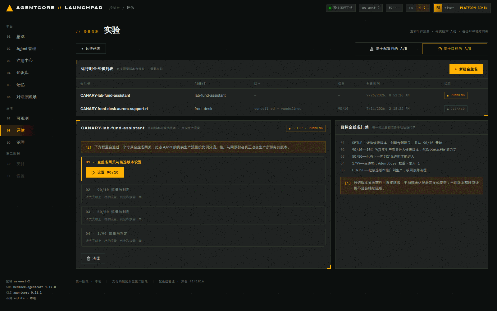
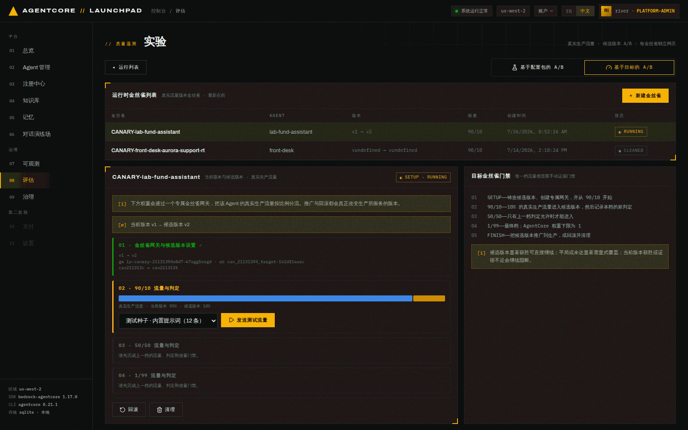
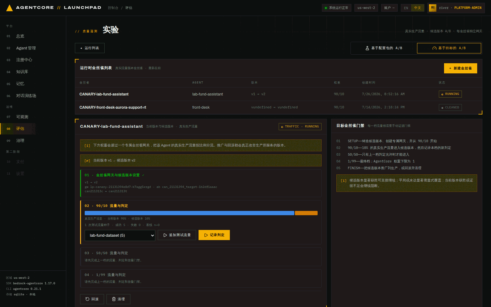
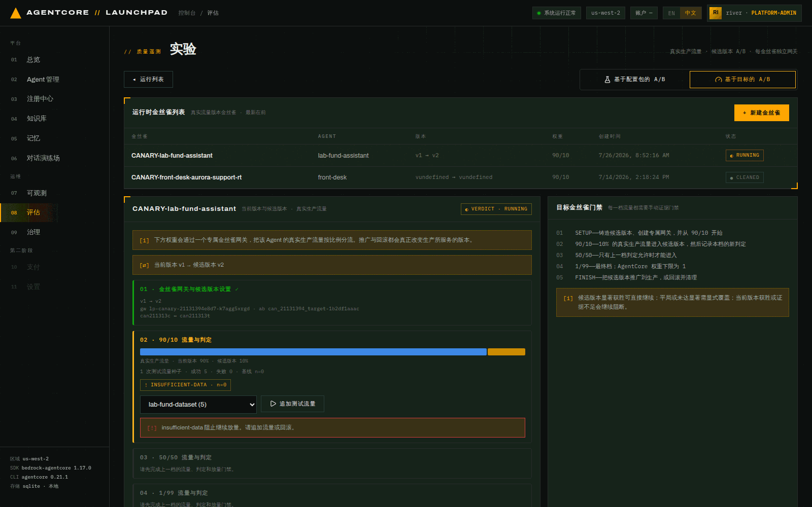
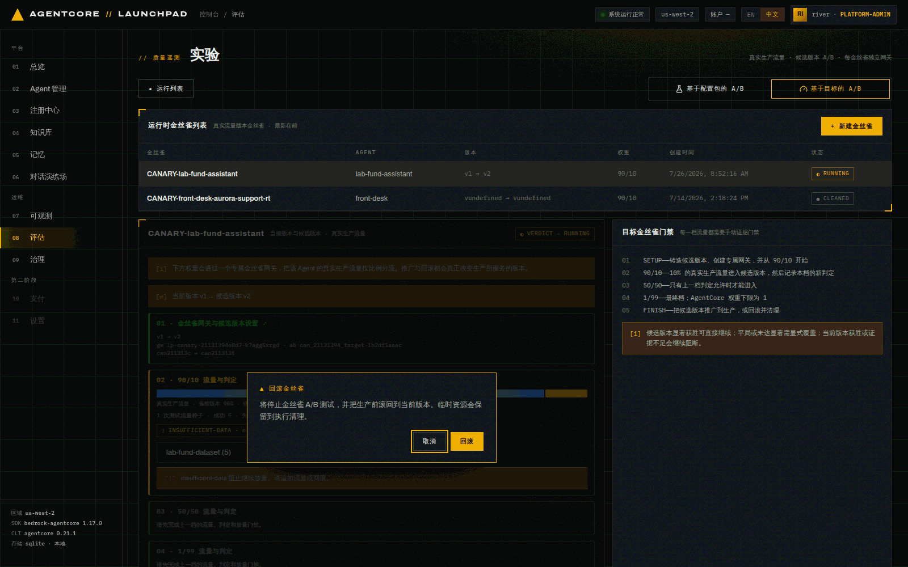
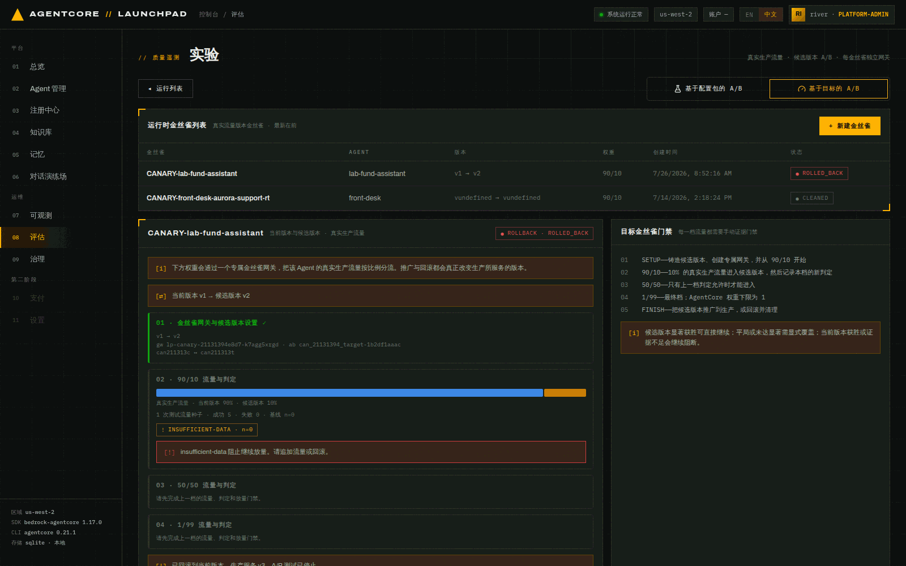
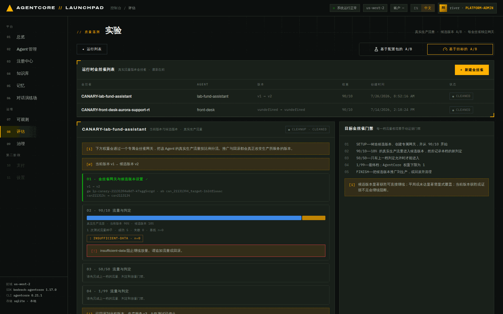

# 第 10 章 · Runtime 金丝雀：把改进版本灰度到真实流量

> **目标**：跑一遍与配置包 A/B **完全不同**的另一条灰度路径——目标金丝雀。它铸造一个真正的
> **候选运行时版本**，用专属金丝雀网关把**真实生产流量**按 90/10 → 50/50 → 1/99 分档切过去，
> 每一档都要人工过证据门禁，最后推广或回滚。
>
> **前置条件**：第 09 章的实验已 `CLEANUP`。对象必须是 `zip_runtime` / `studio` 方式的
> active Agent（见 10.0）。
>
> **预计耗时**：约 25 分钟（setup 约 1 分钟，每档判定最多等 15 分钟）。
>
> **本章将创建的 AWS 资源**：1 个候选 Runtime 版本（v2）、1 个稳定端点、1 个**专属**金丝雀
> Gateway + 2 个 target、1 个 A/B 测试、2 个在线评估配置。**均在 `清理` 时删除。**

---

## 10.0 与配置包 A/B 的区别

| | 第 09 章 配置包 A/B | 本章 目标金丝雀 |
|---|---|---|
| 变的是什么 | **配置**（系统提示词 / 工具描述），代码与版本不变 | **运行时版本本身**（用编辑后的 spec 铸造 v2） |
| 流量 | 采样调用（你手动打的测试流量） | **真实生产流量**按权重分流 |
| 分流载体 | 共享实验网关 + 配置包变体 | **每个金丝雀一个专属网关** + 两个 runtime target |
| 档位 | 单一 50/50 | 90/10 → 50/50 → 1/99，逐档放量 |
| 门禁 | 一次判定 | **每档一次判定 + 手动放量门禁** |
| 推广影响 | 替换生产配置 | **真正改变生产所服务的版本** |
| 支持方式 | 仅 `zip_runtime` | `zip_runtime` / `studio` |

打开 `08 评估` → `⚗ 实验` → 右上角切到 **`基于目标的 A/B`** 标签，点 `+ 新建金丝雀`。
Agent 下拉同样把不合格原因直接写出来：

```
lab-fund-assistant · zip_runtime        ← 可选
math-agent · studio                     ← 可选
lab-fund-packager · container — 容器 Agent 的候选版本铸造需通过 CodeBuild，属于后续工作。
lab-fund-advisor · harness   — 基于目标的金丝雀需要 AgentCore Runtime Agent。
aurora-faq-a2a · zip_runtime — A2A Agent 不兼容 HTTP target-canary 流量。
```

## 10.1 创建金丝雀：编辑候选版本的 spec

选 `lab-fund-assistant`，下方会出现**候选版本的 spec 编辑区**（预填当前生产的系统提示词）。

> ⚠️ **必须从 `+ 新建金丝雀` 进这个表单**（URL 上会带 `canary=new`）。如果你是直接点
> `基于目标的 A/B` 标签页进来的，创建面板同样可见可用，但**编辑区是空的、不会预填**——
> 此时直接提交等于用一个空提示词去铸造候选版本。看到编辑区为空就退回去走 `+ 新建金丝雀`。

把它替换成第 09 章优化器给出的改进提示词——这样这一章就是"A/B 判定不足以支撑晋级，
那就用灰度放量在真实流量上继续收集证据"的自然延续：

```text
你是一名基金产品投顾助手，服务于摩根士丹利新兴市场领先企业股票基金（MS INVF Emerging
Leaders Equity Fund）的销售与客服团队。回答基金的策略、团队、规模与投资流程相关问题。

回答规则：
- 严格遵循用户对格式和长度的要求（如"一句话"、"两句话"、使用表格等）。
- 对于定性的策略与理念问题，直接、简洁地回答。
- 当被问及具体数字（AUM、日期、持股数、业绩、人名）且你无法确认来源时，明确告知用户你没有
  该数据，建议查阅官方 Factsheet 或联系 MSIM 团队，不得编造任何具体数值或人名。
```


*图 10-1：新建金丝雀。提示语写明：「只有手动触发 Setup 后才会创建 AWS 资源」——
创建这条记录本身不动 AWS。*

点 `创建目标金丝雀`。记录以 `SETUP` 阶段创建，此时**还没有**任何 AWS 资源。


*图 10-2：四个档位卡片。右侧「目标金丝雀门禁」说明五步：SETUP → 90/10 → 50/50 → 1/99 →
FINISH，并明确门禁规则：**候选版本显著获胜可直接继续；平局或未达显著需显式覆盖；
当前版本获胜或证据不足会继续阻断。***

## 10.2 SETUP — 铸造候选版本 + 专属网关

点 `设置 90/10`。这一步做的事最多，进度会显示 `endpoint stable211313 status: CREATING`。


*图 10-3：Setup 完成。顶部显示 `当前版本 v1 → 候选版本 v2`，90/10 权重条已就位，
第 02 档解锁。*

本次实测产物：

```json
{"runtime_id": "lab_fund_assistant_c8fbf6-9ZkLYO3rAB",
 "stable_endpoint": "stable211313",
 "v_current": "1",
 "gateway_id": "lp-canary-21131394e8d7-k7agg5xrgd",
 "test_name": "can_21131394_target",
 "ab_test_id": "can_21131394_target-1b2df1aaac",
 "champion":   {"target_name": "can211313c", "target_id": "ANSATBE7RU",
                "online_eval_id": "can_21131394_oec-qVPfTfAXmU"},
 "challenger": {"target_name": "can211313t", "target_id": "GD2HEBWGC6",
                "online_eval_id": "can_21131394_oet-pS0OjJEbpE"}}
```

拆开看它到底建了什么：

| 产物 | 作用 |
|---|---|
| 候选版本 **v2** | 用你编辑的 spec 在**同一个 Runtime 资源**上发布的新版本 |
| 稳定端点 `stable211313` | 把"当前版本"钉在 v1 上，这样放量前生产行为不变 |
| 专属网关 `lp-canary-…` | 每个金丝雀独立一个，避免和别的实验互相干扰 |
| 两个 target `can211313c` / `can211313t` | 分别指向当前版本与候选版本 |
| 两个在线评估 `…_oec` / `…_oet` | **各自独立打分**，判定就靠它们的样本 |

> 注意与配置包 A/B 的关键差别：这里的候选是**真实的 Runtime 版本**。
> 也正因如此，容器方式暂不支持——铸造候选要重新走 CodeBuild 推镜像。

## 10.3 90/10 — 打流量并记录判定

第 02 档提供「测试种子」下拉（内置提示词 12 条，或任意本地数据集）。

> 「测试种子」的意思是：真实生产流量本来应该由你的业务系统产生，实验环境里没有，
> 所以用数据集**播种**一批调用来充当流量。选 `lab-fund-dataset (5)` 与前两章口径一致。

点 `发送测试流量`。


*图 10-4：本档流量已发送，出现 `追加测试流量` 与 `记录判定` 两个动作。*

本次实测：

```json
{"ramp_stage": 0, "weights": {"C": 90, "T1": 10},
 "traffic_attempts": [{"sent": 5, "failed": 0,
                       "dataset_name": "lab-fund-dataset", "baseline_n": 0,
                       "completed_at": "2026-07-26T08:56:47Z"}]}
```

然后点 `记录判定`，进度显示 `aggregating current-stage evidence · n 0/1 · status RUNNING`。

> **`n 0/1` 是本档判定的核心机制**：`baseline_n` 是本档之前已有的样本数，判定循环会一直等到
> **样本数严格大于 baseline** 才算"本档有了新证据"（最多等 15 分钟）。这样就不会把上一档的
> 旧样本当成新档的证据。

本次实测判定（等满 15 分钟后落地）：

```json
{"verdict": "insufficient-data",
 "reason": "no new evaluator samples arrived after current-stage traffic",
 "n": 0, "baseline_n": 0, "metrics": [],
 "recorded_at": "2026-07-26T09:12:15Z"}
```


*图 10-5：第 02 档显示 `1 次测试流量种子 · 成功 5 · 失败 0 · 基线 n=0`，判定
`! INSUFFICIENT-DATA · n=0`，并明确提示 **「insufficient-data 阻止继续放量。请追加流量或回滚。」**
第 03/04 档保持锁定。*

**门禁真的拦住了**：5 条流量按 90/10 分流后，进入候选版本的期望只有 0.5 个请求，
在线评估器在 15 分钟内没有产出任何新样本，所以本档没有证据 → 不允许放量到 50/50。

> 这是**正确行为**，不是故障。灰度放量的前提是"这一档有证据说明候选没变差"；
> 拿不到证据就不能往前走。要继续，只有两条路：`追加测试流量` 攒够样本，或者 `回滚`。
>
> 实践建议：金丝雀档位靠的是**真实生产流量**，10% 权重需要足够的总量才能形成样本。
> 演示环境里用 5 条种子流量必然不够——想在 demo 里走到 50/50，请把种子流量打到几十条以上。

## 10.4 回滚：把生产切回当前版本

因为拿不到证据，本次实验选择 `回滚`（另一条路是继续 `追加测试流量`）。


*图 10-6：回滚前的二次确认——它会真正改变生产所服务的版本，所以必须显式确认。*

进度会显示 `current production version 2`，完成后：

```json
{"winner": "champion", "restored_version": "3",
 "ab_test_status": "STOPPED", "rolled_back_at": "2026-07-26T09:13:58Z"}
```


*图 10-7：状态变为 `ROLLBACK · ROLLED_BACK`，只剩 `清理` 一个动作。*

复核生产状态：

```bash
curl -s http://127.0.0.1:8000/api/agents/<ASSISTANT_ID> | python3 -c "
import sys,json;d=json.load(sys.stdin);print('version',d['version'],d['status']);print(d['spec']['system_prompt'][:60])"
# version 3 active
# 你是一名基金产品投顾助手，服务于摩根士丹利新兴市场领先企业股票基金（MS INVF Emerging Leaders E…
```

> **顺带一个容易困惑的口径**：`02 Agent 管理` 列表里的 `版本` 列显示的是**平台修订号**
> （走过几次五阶段流水线），而这里说的 v1/v2/v3 是 **AgentCore Runtime 版本**。金丝雀铸造候选
> 版本与回滚只增加 Runtime 版本、不增加平台修订，所以回滚后 API 报 `version: 3`、列表里却可能
> 仍显示 `1`——两个都没错，看的是不同的东西。

> 注意 `restored_version: "3"`：回滚不是"删掉 v2"，而是**再发布一个版本**把生产行为恢复成
> 当前版本的配置，并停掉 A/B。Agent 的系统提示词回到了没有"回答规则"的原始版本——
> 也就是说**生产没有被这次未验证的候选影响**。

## 10.5 清理：删掉金丝雀拥有的一切

点 `清理`（同样有二次确认）。


*图 10-8：清理完成，逐项列出删除结果。*

本次清理清单：

```
deleted  abtest:can_21131394_target-1b2df1aaac
deleted  online-eval:can_21131394_oec-qVPfTfAXmU
deleted  online-eval:can_21131394_oet-pS0OjJEbpE
deleted  gateway-target:ANSATBE7RU
deleted  gateway-target:GD2HEBWGC6
deleted  endpoint:stable211313
deleted  endpoint:treat211313
deleted  gateway:lp-canary-21131394e8d7-k7agg5xrgd
```

> 和第 09 章的差别：金丝雀**连专属 Gateway 一起删**（`gateway:lp-canary-…`），
> 而配置包 A/B 用的是共享实验网关，只删自己建的 target。这就是"资源归属"的意义——
> 谁建的谁清。

## 10.6 没走完的档位（本次未实跑）

`50/50` 与 `1/99` 两档**本次未实跑**，原因是第 02 档判定为 `insufficient-data`，
门禁按设计阻断了放量——这本身就是本章要演示的机制。要走完全程，需要：

1. 在 90/10 档反复 `追加测试流量`（几十条以上）直到判定不再是 insufficient-data；
2. 若判定为候选显著获胜，可直接进入 50/50；平局或未达显著则需要**显式覆盖**；
   当前版本获胜或证据不足会继续阻断；
3. 50/50 与 1/99 重复"打流量 → 记录判定 → 过门禁"；`1` 是 AgentCore 的权重下限；
4. 最后 `FINISH`：把候选推广到生产，或回滚。

---

## 本章验证清单

- [ ] Agent 下拉里对不合格方式给出明确原因（容器 / harness / A2A）
- [ ] 创建金丝雀记录时**没有**产生 AWS 资源
- [ ] `SETUP` 后能看到 `v1 → v2`、专属网关、两个 target、两个在线评估
- [ ] 90/10 权重条与真实生产流量说明可见
- [ ] 打完流量后 `记录判定` 能给出本档判定（含 `baseline_n` 语义）
- [ ] 证据不足时第 03/04 档保持锁定
- [ ] 回滚后生产版本与提示词恢复为当前版本
- [ ] 清理清单包含**专属 Gateway 本身**

## 常见问题

| 现象 | 原因 | 处理 |
|---|---|---|
| 判定总是 `insufficient-data` | 10% 权重下样本太少，在线评估没出分 | `追加测试流量`（几十条以上）后重新记录判定 |
| 想直接跳到 50/50 | 门禁要求上一档有判定且允许 | 先把上一档的证据攒够 |
| 回滚后版本号变大了 | 回滚是"再发布一个恢复版本"，不是删版本 | 属预期，检查提示词是否已恢复 |
| 清理报网关删不掉 | 仍有 target 或 A/B 引用 | 重跑清理（幂等，已删项显示 `skipped`） |
| 容器 Agent 选不了 | 候选版本铸造需 CodeBuild，属后续能力 | 用 zip_runtime / studio 方式的 Agent |

---

上一章：[第 09 章 · 配置包 A/B 实验](09-experiment-ab.md) ｜
下一章：[第 11 章 · 治理](11-governance.md)
