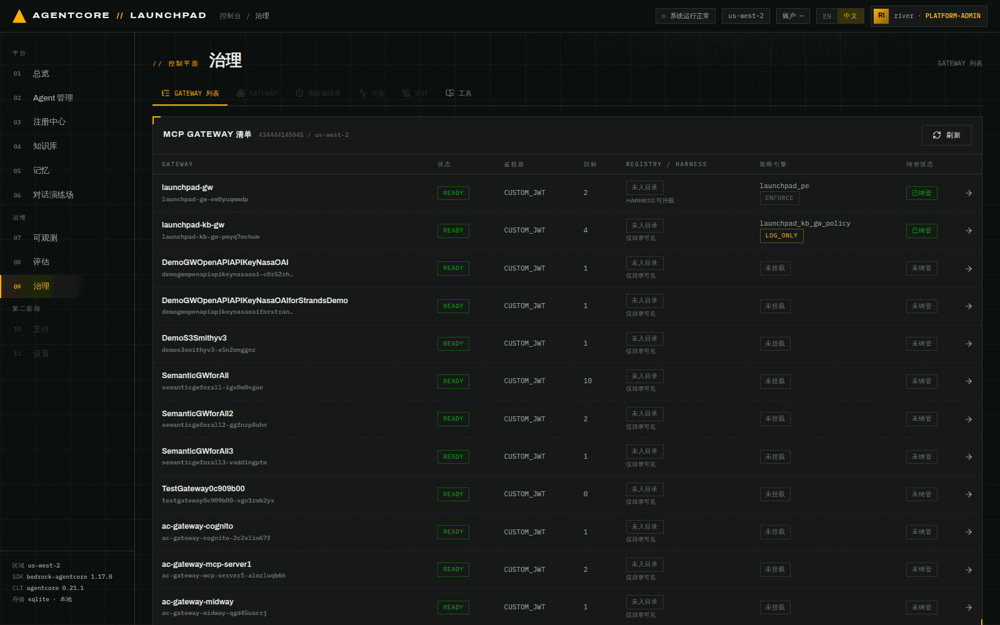
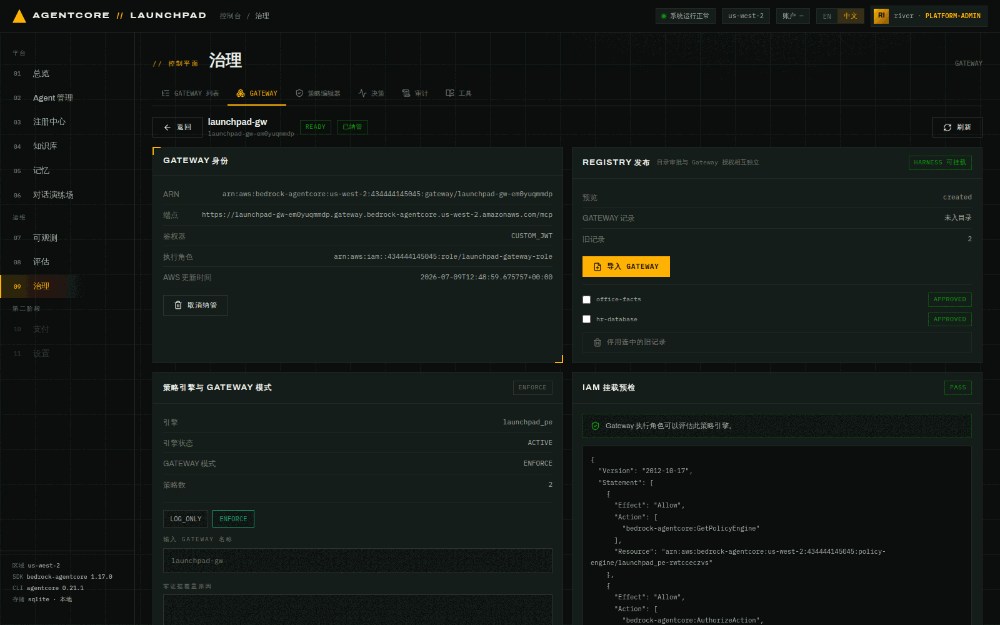
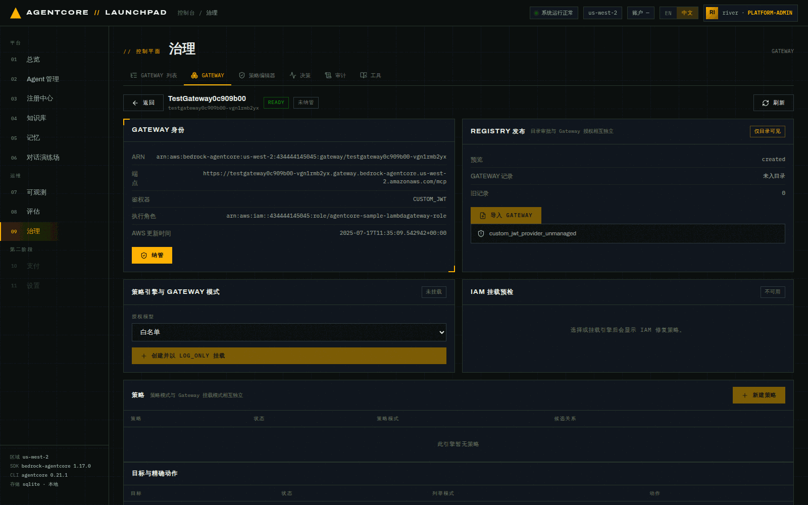
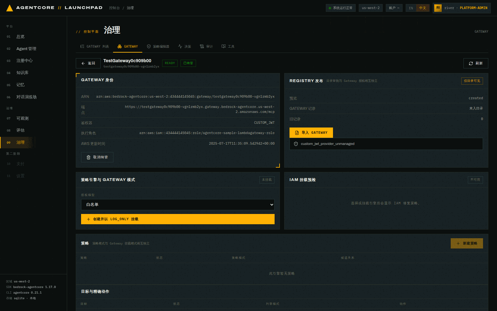
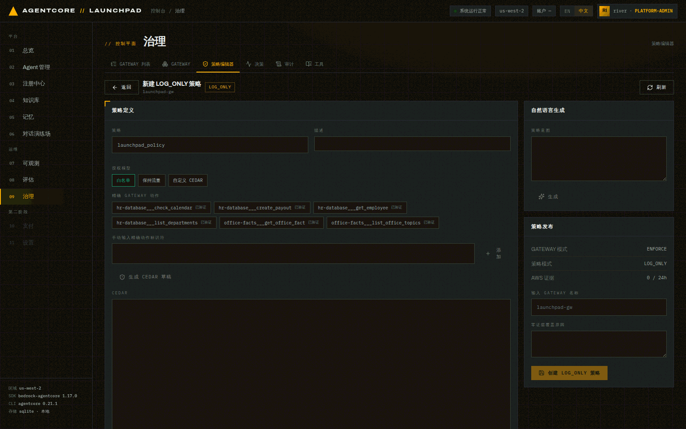
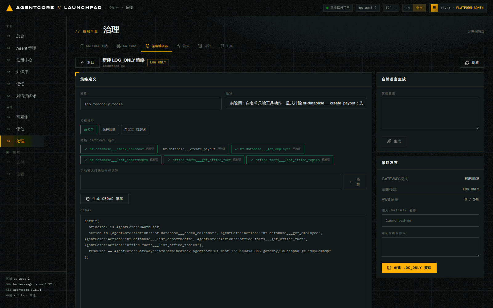
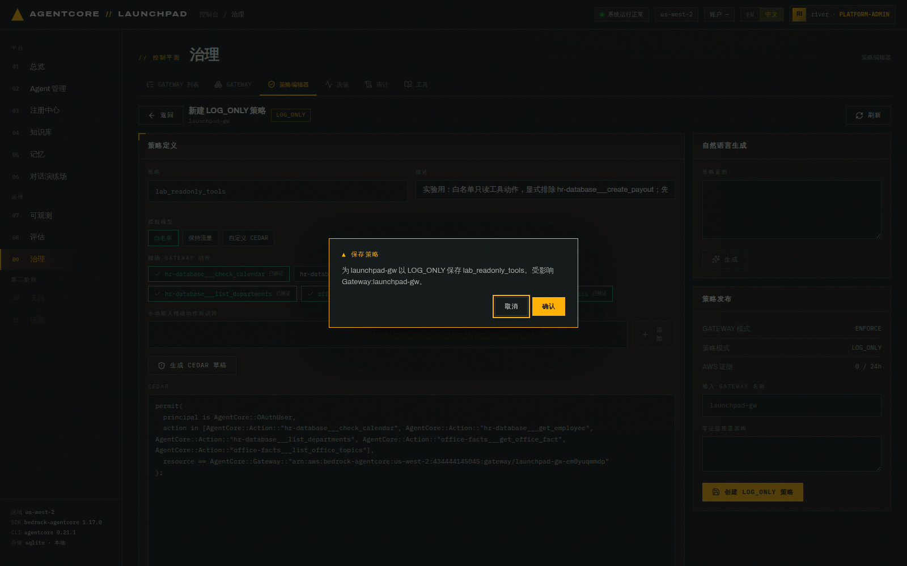
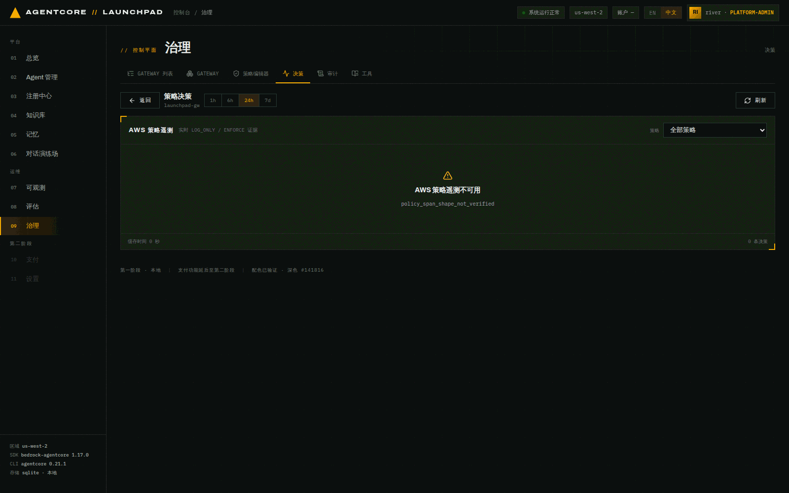
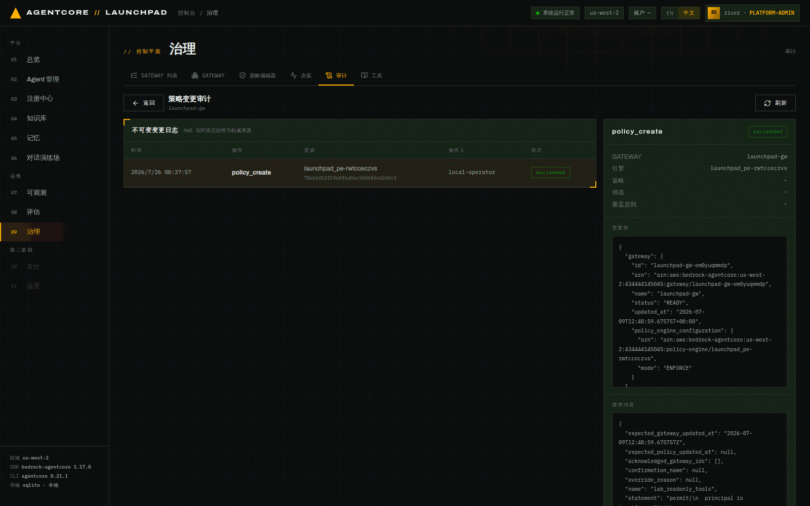

# 第 11 章 · 治理：Gateway 纳管、Cedar 策略与审计

> **目标**：把"谁能调用哪个工具动作"变成可管理、可审计的策略：读懂 Gateway 清单 →
> 用**只加标签**的方式纳管一个 Gateway → 在 Cedar 策略编辑器里创建一条 `LOG_ONLY` 策略 →
> 查看决策证据与不可变审计日志 → 理解从 `LOG_ONLY` 到 `ENFORCE` 的证据门禁。
>
> **前置条件**：完成第 04 章（Registry 生命周期已经走过一遍）。账号里至少有一个 MCP Gateway。
>
> **预计耗时**：约 25 分钟。
>
> **本章将创建的 AWS 资源**：1 条 Cedar 策略（`LOG_ONLY`，不影响现网放行）、
> 一个 Gateway 上的两个纳管标签（本章内会移除）。
>
> **注意**：本章操作的是**共享**资源（`launchpad-gw` 及其策略引擎）。请严格按步骤做：
> 新建策略一律先 `LOG_ONLY`，不要在实验环境里直接把某个 Gateway 切到 `ENFORCE`。

---

## 11.1 Gateway 清单：治理的入口

**打开** `09 治理`。默认是 `GATEWAY 列表` 标签，直接从 AWS 读取账号里所有 MCP Gateway。


*图 11-1：每行是一个真实 Gateway，列出状态、鉴权器、目标数、Registry/Harness 可用性、
策略引擎与模式、纳管状态。*

本次环境里的关键几行：

| Gateway | 目标 | Registry | 策略引擎 | 纳管状态 |
|---|---|---|---|---|
| `launchpad-gw` | 2 | 未入目录 / HARNESS 可挂载 | `launchpad_pe` · **ENFORCE** | 已纳管 |
| `launchpad-kb-gw` | 4 | 未入目录 / 仅目录可见 | `launchpad_kb_gw_policy` · LOG_ONLY | 已纳管 |
| `TestGateway0c909b00` | 0 | 仅目录可见 | 未挂载 | 未纳管 |
| 其余 10 个（Demo*/Semantic*/ac-*） | 1–10 | 仅目录可见 | 未挂载 | 未纳管 |

> `launchpad-kb-gw` 是第 04 章挂知识库时平台自动创建的连接器网关。它的 4 个目标对应
> 每个 KB 的 `Retrieve` 与每个 Agent 的 Agentic 检索。

## 11.2 只读打开一个 Gateway

点任意一行进入详情。**只是打开，不会写任何东西。**


*图 11-2：`launchpad-gw` 详情。四块：Gateway 身份、Registry 发布、策略引擎与模式、
策略列表 + 目标与精确动作（底部还给出可直接跑的 `curl` MCP 调用示例）。*

详情里可以核对：

- **鉴权器 `CUSTOM_JWT`**，执行角色 `launchpad-gateway-role`
- **Registry 发布**：`GATEWAY 记录 未入目录`，`旧记录 2`（`office-facts`、`hr-database` 都是
  APPROVED 的按目标记录）
- **策略引擎**：`launchpad_pe` · 引擎状态 ACTIVE · **Gateway 模式 ENFORCE** · 策略数 2
- **IAM 挂载预检 `PASS`**，并直接给出所需的 IAM 内联策略 JSON（`GetPolicyEngine`、
  `AuthorizeAction`、`PartiallyAuthorizeActions`）。预检失败时按这份 JSON 修正

## 11.3 纳管：只加两个标签，不动任何资源

平台用**两个 durable 标签**标记纳管状态，除此之外不修改资源：

```text
agentcore-launchpad:managed    = true
agentcore-launchpad:managed-by = agentcore-launchpad
```

本次实验用一个空的、与演示无关的 Gateway 来验证（`TestGateway0c909b00`，0 个目标）：

1. 打开它的详情。


*图 11-3：未纳管状态。此时策略引擎显示 `未挂载`，并提供 `创建并以 LOG_ONLY 挂载` 按钮。
新建引擎、Gateway 挂载都从 LOG_ONLY 开始。*

2. 点 `纳管`，在确认弹窗里确认。
3. 到 AWS 侧核对这两个标签：

```bash
aws bedrock-agentcore-control list-tags-for-resource \
  --resource-arn "arn:aws:bedrock-agentcore:us-west-2:<ACCT>:gateway/testgateway0c909b00-vgn1rmb2yx" \
  --region us-west-2
```

```json
{
    "tags": {
        "agentcore-launchpad:managed-by": "agentcore-launchpad",
        "agentcore-launchpad:managed": "true"
    }
}
```


*图 11-4：纳管后状态变为「已纳管」，按钮变成 `取消纳管`。*

4. 点 `取消纳管` 并确认，再查一次标签：

```json
{
    "tags": {}
}
```

取消纳管只移除这两个标签，不会解绑或删除 Gateway、引擎、策略或 Registry 记录。

> 这个开关用于限制平台可以修改的范围。Registry 导入与 Policy 变更**要求 Gateway 带这两个标签**
> （外加一次新鲜的 `updatedAt` 校验），避免平台误改账号里的其他 Gateway。

## 11.4 Registry 边界：一个 Gateway = 一条 MCP 记录

Gateway 详情的「REGISTRY 发布」区有 `预览` 与 `导入 GATEWAY`。预览是只读的：

```bash
curl -s http://127.0.0.1:8000/api/governance/gateways/launchpad-gw-em0yuqmmdp/registry-preview
```

```json
{"gateway_name": "launchpad-gw",
 "proposed": {"name": "launchpad-gw",
   "description": "AgentCore Gateway launchpad-gw · 2 target(s) · 6 MCP tool(s)",
   "descriptors": {"mcp": {"server": {"...": "streamable-http endpoint"},
                           "tools": {"tools": [{"name": "hr-database___check_calendar", …}]}}}}}
```

即：导入会生成**一条**包含整个 Gateway 端点 + 完整工具目录的 MCP 记录。

**两条边界**：

1. **Registry 审批 ≠ 授权**。审批只决定"这条记录在目录里可见/可挂载"；挂载一条 Gateway 记录
   等于把**整个 Gateway 及其全部工具**给了 Harness。按动作的授权只能靠 Cedar 策略。
2. 导入 Gateway 记录后，旧的按目标记录（`office-facts` / `hr-database`）**仍然存在**，
   要显式点 `停用选中的旧记录` 才退休。`DEPRECATED` 是**终态**，停用不可回退。

> **注意**：本次实验**只跑了预览，没有执行导入**（避免在共享演示账号里永久改动目录：Registry 记录一旦
> `DEPRECATED` 不可恢复）。导入按钮的行为与上面预览返回的 `proposed` 完全一致。

## 11.5 Cedar 策略编辑器：创建一条 `LOG_ONLY` 策略

切到 `策略编辑器` 标签（也可以从 Gateway 详情点 `新建策略`）。


*图 11-5：策略编辑器。三种授权模型（白名单 / 保持流量 / 自定义 CEDAR），
中间是从 Gateway **实时发现**的精确动作列表（每个都标 `已验证`），右侧是 CEDAR 审核与发布区。*

本次实验创建的策略：

| 字段 | 取值 |
|---|---|
| 策略 | `lab_readonly_tools` |
| 描述 | `实验用：白名单只读工具动作，显式排除 hr-database___create_payout；先以 LOG_ONLY 观察` |
| 授权模型 | `白名单` |
| 勾选的动作 | `hr-database___check_calendar`、`hr-database___get_employee`、`hr-database___list_departments`、`office-facts___get_office_fact`、`office-facts___list_office_topics` |
| **不**勾选 | `hr-database___create_payout`（发放款项，敏感动作） |

点 `生成 CEDAR 草稿`，平台按勾选生成 Cedar：

```cedar
permit(
  principal is AgentCore::OAuthUser,
  action in [AgentCore::Action::"hr-database___check_calendar",
             AgentCore::Action::"hr-database___get_employee",
             AgentCore::Action::"hr-database___list_departments",
             AgentCore::Action::"office-facts___get_office_fact",
             AgentCore::Action::"office-facts___list_office_topics"],
  resource == AgentCore::Gateway::"arn:aws:bedrock-agentcore:us-west-2:<ACCT>:gateway/launchpad-gw-em0yuqmmdp"
);
```


*图 11-6：CEDAR 审核区把 `AWS 实时版本` 与 `草稿` 并排对比（新策略时实时版本为空）。
旁边还有「自然语言生成」，可以描述意图让模型生成 Cedar 草稿。*

「策略发布」区显示三个事实：`GATEWAY 模式 ENFORCE`、`策略模式 LOG_ONLY`、`AWS 证据 0 / 24h`。
下面的 `输入 GATEWAY 名称` 与 `零证据覆盖原因` **只有提升 / 回滚才必填**，创建 LOG_ONLY
草稿不需要（填了会记进审计条目）；字段下方的小字也这么写。
点 `创建 LOG_ONLY 策略` → 确认弹窗。按钮若是灰的，它上方会用红字列出还缺什么。


*图 11-7：发布前的确认。*

创建结果包含**两个不同维度的状态**：

```json
{"id": "lab_readonly_tools-be45dja2_p",
 "name": "lab_readonly_tools",
 "status": "ACTIVE",              // 资源生命周期：策略资源本身可用
 "enforcement_mode": "LOG_ONLY",  // 执行模式：只记录，不拦截
 "description": "实验用：白名单只读工具动作…"}
```

> **`status` 与 `enforcement_mode` 不是一回事**：`status: ACTIVE` 只说明策略资源存在且可用，
> 决定"会不会拦"的是 `enforcement_mode`。同理 Gateway 也有自己的模式
> （本例 `launchpad-gw` 是 `ENFORCE`）。**策略模式与 Gateway 挂载模式相互独立**。

### 生命周期与提升门禁

- 新引擎、新 Gateway 挂载、新策略**一律从 `LOG_ONLY` 开始**。
- 编辑一条已经 `ACTIVE`（执行中）的策略，不会就地改它，而是创建一个 `LOG_ONLY` **候选**。
- 提升（promote）与回滚（rollback）走保守顺序：先让候选生效，再退役旧的。
- **把 Gateway 切到 `ENFORCE` 需要证据**：界面要求 24 小时内有 LOG_ONLY 决策证据；
  没有证据就必须**手输 Gateway 名称 + 填写零证据覆盖原因**才能强制通过。

## 11.6 当前账号的决策证据状态

切到 `决策` 标签。


*图 11-8：决策视图。可按时间范围（1h/6h/24h/7d）与具体策略过滤。*

本次环境返回的是：

```json
{"available": false, "count": 0, "unavailable_reason": "policy_span_shape_not_verified"}
```

界面如实显示 `AWS 策略遥测不可用 · policy_span_shape_not_verified`。

> AgentCore Policy 决策 span 的字段形状在本账号尚未验证，因此平台报告
> 不可用，不猜测遥测字段。这也是切 `ENFORCE` 时需要"零证据覆盖"路径的原因：
> 因为证据通道本身可能还拿不到数据。

不过平台**本地决策台账**里有历史演示记录（`/api/governance/decisions`），可以看到一条真实的
Cedar 拦截：

```json
{"at": "2026-07-13T23:09:23", "principal": "demo@hr-analyst",
 "tool": "hr-database___create_payout", "outcome": "DENY",
 "reason": "Tool Execution Denied: Tool call not allowed due to policy enforcement
            [Policy evaluation denied due to launchpad_payout_admin_only…]", "source": "demo"}
```

对比同一个动作在管理员身份下的记录：

```json
{"at": "2026-07-09T12:56:00", "principal": "river@platform-admin",
 "tool": "hr-database___create_payout", "outcome": "ALLOW"}
```

同一个工具在不同身份下得到不同结果，返回里还包含做出判定的策略名。这可以核对 Cedar
在网关层的按动作授权结果。

> 想自己复现这个 DENY：用 `hr-database` 这个演示 Harness Agent（它挂了 `launchpad-gw`）
> 以 `hr-analyst` 身份去调 `create_payout`。本实验没有重跑它，因为它属于既有演示资产，
> 上面这两条是账号里已有的真实记录。

## 11.7 审计：不可变变更日志

切到 `审计` 标签。


*图 11-9：策略变更审计。每次变更一条不可变快照，含操作人、状态、变更前/后完整 JSON。*

本章那次策略创建留下的记录：

```
2026/7/26 08:37:57 | policy_create | launchpad_pe-rwtcceczvs | local-operator | succeeded
```

展开后能看到 `变更前` 的完整 Gateway + 引擎快照（含 `policy_engine_configuration.mode: ENFORCE`）、
`变更后`、覆盖原因、以及回滚所需的输入。**AWS 实时状态始终是权威来源，审计只是本地的变更史。**

---

## 本章验证清单

- [ ] Gateway 清单能列出账号里的真实 Gateway 与它们的策略引擎/模式
- [ ] 纳管后 AWS 侧只多了 `agentcore-launchpad:managed` 与 `managed-by` 两个标签
- [ ] 取消纳管后标签为空，且 Gateway 本身未被改动
- [ ] `lab_readonly_tools` 策略创建成功，`enforcement_mode = LOG_ONLY`
- [ ] 生成的 Cedar 语句里**没有** `create_payout`
- [ ] 决策视图如实显示可用/不可用状态
- [ ] 审计里有一条 `policy_create · succeeded`，且含变更前后快照

## 常见问题

| 现象 | 原因 | 处理 |
|---|---|---|
| 策略创建按钮点了没反应 | 按钮处于禁用态（最常见是 Cedar 草稿还是空的） | 按钮上方会用红字列出缺什么，照着补齐即可；补全后点它会先弹二次确认，再点 `确认` |
| 报"需要纳管" | 该 Gateway 没有 launchpad 标签 | 先点 `纳管` |
| 报 `updatedAt` 相关冲突 | 平台要求变更前 Gateway 状态新鲜 | 点 `刷新` 后重试 |
| 决策一直是 0 条 | `policy_span_shape_not_verified`（本账号未验证 span 形状） | 属已知状态；用本地决策台账观察 |
| 切 ENFORCE 被阻止 | 24h 内没有 LOG_ONLY 证据 | 补证据，或手输 Gateway 名 + 覆盖原因（谨慎） |
| IAM 挂载预检 FAIL | Gateway 执行角色缺少策略引擎权限 | 照界面给出的内联策略 JSON 修 |

---

上一章：[第 10 章 · Runtime 金丝雀](10-canary.md) ｜
下一章：[第 12 章 · 收尾与资源清理](12-wrapup-cleanup.md)
