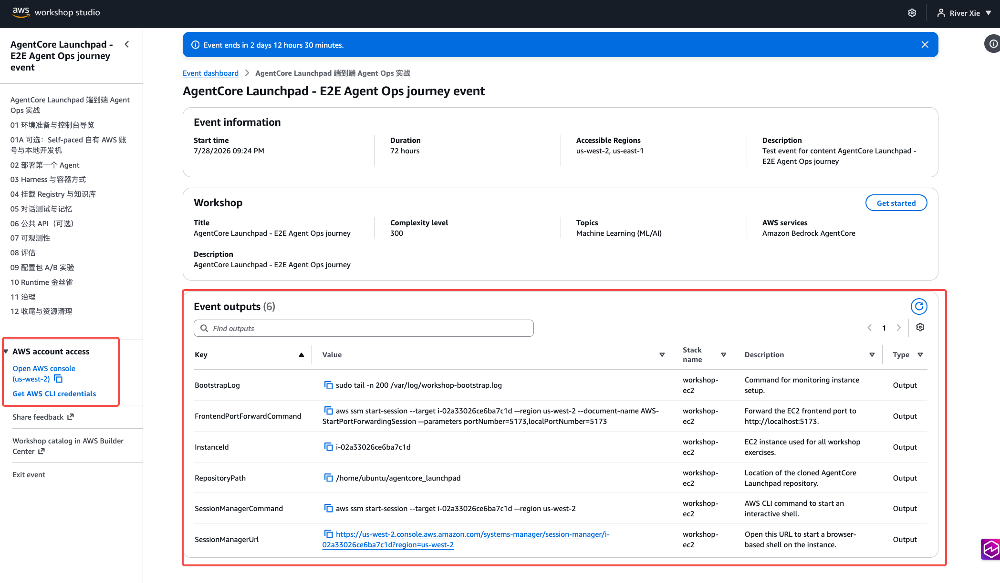
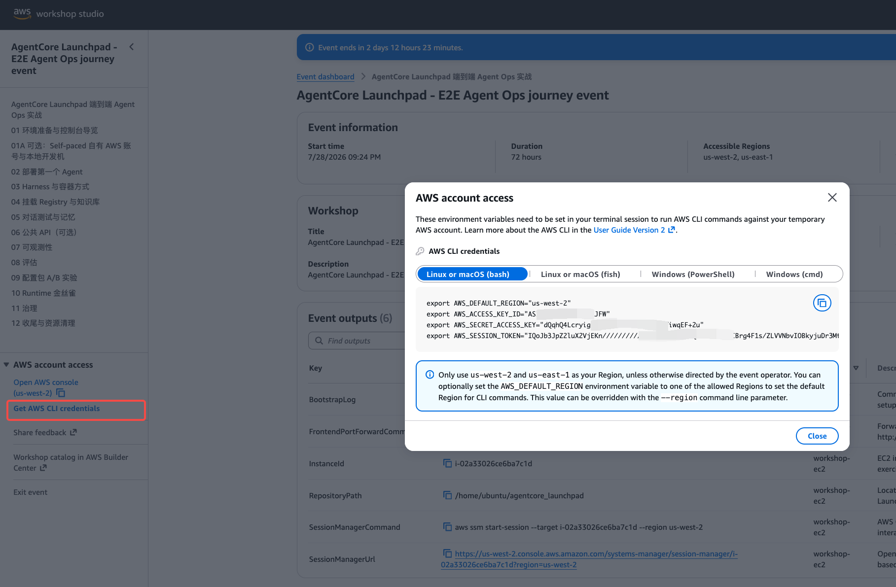
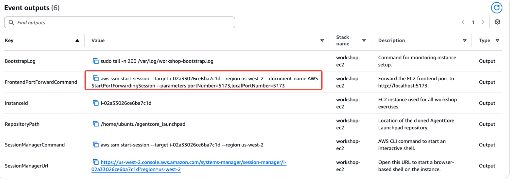

# 第 01 章 · 实验环境准备与控制台导览

> **目标**：进入 Workshop Studio 预置 EC2，核对环境，打开 AgentCore Launchpad 控制台。
>
> **前置条件**：已加入本 Workshop Studio 活动，活动账号与基础设施部署成功。个人电脑上要有
> AWS CLI 和 Session Manager Plugin，用来建立前端端口转发，1.1 节给出安装步骤。
>
> **预计耗时**：约 5–10 分钟；个人电脑首次安装 AWS CLI 和 Session Manager Plugin 另加约 5 分钟。
>
> **预置资源**：活动部署时已运行 `make bootstrap`，创建共享基础设施和 AgentCore 单例。
> 本章只验证环境，不创建 Agent。

---

> **Self-paced 路径**：本章只讲 Workshop Studio 预置 EC2。若要在本地开发机上连接自有
> AWS 账号，请跳过本章，改看
> [可选第 01A 章 · Self-paced 自有 AWS 账号](../01a-own-account-local)。两章命令不能混用。

## 1.1 在个人电脑上安装 AWS CLI 与 Session Manager Plugin

实验用到的开发工具都装在预置 EC2 上，个人电脑只需要这两个：AWS CLI v2（≥ 1.16.12 即可用
Session Manager，这里直接装 v2）和 Session Manager Plugin。1.4 节的前端端口转发命令依赖它们，
缺 plugin 时 `aws ssm start-session` 会报
`SessionManagerPlugin is not found`。

已装过的先核对版本，两条命令都有输出就可以跳到 1.2：

```bash
aws --version                      # aws-cli/2.x
session-manager-plugin --version   # ≥ 1.1.17.0
```

### macOS

```bash
# AWS CLI v2
curl "https://awscli.amazonaws.com/AWSCLIV2.pkg" -o "AWSCLIV2.pkg"
sudo installer -pkg AWSCLIV2.pkg -target /

# Session Manager Plugin（Apple 芯片；Intel 机型把 mac_arm64 换成 mac）
curl "https://s3.amazonaws.com/session-manager-downloads/plugin/latest/mac_arm64/session-manager-plugin.pkg" \
  -o "session-manager-plugin.pkg"
sudo installer -pkg session-manager-plugin.pkg -target /
sudo ln -s /usr/local/sessionmanagerplugin/bin/session-manager-plugin \
  /usr/local/bin/session-manager-plugin
```

用 Homebrew 也可以：`brew install awscli` 加
`brew install --cask session-manager-plugin`。

### Windows

用 PowerShell（管理员）或直接下载安装包，装完新开一个终端窗口再验证：

```powershell
msiexec.exe /i https://awscli.amazonaws.com/AWSCLIV2.msi
```

Session Manager Plugin 下载
<https://s3.amazonaws.com/session-manager-downloads/plugin/latest/windows/SessionManagerPluginSetup.exe>
运行安装，安装位置留空即用默认目录。Session Manager 只支持 PowerShell 5+ 和 CMD，
Git Bash 一类第三方终端可能不兼容。


**预期结果**：`aws --version` 和 `session-manager-plugin --version` 都能输出版本号。
凭证不用现在配，1.4 节从 Workshop Studio 活动页面取临时凭证即可。

## 1.2 进入 Workshop Studio 预置 EC2

Workshop Studio 已在临时账号中部署一台 Ubuntu Server 24.04 LTS `m7g.xlarge` Graviton EC2。
在活动页面的 CloudFormation Stack Outputs 中找到：


*图 1-1：Workshop Studio 的 CloudFormation Stack Outputs，列出实例、Session Manager
入口和前端端口转发命令。*

| 输出 | 用途 |
|---|---|
| `InstanceId` | 本次实验使用的 EC2 实例 ID |
| `SessionManagerUrl` | 在浏览器中打开 EC2 终端 |
| `SessionManagerCommand` | 从本机终端进入 EC2 |
| `FrontendPortForwardCommand` | 把 EC2 的前端端口转发到本机 `5173` |
| `RepositoryPath` | 已克隆源码的目录 |
| `BootstrapLog` | 查看 EC2 初始化日志的命令 |

打开 `SessionManagerUrl`。Session Manager 默认进入 `ssm-user`，先切换到 Ubuntu 实验用户：

```bash
sudo -iu ubuntu
cat ~/WORKSHOP-READY.txt
cd /home/ubuntu/agentcore_launchpad
```

后续章节的命令，除了特别注明要在个人电脑执行的端口转发命令，**全部在这个 EC2 终端里执行**。

## 1.3 验证预热结果、区域与 AWS 身份
```bash
pwd                   # /home/ubuntu/agentcore_launchpad
uv --version          # ≥ 0.8
node --version        # ≥ 22
cdk --version         # v2
docker --version
echo "$AWS_REGION"    # us-east-1 或 us-west-2
aws sts get-caller-identity
```
预期结果：`get-caller-identity` 返回 Workshop Studio 分配的账号，ARN 中包含 `WSParticipantRole`，例如：

```json
{
    "UserId": "ARxxxxxx:i-0785d8d0b8b950448",
    "Account": "12345678900",
    "Arn": "arn:aws:sts::12345678900:assumed-role/WSParticipantRole/i-0785d8d0b8b950448"
}
```
依赖、CDK bootstrap 和 `make bootstrap` 都已完成。确认配置文件存在：
```bash
test -s config/launchpad.yaml && echo "Launchpad config is ready"
```

预热过程创建或复用了下列资源，并把结果写入 config/launchpad.yaml：


## 1.4 在 EC2 启动服务并转发前端端口

在 EC2 终端中使用后台模式启动服务：

```bash
./start.py            # 日志与进程记录在 .run/
```

启动输出没有报错就可以继续。服务是否正常由控制台右上角的状态灯给出，不用在终端里另外验证。

接着在**个人电脑的终端**里完成两步：

1. 从 Workshop Studio 的 AWS account access 页面加载临时 AWS CLI 凭证。


*图 1-2：AWS account access 页面按操作系统提供临时 AWS CLI 凭证配置方式。*
> 请根据自己的个人电脑系统选择对应的设置方式, 例如在Mac电脑中，开启终端工具，然后输入:
```bash
export AWS_DEFAULT_REGION="us-east-1"
export AWS_ACCESS_KEY_ID="xxx"
export AWS_SECRET_ACCESS_KEY="xxx"
export AWS_SESSION_TOKEN="xxx"
```

2. 复制 Stack Output 里的 `FrontendPortForwardCommand`，在同一个终端运行，建立隧道。


*图 1-3：Stack Output 中的 Session Manager 入口与前端端口转发命令。*

保持这个终端运行，然后在个人电脑浏览器打开 `http://localhost:5173`。

| 服务 | EC2 内部地址 | 个人电脑访问地址 |
|---|---|---|
| 平台后端（FastAPI） | `http://127.0.0.1:8000` | 经 Vite 代理访问 |
| 平台控制台（Vite） | `http://127.0.0.1:5173` | `http://localhost:5173` |
| API 文档 | `http://127.0.0.1:5173/api/docs` | `http://localhost:5173/api/docs` |

**预期结果**：浏览器打开 `http://localhost:5173` 出现控制台，右上角显示
`● 系统运行正常`，区域与 `AWS_REGION` 一致。这个状态灯读的就是后端健康检查，页面能显示它，
说明前端、隧道和后端三段都通了。

## 1.5 控制台导览

打开控制台后先点右上角 **中文** 切换语言，本指南所有截图都是中文界面。


*图 1-1：总览页。左侧是分组的模块导航，右侧「服务健康」逐项反映真实 AgentCore 资源状态。
全新账号的四张统计卡都是 0、发布动态为空，Runtime 与 Evaluation 显示「尚未创建」，
这就是第 02 章之前的正常状态。*

核对三处：

1. **左侧导航**，按分组排列：
   - **平台**：`01 总览` → `02 Agent 管理`（创建/部署/重新发布） → `03 注册中心`（Registry
     资产） → `04 知识库` → `05 记忆` → `06 对话演练场`。
   - **运维**：`07 可观测` → `08 评估` → `09 治理`。本实验的主线就走这九个。
   - **管理**：`10 用户管理`，本实验不涉及。
   - **第二阶段**：`11 支付` / `12 设置` 为灰色不可点。

   构建版本不同时模块编号可能有出入，以你界面上的实际分组为准。
2. **服务健康**：共 7 项。bootstrap 预建的 5 项应显示 `就绪` 与真实资源 id
   （如 `launchpad_memory-DuDGsM7wA1`）：Gateway / Memory / Registry / Policy / Observability。

   **Runtime 和 Evaluation 在全新账号里显示 `尚未创建`，这是正常的**，分别写作
   `尚未创建 · 部署首个 Agent 后点亮` 与 `尚未创建 · 运行首次评估后点亮`。它们统计的是本实验
   自己创建的资源，而你还没部署 Agent（第 02 章）、也还没创建评估资源（第 08 章），完成对应章节
   后会自动转就绪。页头此时显示 `● 系统运行正常`，和这两项并不矛盾。

3. **环境信息**：区域应与 `AWS_REGION` 一致，并显示
   `SDK bedrock-agentcore 1.17.0`、`CLI agentcore 0.21.1`、`存储 sqlite · 本地`。

> 顶部统计卡汇总 EC2 本地台账和 AWS 状态。新账号显示 0 属正常，EC2 销毁后本地 SQLite
> 台账也会一起删除。

## 1.6 认识后端 API（可选）

打开 http://localhost:5173/api/docs 查看 FastAPI 文档。实验用到的主要路由如下：

| 路由 | 用途 | 对应章节 |
|---|---|---|
| `POST /api/agents` | 创建并部署 Agent（返回 `202` + `job_id`） | 02 / 03 |
| `GET /api/jobs/{id}` | 部署任务的逐阶段 JSONL 事件 | 02 |
| `POST /api/chat/{agent_id}` | 控制台对话入口 | 05 |
| `POST /v1/agents/{id}/invoke` | 公共 API（`X-Api-Key` 鉴权） | 06（可选） |
| `GET /api/observability/*` | 仪表盘 / 会话 / 追踪 | 07 |
| `POST /api/eval/runs` | 批量评估与洞察 | 08 |
| `POST /api/experiments/{id}/action` | A/B 实验分步动作 | 09 |

> `/api/*` 是控制台内部接口，`/v1/*` 是给外部系统的公共接口。两者共用同一条 invoke
> 链路，差别只在鉴权。第 06 章会验证这一点。

---

## 本章验证清单

- [ ] 个人电脑上 `aws --version` 与 `session-manager-plugin --version` 均有输出
- [ ] 已通过 Session Manager 进入 EC2，并切换为 `ubuntu`
- [ ] `FrontendPortForwardCommand` 保持运行
- [ ] 控制台可打开，右上角显示 `● 系统运行正常`
- [ ] 「服务健康」面板中 Gateway / Memory / Registry / Policy / Observability 五项为「就绪」
- [ ] Runtime 与 Evaluation 为「尚未创建」（全新账号的预期状态，不是故障）
- [ ] `~/MODEL-ACCESS.txt` 的 `[bedrock]` 小节里 `global.amazon.nova-2-lite-v1:0` 标为
      `available`，可在 Sonnet 5 不可用时作为回退
- [ ] 已经知道第 02/03 章首选 `global.anthropic.claude-sonnet-5`；若账号无法使用，
      两个 Agent 都改用 `global.amazon.nova-2-lite-v1:0`
- [ ] 已经知道第 02/03 章要把 `模型来源` 从默认的 `Bedrock Mantle` 改成 `Bedrock`
- [ ] 界面已切换到中文

## 常见问题

| 现象 | 原因 | 处理 |
|---|---|---|
| `SessionManagerUrl` 无法连接 | EC2 仍在预热，或 SSM Agent 尚未上线 | 查看活动基础设施状态；部署成功后等待 1–2 分钟再连接 |
| 端口转发报 `SessionManagerPlugin is not found` | 个人电脑只装了 AWS CLI，缺 Session Manager Plugin | 按 1.1 节安装 plugin，新开终端后重试 |
| 装完却提示找不到 `aws` 或 `session-manager-plugin` | 终端仍在用旧的 PATH | 关掉终端重新打开；Windows 上确认安装目录在 `PATH` 中 |
| 本机执行端口转发时报凭证失效 | Workshop Studio 临时 CLI 凭证已过期 | 从活动页面重新获取凭证，再运行 `FrontendPortForwardCommand` |
| 浏览器打不开 `localhost:5173` | EC2 服务未启动，或端口转发已退出 | 在 EC2 重跑 `./start.py`，再重启端口转发 |
| Runtime / Evaluation 显示「尚未创建」 | 这两项统计本实验自建资源，尚未部署 Agent / 创建评估资源 | 属预期，继续第 02 章；完成后自动转就绪 |
| 其余五项某项为红/未就绪 | 环境预热不完整或权限不足 | 先查 `/var/log/workshop-bootstrap.log`；确认身份和区域无误后，可重跑幂等的 `make bootstrap`，仍失败查[排障文档](https://github.com/xiehust/agentcore_launchpad/blob/main/docs/troubleshooting.zh-CN.md) |
| 页面能开但所有列表为空、统计为 0 | Workshop Studio 分配的是全新账号，还没有 Agent | 正常，继续第 02 章 |
| Sonnet 5 首次调用提示订阅或访问错误 | 账号未完成 Marketplace 订阅，或该账号暂不可用 | 两个 Agent 都改用回退模型 `global.amazon.nova-2-lite-v1:0`，保持模型一致 |
| `[bedrock]` 小节里 `nova-2-lite` 是 `unavailable`，Sonnet 5 也不可用 | 该账号没有可用的实验模型 | 联系讲师更换 team |
| Agent 部署完成，但首次调用提示模型无权访问 | 创建时保留了默认的 `Bedrock Mantle`，或所选模型对当前账号不可用 | 先把模型来源改成 `Bedrock`；Sonnet 5 不可用时，两个 Agent 都改用 Nova 2 Lite 后重新发布 |
| 文件里根本没有 `[bedrock]` 小节 | 预热用的是旧版模板 | 本活动的基础设施不是本版内容配套的，找讲师确认活动使用的 workshop 版本 |
| 恢复时 `make bootstrap` 报 CDK 未 bootstrap | 当前活动账号/区域的 CDK 引导不完整 | 执行 `ACCOUNT_ID=$(aws sts get-caller-identity --query Account --output text)`，再运行 `cdk bootstrap "aws://${ACCOUNT_ID}/${AWS_REGION}"` |
| 后端起不来，报 `config` 相关 KeyError | 预热未生成 `config/launchpad.yaml` | 先查 bootstrap 日志；确认活动部署成功后重跑 `make bootstrap` |

---

下一章：[第 02 章 · 部署第一个 Agent（Strands ZIP 快速通道）](../02-deploy-runtime)
