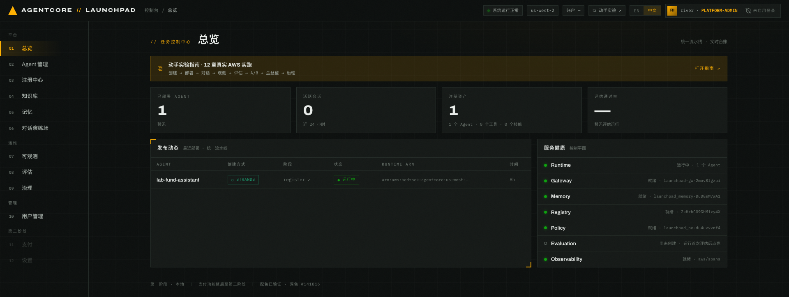

# 第 01 章 · 使用自有 AWS 账号部署 Launchpad

> **目标**：在本地开发机准备 AgentCore Launchpad，使用自己的 AWS 账号部署共享基础设施，
> 启动中文控制台。
>
> **前置条件**：AWS 账号可在 `us-east-1` 使用 Bedrock AgentCore Runtime、Harness、
> Registry、Gateway、Policy 和 Evaluation；当前身份具备管理员级权限。
>
> **预计耗时**：首次约 15–20 分钟，其中 `make bootstrap` 通常需要 8–12 分钟；
> 已完成引导的环境约 2 分钟。
>
> **费用和清理**：本章创建的资源及后续实验调用都会计入你的 AWS 账号。完成实验后请按
> [第 12 章](../12-wrapup-cleanup)清理。

---

## 1.1 准备本地工具和源码

本地开发机需要安装以下工具：

```bash
uv --version          # >= 0.8
node --version        # >= 20
cdk --version         # v2
aws --version         # v2
git --version
```

如未安装 AWS CDK CLI，可运行：

```bash
npm install -g aws-cdk
```

如果本机还没有源码：

```bash
git clone https://github.com/aws-samples/sample-agentcore-launchpad.git
cd agentcore_launchpad
```

如果已经打开本仓库，直接在仓库根目录继续。后续章节的命令默认都从这里执行。

## 1.2 配置区域、凭证与模型访问

先在本地终端配置自有账号的 AWS 凭证，再将区域设为 `us-east-1` 并核对身份：

```bash
export AWS_REGION=us-east-1
export AWS_DEFAULT_REGION="$AWS_REGION"
aws sts get-caller-identity
```

继续前请确认输出中的账号和角色正确。后续创建的资源和费用都会归到这个账号。

本实验的两个 Agent 必须使用同一个模型。首选
`Bedrock Mantle` - `openai.gpt-5.6-sol`；如果当前账号无法使用，则两个 Agent 一起回退到
`global.amazon.nova-2-lite-v1:0`。创建 Agent 时还要把模型来源从默认的
`Bedrock Mantle` 改为 `Bedrock`。

每个账号和区域只需要执行一次 CDK bootstrap。已经执行过可以跳过，不确定时重复执行也安全：

```bash
ACCOUNT_ID=$(aws sts get-caller-identity --query Account --output text)
cdk bootstrap "aws://${ACCOUNT_ID}/${AWS_REGION}"
```

## 1.3 安装项目依赖

```bash
cd backend  && uv sync && cd ..
cd frontend && npm install && cd ..
cd infra    && uv sync && cd ..
```

执行后，后端和 infra 目录会生成 `.venv`，前端目录会生成 `node_modules`。本仓库的 Python
命令都通过 `uv run` 执行，不要直接使用 `python` 或 `pip`。

## 1.4 引导 AWS 资源

```bash
make bootstrap
```

该命令可重复执行：缺少的 CDK 栈会部署，已有的 AgentCore 单例会复用。结果写入
`config/launchpad.yaml`：

| 资源类别 | 名称 |
|---|---|
| S3 产物桶 | `launchpad-artifacts-<ACCOUNT_ID>-us-east-1` |
| IAM 执行角色 | `launchpad-agent-execution-role` |
| Cognito 用户池 | `launchpad-users` |
| AgentCore Registry | `launchpad-registry` |
| AgentCore Memory | `launchpad_memory` |
| AgentCore Gateway | `launchpad-gw-<suffix>` |
| AgentCore Policy Engine | `launchpad-pe-<suffix>` |

Bootstrap 还会尝试启用 CloudWatch Transaction Search，供第 07 章读取 trace。完成后，
`config/launchpad.yaml` 应包含 `region`、`account_id` 和 `resources.*`。该文件包含账号相关配置，
不要提交。

## 1.5 启动本地栈

可以在后台启动，也可以留在前台查看日志：

```bash
./start.py            # 后台开发模式，日志与进程记录在 .run/
make dev              # 前台模式，占用当前终端
```

| 服务 | 本地地址 | 端口覆盖变量 |
|---|---|---|
| 平台后端（FastAPI） | `http://127.0.0.1:8000` | `PLATFORM_API_PORT` |
| 平台控制台（Vite） | `http://127.0.0.1:5173` | `PLATFORM_UI_PORT` |
| API 文档（经前端代理） | `http://127.0.0.1:5173/api/docs` | - |

浏览器打开 `http://localhost:5173`，切换到中文界面。


*图 1-1：全新账号的控制台总览。Runtime 和 Evaluation 尚未创建属于正常状态。*

确认右上角显示 `● 系统运行正常`、区域为 `us-east-1`，服务健康面板里的 Gateway、Memory、
Registry、Policy 和 Observability 五项为「就绪」。Runtime 与 Evaluation 显示「尚未创建」
是正常的，它们会在后续部署 Agent 和运行评估后点亮。

## 1.6 认识后端 API（可选）

打开 <http://localhost:5173/api/docs> 查看 FastAPI 文档。实验用到的主要路由如下：

| 路由 | 用途 | 对应章节 |
|---|---|---|
| `POST /api/agents` | 创建并部署 Agent | 02 / 03 |
| `GET /api/jobs/{id}` | 读取部署阶段和任务日志 | 02 |
| `POST /api/chat/{agent_id}` | 控制台对话入口 | 05 |
| `POST /v1/agents/{id}/invoke` | 公共 API | 06（可选） |
| `GET /api/observability/*` | 仪表盘、会话和 trace | 07 |
| `POST /api/eval/runs` | 批量评估与洞察 | 08 |
| `POST /api/experiments/{id}/action` | A/B 实验分步动作 | 09 |

---

## 本章验证清单

- [ ] `aws sts get-caller-identity` 返回预期的自有账号
- [ ] `AWS_REGION` 和 `AWS_DEFAULT_REGION` 均为 `us-east-1`
- [ ] `uv`、Node.js、CDK、AWS CLI 和 Git 均可用
- [ ] `config/launchpad.yaml` 包含所需的 `resources.*` 标识符
- [ ] 本地浏览器可以打开控制台，右上角显示 `● 系统运行正常`
- [ ] Gateway / Memory / Registry / Policy / Observability 五项为「就绪」
- [ ] Runtime 与 Evaluation 显示「尚未创建」
- [ ] 已确认本次实验使用的 Bedrock 模型

## 常见问题

| 现象 | 原因 | 处理 |
|---|---|---|
| 控制台打不开，端口 5173 无监听 | Vite 端口被占用后可能自动使用其它端口 | 查看启动输出中的实际端口，或用 `PLATFORM_UI_PORT` 指定 |
| 服务健康某项为红或未就绪 | Bootstrap 未完成、区域错误或权限不足 | 核对身份和区域后重跑 `make bootstrap`；仍失败时查[排障文档](https://github.com/aws-samples/sample-agentcore-launchpad/blob/main/docs/troubleshooting.zh-CN.md) |
| `make bootstrap` 报 CDK 未 bootstrap | 当前账号和区域缺少 CDK 引导 | 执行本章的 `cdk bootstrap` 命令后重跑 |
| 后端启动时报 `config` 相关 KeyError | 缺少 `config/launchpad.yaml` | 先执行 `make bootstrap` |
| 页面能打开但列表为空、统计为 0 | 当前账号还没有本实验的 Agent | 正常，继续第 02 章 |
| 首次调用提示模型无权访问 | 模型来源仍是默认值，或所选模型对当前账号不可用 | 先改为 `Bedrock`；必要时让两个 Agent 一起改用当前账号可用的同一模型 |

---

下一章：[第 02 章 · 部署第一个 Agent（Strands ZIP 快速通道）](../02-deploy-runtime)
