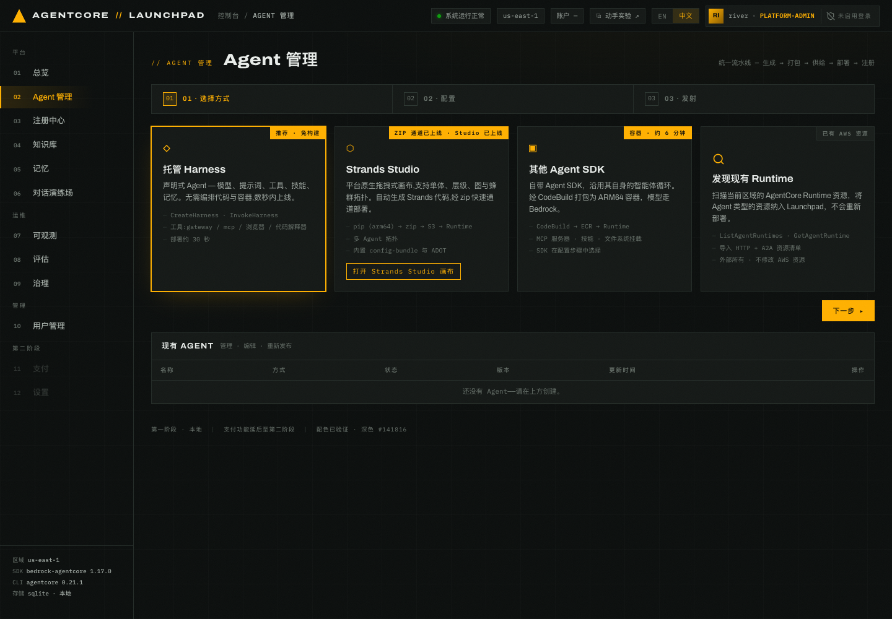
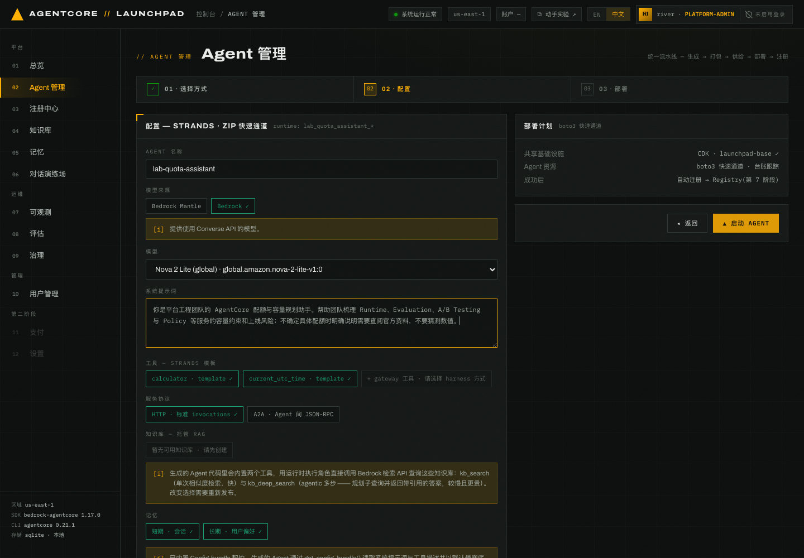
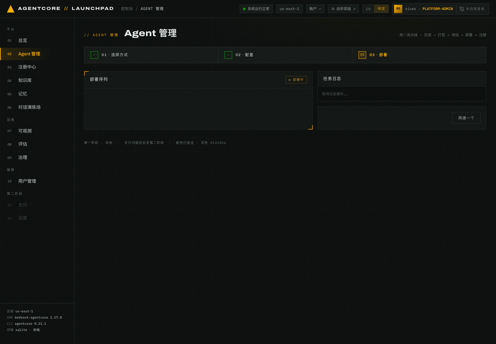
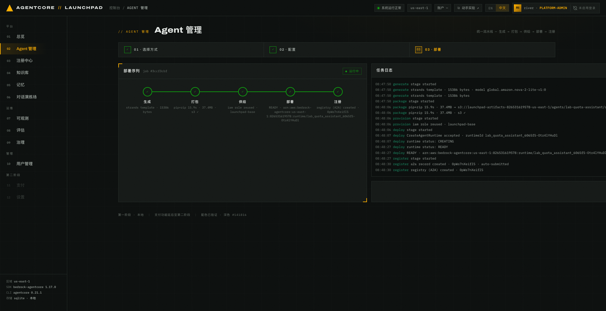
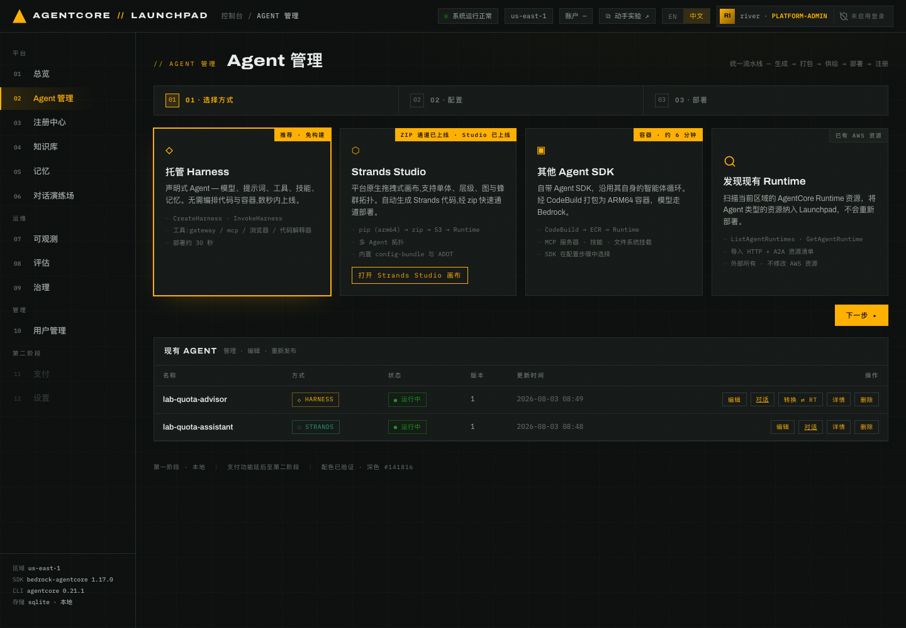

# 第 02 章 · 部署第一个 Agent（Strands ZIP）

> **目标**：通过 Strands ZIP 表单部署 `lab-quota-assistant`，观察五阶段流水线。
>
> **前置条件**：任选一种环境路径完成准备，并确认 bootstrap 预建的 5 项服务已经就绪。
> Workshop Studio 主线见[第 01 章](../01-environment)，自有账号路径见
> [可选第 01A 章](../01a-own-account-local)。
>
> **预计耗时**：约 5 分钟。部署通常在数十秒内完成，首次下载依赖时可能更久。
>
> **本章将创建的 AWS 资源**：1 个 AgentCore Runtime、1 个 S3 部署包对象、1 条
> AgentCore Registry A2A 记录。

---

## 2.0 两种创建方式如何分工

本实验只使用两种创建方式：

| 创建方式 | 本实验 Agent | 适用场景 | 后续用途 |
|---|---|---|---|
| Strands ZIP | `lab-quota-assistant` | 生成代码、打包为 ZIP 并部署到 AgentCore Runtime | 无知识库基线、公共 API、可观测、评估与金丝雀 |
| 托管 Harness | `lab-quota-advisor` | 由 AgentCore 托管，无需构建部署包 | 第 04 章挂载知识库和技能；第 09 章转换为 Runtime 后参加 A/B |

Strands ZIP 生成的代码内置 config-bundle 契约和 ADOT 埋点。`lab-quota-assistant` 用于金丝雀；
第 09 章会把 Harness 导出为同类 Runtime，并保留知识库后进行配置包 A/B。Harness 将在第 03 章创建。

## 2.1 进入创建向导

1. 打开控制台的 `02 Agent 管理`。
2. 页面顶部依次显示 `01 · 选择方式`、`02 · 配置`、`03 · 部署`。
3. 选择 **Strands ZIP** 表单路径，点 **下一步 ▸**。


*图 2-1：创建方式选择页。本实验只使用 Strands ZIP 与托管 Harness。*

## 2.2 配置 Agent

按下表填写，其余保持默认：

| 字段 | 本实验取值 |
|---|---|
| AGENT 名称 | `lab-quota-assistant` |
| 模型来源 | **`Bedrock`**。这一项必须手动修改，页面默认是 `Bedrock Mantle` |
| 模型 | 选择 `global.amazon.nova-2-lite-v1:0` |
| 系统提示词 | `你是平台工程团队的 AgentCore 配额与容量规划助手。帮助团队梳理 Runtime、Evaluation、A/B Testing 与 Policy 等服务的容量约束和上线风险；不确定具体配额时明确说明需要查阅官方资料，不要猜测数值。` |
| 工具 | `calculator`、`current_utc_time`，保持默认勾选 |
| 知识库 | 不选，作为第 05、08 章的无知识库基线 |
| 服务协议 | `HTTP · 标准 invocations` |
| 记忆 | `短期 · 会话` 与 `长期 · 用户偏好` 都保持开启 |


*图 2-2：Strands ZIP 配置页。模型来源为 `Bedrock`，知识库留空。模型以当前账号实际选择为准。*

`模型来源` 决定模型调用入口。切换到 `Bedrock` 后，模型下拉列表会刷新。先选择
`global.anthropic.claude-sonnet-5`；如果首次调用遇到 Marketplace 订阅或模型访问问题，
改用 `global.amazon.nova-2-lite-v1:0`。记下最终选择，下一章必须为 Harness 使用同一模型，
避免把模型差异混入后续对照。

> **不要沿用默认值。** 如果模型来源仍是 `Bedrock Mantle`，部署可能正常完成，但首次调用会因
> 模型访问权限失败。出现这种情况时，编辑 Agent，改成 `Bedrock` 与本章指定模型后重新发布。

这里刻意使用普通提示词，作为第 05、08 章的无知识库基线。第 09 章不会直接优化这个 Agent，
而是转换带知识库的 `lab-quota-advisor` 后再做 A/B。

**预期结果**：`▲ 启动 AGENT` 按钮从灰色变为可点击。

## 2.3 部署并观察五阶段流水线

点击 **▲ 启动 AGENT**。页面进入 `03 · 部署`，显示「部署序列」和「任务日志」。


*图 2-3：`生成` 已完成，`打包` 正在执行，右侧任务日志持续追加事件。*

五个阶段的作用和完成标志如下：

| 阶段 | Strands ZIP 执行内容 | 完成时核对 |
|---|---|---|
| `生成 generate` | 渲染 Strands 代码模板 | 日志中的模型与本章配置一致 |
| `打包 package` | 安装 ARM64 依赖、生成 ZIP 并上传 S3 | 日志给出耗时、包大小和 S3 路径 |
| `供给 provision` | 准备 AgentCore 执行角色 | 日志显示共享 IAM 角色已复用 |
| `部署 deploy` | 调用 `CreateAgentRuntime` 并轮询状态 | Runtime 状态变为 `READY` |
| `注册 register` | 创建 A2A Registry 记录 | 日志显示记录已创建并自动提交 |

首次下载依赖时，`打包` 阶段可能需要更长时间。只要日志仍在更新，就继续等待。


*图 2-4：五阶段全部完成。请以自己页面显示的任务耗时为准。*

**预期结果**：五个节点全绿，右上角状态变为 `● 运行中`。

## 2.4 从任务日志读取部署结果

右侧「任务日志」是当前任务的完整事件流。关键行的格式如下；尖括号中的内容以自己日志里的
实际值为准：

```text
generate  strands template · <BYTES> bytes · model <SELECTED_MODEL_ID>
package   pip+zip <SECONDS>s · <SIZE_MB>MB → s3://<ARTIFACT_BUCKET>/agents/lab-quota-assistant/deployment_package.zip
provision iam role reused · launchpad-agent-execution-role
deploy    CreateAgentRuntime accepted · runtimeId <RUNTIME_ID>
deploy    runtime status: CREATING
deploy    runtime status: READY
register  a2a record created · <REGISTRY_RECORD_ID> · auto-submitted
```

用 `generate` 行核对模型，确认 `deploy` 行最终变为 `READY`，再记录该任务的 Runtime ID 和
Registry 记录 ID。


*图 2-4b：左侧显示五阶段结果，右侧列出任务的完整日志。*

这条流水线支持：

- **异步可恢复**：`POST /api/agents` 返回 `202` 和 `job_id`。后端重启后会从首个未完成阶段继续。
- **自动注册**：部署成功后自动创建 A2A Registry 记录，第 04 章会在注册中心看到它。
- **AWS 是状态来源**：本地 SQLite 只存标识符和进度，Runtime 状态从 AWS 读取。

## 2.5 确认 Agent 出现在列表里

回到 `02 Agent 管理` 页面底部的「现有 AGENT」表格。


*图 2-5：完成第 03 章后的最终列表。`lab-quota-advisor` 为 `HARNESS`，
`lab-quota-assistant` 为 `STRANDS`，两者均为 `运行中`、版本 `1`。本章结束时先看到
`lab-quota-assistant` 一行。*

可选第 06 章会使用这个 Agent 的 ID，本指南记作 `<ASSISTANT_ID>`。届时可在
`06 对话演练场` 的「等价 API 调用」面板中读取，不必现在记录。

---

## 本章验证清单

- [ ] 模型来源为 `Bedrock`，已记录实际选择的 Sonnet 5 或 Nova 2 Lite 模型 ID
- [ ] 「现有 AGENT」中 `lab-quota-assistant` 状态为 `运行中`，版本为 `1`
- [ ] 五阶段面板全绿，任务日志包含 `runtime status: READY`
- [ ] 任务日志给出以 `lab_quota_assistant_` 开头的 Runtime ID，且已记录当前活动的实际值
- [ ] `register` 阶段给出 Registry 记录 ID，且已记录当前活动的实际值

## 常见问题

| 现象 | 原因 | 处理 |
|---|---|---|
| `打包` 阶段长时间无进展 | ARM64 依赖首次下载较慢 | 继续观察日志；3 分钟仍无新事件再查网络和任务状态 |
| `部署` 阶段报角色或权限错误 | 共享执行角色缺失 | 重跑 `make bootstrap`，确认 `launchpad-agent-execution-role` 已创建 |
| 页面刷新后部署面板为空 | 前端没有保留当前任务视图 | 在 Agent 列表点 `详情`，重新打开部署详情和任务日志 |
| 状态长时间停在 `deploying` | Runtime 仍为 `CREATING` | 查看任务日志最后一条事件；通常 20–60 秒会进入 `READY` |
| 模型下拉里找不到 Sonnet 5 或 Nova 2 Lite | 模型来源仍是默认的 `Bedrock Mantle` | 把模型来源改为 `Bedrock`，再选择本章列出的模型 |
| Sonnet 5 首次调用提示订阅或访问错误 | 当前账号无法使用该模型 | 改用 `global.amazon.nova-2-lite-v1:0`；下一章的 Harness 也必须使用同一回退模型 |
| 两个模型都不可用 | 活动账号没有可用的实验模型 | 停止创建并联系讲师更换 team |

---

环境准备：[第 01 章 · Workshop Studio 预置 EC2](../01-environment) /
[可选第 01A 章 · Self-paced 自有 AWS 账号](../01a-own-account-local) ｜
下一章：[第 03 章 · 部署托管 Harness](../03-deploy-harness)
