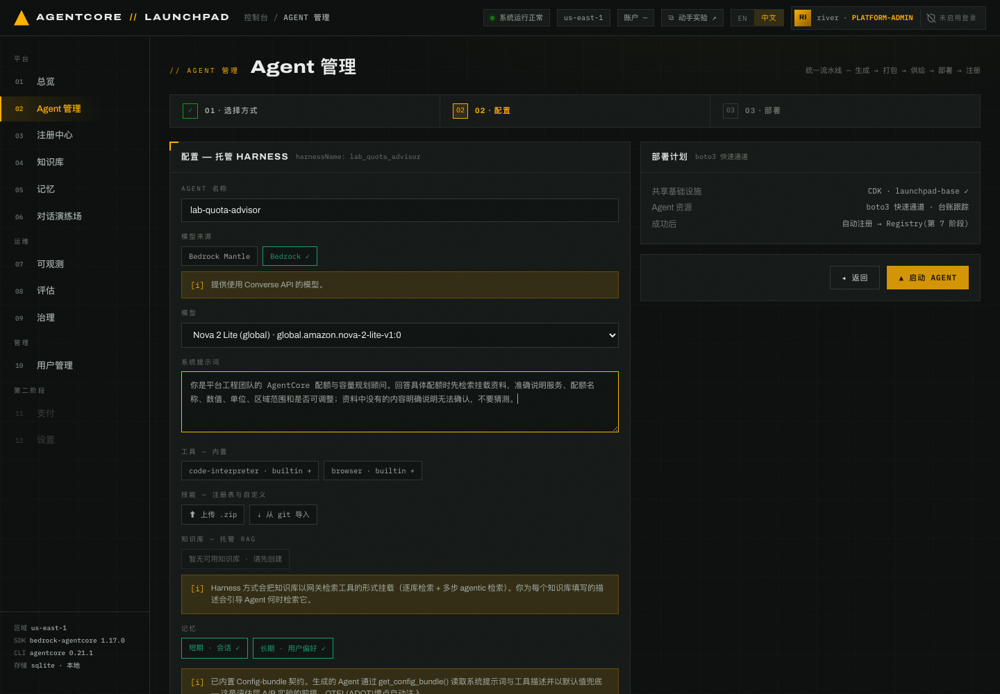
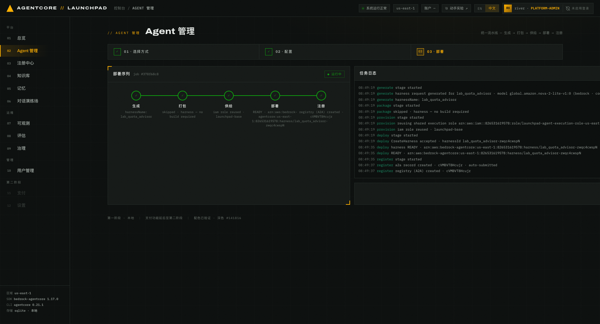

# 第 03 章 · 部署托管 Harness

> **目标**：通过托管 Harness 创建 `lab-quota-advisor`，并理解它与 Strands ZIP 的差异。
>
> **前置条件**：完成[第 02 章](../02-deploy-runtime)，`lab-quota-assistant` 状态为
> `运行中`、版本为 `1`。
>
> **预计耗时**：约 5 分钟。Harness 无需打包，部署通常在数十秒内完成。
>
> **本章将创建的 AWS 资源**：1 个 AgentCore Harness、1 条 AgentCore Registry A2A 记录。

---

## 3.1 配置 `lab-quota-advisor`

Harness 由 AgentCore 托管运行，不需要构建部署包。本实验先创建一个未挂载知识库的 Harness，
第 04 章再为它添加 AgentCore 配额资料和回答规范技能。

1. 打开 `02 Agent 管理`，选择 **托管 Harness**，点 **下一步 ▸**。
2. 按下表填写：

   | 字段 | 取值 |
   |---|---|
   | AGENT 名称 | `lab-quota-advisor` |
   | 模型来源 | **`Bedrock`**。页面默认是 `Bedrock Mantle`，必须手动修改 |
   | 模型 | 必须与 `lab-quota-assistant` 完全一致： Nova 2 Lite |
   | 系统提示词 | `你是平台工程团队的 AgentCore 配额与容量规划顾问。回答具体配额时先检索挂载资料，准确说明服务、配额名称、数值、单位、区域范围和是否可调整；资料中没有的内容明确说明无法确认，不要猜测。` |
   | 工具 / 技能 / 知识库 | 本章都不选，第 04 章再挂载 |
   | 记忆 | 短期与长期都保持开启 |


*图 3-1：Harness 配置页。模型来源为 `Bedrock`，模型与第 02 章实际选择一致，
工具、技能和知识库暂时留空。*

全新账号中，技能区和知识库区没有可选条目属于正常现象。第 04 章创建知识库并批准技能后，
编辑这个 Agent 即可看到它们。

> **不要沿用默认值。** 保留 `Bedrock Mantle` 时，Harness 可能创建成功并进入 `READY`，
> 但首次调用仍会因模型访问权限失败。遇到这种情况，编辑 Agent，改成 `Bedrock` 和本章指定模型
> 后重新发布。

## 3.2 部署并读取 Harness 日志

点 `▲ 启动 AGENT`。Harness 仍经过统一的五阶段流水线，但 `打包` 阶段会跳过。


*图 3-2：Harness 部署完成，`打包` 显示
`skipped · harness — no build required`。请以自己的任务日志为准。*

在自己的任务日志中核对以下关键行。尖括号中的 Harness ID、ARN 和 Registry 记录 ID
应使用当前任务的实际值：

```text
generate  harness request generated for lab_quota_advisor · model <SELECTED_MODEL_ID>
package   skipped · harness — no build required
provision reusing shared execution role · launchpad-agent-execution-role
deploy    CreateHarness accepted · harnessId <HARNESS_ID>
deploy    harness READY · <HARNESS_ARN>
register  a2a record created · <REGISTRY_RECORD_ID> · auto-submitted
```

用 `generate` 行核对模型，确认 `package` 行显示 `skipped`，并等待 `deploy` 行变为
`READY`。记录 Harness ID 和 Registry 记录 ID。Harness ARN 使用 `:harness/`，不是
`:runtime/`；背后的运行环境由服务托管，调用时走 `InvokeHarness`。

**预期结果**：五个节点全绿，「现有 AGENT」中的 `lab-quota-advisor` 状态变为 `运行中`。

Harness 还有一项与后续评估有关的行为：日志组在首次调用后才出现。因此第 08 章评估前，必须先在
第 05 章完成至少一次 Harness 对话，否则评估会提示 `eval.harness_no_telemetry`。

## 3.3 核对两种创建方式

完成本章后，本实验新建的 Agent 应为下面两个：

| | 托管 Harness | Strands ZIP |
|---|---|---|
| Agent | `lab-quota-advisor` | `lab-quota-assistant` |
| 模型来源 | `Bedrock` | `Bedrock` |
| 模型 | 与第 02 章实际选择一致 | 与第 02 章实际选择一致 |
| `package` | 跳过，无部署包 | 安装依赖并生成 ZIP 部署包 |
| `deploy` | `CreateHarness` | `CreateAgentRuntime` |
| Registry 记录 | 自动创建 A2A 记录 | 自动创建 A2A 记录 |
| 知识库 | 支持托管网关多步检索 | 可挂载，但本实验保留为无知识库基线 |
| 配置包 A/B | Harness 本身不支持；第 09 章可转换为 Runtime | 支持 |
| Runtime 金丝雀 | 不支持 | 支持 |

回到「现有 AGENT」表格，确认能看到这两行：

| 名称 | 方式 | 状态 | 版本 |
|---|---|---|---|
| `lab-quota-advisor` | `HARNESS` | `运行中` | `1` |
| `lab-quota-assistant` | `STRANDS` | `运行中` | `1` |

第 04 章会重新发布 `lab-quota-advisor`，届时它会升到版本 `2`。

---

## 本章验证清单

- [ ] `lab-quota-advisor` 的模型来源为 `Bedrock`，模型与 `lab-quota-assistant` 完全一致
- [ ] Harness 的 `打包` 阶段显示 `skipped`
- [ ] 任务日志给出以 `lab_quota_advisor-` 开头的 Harness ID，且已记录当前账号中的实际值
- [ ] `register` 阶段给出 Registry 记录 ID，且已记录当前账号中的实际值
- [ ] 「现有 AGENT」中能看到 `lab-quota-advisor` 和 `lab-quota-assistant`
- [ ] 两个 Agent 都是 `运行中`，版本均为 `1`

## 常见问题

| 现象 | 原因 | 处理 |
|---|---|---|
| Harness 配置页找不到 Nova 2 Lite | 模型来源仍是默认的 `Bedrock Mantle` | 改成 `Bedrock`，再选择第 02 章实际使用的模型 |
| 两个 Agent 的模型不同 | 第 03 章没有沿用第 02 章的选择 | 编辑 Harness，改为与 `lab-quota-assistant` 相同的模型后重新发布 |
| 回退模型也不可用 | 当前账号没有可用的实验模型 | 先为账号开通可用模型，或选择两个 Agent 都能访问的同一模型 |
| Harness 评估提示 `eval.harness_no_telemetry` | Agent 还没有被调用，日志组尚未创建 | 先完成第 05 章的 Harness 对话，再运行评估 |
| 想把 Harness 用于配置包 A/B | Harness 本身不读取配置包 | 第 09 章先把 `lab-quota-advisor` 转为保留知识库的 Runtime |

---

上一章：[第 02 章 · 部署第一个 Agent](../02-deploy-runtime) ｜
下一章：[第 04 章 · 挂载能力：Registry 资产与知识库](../04-capabilities)
