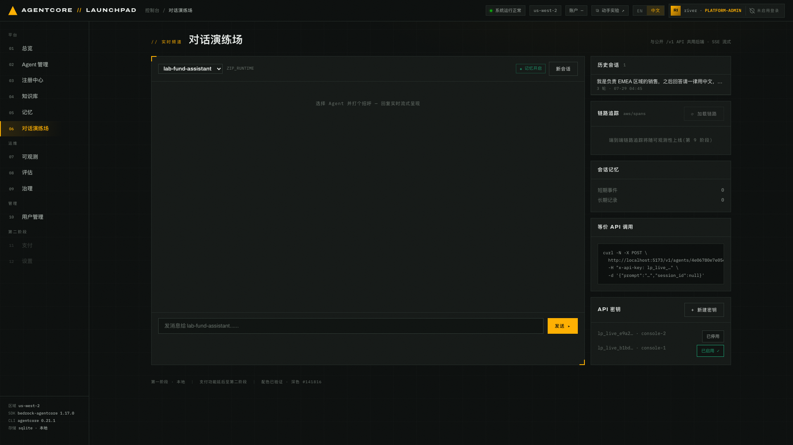

# 第 06 章 · 用公共 `/v1` API 调用 Agent（可选）

> **本章可选**。内容是外部系统接入，跳过后可直接进入第 07 章。
>
> **目标**：签发 API Key，用 `/v1` 接口同步和流式调用 Agent。
>
> **前置条件**：完成[第 05 章](../05-chat-memory)，`lab-quota-assistant` 可正常对话。
>
> **预计耗时**：约 10 分钟。
>
> **本章将创建的 AWS 资源**：无（API Key 只存在本地台账，且只存 sha256 摘要）。

---

## 6.1 两个入口，一条链路

| | 控制台入口 | 公共入口 |
|---|---|---|
| 路径 | `POST /api/chat/{agent_id}` | `POST /v1/agents/{id}/invoke` · `/invoke-stream` |
| 鉴权 | 控制台会话（可选口令） | `X-Api-Key` 头 |
| 下游 | `invoke_agent_text` / `chat_stream` | 完全相同 |

`/v1` 只增加 API Key 鉴权。方式分派、记忆、工具调用和遥测都与控制台入口共用同一份代码。

## 6.2 签发 API Key

1. 打开 `06 对话演练场`，右下角「API 密钥」面板点 `+ 新建密钥`。
2. **立即复制**弹出的明文密钥。界面会提示 *「立即复制 — 仅显示一次」*。


*图 6-1：密钥列表只保留前缀（如 `lp_live_b1bd…`）与备注名，并可 `已启用 / 已停用` 切换。
图中 `console-1` 已启用、`console-2` 已停用。台账里存的是 sha256 摘要，明文不落库，
丢失后只能重新签发。*

> 上图是刷新页面后的样子，只剩前缀。截图或录屏演示时要注意：新建那一刻的明文
> 会完整显示在界面上，别把它录进材料里。
>
> 备注名由界面自动生成（`console-1`、`console-2` …）。点「已启用」停用时会先弹确认框，
> 写着 *「使用『console-2』的客户端将立即收到 401。之后可以重新启用。」*，确认后才生效。

3. 把密钥放进环境变量，不要写进脚本文件：

```bash
export LP_KEY='lp_live_xxxxxxxxxxxxxxxxxxxxxxxxxxxxxxxx'
export AGENT_ID='<ASSISTANT_ID>'
```

> `<ASSISTANT_ID>` 从这一页右下角的「等价 API 调用」面板里取：选中 `lab-quota-assistant` 后，
> 片段里的 `/v1/agents/<id>/invoke-stream` 就是它的 id。

## 6.3 同步调用 `/v1/agents/{id}/invoke`

```bash
curl -s -X POST "http://127.0.0.1:8000/v1/agents/$AGENT_ID/invoke" \
  -H "x-api-key: $LP_KEY" -H 'content-type: application/json' \
  -d '{"prompt":"AgentCore Runtime 的同步请求超时上限是多少？是否可调整？","session_id":null}' | python3 -m json.tool
```

返回字段如下。`text` 的内容和 `latency_ms` 以你的实际调用为准，原始响应中的中文可能显示为
`\uXXXX` 转义：

```typescript
{
    "agent": "lab-quota-assistant",
    "text": string,
    "session_id": string,
    "latency_ms": number
}
```

返回说明：

- `session_id: null` 表示新建会话，响应会回填服务端生成的 session id。
- 想做多轮，把上一次返回的 `session_id` 原样带回来即可，记忆按会话隔离。
- `latency_ms` 是包含模型生成在内的端到端耗时。

## 6.4 流式调用 `/v1/agents/{id}/invoke-stream`

```bash
curl -sN -X POST "http://127.0.0.1:8000/v1/agents/$AGENT_ID/invoke-stream" \
  -H "x-api-key: $LP_KEY" -H 'content-type: application/json' \
  -d '{"prompt":"用两句话比较 Runtime 的流式连接和异步任务最长持续时间。","session_id":null}'
```

`lab-quota-assistant` 是 ZIP Runtime，流式接口会使用缓冲兼容模式。下面保留事件结构，
文本和耗时以你的调用结果为准：

```
event: meta
data: {"session_id": "<session id>", "agent": "lab-quota-assistant", "mode": "buffered"}

event: delta
data: {"text": "<一段增量文本>"}

event: done
data: {"latency_ms": <端到端毫秒数，整数>}
```

事件类型：

| event | 含义 |
|---|---|
| `meta` | 会话与 Agent 元信息，含 `mode` |
| `delta` | 增量文本 |
| `tool` | 触发工具时返回工具调用信息 |
| `done` | 结束，带 `latency_ms` |

> `"mode": "buffered"` 表示 ZIP Runtime 先取回完整结果，再按 SSE 契约切成 `delta` 帧。
> 托管 Harness 支持原生增量流式输出。两种方式使用相同的公共 SSE 事件类型，但首段文本到达时间
> 和逐字输出体感会不同。

## 6.5 鉴权失败长什么样

```bash
curl -s -o /dev/null -w "%{http_code}\n" -X POST \
  "http://127.0.0.1:8000/v1/agents/$AGENT_ID/invoke" \
  -H "x-api-key: lp_live_wrong" -H 'content-type: application/json' -d '{"prompt":"hi"}'
```

```
401
{"code":"auth.invalid_api_key","message":"invalid or disabled API key","detail":null}
```

停用一枚密钥（而不是删除）也会得到同样的 401。面板上的 `已启用 / 已停用` 就是这个开关。

## 6.6 从对话页复制「等价 API 调用」

对话页右下角「等价 API 调用」面板会按当前选中的 Agent 与会话生成 curl 片段：

```bash
curl -N -X POST \
  http://localhost:5173/v1/agents/<AGENT_ID>/invoke-stream \
  -H "x-api-key: lp_live_…" \
  -d '{"prompt":"…","session_id":"<当前会话>"}'
```

本地开发服务器会把 `/v1` 代理到后端，因此复制出的 `localhost:5173` 地址可以直接运行。
如需绕过前端代理，也可以改用
`http://127.0.0.1:8000/v1/agents/<AGENT_ID>/invoke-stream`，API Key 校验行为相同。

---

## 本章验证清单

- [ ] 成功签发密钥，列表里只显示前缀
- [ ] 同步调用返回 `agent` / `text` / `session_id` / `latency_ms`
- [ ] 流式调用先收到 `event: meta`，随后是若干 `event: delta`，最后 `event: done`
- [ ] 错误密钥返回 `401 auth.invalid_api_key`
- [ ] 把返回的 `session_id` 带回去能续上多轮

## 常见问题

| 现象 | 原因 | 处理 |
|---|---|---|
| `401 auth.invalid_api_key` | 密钥错、被停用，或复制时带了空格 | 重新签发；确认面板上是 `已启用 ✓` |
| `404` agent not found | agent id 写错，或 Agent 不是 active | 在 `02 Agent 管理` 列表里确认状态是 `运行中`，再从对话页「等价 API 调用」面板重新取一次 id |
| 流式没有逐字输出、短时间内集中吐出 | ZIP Runtime 使用缓冲兼容路径 | 属预期；托管 Harness 支持原生增量流式输出 |
| 明文密钥丢了 | 只显示一次，台账只存摘要 | 重新签发，把旧的停用 |
| `curl` 一直挂着不返回 | 忘了 `-N`，或模型生成较慢 | 加 `-N` 关闭缓冲；模型生成可能需要数秒 |
| `127.0.0.1:8000` 连不上 | 后端未启动，或使用了自定义端口 | 查看 `./start.py` 输出和 `.run/` 日志；设置过 `PLATFORM_API_PORT` 时改用对应端口 |
| 通过 `localhost:5173/v1/...` 返回连接错误 | 前端开发服务器未启动，或端口不是 5173 | 查看 `./start.py` 输出中的实际前端端口，或直接调用后端 `127.0.0.1:8000` |

---

上一章：[第 05 章 · 对话与记忆](../05-chat-memory) ｜
下一章：[第 07 章 · 可观测性](../07-observability)
