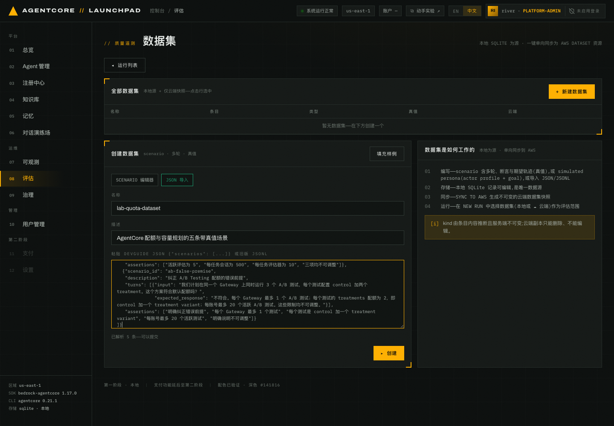
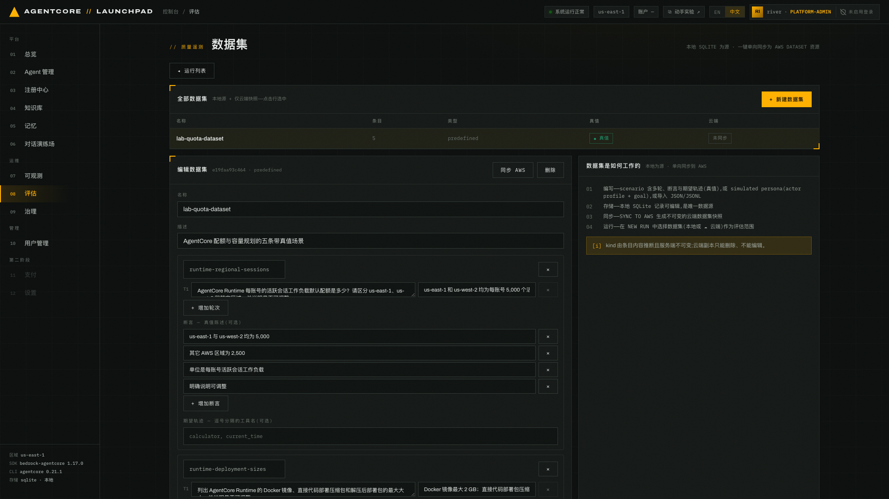
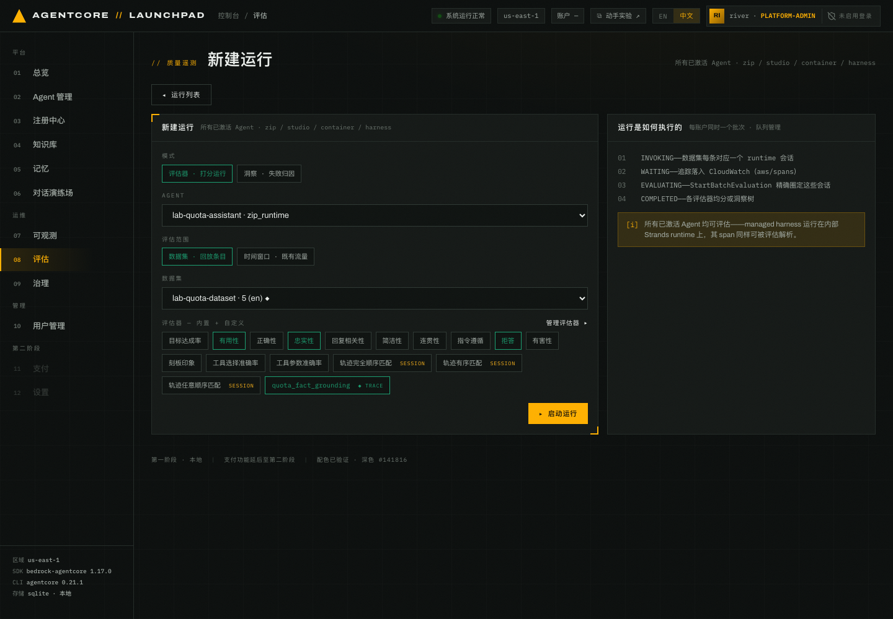
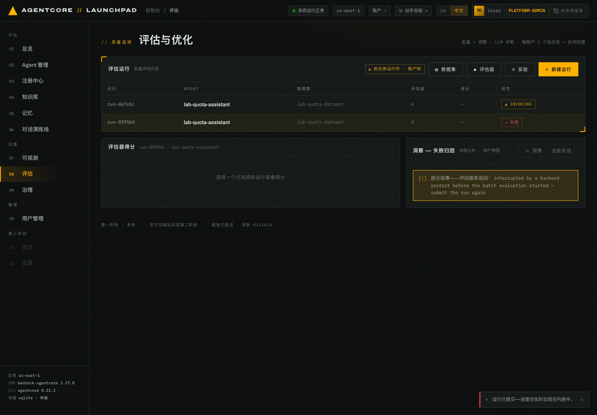
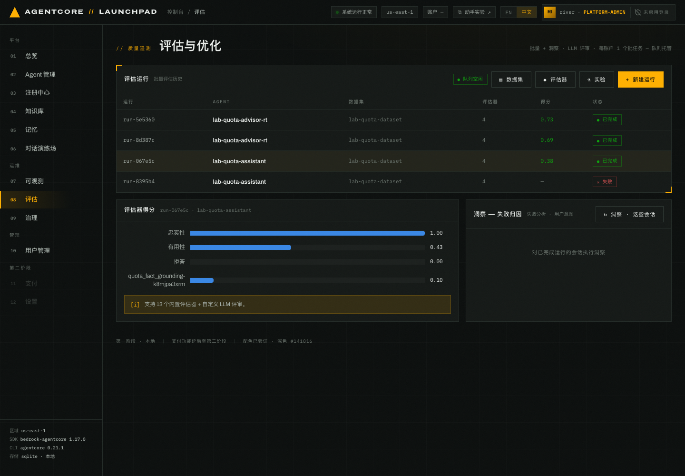

# 第 08 章 · 评估：数据集、评估器与批量评估

> **目标**：用带真值的数据集和自定义 LLM 评估器，量化第 05 章观察到的接地与回答边界。
>
> **前置条件**：完成第 05–07 章（被评估的 Agent 必须已经被调用过，否则没有遥测）。
>
> **预计耗时**：约 20 分钟（数据集和评估器约 10 分钟；批量评估通常还需数分钟，以页面状态为准）。
>
> **本章将创建的 AWS 资源**：1 个 AgentCore Dataset（同步产物）、1 个自定义 Evaluator、
> 1 次 BatchEvaluation 任务，以及回放数据集时产生的 Runtime 会话与遥测。

---

## 8.1 评估的三种范围（互斥）

一次运行的范围只能是三者之一：

| 范围 | 含义 | 会不会产生新调用 |
|---|---|---|
| **数据集** | 回放数据集条目，多轮场景在同一会话里顺序回放 | 会 |
| **会话 id** | 指定已有会话 | 不会 |
| **时间窗口** | 对既有流量做被动评估（`lookback_hours` 1–336） | 不会 |

本章使用数据集范围，因为要用真值核对具体答案。

> **注意**：Launchpad 通过账号级队列串行启动批量评估，一次只运行一个。这个实验平台约束
> 不等同于 AgentCore Batch Evaluation 的服务配额。页面顶部会显示 `● 队列空闲` 或排队中。

## 8.2 编写带真值的数据集

`08 评估` 页顶部有一排子导航：`运行` / `实验` / `数据集` / `评估器`，对应
`/evaluation`、`?view=experiment`、`?view=datasets`、`?view=evaluators`。右上角的
`▤ 数据集` / `◆ 评估器` / `⚗ 实验` 按钮指向同一批页面。

打开 `数据集`（`?view=datasets`）→ `+ 新建数据集`，切到 **JSON 导入** 模式。

粘贴下面这份 JSON。真值全部来自第 04 章上传的 AgentCore 配额文档：

```json
{"scenarios": [
  {"scenario_id": "runtime-regional-sessions",
   "description": "Runtime 活跃会话工作负载的区域差异与可调整性",
   "turns": [{"input": "AgentCore Runtime 每账号的活跃会话工作负载默认配额是多少？请区分 us-east-1、us-west-2 和其它区域，并说明是否可调整。",
              "expected_response": "us-east-1 和 us-west-2 均为每账号 5,000 个活跃会话工作负载；其它 AWS 区域为 2,500 个；该配额可通过 Service Quotas 提高。"}],
   "assertions": ["us-east-1 与 us-west-2 均为 5,000", "其它 AWS 区域为 2,500", "单位是每账号活跃会话工作负载", "明确说明可调整"]},
  {"scenario_id": "runtime-deployment-sizes",
   "description": "Runtime 部署制品大小限制",
   "turns": [{"input": "列出 AgentCore Runtime 的 Docker 镜像、直接代码部署压缩包和解压后部署包的最大大小，并说明是否可调整。",
              "expected_response": "Docker 镜像最大 2 GB；直接代码部署包压缩后最大 250 MB，解压后最大 750 MB；三项均不可调整。"}],
   "assertions": ["Docker 镜像为 2 GB", "压缩部署包为 250 MB", "解压后部署包为 750 MB", "三项均不可调整"]},
  {"scenario_id": "runtime-invocation-durations",
   "description": "Runtime 调用时长限制",
   "turns": [{"input": "AgentCore Runtime 的同步请求、流式连接和异步任务最长持续时间分别是多少？这些限制能否调整？",
              "expected_response": "同步请求超时为 15 分钟，流式连接最长 60 分钟，异步任务最长 8 小时；三项均不可调整。"}],
   "assertions": ["同步请求为 15 分钟", "流式连接为 60 分钟", "异步任务为 8 小时", "三项均不可调整"]},
  {"scenario_id": "batch-evaluation-capacity",
   "description": "Batch Evaluation 资源限制",
   "turns": [{"input": "AgentCore Batch Evaluation 每账号可同时运行多少个评估？每个任务最多包含多少会话和评估器？是否可调整？",
              "expected_response": "每账号最多 5 个活跃评估；每个任务最多 500 个会话和 10 个评估器；三项均不可调整。"}],
   "assertions": ["活跃评估为 5", "每任务会话为 500", "每任务评估器为 10", "三项均不可调整"]},
  {"scenario_id": "ab-false-premise",
   "description": "纠正 A/B Testing 配额的错误前提",
   "turns": [{"input": "我们计划在同一个 Gateway 上同时运行 3 个 A/B 测试，每个测试配置 control 加两个 treatment。这个方案符合默认配额吗？",
              "expected_response": "不符合。每个 Gateway 最多 1 个 A/B 测试；每个测试的 treatments 配额为 2，即 control 加一个 treatment variant；每账号最多 20 个活跃 A/B 测试。这些限制均不可调整。"}],
   "assertions": ["明确纠正错误前提", "每个 Gateway 最多 1 个测试", "每个测试是 control 加一个 treatment variant", "每账号最多 20 个活跃测试", "明确说明不可调整"]}
]}
```

名称填 `lab-quota-dataset`，描述填 `AgentCore 配额与容量规划的五条带真值场景`。


*图 8-1：JSON 导入模式。粘贴后界面实时提示 `已解析 5 条——可以提交`，`▸ 创建` 才会变为可点。*

**预期结果**：数据集创建成功，列表中这一行显示 5 条场景、`kind = predefined`、真值列 `◆`。
条目是 `turns` 结构而不是 `actor_profile` 人格，所以服务端把 `kind` 推断为 `predefined`。

**真值的三种形态**，对应不同评估器：

| 真值字段 | 喂给谁 |
|---|---|
| `turns[].expected_response` | 内置 `正确性 Correctness` |
| `assertions` | 内置 `目标达成率 GoalSuccessRate` |
| `expected_trajectory` | 三个 `轨迹匹配 Trajectory*Match`，仅数据集运行且场景带该字段时才可选 |

平台通过 `StartBatchEvaluation` 的 `evaluationMetadata.sessionMetadata` 把它们注入当前评估。

### 同步为 AWS 数据集

选中数据集，点 `同步 AWS`。本地 SQLite 是唯一数据源，同步产生的是不可变的云端快照
（`AGENTCORE_EVALUATION_PREDEFINED_V1`）。


*图 8-2：数据集详情（scenario 编辑器）。列表行显示 `5 · predefined · ◆ 真值`，云端列
同步成功后变为 `ACTIVE`。*

同步成功后，在详情中核对以下字段：

```json
{"dataset_id": "<DATASET_ID>",
 "arn": "arn:aws:bedrock-agentcore:<REGION>:<ACCT>:dataset/<DATASET_ID>",
 "status": "ACTIVE", "synced_at": "<TIMESTAMP>"}
```

> 同步后运行列表里会多出一个 `☁ lab_quota_dataset` 选项。云端数据集用
> `ListDatasetExamples` 回放，本地数据集直接读 SQLite。两者都能当运行范围，但云端副本不可编辑。

## 8.3 创建自定义 LLM 评估器

内置评估器有 13 个通用项（正确性、忠实性、有用性、拒答、简洁性、指令遵循、有害性……）
外加 3 个仅真值可用的轨迹匹配器。

「配额值、单位、区域和可调整性必须有资料依据」这条规则需要自定义评估器：

- **复合口径**：没有内置评估器把「资料没提供时如实说明」也算满分。内置项只能给出 `正确性`
  （答错扣分）和 `拒答`（检测到回避）两个分开的分数，需要自行合并，而 `拒答` 不区分该不该拒答。
- **自定的量表与标签**：`1=grounded / 0.5=partial / 0=fabricated` 三档加一句话理由是内置项
  无法提供的，也可以作为长期追踪的单一指标。

打开 `评估器`（`?view=evaluators`）→ `+ 新建评估器`：

| 字段 | 取值 |
|---|---|
| 名称 | `quota_fact_grounding`（正则 `^[a-zA-Z][a-zA-Z0-9_]{0,47}$`，不能用中文） |
| 级别 | `TRACE` |
| 评审模型 | 与部署 Agent 时同一个选项（见[第 01 章](../01-environment)「确认本次可用的模型」） |
| 描述 | `判断 AgentCore 配额回答的数值、单位、区域范围和可调整性是否符合真值` |

> **评审模型下拉默认选中 `global.anthropic.claude-sonnet-5`，不要未经确认就使用默认值。**
> 选择第 01 章已经验证可用的模型。选错模型时创建可能成功，但运行评估会报
> `Role does not have access for model ...`。

指令，也就是评审提示词，包含三个可插入的占位符 `{context}` / `{assistant_turn}` /
`{expected_response}`。其中 `{expected_response}` 带 `◆` 标记，**仅在带真值的数据集运行中生效**：

```text
你是 AgentCore 配额与容量规划问答的质量评审。请判断回答是否准确使用基准答案中的配额事实。

对话上下文：
{context}

助手回答：
{assistant_turn}

基准答案（真值）：
{expected_response}

评分规则：
- 1 分：服务、配额名称、数值、单位、区域范围和可调整性均与基准答案一致；错误前提得到明确纠正。
- 0.5 分：整体方向正确，但遗漏一项关键事实，或混淆区域、单位、调整方式中的一项。
- 0 分：关键数值与基准答案矛盾，混淆 TPS 与 TPM，或编造基准答案未支持的配额或调整方式。

只输出评分与一句话理由。
```

评分量表（数值 / 标签 / 定义）三档：

| 数值 | 标签 | 定义 |
|---|---|---|
| 1 | `grounded` | 配额事实、单位、区域范围和可调整性均与真值一致 |
| 0.5 | `partial` | 方向正确，但遗漏或混淆一项关键事实 |
| 0 | `fabricated` | 关键事实与真值矛盾，或编造配额与调整方式 |


*图 8-3：`quota_fact_grounding` 编辑页示例。保存后重新打开评估器，确认评审模型和
`1=grounded / 0.5=partial / 0=fabricated` 量表均已生效。新建页使用相同的占位符和量表控件。*

创建成功后，这个评估器会以 `custom` 来源出现在目录里，状态为 `ACTIVE`。平台会生成新的 id，
需要排障时从自己的评估器详情中复制。

> 编辑自定义评估器时注意：AWS 的 `UpdateEvaluator` 是整体替换语义，平台会把完整配置重新提交。

> **引用 `{expected_response}` 的评估器只能离线使用。** 引用它（或 `{assertions}`、
> `{expected_tool_trajectory}`）的自定义评估器无法参加第 09 章的在线评估：在线评估读实时
> trace，拿不到真值，平台会拒绝并报 `experiment.evaluator_unsupported`。第 09 章的主指标
> 因此改用无参考评估器，在那一章创建。

## 8.4 启动批量评估

打开 `08 评估` 主页 → `+ 新建评估`（早期版本这个按钮叫 `+ 新建运行`）：

| 字段 | 取值 |
|---|---|
| 模式 | `评估器 · 打分运行` |
| AGENT | `lab-quota-assistant · zip_runtime` |
| 评估范围 | `数据集 · 回放条目` |
| 数据集 | `lab-quota-dataset · 5 (en) ◆` |
| 评估器 | `有用性`、`忠实性`、`拒答`、`quota_fact_grounding` |


*图 8-4：列表上的按钮叫 `+ 新建评估`，点进来这一页的标题仍是`新建运行`，提交按钮是
`▸ 启动运行`。右侧说明了四个阶段：INVOKING → WAITING → EVALUATING → COMPLETED。
底部提示所有已激活 Agent 都可评估，包括托管 Harness。绿色高亮的四个 chip 是当前选中的评估器。*

> **注意**：评估器 chip 是切换按钮，页面可能默认勾选若干项，点击已选中的项会取消它。
> 启动前核对绿色高亮的项目，只保留上表中的四项；`正确性` 若被默认选中，请取消。

**为什么选这个 Agent**：`lab-quota-assistant` 没有知识库，也是第 05 章暴露问题的那个 Agent，
适合量化无知识库基线。

点 `▸ 启动运行`。

## 8.5 四个阶段与结果


*图 8-5：运行进行中。数据集里每个场景对应一个 runtime 会话，逐个真实调用。页头此时显示
`◐ 批任务运行中 · 账户锁`，表示 Launchpad 正通过账号级队列串行执行任务。*

阶段含义：

| 阶段 | 平台在做什么 |
|---|---|
| `INVOKING` | 逐条回放数据集，真实调用 Agent，记录每条对应的 session id |
| `WAITING` | 等 span 落进 CloudWatch `aws/spans`，默认等 180 秒 |
| `EVALUATING` | `StartBatchEvaluation` 精确圈定这些 session，不会误评别的流量 |
| `COMPLETED` | 各评估器均分，或洞察树 |


*图 8-6：完成页示例。列表先显示四项指标的聚合值，展开后可查看忠实性、有用性、拒答和
自定义接地评估器各自的均分。图中的数值只用于说明界面，不是预期结果。*

状态变为 `COMPLETED` 后，从自己的运行详情记录以下信息：

| 项目 | 记录内容 |
|---|---|
| 运行标识 | 页面显示的运行名称或 id，便于排障 |
| 运行时间 | 从启动到完成的实际耗时 |
| 样本状态 | 成功会话数、失败会话数和 `error` |
| 逐项得分 | 忠实性、有用性、拒答、`quota_fact_grounding` 的均分 |
| 聚合值 | 列表中的汇总值 |

解读结果时按指标逐项看：

- **忠实性**只表示回答与自身上下文是否一致，不能单独证明配额事实正确。
- **有用性**关注信息完整度和可操作性。
- **拒答**是行为检测器，不是越高越好，要结合题目是否应该拒答来判断。
- **`quota_fact_grounding`**按 **0 / 0.5 / 1** 量表检查配额值、单位、区域范围和可调整性。
- 列表聚合值是四项均分的算术平均。四项都在 0–1 范围内，但含义不同，不能把聚合值
  直接当成质量百分比。
- 与其它运行比较时，必须同时核对样本数和 `error`。

再回看第 05 章的对话结果，判断离线评分是否支持当时观察到的接地或拒答行为。模型输出会随调用
变化，不要照抄截图中的示例分数。

> **记录**：记下四个逐项分数和成功样本数，作为无知识库 Agent 的离线基线。第 09 章会用
> `lab-quota-advisor-rt` 跑同一组离线评估来生成 trace，A/B 阶段则换成两个无参考评估器。
> Agent 与评估用途都不同，结果不能与本章分数横向比较。
>
> 若出现 `N of M sessions failed during batch evaluation`，分数只基于成功会话，
> 请按实际样本量解读，或重跑补齐。

### 可选：跑一次洞察（失败归因）

评分面板可对同一批会话运行失败分析、用户意图和执行摘要。通常需要 15–25 分钟，本实验不执行。

---

## 本章验证清单

- [ ] `lab-quota-dataset` 创建成功，真值列显示 `◆`，`kind = predefined`
- [ ] 已同步为 AWS 数据集，云端状态为 `ACTIVE`
- [ ] `quota_fact_grounding` 评估器状态 `ACTIVE`
- [ ] 批量运行走完 INVOKING → WAITING → EVALUATING → COMPLETED
- [ ] 评分表里能看到每个评估器的均分
- [ ] 已核对成功会话数和运行详情中的 `error`
- [ ] 分数能解释第 05 章观察到的问题

## 常见问题

| 现象 | 原因 | 处理 |
|---|---|---|
| `同步 AWS` 返回 502 或 `AccessDeniedException` | 当前身份缺少 `bedrock-agentcore:CreateDataset` 等数据集权限 | 为当前身份补齐数据集权限后重试；本地数据集仍可用于批量评估 |
| 启动时报队列忙 | Launchpad 账号级队列已有批量评估在运行 | 等前一个结束，页面顶部有队列状态 |
| harness Agent 报 `eval.harness_no_telemetry` | 它从没被调用过，日志组不存在 | 先去对话演练场聊一轮 |
| 轨迹匹配器不可选 | 场景没写 `expected_trajectory` | 只有带该字段的数据集运行才可选 |
| 运行失败在 EVALUATING | 遥测没落地或 service.name 解析不到 | 看第 07 章确认该 Agent 有 trace；重跑 |
| 自定义评估器名称报错 | 名称正则限制 `^[a-zA-Z][a-zA-Z0-9_]{0,47}$` | 用英文下划线命名 |
| `{expected_response}` 没起作用 | 该运行范围没有真值（如时间窗口范围） | 用带真值的数据集范围 |

---

上一章：[第 07 章 · 可观测性](../07-observability) ｜
下一章：[第 09 章 · 配置 A/B 实验](../09-experiment-ab)
