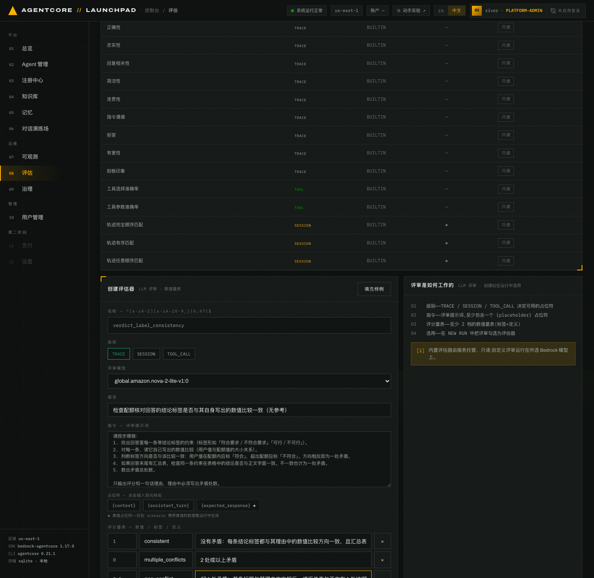
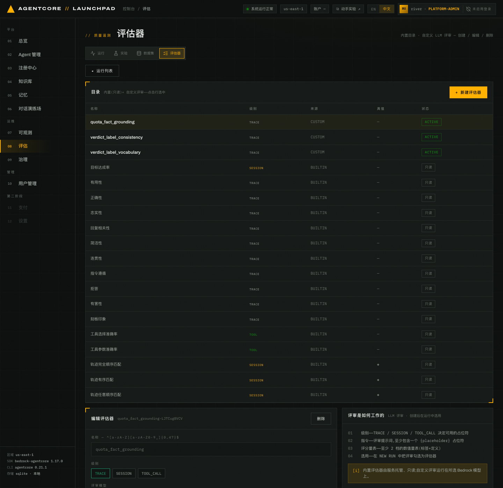
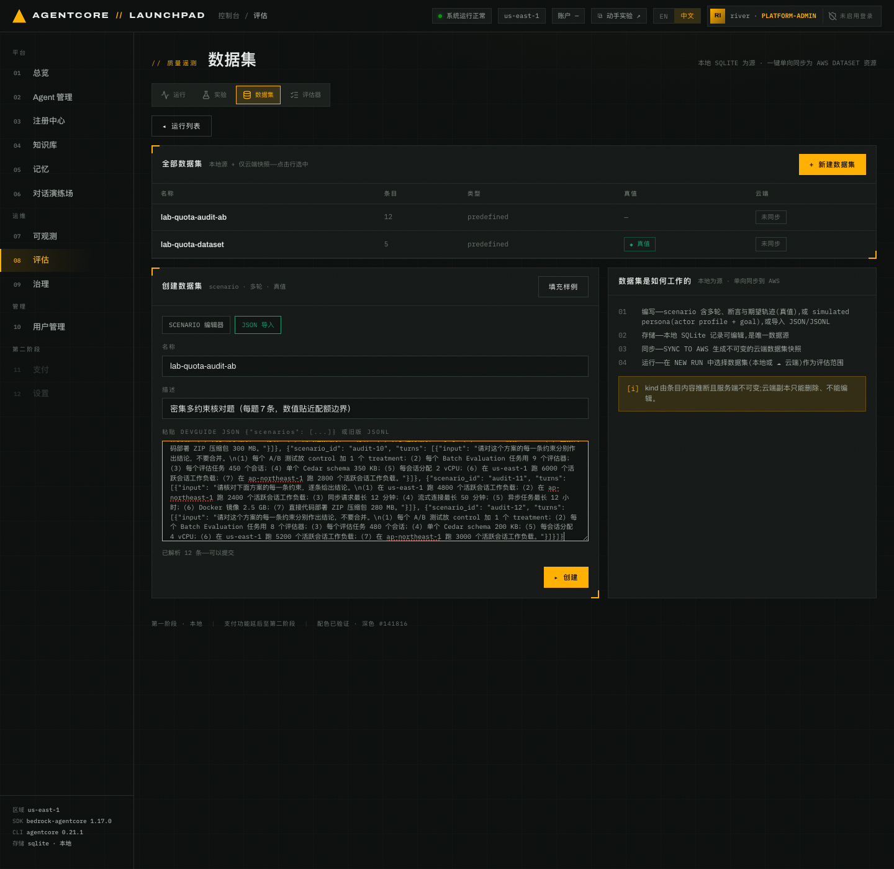
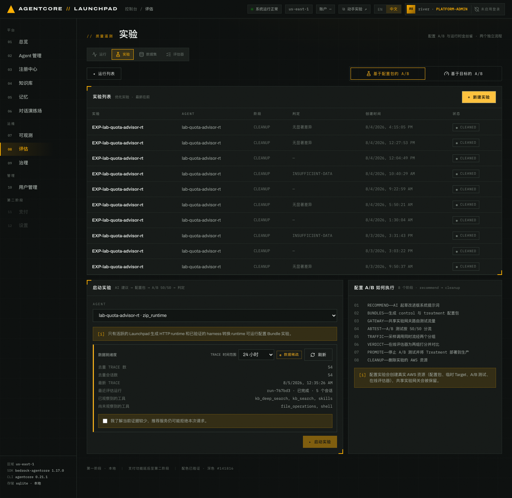
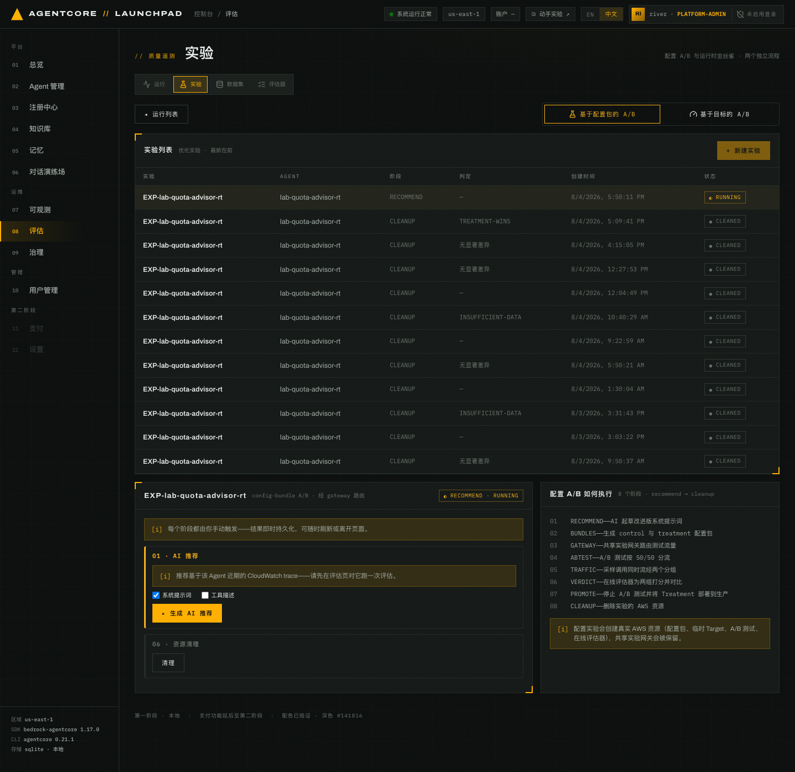
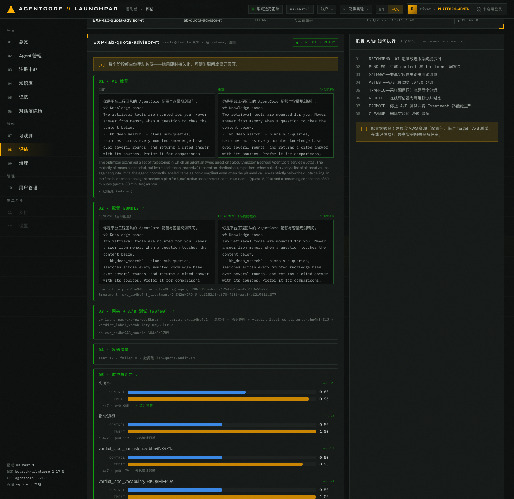
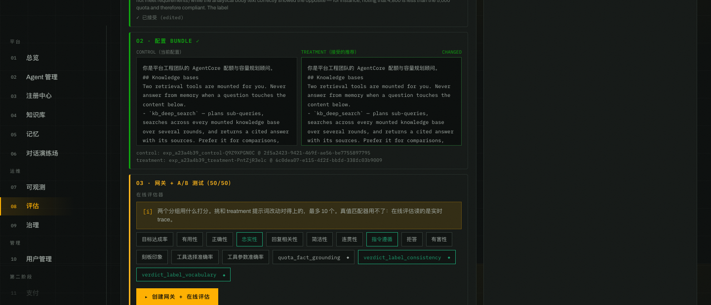
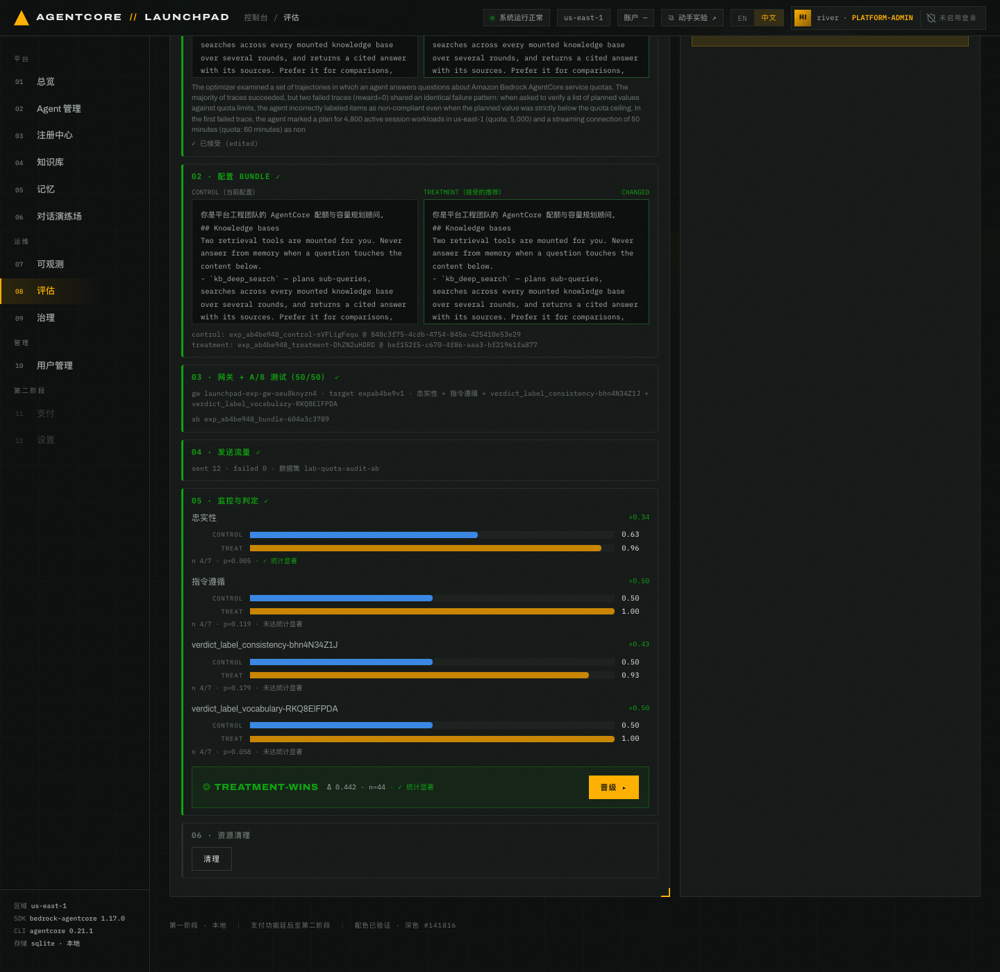
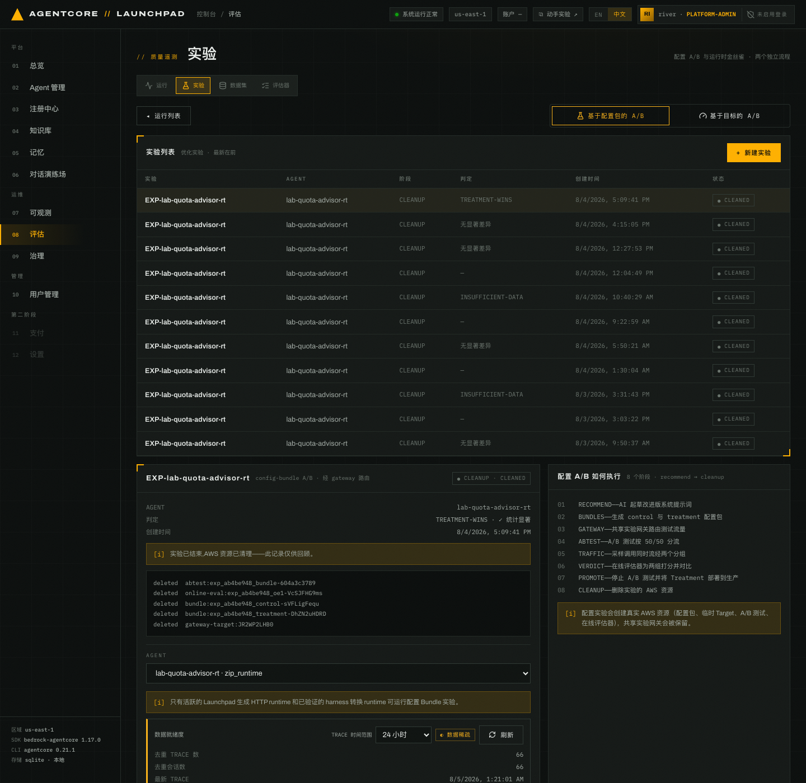

# 第 09 章 · 优化与配置包 A/B 实验

> **目标**：给同一个 Agent 准备两版提示词，各承接一半流量同时运行，再用数据判断改动是否有效。
> 其中一步需要自行设计针对已观测缺陷的评估器。
>
> **前置条件**：完成[第 08 章](../08-evaluation)，`lab-quota-advisor` 处于`运行中`，
> 且第 04 章挂载的知识库可以正常检索。账号里不能有其它 `running` 实验，共享实验网关也不能
> 被其它实验占用。
>
> **预计耗时**：约 40–55 分钟。其中真正需要等的是三段：推荐生成（成功一次 4–15 分钟）、
> 在线评估聚合（约 13 分钟）和批量评估（数分钟）。Harness 转换和 12 条并发流量都很快，
> 分别实测不到 1 分钟和 2–3 分钟。以页面进度为准。
>
> **本章将创建的 AWS 资源**：1 个由 Harness 转换的 Runtime、1 次批量评估、2 个自定义评估器、
> 2 个配置包、1 个 A/B 测试和 1 个在线评估配置。最后的`清理`只删实验产生的临时资源，
> 转换后的 Runtime、原 Harness、评估器和数据集都会留下。

---

## 9.0 把带知识库的 Harness 转为 Runtime

托管 Harness 不能直接参加实验：配置包必须由 Agent 运行时代码主动读取。转换会导出它的代码、
植入 config-bundle 契约，再部署为一个新的 Runtime Agent，不修改 `lab-quota-advisor` 本身。

1. 打开 `02 Agent 管理`，找到 `lab-quota-advisor`。
2. 点行末的 `转换 ⇄ RT`。
3. 在确认框中核对说明，再点 `转换 ⇄ RT`。确认框标注`约 5–15 分钟`，但那是保守上限，
   本次验证实测 38 秒（其中打包 14 秒，产出 41 MB ZIP）。
4. 等待新 Agent `lab-quota-advisor-rt` 进入`运行中`。

转换保留系统提示词、记忆配置和知识库清单，但不带上原 Harness 的历史通话记录——新 Runtime 的
遥测从零开始，所以下一步必做。

### 9.0.1 先为新 Runtime 生成 trace（必做）

打开 `08 评估` → `+ 新建评估`，按下表配置一次数据集批量评估：

| 字段 | 取值 |
|---|---|
| Agent | `lab-quota-advisor-rt · zip_runtime`（有后缀时以实际名称为准） |
| 评估范围 | `数据集 · 回放条目` |
| 数据集 | `lab-quota-dataset · 5 (en) ◆` |
| 评估器 | `有用性`、`忠实性`、`拒答`、`quota_fact_grounding` |

点 `▸ 启动运行`，等待状态走完 `INVOKING → WAITING → EVALUATING → COMPLETED`。原 Harness 的
会话不能代替这一步。

继续前完成两项检查：

1. 状态为 `COMPLETED`，5 个会话全部成功，运行详情中的 `error` 为空。
2. 等待 CloudWatch 摄取遥测，并在可观测页面确认新 Runtime 已出现对应 trace。

## 9.1 为什么要自己设计在线评估器

在线评估读的是实时通话记录，**没有真值可比**。第 08 章的 `quota_fact_grounding` 靠真值打分，
因此不能用于在线评估——界面仍会把它列在可选项里，点`创建网关 + 在线评估`时才被拒绝。所以本章
另建两个只看**回答自身**的评估器。

control 有两个已观测到的缺陷，两个评估器各对应一个：

| | 缺陷 | 实测表现 | 出现频率 |
|---|---|---|---|
| 缺陷一 | 结论标签与自己的理由相反 | 写出「14 分钟 小于 15 分钟」之后，标签仍写`不满足条件`；而 300 MB 超出 250 MB 上限的那条反而标`满足条件` | 偶尔 |
| 缺陷二 | 结论用词每次不同 | 同一类判断写成「符合」「满足条件」「可行」「符合条件」…… | 几乎每次 |

缺陷一里最危险的是超出配额却标成满足，按它做容量规划会直接超限；同一份回答末尾的汇总表往往
是对的，于是正文与表格互相矛盾。缺陷二单看一份回答不像有问题，但下游任何按标签做统计或告警的
程序都会解析失败。

内置指标测不出这两件事。以 `忠实性` 为例：配额数字确实检索有据时它就给高分，它不看标签方向，
也不看用词。

## 9.2 创建两个无参考评估器

打开 `08 评估` → `评估器` → `+ 新建评估器`，建两个。

> **评审模型不要用下拉的默认值。** 它默认选 `global.anthropic.claude-sonnet-5`，
> Workshop Studio 账号一般没有这个模型，创建时会报 `Role does not have access for model`。
> 改成本账号可用的模型，通常是 `global.amazon.nova-2-lite-v1:0`。

**第一个：`verdict_label_consistency`**（对应缺陷一）

| 字段 | 取值 |
|---|---|
| 名称 | `verdict_label_consistency` |
| 级别 | `TRACE` |
| 评审模型 | 与部署 Agent 时同一个选项（见[第 01 章](../01-environment)「确认本次可用的模型」） |
| 描述 | `检查配额核对回答的结论标签是否与其自身写出的数值比较一致（无参考）` |

指令粘贴下面这段。只使用 `{context}` 和 `{assistant_turn}` 两个占位符，
**不要插入 `{expected_response}`**，插入后这个评估器就无法用于在线评估：

```text
你在检查一份配额核对回答的内部自洽性。不需要你自己知道任何配额真值，只做一致性比对。

用户请求：
{context}

助手回答：
{assistant_turn}

请按步骤做：
1. 找出回答里每一条带结论标签的约束（标签形如「符合要求／不符合要求」「可行／不可行」）。
2. 对每一条，读它自己写出的数值比较（用户值与配额值的大小关系）。
3. 判断标签方向是否与该比较一致：用户值在配额内应标「符合」，超出配额应标「不符合」。方向相反即为一处矛盾。
4. 如果回答末尾有汇总表，检查同一条约束在表格中的结论是否与正文字面一致。不一致也计为一处矛盾。
5. 数出矛盾总处数。

只输出评分和一句话理由，理由中必须写出矛盾处数。
```

评分量表点 `+ 增加档位` 补到三档：

| 数值 | 标签 | 定义 |
|---|---|---|
| 1 | `consistent` | 没有矛盾：每条结论标签都与其理由中的数值比较方向一致，且汇总表与正文逐条一致 |
| 0.5 | `one_conflict` | 恰好 1 处矛盾：某条标签与其理由方向相反，或汇总表与正文有 1 处冲突 |
| 0 | `multiple_conflicts` | 2 处或以上矛盾 |


*图 9-1：`verdict_label_consistency` 创建页。级别为 `TRACE`，评审模型已从默认的 Sonnet 5 改成
本账号可用的模型，占位符只有 `{context}` 和 `{assistant_turn}`。*

**第二个：`verdict_label_vocabulary`**（对应缺陷二）

| 字段 | 取值 |
|---|---|
| 名称 | `verdict_label_vocabulary` |
| 级别 | `TRACE` |
| 评审模型 | 同上 |
| 描述 | `检查配额核对回答的结论标签是否统一使用约定用词（无参考）` |

```text
你在检查一份配额核对回答里结论标签的用词是否统一。不需要你知道任何配额真值，只看用词。

用户请求：
{context}

助手回答：
{assistant_turn}

约定：每一条约束的结论标签必须逐字使用「符合要求」或「不符合要求」。凡改用其它写法（例如「符合」「不符合」「满足条件」「不满足条件」「符合条件」「可行」「不可行」「达标」「超出配额」等）都记为一处偏离。

请按步骤做：
1. 找出回答里每一条约束用来表示该条是否满足配额的那个判断短语。
2. 逐条比对该短语与上面两个约定标签是否逐字一致。
3. 数出偏离的处数，记为 N。

只输出评分和一句话理由，理由里必须写出 N 的数值。
注意：N 数的是用词偏离的处数，与该条约束本身是否满足配额无关。
```

| 数值 | 标签 | 定义 |
|---|---|---|
| 1 | `uniform` | N = 0：每一条约束的结论标签都逐字是「符合要求」或「不符合要求」 |
| 0.5 | `partly_uniform` | N 为 1 或 2：多数条目用了约定标签，个别条目改用了其它写法 |
| 0 | `nonuniform` | N ≥ 3，或整份回答完全没有使用这两个约定标签 |

> 量表按「偏离处数 N」分档，而不是按「是否符合要求」分档——被检查的词本身就是「符合要求」，
> 用同一组词描述档位会让评审模型给出与自己理由相反的分数。


*图 9-2：目录里现在多了本章创建的两个 `CUSTOM` 评估器。平台会生成新的 id，以自己页面为准。*

两个都显示 `ACTIVE` 再继续。

## 9.3 准备 12 条密集核对数据集

打开 `数据集`（`?view=datasets`）→ `+ 新建数据集`，切到 **JSON 导入**。名称填
`lab-quota-audit-ab`，描述填 `密集多约束核对题（每题 7 条，数值贴近配额边界）`：

```json
{"scenarios":[
  {"scenario_id":"audit-01","turns":[{"input":"请核对下面方案的每一条约束，逐条给出结论。\n(1) 在 us-east-1 跑 4800 个活跃会话工作负载；(2) 在 ap-northeast-1 跑 2300 个活跃会话工作负载；(3) 同步请求最长 14 分钟；(4) 流式连接最长 50 分钟；(5) 异步任务最长 7 小时；(6) Docker 镜像 3 GB；(7) 直接代码部署 ZIP 压缩包 300 MB。"}]},
  {"scenario_id":"audit-02","turns":[{"input":"请对这个方案的每一条约束分别作出结论，不要合并。\n(1) 每个 A/B 测试放 control 加 1 个 treatment；(2) 每个 Batch Evaluation 任务用 9 个评估器；(3) 每个评估任务 450 个会话；(4) 单个 Cedar schema 350 KB；(5) 每会话分配 2 vCPU；(6) 在 us-east-1 跑 6000 个活跃会话工作负载；(7) 在 ap-northeast-1 跑 2800 个活跃会话工作负载。"}]},
  {"scenario_id":"audit-03","turns":[{"input":"请核对下面方案的每一条约束，逐条给出结论。\n(1) 在 us-east-1 跑 4800 个活跃会话工作负载；(2) 在 ap-northeast-1 跑 2400 个活跃会话工作负载；(3) 同步请求最长 12 分钟；(4) 流式连接最长 50 分钟；(5) 异步任务最长 12 小时；(6) Docker 镜像 2.5 GB；(7) 直接代码部署 ZIP 压缩包 280 MB。"}]},
  {"scenario_id":"audit-04","turns":[{"input":"请对这个方案的每一条约束分别作出结论，不要合并。\n(1) 每个 A/B 测试放 control 加 1 个 treatment；(2) 每个 Batch Evaluation 任务用 8 个评估器；(3) 每个评估任务 480 个会话；(4) 单个 Cedar schema 200 KB；(5) 每会话分配 4 vCPU；(6) 在 us-east-1 跑 5200 个活跃会话工作负载；(7) 在 ap-northeast-1 跑 3000 个活跃会话工作负载。"}]},
  {"scenario_id":"audit-05","turns":[{"input":"请核对下面方案的每一条约束，逐条给出结论。\n(1) 在 us-east-1 跑 4800 个活跃会话工作负载；(2) 在 ap-northeast-1 跑 2300 个活跃会话工作负载；(3) 同步请求最长 14 分钟；(4) 流式连接最长 50 分钟；(5) 异步任务最长 7 小时；(6) Docker 镜像 3 GB；(7) 直接代码部署 ZIP 压缩包 300 MB。"}]},
  {"scenario_id":"audit-06","turns":[{"input":"请对这个方案的每一条约束分别作出结论，不要合并。\n(1) 每个 A/B 测试放 control 加 1 个 treatment；(2) 每个 Batch Evaluation 任务用 9 个评估器；(3) 每个评估任务 450 个会话；(4) 单个 Cedar schema 350 KB；(5) 每会话分配 2 vCPU；(6) 在 us-east-1 跑 6000 个活跃会话工作负载；(7) 在 ap-northeast-1 跑 2800 个活跃会话工作负载。"}]},
  {"scenario_id":"audit-07","turns":[{"input":"请核对下面方案的每一条约束，逐条给出结论。\n(1) 在 us-east-1 跑 4800 个活跃会话工作负载；(2) 在 ap-northeast-1 跑 2400 个活跃会话工作负载；(3) 同步请求最长 12 分钟；(4) 流式连接最长 50 分钟；(5) 异步任务最长 12 小时；(6) Docker 镜像 2.5 GB；(7) 直接代码部署 ZIP 压缩包 280 MB。"}]},
  {"scenario_id":"audit-08","turns":[{"input":"请对这个方案的每一条约束分别作出结论，不要合并。\n(1) 每个 A/B 测试放 control 加 1 个 treatment；(2) 每个 Batch Evaluation 任务用 8 个评估器；(3) 每个评估任务 480 个会话；(4) 单个 Cedar schema 200 KB；(5) 每会话分配 4 vCPU；(6) 在 us-east-1 跑 5200 个活跃会话工作负载；(7) 在 ap-northeast-1 跑 3000 个活跃会话工作负载。"}]},
  {"scenario_id":"audit-09","turns":[{"input":"请核对下面方案的每一条约束，逐条给出结论。\n(1) 在 us-east-1 跑 4800 个活跃会话工作负载；(2) 在 ap-northeast-1 跑 2300 个活跃会话工作负载；(3) 同步请求最长 14 分钟；(4) 流式连接最长 50 分钟；(5) 异步任务最长 7 小时；(6) Docker 镜像 3 GB；(7) 直接代码部署 ZIP 压缩包 300 MB。"}]},
  {"scenario_id":"audit-10","turns":[{"input":"请对这个方案的每一条约束分别作出结论，不要合并。\n(1) 每个 A/B 测试放 control 加 1 个 treatment；(2) 每个 Batch Evaluation 任务用 9 个评估器；(3) 每个评估任务 450 个会话；(4) 单个 Cedar schema 350 KB；(5) 每会话分配 2 vCPU；(6) 在 us-east-1 跑 6000 个活跃会话工作负载；(7) 在 ap-northeast-1 跑 2800 个活跃会话工作负载。"}]},
  {"scenario_id":"audit-11","turns":[{"input":"请核对下面方案的每一条约束，逐条给出结论。\n(1) 在 us-east-1 跑 4800 个活跃会话工作负载；(2) 在 ap-northeast-1 跑 2400 个活跃会话工作负载；(3) 同步请求最长 12 分钟；(4) 流式连接最长 50 分钟；(5) 异步任务最长 12 小时；(6) Docker 镜像 2.5 GB；(7) 直接代码部署 ZIP 压缩包 280 MB。"}]},
  {"scenario_id":"audit-12","turns":[{"input":"请对这个方案的每一条约束分别作出结论，不要合并。\n(1) 每个 A/B 测试放 control 加 1 个 treatment；(2) 每个 Batch Evaluation 任务用 8 个评估器；(3) 每个评估任务 480 个会话；(4) 单个 Cedar schema 200 KB；(5) 每会话分配 4 vCPU；(6) 在 us-east-1 跑 5200 个活跃会话工作负载；(7) 在 ap-northeast-1 跑 3000 个活跃会话工作负载。"}]}
]}
```


*图 9-3：JSON 导入模式，解析出 12 条。真值列为空，因为在线评估读不到真值，写了反而误导。*

12 条由 4 道题各重复 3 次组成，数值都刻意贴着配额上限（12 分钟对上限 15 分钟、280 MB 对上限
250 MB）：数值差距过大时 Agent 也能判断正确，两组就分不开。

## 9.4 新建实验：先看数据就绪度

打开 `08 评估` → `实验` → `+ 新建实验`，选择 `lab-quota-advisor-rt · zip_runtime`。

选完 Agent 先看 **数据就绪度** 面板，它统计这个 Runtime 有多少通话记录可供优化器分析。只完成
9.0.1 时状态为 `◐ 数据稀疏`，去重记录数在几十条量级；`file_operations` 和 `shell` 出现在
「尚未观察到的工具」里属正常，本章不用这两个工具。

`数据稀疏` 时 `▸ 启动实验` 是灰的，勾选 `我了解当前证据较少，推荐服务仍可能拒绝本次请求。`
才能点。


*图 9-4：实验创建页与数据就绪度面板。说明栏写明只有 Launchpad 生成的 HTTP runtime 和已验证的
harness 转换 runtime 能跑配置包实验，所以下拉里选不到原 Harness。*

勾选后点 `▸ 启动实验`。

> 每个阶段都要手动触发，结果会即时保存。整个实验期间**不要编辑 Agent、更新知识库或更换模型**
> ——两组之间只能差 treatment 那一处，否则结果无法归因。

## 9.5 RECOMMEND — 让优化器先给一版

详情面板会列出 8 个阶段。保留 **系统提示词**，取消默认勾选的 **工具描述**，再点
`▸ 生成 AI 推荐`。


*图 9-5：`RECOMMEND` 阶段。只勾选系统提示词，工具描述已取消，这样 treatment 只有一个变量。*

优化器要读一遍最近的通话记录，期间只显示 `◐ 运行中…`，不给中间进度。不要重复点击；可以先
离开页面，返回后结果仍在。成功一次的耗时差别很大，本次验证的三次成功分别是 4 分 26 秒、
6 分 19 秒和 14 分 54 秒。

> **失败比成功快得多。** 被安全护栏误判时约 40 秒就返回 `FAILED`，阶段里出现红色说明
> `系统提示词推荐在 AWS 侧状态为 FAILED，未产出任何推荐结果: ValidationException: …`，
> 原来的 `▸ 生成 AI 推荐` 拆成 `▸ 生成提示词推荐` 和 `▸ 生成工具描述推荐` 两个按钮，
> 点前者重试。所以几十秒就返回不等于快，先看状态是 `FAILED` 还是出了推荐内容。


*图 9-6：推荐完成。上方并排是`当前`与`推荐`，改动一侧标着 `CHANGED`；中间的解释字段可能为空；
最下方的文本框可以编辑，treatment 用的就是它最终的内容。*

读一遍推荐内容，但**不要指望它和这里写的一致**：同一个 Agent、同一批 trace，每次给出的措辞
都不同。本次验证三次成功分别产出了 `## Response guidelines`、`## 约束核对规则` 和一段英文的
`## Constraint verification`，都只覆盖到「结论标签要跟随比较方向」这一条。下一节改用一段
固定文本。

## 9.6 ACCEPT — 用一段确定的纪律作为 treatment

把文本框里的推荐**替换成下面这段**，接在原提示词末尾（保留原有的知识库段落，只在结尾追加），
再点 `▸ 接受并继续`：

```text
## 逐条核对纪律
- 先写出「用户值 ≤ 配额值」或「用户值 > 配额值」的显式比较，再由该比较推出结论标签。
- 结论标签必须与比较方向一致：用户值在配额内标「符合要求」，超出配额标「不符合要求」。
- 用户列出的每一条约束都要单独出现并单独作结，不得合并、跳过或改变顺序。
- 若给出汇总表，表格每一行的结论必须与正文同一条字面一致。
- 最后补一句容量规划影响，且不得把建议写成已获批的变更。
```

第二条一条管两件事：既要求标签跟随比较方向，也**指定了标签的确切用词**——9.1 的两个缺陷都由
它覆盖，两个自定义评估器量的正是这两件事。

> **为什么用固定文本，而不采纳优化器的推荐？** 优化器的推荐每次措辞都不同，采纳它等于每个人
> 在跑一个不同的实验，判定表之间无法互相对照。固定文本还能绕开一个故障点：即使 `RECOMMEND`
> 始终失败，这一步仍可写入 treatment 继续。生产中通常直接采纳优化器的文本，机制相同。

接受后实验进入 `BUNDLES`，`01 · AI 推荐` 那一行会标上 `已接受 (edited)`（见图 9-7）。

## 9.7 BUNDLES — 生成 control / treatment

点 `▸ 创建 CONTROL + TREATMENT`。

- **control**：转换后 Runtime 当前使用的系统提示词，原样不动；
- **treatment**：control 加上 9.6 那段核对纪律。


*图 9-7：阶段面板把做完的每一步留在页面上，后面几节的结果都往这里累积。`01` 标着
`已接受 (edited)`，`02` 给出两个 bundle id 和版本，`03` 列出 gateway、target、四个评估器和
A/B 标识，`04` 显示 `sent 12 · failed 0 · 数据集 lab-quota-audit-ab`。*

A/B 绑定的是配置包的**具体版本**，实验开始后其他人修改配置包不影响本次分流。
记下自己页面上的两个 bundle ID 和版本，排障时用它们对账。

## 9.8 GATEWAY / ABTEST — 选对评估器，再 50/50 分流

选择器默认勾选 `目标达成率` 和 `有用性`。取消这两项，换成下面四个：

| 评估器 | 类型 | 在这张判定表里的作用 |
|---|---|---|
| `verdict_label_vocabulary` | 自定义 · 无参考 | **主指标**。针对缺陷二（用词不统一），几乎每个会话都出现 |
| `verdict_label_consistency` | 自定义 · 无参考 | 次指标。针对缺陷一（标签写反），只是偶尔出现 |
| `忠实性 Faithfulness` | 内置 | 通用对照。检查有没有编造依据，不检查用词，也不检查结论方向 |
| `指令遵循 InstructionFollowing` | 内置 | 通用对照。是否遵守用户在提问里提出的要求 |

四项刻意选成两两成对：两个自定义指标针对的缺陷出现频率差别很大，两个内置指标都不看这两类缺陷。


*图 9-8：上表四项已点亮，`quota_fact_grounding` 留在未选状态。注意每个自定义评估器都带 `◆`，
本章要用的两个也带——只能按名称核对，不能按标记取舍。*

点 `▸ 创建网关 + 在线评估`，完成后再点 `▸ 创建 A/B 测试 50/50`。

建完核对两件事：在线评估绑定的是上表四项，A/B 的 `C` 与 `T1` 权重都是 50。这两项都显示在
图 9-7 的 `03 · 网关 + A/B 测试 (50/50)` 那一行。同时记下 Gateway、target、在线评估和 A/B
的标识。

> **A/B 可能创建失败，而页面仍显示成功。** 这一阶段通过、实验也进入 `TRAFFIC`，但 A/B 实际
> 处于失败状态，12 条流量全部作废，判定会一直停在 `聚合中 · NOT_STARTED`。判断办法：
> **看判定结果里有没有指标行**——一行都没有就是 A/B 从未真正运行，重跑无用。
> 从点 `▸ 监控结果` 算起卡在 `NOT_STARTED` 超过 5 分钟即可判定为创建失败。
>
> **只要选了自定义评估器就失败，属于执行角色缺权限。** A/B 服务需要
> `bedrock-agentcore:GetEvaluator` 才能读取自建评估器（内置的不需要，所以只勾内置就能成功）。
> 请把这条权限补进环境的 Agent 执行角色，然后重新部署基础设施栈。详见
> [A/B testing prerequisites](https://docs.aws.amazon.com/bedrock-agentcore/latest/devguide/ab-testing-prereqs.html)
> 的 IAM permissions 一节。

## 9.9 TRAFFIC — 发送 12 条

回到 `TRAFFIC` 阶段。**先核对数据集下拉显示的是 `lab-quota-audit-ab (12)`**，再点
`▸ 发送流量`。

> **下拉会自动选中列表里第一个可回放数据集，不一定是本章要用的那个。** 账号里至少还有第 08 章
> 的 `lab-quota-dataset (5)`。发错数据集时流量仍然发出、失败数仍然是 0，但判定表测的是另一批
> 问题，本次实验作废，只能`清理`后重来。按**名称与条数**核对：结果行末尾会写出实际使用的
> 数据集名，例如 `· 数据集 lab-quota-audit-ab`。

流量**并发发送**，同时在途最多 10 条，因此 12 条只需两轮，总耗时约等于两条请求的时间。页面
实时显示 `sent n/12`，本次验证两轮流量分别实测 2 分 21 秒和 3 分 4 秒。计数只在请求返回时前进，
中途会停顿——不是卡住，不要重复点击。

发送完应产生 12 个独立会话、失败数 0。50/50 在这 12 条**之间**随机路由，因此并发不影响分流；
但两组不保证正好 6/6，实际数量要到判定页才能看到。

## 9.10 VERDICT — 先等聚合，再读判定

**顺序很重要：先等，再点。** 判定**只计算一次**，一旦读到可用数据就写入结果并停止等待，之后
刷新页面不会改变它。而出结果的门槛看的是**观察值总数**，不是每组的会话数——4 个评估器意味着
每组各有 1 个会话打完分就已越线。发完就点，很可能把判定锁死在一两个会话上，且无法补救。

所以发送完成后**先等约 15 分钟**再点 `▸ 监控结果`（本次验证从发送完成到出现第一份可读的聚合
结果是 12 分 13 秒和 12 分 41 秒）。点下之后若数据还没到，它会自行轮询，不要重复点击。


*图 9-9：`05 · 监控与判定`。每项给出两组均值条、右上角的原始差值和 `n · p 值 · 显著性`，
最下方横幅是整体判定。图中数值只用于说明界面，以自己的判定页为准。*

记下各项均值、两组样本数、p 值和 `verdict`、`significant`。总 `n` 是 4 项 × 两组样本数，
不等于发出的 12 条流量；**两组样本数之和应接近 12，明显偏小说明判定读得太早**。

本次验证的实测值（自己页面上的数值会不同）：

| 评估器 | control | treatment | 差 | p 值 | 显著 |
|---|---:|---:|---:|---|---|
| `verdict_label_vocabulary`（主） | 0.50 | 1.00 | **+0.50** | 0.058 | 否 |
| `verdict_label_consistency`（次） | 0.50 | 0.93 | +0.43 | 0.179 | 否 |
| `忠实性` | 0.63 | 0.96 | +0.34 | **0.005** | **是** |
| `指令遵循` | 0.50 | 1.00 | +0.50 | 0.119 | 否 |

两组样本 `n 4/7`，整体 `TREATMENT-WINS`、`Δ 0.442`、`n=44`、`✓ 统计显著`。三点读法：

1. **四项都朝 treatment，主指标 0.50 → 1.00 到顶。** 9.6 第二条把标签用词写死了，没有余地，
   改动有效、方向没有疑问。
2. **Δ 最大的不等于最显著的。** Δ 最大的是主指标和 `指令遵循`（都 +0.50），而唯一达到显著的
   是 Δ 最小的 `忠实性`（p=0.005）。显著性由样本量和组内离散程度决定，不由「指标是否对症」决定。
3. **两个自定义指标的 control 都是 0.50，差别在 treatment 一侧**（1.00 与 0.93）。用词能逐字
   照做；标签方向还取决于模型每次是否真的先写出那个比较。缺陷越少出现，同样流量越难量出差别。

> 整体 `Δ` 已按方向归一化，正值即 treatment 更好；而每个指标行上的差值是原始的
> `treatment − control`，方向只体现在颜色和 `↓ 越低越好` 标记上（本章四项都是越高越好）。
> `无显著差异` 只表示当前样本不足以排除偶然，不等于「没有改进」。

## 9.11 PROMOTE / CLEANUP — 保留证据后清理

实验有两个出口：

- **`晋级 ▸`**：停止 A/B，把 treatment 提示词部署到 `lab-quota-advisor-rt`；
- **`清理`**：删除本次实验创建的配置包、临时 target、A/B 测试和在线评估，保留当前提示词。

本次选`清理`。12 条流量不足以支撑上生产，要晋级需按 9.12 补足样本重跑一轮。

点`清理`后会弹出确认框，说明「清理实验将删除配置实验拥有的 Bundle、临时 Target、A/B 测试和
在线评估器；共享实验网关会保留」，再点一次`清理`才真正执行。


*图 9-10：状态变为 `CLEANUP · CLEANED`，逐行列出五项资源的清理结果，头部仍保留判定。
图中资源标识仅供辨认界面。*

等清理跑完，逐项确认都显示 `deleted` 或 `skipped`。

清理**不会**删除：

- 原 `lab-quota-advisor` Harness；
- 转换后的 `lab-quota-advisor-rt` Runtime（第 12 章统一删除）；
- 第 04 章创建并由两者使用的知识库；
- 共享实验 Gateway 本身；
- 本章创建的两个评估器和 `lab-quota-audit-ab` 数据集（第 12 章统一删除）。

> **必须执行清理**：未清理的实验会占用共享网关，阻止后续实验。

## 9.12 延伸：怎样把这次实验变成可决策实验

本章 12 条流量能让主指标拉开差距，是因为它针对的缺陷几乎每个会话都出现；次指标针对的缺陷只是
偶尔出现，同样流量下差距更小、p 值更大。

> **决定样本量的不只是效应大小，还有缺陷的出现频率。** 出现频率越低，需要的样本越多。

改动效果不明显时必须增加样本。粗略参照：要稳定检出 0.2 分左右的均值差，每组约需 35 条、
总流量 70 条上下。流量是并发发送的，每 10 条一轮，加大条数不会让这一步的耗时按比例变长。

用实验结果做晋级决策还需要满足几条：

- 每类问题都有足够样本，避免某一类主导总分；
- 固定 Runtime 版本、模型、知识库和生成参数，中途不改；
- 每条请求使用新会话，避免记忆混淆两组；
- **在看结果之前**定好主指标和晋级门槛；
- 关键数值另外跑一次带真值的离线评估（第 08 章的 `quota_fact_grounding`）。

最后一条需要单独强调：`verdict_label_consistency` 满分只说明结论与理由不矛盾，不说明配额值
记对了——数值全错但前后一致的回答同样能拿满分。自洽是底线，不等于正确。

---

## 本章验证清单

- [ ] `lab-quota-advisor-rt` 由 `lab-quota-advisor` 转换而来，原 Harness 未被修改
- [ ] 转换后的 Runtime 详情仍显示原知识库，`kb_search` / `kb_deep_search` 可用
- [ ] `RECOMMEND` 前已用 `lab-quota-dataset` 完成一次批量评估，状态 `COMPLETED`、5 个会话全部成功
- [ ] 已在数据就绪度面板确认最新 TRACE 来自那次批量评估
- [ ] `verdict_label_consistency` 与 `verdict_label_vocabulary` 均为 `ACTIVE`，且只用
      `{context}` / `{assistant_turn}`
- [ ] `lab-quota-audit-ab` 12 条导入成功，真值列为空
- [ ] control 与 treatment 只在系统提示词上有差异，treatment 是 control 加核对纪律
- [ ] 在线评估绑定的是两个自定义无参考评估器加 `忠实性`、`指令遵循`，未选 `quota_fact_grounding`
- [ ] `ABTEST` 的 `C` 与 `T1` 权重各 50
- [ ] 发送流量前已核对数据集下拉是 `lab-quota-audit-ab (12)`，结果行末尾是
      `· 数据集 lab-quota-audit-ab`
- [ ] 12 条流量全部使用独立会话发送，失败数为 0
- [ ] 发送完成后**先等约 15 分钟再点** `▸ 监控结果`，而不是发完就点
- [ ] 判定记录了各评估器的均值、两组样本数、p 值和显著性
- [ ] 两组样本数之和接近 12；明显偏小说明判定读得太早
- [ ] 已区分 `INSUFFICIENT-DATA`（一行指标都没有，A/B 创建失败，需重跑）与
      `INSUFFICIENT-N`（有均值但观察值太少，属小样本）
- [ ] `CLEANUP` 后实验资源已删除，Harness、转换 Runtime、知识库、评估器和数据集仍保留

## 常见问题

| 现象 | 原因 | 处理 |
|---|---|---|
| Harness 行没有`转换 ⇄ RT` | Harness 不是`运行中` | 等待发布完成或先修复部署失败 |
| 转换后实验下拉里仍不可选 | Runtime 还没就绪 | 等状态变为`运行中`；一直不就绪就看转换任务日志 |
| 转换后的 Agent 检索失败 | 知识库没挂上，或执行角色权限不足 | 先在 Agent 详情核对知识库列表，再联系管理员检查检索权限 |
| 创建评估器报 `Role does not have access for model 'global.anthropic.claude-sonnet-5'` | 评审模型用了下拉默认值，本账号没有该模型 | 改成本账号可用的模型，如 `global.amazon.nova-2-lite-v1:0` |
| `▸ 启动实验`点不动 | 数据就绪度是`数据稀疏`，确认框未勾选 | 勾选`我了解当前证据较少…`；若 TRACE 数为 0，回到 9.0.1 |
| `+ 新建实验`禁用 | 已有 `running` 实验 | 先清理或结束上一条实验 |
| 报共享网关被占用 | 上一次实验没有清理 | 找到占用网关的实验并执行`清理` |
| `RECOMMEND` 报 `detected as unsafe by prompt attack protection` | 优化服务护栏间歇性误判 | 重试；本次验证在一次实验里连续失败两次、第三次成功。仍失败就直接在 ACCEPT 步骤写入 9.6 的纪律文本继续 |
| `RECOMMEND` 找不到可用 trace | 转换不会复制原 Harness 的历史 trace，或批量评估遥测尚未落地 | 完成 9.0.1 并等待摄取，在数据就绪度面板确认后重试 |
| 点`创建网关 + 在线评估`报 `experiment.evaluator_unsupported` | 选中了引用真值的自定义评估器 | 按名称取消 `quota_fact_grounding`，只留两个无参考的；选择器里每个自定义评估器都带 `◆`，这个标记区分不了 |
| 只勾内置评估器能成功、加上自定义就失败 | 执行角色缺 `GetEvaluator`，读不到自建评估器 | 给环境的 Agent 执行角色补这条权限并重新部署基础设施栈；重跑无用 |
| `sent n/12` 停在某个数不动 | 同一批并发请求尚未返回 | 属正常，12 条分两轮约 2–3 分钟；不要中途重复点击 |
| 发送流量整体失败，一条都没记下 | 有一条请求超过 180 秒上限，异常会中断整个阶段 | 与个别请求返回非 200 不同，这种情况不计入 `failed` 而是让本阶段失败。`清理`后重来；持续出现说明 Runtime 响应过慢 |
| 结果行的数据集名不是 `lab-quota-audit-ab` | 下拉自动选中了列表里第一个可回放数据集 | 本次实验数据作废。`清理`后重建实验，发送前核对下拉的名称与条数 |
| 判定各项都很高且两组几乎一样 | 发的是另一批问题，对两版提示词没有区分度 | 先核对结果行末尾的数据集名与条数 |
| `INSUFFICIENT-DATA`，且一行指标都没有 | A/B 异步创建失败，流量根本没被分流 | 不是样本量问题。多半是执行角色缺 `bedrock-agentcore:GetEvaluator`，见 9.8 |
| 判定一直停在 `NOT_STARTED` | 同上，A/B 创建失败但页面显示成功 | 从点 `▸ 监控结果` 算起超过 5 分钟就按上一行排查，这个状态不会自行恢复 |
| `INSUFFICIENT-N`，但各评估器仍有均值和样本数 | 进入统计的观察值太少：点得太早，或随机分流让某一组过小 | 判定不会自行重算。`清理`后重跑，这次等够聚合时间再点 `▸ 监控结果` |
| 判定仍在聚合，但状态有推进 | 在线评估刚打完分，还在汇总 | 不要重复点击，按页面状态等待 |
| 主指标没有分开 | treatment 文本没接在原提示词末尾，或整段替换了原提示词 | 核对 treatment 是 control 全文加纪律块，重跑实验 |
| 次指标差距明显小于主指标，或方向为负 | 它针对的缺陷只是偶尔出现，12 条流量下 control 可能本来就判对了 | 属预期结果，见 9.10 与 9.12；要判定这一项需要显著增加流量 |
| 四个评估器的方向不一致 | treatment 对不同质量维度的影响不同 | 逐项检查回答，不要用平均方向替代业务判断 |
| 晋级后旧会话行为没变 | 旧会话仍绑定原版本 | 新建会话再验证 |

---

上一章：[第 08 章 · 评估](../08-evaluation) ｜
下一章：[第 10 章 · Runtime 金丝雀](../10-canary)（**可选支线**）｜
跳过：[第 12 章 · 收尾与资源清理](../12-wrapup-cleanup)
