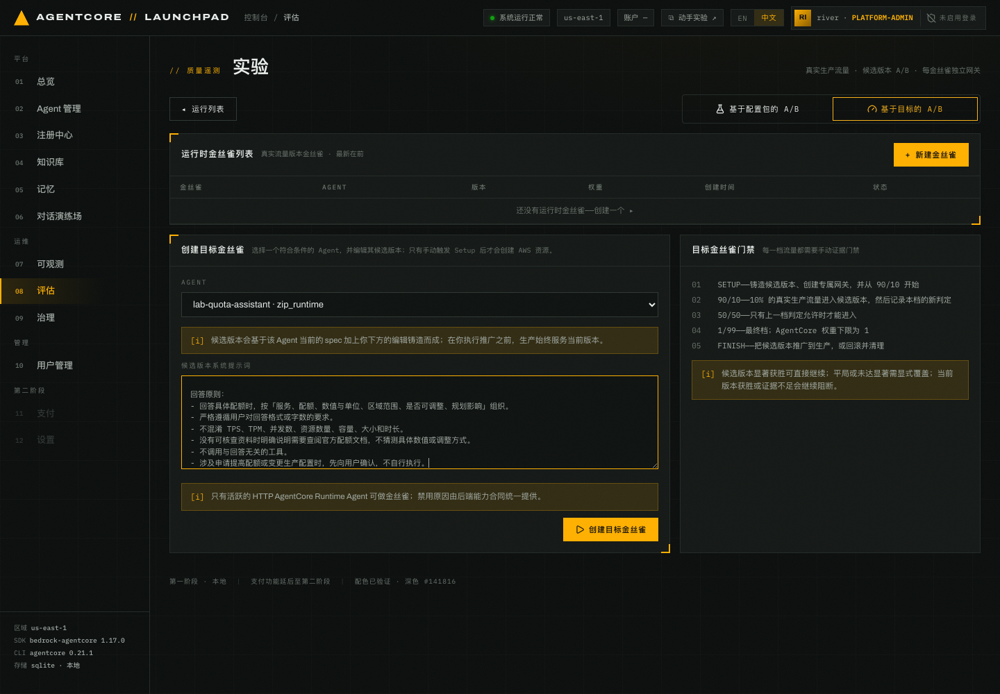
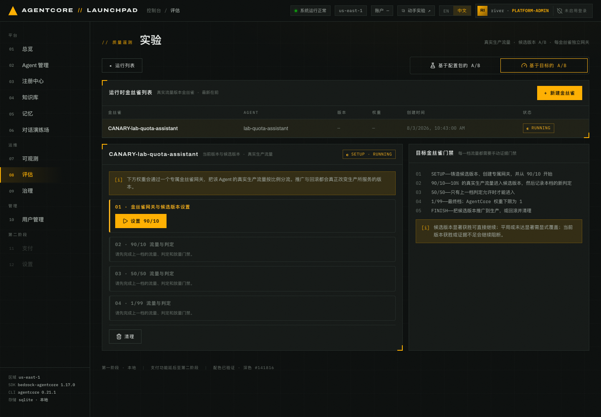
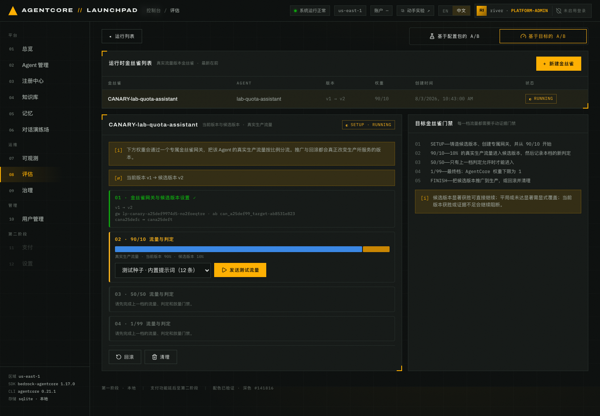
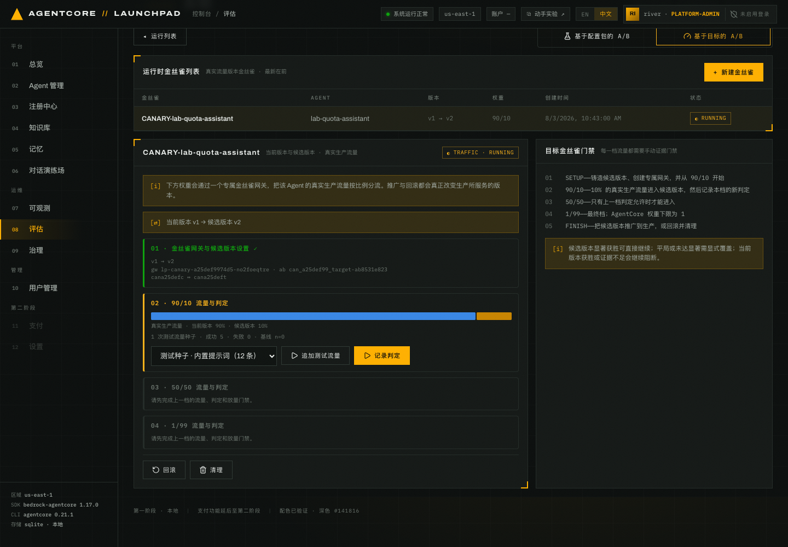
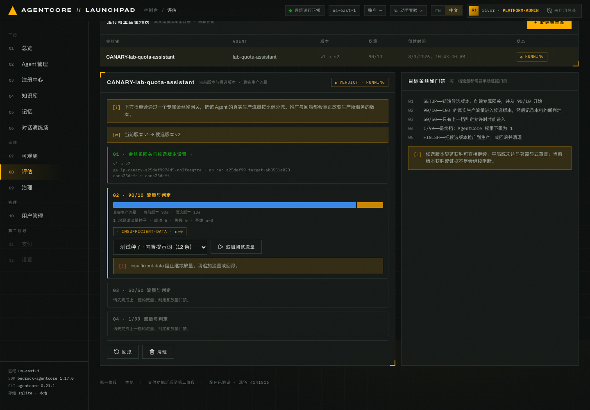
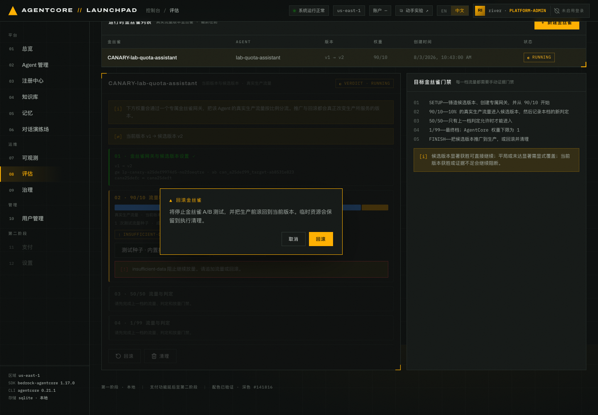
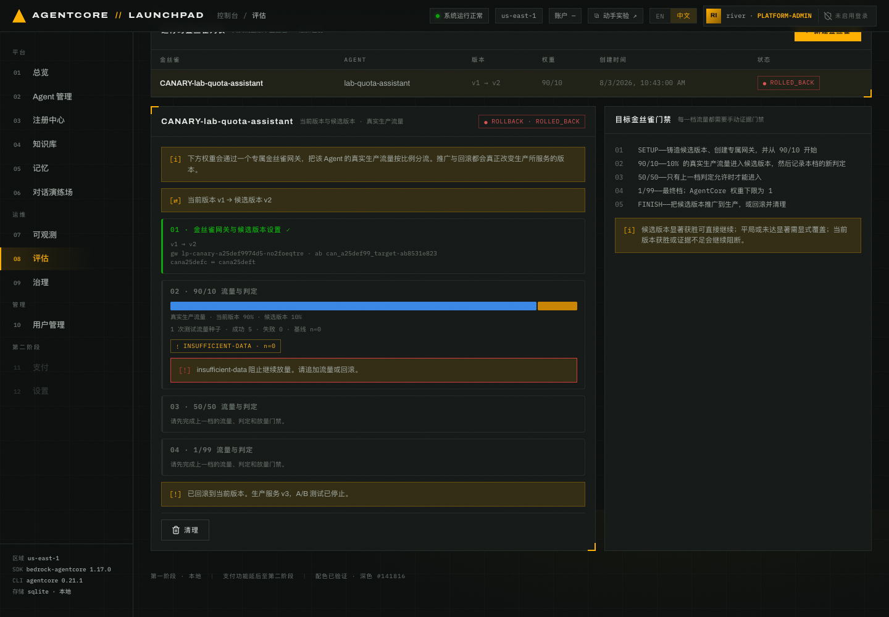
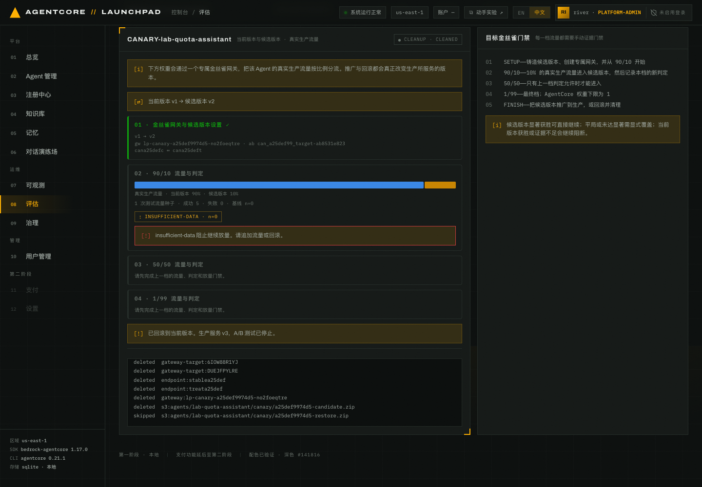

# 第 10 章 · Runtime 金丝雀：把改进版本灰度到真实流量（可选）

> **本章可选**。内容是运行时版本的灰度放量，没有任何后续章节依赖它，跳过后可直接进入
> [第 11 章](../11-governance)或[第 12 章](../12-wrapup-cleanup)。本章每一档判定最多要等
> 15 分钟，是全实验里等待最长的一段，所以从主线里摘了出来；控时紧张时不要跑，
> 或者和[第 09 章](../09-experiment-ab)一起另开一场来讲。
>
> **目标**：创建候选 Runtime 版本，将流量按 90/10 → 50/50 → 1/99 分档切换，并在每档检查
> 证据门禁。
>
> **前置条件**：对象必须是 active 的 `zip_runtime` Agent（见 10.0），第 02 章创建的
> `lab-quota-assistant` 符合。如果跑过[第 09 章](../09-experiment-ab)，
> 要先确认那次实验已 `CLEANUP`，否则共享网关互斥锁仍被占用；跳过第 09 章时没有这个要求。
>
> **预计耗时**：约 25 分钟（setup 通常约 4 分钟，每档判定最多等 15 分钟，
> 回滚与清理各约半分钟）。
>
> **本章将创建的 AWS 资源**：1 个候选 Runtime 版本（v2）、1 个稳定端点、1 个**专属**金丝雀
> Gateway + 2 个 target、1 个 A/B 测试、2 个在线评估配置。临时资源会在 `清理` 时删除；
> 回滚后仍服务生产的部署包会保留。

---

## 10.0 与配置包 A/B 的区别

| | 第 09 章 配置包 A/B | 本章 目标金丝雀 |
|---|---|---|
| 变的是什么 | **配置**（系统提示词 / 工具描述），代码与版本不变 | **运行时版本本身**（用编辑后的 spec 铸造 v2） |
| 流量 | 采样调用（你手动打的测试流量） | **真实生产流量**按权重分流 |
| 分流载体 | 共享实验网关 + 配置包变体 | **每个金丝雀一个专属网关** + 两个 runtime target |
| 档位 | 单一 50/50 | 90/10 → 50/50 → 1/99，逐档放量 |
| 门禁 | 一次判定 | **每档一次判定 + 手动放量门禁** |
| 推广影响 | 替换生产配置 | **切换生产所服务的版本** |
| 支持方式 | 仅 `zip_runtime` | `zip_runtime` |

打开 `08 评估` → `⚗ 实验` → 右上角切到 **`基于目标的 A/B`** 标签，点 `+ 新建金丝雀`。
Agent 下拉同样把不合格原因直接写出来：

```
lab-quota-assistant · zip_runtime        ← 可选
lab-quota-advisor-rt · zip_runtime       ← 完成第 09 章转换后也会出现，本章不选
lab-quota-advisor · harness   — 基于目标的金丝雀需要 AgentCore Runtime Agent。
```

`lab-quota-advisor` 在下拉里是灰色的，无法选中。完成第 09 章后，
`lab-quota-advisor-rt` 也是合格的 Runtime，但本章仍选 `lab-quota-assistant`，避免把配置 A/B
和版本金丝雀混在同一个对象上。A2A Agent 也会因不兼容 HTTP target-canary 流量被排除。

> 10.1–10.6 的截图只用于说明界面和门禁行为。资源 ID、版本号、耗时、流量结果与判定都以
> 自己的运行为准。

## 10.1 创建金丝雀：编辑候选版本的 spec

选 `lab-quota-assistant`，下方出现**候选版本的 spec 编辑区**，预填当前生产的系统提示词。

> 提示词是选中 Agent 那一刻才填进去的。刚进 `+ 新建金丝雀`（URL 带 `canary=new`）时下拉是
> 「选择要做金丝雀的 Agent……」、编辑区空白、`创建目标金丝雀` 是灰的，所以不用担心把空提示词
> 拿去铸造。选完仍是空的，换一下下拉再选一次。
>
> 账号里已有金丝雀记录时，点 `基于目标的 A/B` 看到的是那条记录的详情，新建仍得走
> `+ 新建金丝雀`。

把它替换成下面这份候选提示词。本章对象是无知识库的 `lab-quota-assistant`，与第 09 章转换后的
`lab-quota-advisor-rt` 不同；这里验证的是 Runtime 版本灰度机制，不把第 09 章的 treatment
直接搬到另一个 Agent 上：

```text
你是平台工程团队的 AgentCore 配额与容量规划助手。帮助团队识别 Runtime、Evaluation、
A/B Testing 与 Policy 等服务的容量约束和上线风险。

回答原则：
- 回答具体配额时，按「服务、配额、数值与单位、区域范围、是否可调整、规划影响」组织。
- 严格遵循用户对回答格式或字数的要求。
- 不混淆 TPS、TPM、并发数、资源数量、容量、大小和时长。
- 没有可核查资料时明确说明需要查阅官方配额文档，不猜测具体数值或调整方式。
- 不调用与回答无关的工具。
- 涉及申请提高配额或变更生产配置时，先向用户确认，不自行执行。
```


*图 10-1：当前环境的金丝雀创建页已选中 `lab-quota-assistant · zip_runtime`，
并显示候选提示词。创建记录本身不会改动 AWS 资源。*

点 `创建目标金丝雀`。记录以 `SETUP` 阶段创建，此时还没有任何 AWS 资源。


*图 10-2：四个档位卡片，此时只有第 01 档可动。右侧「目标金丝雀门禁」说明五步：
SETUP → 90/10 → 50/50 → 1/99 → FINISH，并写明门禁规则：候选版本显著获胜可直接继续；
平局或未达显著需显式覆盖；当前版本获胜或证据不足会继续阻断。面板上方还提醒：
「推广与回滚都会真正改变生产所服务的版本」。*

## 10.2 SETUP — 铸造候选版本 + 专属网关

点 `设置 90/10`。这一步做的事最多，进度会依次走过几条文字，能看出它在干什么：

```text
endpoint stable<CANARY_ID> status: CREATING
candidate runtime status: UPDATING
creating control/treatment gateway targets + waiting READY…
```


*图 10-3：Setup 完成。顶部一行 `当前版本 vN → 候选版本 vN+1`，第 01 档打勾并列出网关、
A/B 测试与两个 target 的 id；第 02 档解锁并标出 `真实生产流量 · 当前版本 90% · 候选版本 10%`
和权重条，第 03/04 档仍写着「请先完成上一档的流量、判定和放量门禁」。*

> Runtime 版本号会累加，截图中的版本不一定与自己的页面相同。核对当前版本和候选版本的相对关系，
> 不要照抄截图数字。版本口径见 10.4 末尾。

SETUP 完成后的产物结构如下：

```json
{"runtime_id": "<ASSISTANT_RUNTIME_ID>",
 "stable_endpoint": "stable<CANARY_ID>",
 "treatment_endpoint": "treat<CANARY_ID>",
 "v_current": "1", "v_candidate": "2",
 "gateway_id": "lp-canary-<CANARY_ID>-<SUFFIX>",
 "test_name": "can_<CANARY_ID>_target",
 "ab_test_id": "can_<CANARY_ID>_target-<SUFFIX>",
 "champion":   {"target_name": "can<CANARY_ID>c", "target_id": "<CONTROL_TARGET_ID>",
                "online_eval_id": "can_<CANARY_ID>_oec-<SUFFIX>"},
 "challenger": {"target_name": "can<CANARY_ID>t", "target_id": "<TREATMENT_TARGET_ID>",
                "online_eval_id": "can_<CANARY_ID>_oet-<SUFFIX>"},
 "ramp_stage": 0, "weights": {"C": 90, "T1": 10},
 "candidate_s3_key": "agents/lab-quota-assistant/canary/<CANARY_ID>-candidate.zip"}
```

> 名字里的 `<CANARY_ID>` 是金丝雀 id 前 8 位，端点、网关、target、在线评估全都带着它，
> 排障时照这个前缀去 AWS 里找就行。`candidate_s3_key` 指向铸造候选用的部署包，
> 10.5 会说明候选包与回滚包的清理差异。

SETUP 会创建：

| 产物 | 作用 |
|---|---|
| 候选版本 **v2** | 用你编辑的 spec 在同一个 Runtime 资源上发布的新版本 |
| 稳定端点 `stable<CANARY_ID>` | 把当前版本钉在 v1 上，放量前生产行为不变 |
| 专属网关 `lp-canary-…` | 每个金丝雀独立一个，避免和别的实验互相干扰 |
| 两个 target `can<CANARY_ID>c` / `can<CANARY_ID>t` | 分别指向当前版本与候选版本 |
| 两个在线评估 `…_oec` / `…_oet` | 各自独立打分，判定就靠它们的样本 |

> 和配置包 A/B 的关键差别是，这里的候选是真实的 Runtime 版本。

## 10.3 90/10 — 打流量并记录判定

第 02 档提供「测试种子」下拉（内置提示词 12 条，或任意本地数据集）。

> 实验环境没有业务流量，使用 `lab-quota-dataset (5)` 播种测试调用。

点 `发送测试流量`。


*图 10-4：本档流量已发送，出现 `追加测试流量` 与 `记录判定` 两个动作。*

响应会记录本档权重、发送结果和发送前的样本基线：

```json
{"ramp_stage": 0, "weights": {"C": 90, "T1": 10},
 "traffic_attempts": [{"sent": "<SENT>", "failed": "<FAILED>",
                       "dataset_name": "lab-quota-dataset", "baseline_n": "<BASELINE_N>"}]}
```

从卡片记录发送次数、成功数、失败数和 `baseline_n`。有失败时先查看错误，不要直接进入判定。

然后点 `记录判定`。进度会显示当前证据数、基线和聚合状态。

> `baseline_n` 是本档之前已有的样本数。判定循环会一直等到样本数严格
> 大于 baseline，才算本档有了新证据，最多等 15 分钟。这样就不会把上一档的旧样本当成
> 新档的证据。


*图 10-5：90/10 档的判定界面示例。读取自己的 `verdict`、样本数、指标和显著性。*

只发送 5 条流量时，按 10% 权重计算，候选版本的期望请求数仅为 0.5，很容易没有足够样本。
`insufficient-data` 表示没有新证据，`control-wins` 表示当前证据不支持候选。两者都会阻断放量，
第 03/04 档保持锁定。候选显著获胜才可直接继续；平局或未达显著需要显式覆盖。

> 继续实验需要追加几十条以上流量，或直接回滚。

## 10.4 回滚：把生产切回当前版本

如果拿不到足够证据，Workshop 中选择 `回滚`（另一条路是继续 `追加测试流量`）。


*图 10-6：回滚前的二次确认。它会改变生产所服务的版本，所以必须显式确认。弹窗原文：
「将停止金丝雀 A/B 测试，并把生产前滚回到当前版本。临时资源会保留到执行清理。」
最后半句要留意：回滚不等于清理，网关、target、在线评估都还在，得再点一次 `清理`。*

进度会显示 `candidate runtime status: UPDATING`，约半分钟后完成：

```json
{"winner": "champion", "restored_version": "<RESTORED_VERSION>",
 "restored_s3_key": "agents/lab-quota-assistant/canary/<CANARY_ID>-restore.zip",
 "ab_test_status": "STOPPED"}
```


*图 10-7：状态变为 `ROLLBACK · ROLLED_BACK`，只剩 `清理` 一个动作。*

复核生产状态：回到 `02 Agent 管理`，`lab-quota-assistant` 应仍是 `运行中`；点这一行的
`编辑`，系统提示词应该已经回到原始版本，没有候选版本里那段「回答原则」：

```text
你是平台工程团队的 AgentCore 配额与容量规划助手。帮助团队梳理 Runtime、Evaluation、A/B Testing
与 Policy 等服务的容量约束和上线风险；不确定具体配额时明确说明需要查阅官方资料，不要猜测数值。
```

确认恢复后的提示词与第 02 章创建时一致，候选版本的「回答原则」没有留在生产里。

看完直接关掉编辑表单，不要点重新发布，这里只是查看。

> **版本口径**：`02 Agent 管理` 列表里的 `版本` 列是平台修订号，记的是走过几次五阶段流水线；
> 这里说的 v1/v2/v3 是 AgentCore Runtime 版本。两者不一定相等。判断回滚成功要看提示词
> 内容是否已恢复，不是比对版本号。

> `restored_version: "<RESTORED_VERSION>"` 表示回滚不是删掉候选版本，而是再发布一个版本，
> 把生产行为恢复成当前版本的配置并停掉 A/B。Agent 的系统提示词回到了没有「回答规则」的
> 原始版本，生产没有继续使用这次未验证的候选。

## 10.5 清理：删掉金丝雀拥有的一切

点 `清理`（同样有二次确认）。


*图 10-8：清理完成，逐项列出删除结果。*

清理清单的结构如下。实际状态以自己的页面为准；回滚包仍服务当前版本时应为 `skipped`：

```
deleted  abtest:can_<CANARY_ID>_target-<SUFFIX>
deleted  online-eval:can_<CANARY_ID>_oec-<SUFFIX>
deleted  online-eval:can_<CANARY_ID>_oet-<SUFFIX>
deleted  gateway-target:<CONTROL_TARGET_ID>
deleted  gateway-target:<TREATMENT_TARGET_ID>
deleted  endpoint:stable<CANARY_ID>
deleted  endpoint:treat<CANARY_ID>
deleted  gateway:lp-canary-<CANARY_ID>-<SUFFIX>
deleted  s3:agents/lab-quota-assistant/canary/<CANARY_ID>-candidate.zip
skipped  s3:agents/lab-quota-assistant/canary/<CANARY_ID>-restore.zip
         └ artifact of the live version <VERSION>
```

确认弹窗写明范围：「将删除本金丝雀的专属网关、A/B 测试、在线评估器、Target 以及
treatment 端点。」

> 和第 09 章的差别：金丝雀连专属 Gateway 一起删（`gateway:lp-canary-…`），
> 配置包 A/B 用的是共享实验网关，只删除自己创建的 target。两条路径都按资源归属清理。
> 清理后 `list-gateways` 只剩 bootstrap 建的 `launchpad-gw` / `launchpad-kb-gw`
> 和共享的 `launchpad-exp-gw`。

> **S3 部署包只删该删的那一份。** 铸造候选和回滚会分别上传一份完整部署包。
> 候选包已经不服务流量，所以 `deleted`；回滚包是当前生产版本的产物，删了会把生产搞坏，
> 所以 `skipped`。跑一次金丝雀就留下一份 restore 包：
>
> ```bash
> aws s3 ls "s3://launchpad-artifacts-<ACCT>-<REGION>/agents/<AGENT_NAME>/canary/" --human-readable
> # <TIMESTAMP>   <SIZE> <CANARY_ID>-restore.zip
> ```
>
> **别手动删对应当前生产版本的那一份。** 反复跑会按次累积，只有最新那份还在服务生产。
> 想彻底回收，先把 Agent 重新发布到不依赖它们的版本，再删除不再被生产版本引用的部署包。

## 10.6 后续档位

如果在 90/10 档因 `insufficient-data` 停止，要继续：

1. 在 90/10 档反复 `追加测试流量`（几十条以上）直到判定不再是 insufficient-data；
2. 若判定为候选显著获胜，可直接进入 50/50；平局或未达显著需要显式覆盖；
   当前版本获胜或证据不足会继续阻断；
3. 50/50 与 1/99 重复「打流量 → 记录判定 → 过门禁」，`1` 是 AgentCore 的权重下限；
4. 最后 `FINISH`：把候选推广到生产，或回滚。

---

## 本章验证清单

- [ ] 选择 `lab-quota-assistant · zip_runtime`；`lab-quota-advisor · harness` 显示不合格原因
- [ ] 若已完成第 09 章，确认 `lab-quota-advisor-rt · zip_runtime` 也可选，但本章没有选它
- [ ] 创建金丝雀记录时没有产生 AWS 资源
- [ ] `SETUP` 后能看到 `v1 → v2`、专属网关、两个 target、两个在线评估
- [ ] 90/10 权重条与真实生产流量说明可见
- [ ] 打完流量后 `记录判定` 能给出本档判定（含 `baseline_n` 语义）
- [ ] 证据不足时第 03/04 档保持锁定
- [ ] 回滚后生产版本与提示词恢复为当前版本（`02 Agent 管理` 里看不到那段「回答原则」）
- [ ] 清理清单包含专属 Gateway 本身
- [ ] 清理把候选部署包 `deleted`，却把回滚包 `skipped`（它是当前生产版本的产物）

## 常见问题

| 现象 | 原因 | 处理 |
|---|---|---|
| 判定总是 `insufficient-data` | 10% 权重下样本太少，在线评估没出分 | `追加测试流量`（几十条以上）后重新记录判定 |
| 清理清单里有一项 `skipped` | 回滚包是当前生产版本的产物，删了会破坏生产 | 属预期，见 10.5；不要手动删这个文件 |
| 想直接跳到 50/50 | 门禁要求上一档有判定且允许 | 先把上一档的证据攒够 |
| 回滚后版本号变大了 | 回滚是再发布一个恢复版本，不是删版本 | 属预期，检查提示词是否已恢复 |
| 清理报网关删不掉 | 仍有 target 或 A/B 引用 | 重跑清理（幂等，已删项显示 `skipped`） |

---

上一章：[第 09 章 · 配置包 A/B 实验](../09-experiment-ab) ｜
下一章：[第 11 章 · 治理](../11-governance)（**可选支线**）｜
跳过：[第 12 章 · 收尾与资源清理](../12-wrapup-cleanup)
