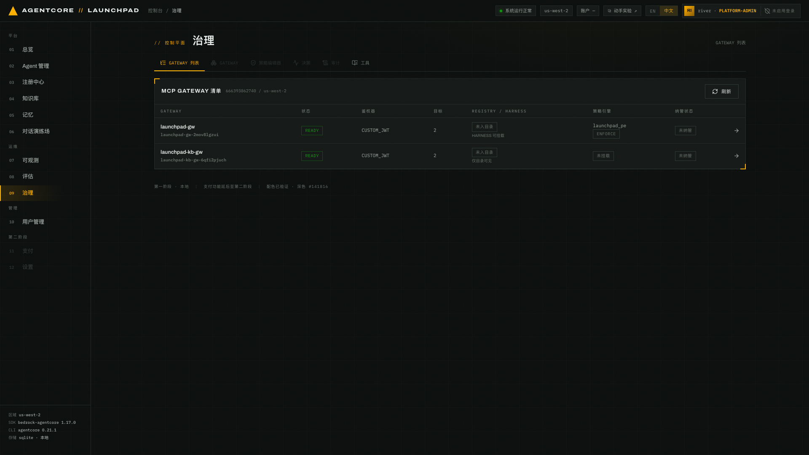
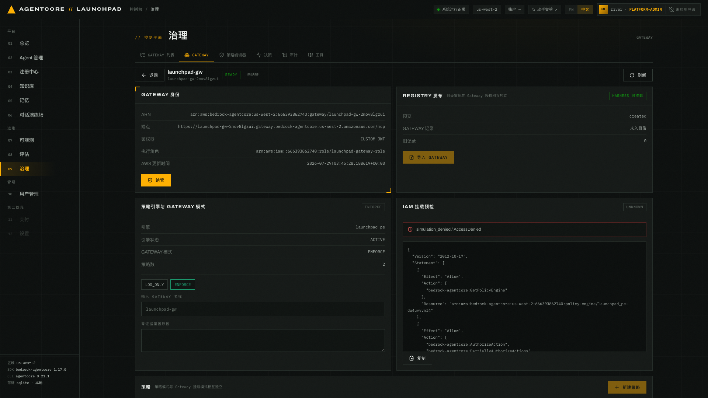
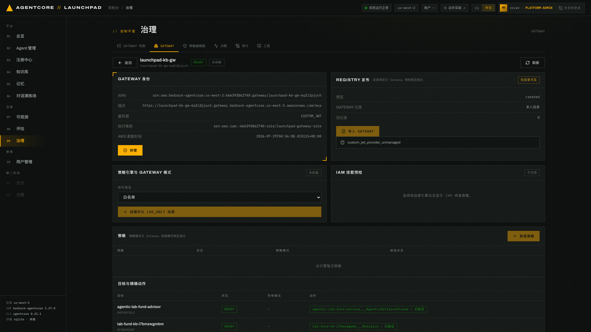
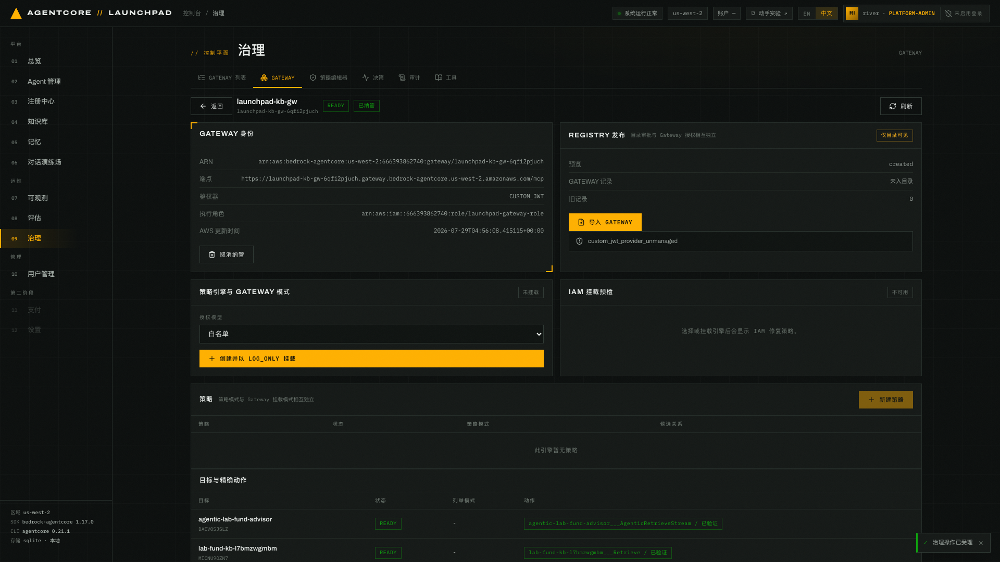
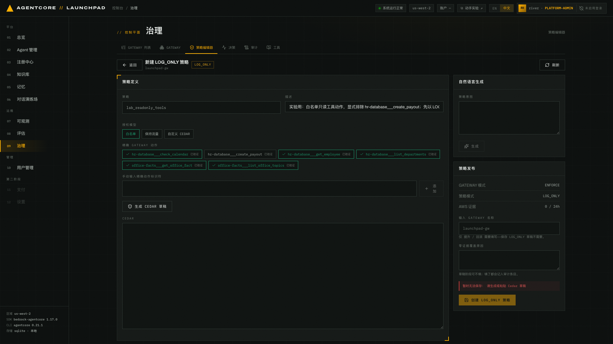
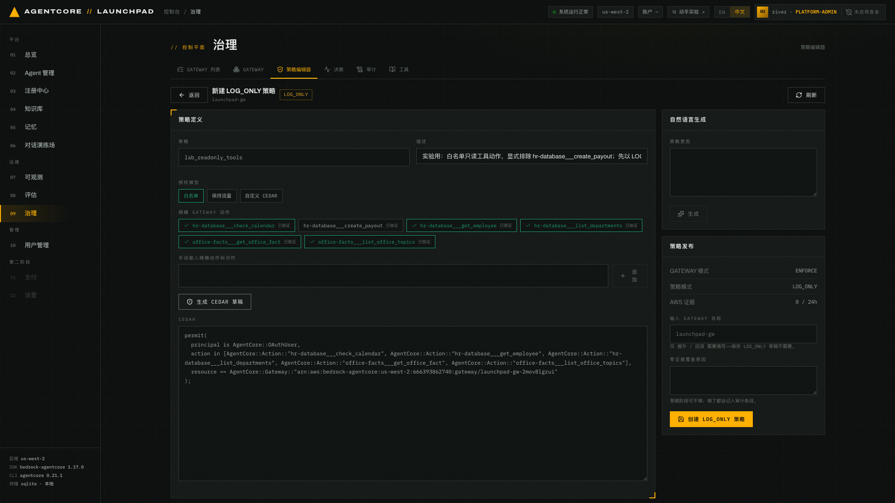
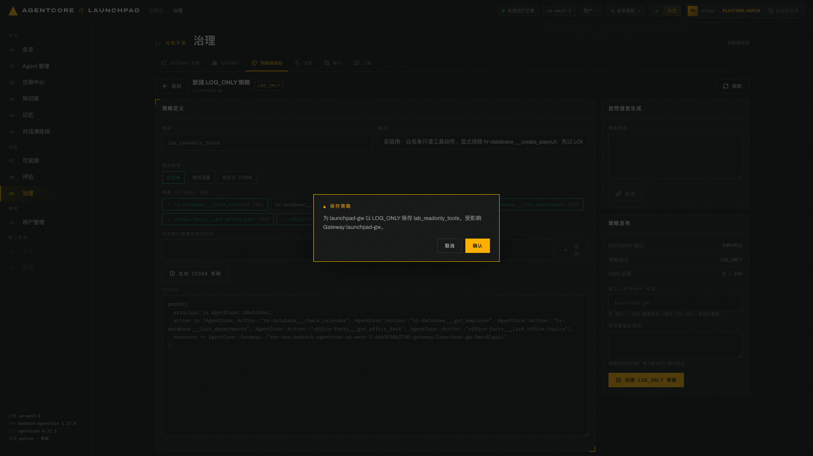
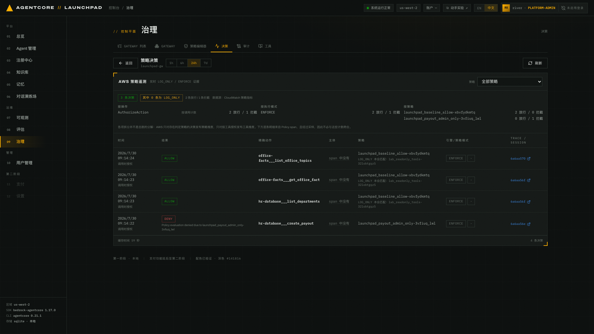
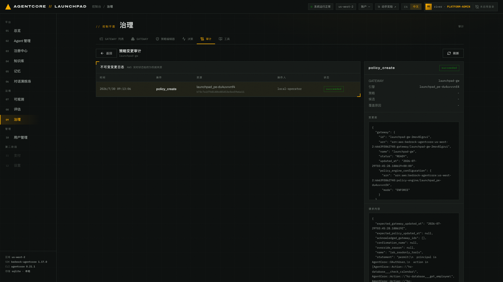

# 第 11 章 · 治理：Gateway 纳管、Cedar 策略与审计（可选）

> **本章可选**。内容是工具级授权治理，与第 02–10 章的 Agent 生命周期主线相互独立，
> 跳过后可直接进入[第 12 章](../12-wrapup-cleanup)。时间紧时建议单独另开一场来讲。
> 本章继续使用 bootstrap 提供的真实 `hr-database` 与 `office-facts` Gateway 工具，
> 不把它们改名为配额工具。
>
> **目标**：纳管一个 Gateway，创建 `LOG_ONLY` Cedar 策略，造出真实的 ALLOW / DENY 判定，
> 再从决策视图与审计日志里把证据读出来。
>
> **前置条件**：完成第 04 章（Registry 生命周期已经走过一遍）。账号里至少有一个 MCP Gateway。
>
> **预计耗时**：约 25 分钟（含决策证据的摄取等待）。
>
> **本章将创建的 AWS 资源**：1 条 Cedar 策略（`LOG_ONLY`，不影响现网放行）、
> `launchpad-kb-gw` 上的两个纳管标签（本章内加上再移除）、`launchpad-gw` 上的两个纳管标签
> （策略创建需要，留到第 12 章清理）。另外 11.6 会对 Gateway 发起几次真实工具调用，
> 产生 CloudWatch 策略指标与 Policy span（只读遥测，无需清理）。
>
> **注意**：本章操作的是共享资源（`launchpad-gw` 及其策略引擎）。请严格按步骤做：
> 新建策略一律先 `LOG_ONLY`，不要在实验环境里直接把某个 Gateway 切到 `ENFORCE`。

---

## 11.1 Gateway 清单：治理的入口

打开 `09 治理`。默认是 `GATEWAY 列表` 标签，直接从 AWS 读取账号里的 MCP Gateway。


*图 11-1：每行是一个真实 Gateway，列出状态、鉴权器、目标数、Registry/Harness 可用性、
策略引擎与模式、纳管状态。*

完成前序章节后，当前账号通常至少有下面两个 Launchpad 网关，两个都应显示为「未纳管」：

| Gateway | 目标 | Registry | 策略引擎 | 纳管状态 |
|---|---|---|---|---|
| `launchpad-gw` | 2 | 未入目录 / HARNESS 可挂载 | `launchpad_pe` · **ENFORCE** | 未纳管 |
| `launchpad-kb-gw` | 2 | 未入目录 / 仅目录可见 | 未挂载 | 未纳管 |

> `launchpad-kb-gw` 是第 04 章挂知识库时平台自动创建的连接器网关。它的目标对应每个 KB 的
> `Retrieve` 与每个 Agent 的 Agentic 检索，所以数量随你挂了多少 KB 变化。

> **清单不含实验专属网关**。第 09 章的 `launchpad-exp-gw` 和可选第 10 章的 `lp-canary-*` 由平台
> 自管，`list-gateways` 看得到但治理清单会过滤掉：治理面向你要纳管的资源，不是实验的中间产物。
>
> 自有账号里可能还有其它历史网关。本章只操作上面两行，其余不要动。

## 11.2 只读打开一个 Gateway

点任意一行进入详情。只是打开，不会写任何东西。


*图 11-2：`launchpad-gw` 详情。四块：Gateway 身份、Registry 发布、策略引擎与模式、
策略列表 + 目标与精确动作。*

详情里可以核对：

- **鉴权器 `CUSTOM_JWT`**，执行角色 `launchpad-gateway-role`
- **Registry 发布**：`GATEWAY 记录 未入目录`；`旧记录` 数量取决于当前账号是否已有
  `office-facts`、`hr-database` 等按目标记录，11.4 会解释它们和 Gateway 记录的关系
- **策略引擎**：`launchpad_pe` · 引擎状态 ACTIVE · Gateway 模式 ENFORCE · 策略数 2
  （`launchpad_baseline_allow`、`launchpad_payout_admin_only`）
- **IAM 挂载预检**：平台调用 `iam:SimulatePrincipalPolicy` 检查 Gateway 执行角色。
  `PASS` 表示权限齐全；`FAIL` 时按界面给出的内联策略 JSON 补齐 `GetPolicyEngine`、
  `AuthorizeAction`、`PartiallyAuthorizeActions`；若当前操作身份不能执行模拟，则显示
  `UNKNOWN · simulation_denied`

## 11.3 纳管：只加两个标签，不动任何资源

平台用两个 durable 标签标记纳管状态，除此之外不修改资源：

```text
agentcore-launchpad:managed    = true
agentcore-launchpad:managed-by = agentcore-launchpad
```

本节用 `launchpad-kb-gw` 验证这个来回：它是知识库连接器网关，本章其余步骤都不碰它，
纳管和取消纳管又只动标签，拿它做实验最安全。

1. 打开它的详情。


*图 11-3：未纳管状态。此时策略引擎显示 `未挂载`，并提供 `创建并以 LOG_ONLY 挂载` 按钮。
新建引擎、Gateway 挂载都从 LOG_ONLY 开始。*

2. 点 `纳管`，在确认弹窗里确认。
3. 到 AWS 侧核对（这一步就是本节的重点）：

```bash
# Gateway 详情页「身份」区可以直接复制 ARN，后缀是随机的
aws bedrock-agentcore-control list-tags-for-resource \
  --resource-arn "arn:aws:bedrock-agentcore:${AWS_REGION}:<ACCT>:gateway/launchpad-kb-gw-<后缀>" \
  --region "$AWS_REGION"
```

```json
{
    "tags": {
        "agentcore-launchpad:managed-by": "agentcore-launchpad",
        "agentcore-launchpad:managed": "true"
    }
}
```


*图 11-4：纳管后状态变为「已纳管」，按钮变成 `取消纳管`。*

4. 点 `取消纳管` 并确认，再查一次标签：

```json
{
    "tags": {}
}
```

取消纳管只移除这两个标签，不解绑也不删除 Gateway、引擎、策略或 Registry 记录。反过来，
Registry 导入和 Policy 变更都要求 Gateway 带着这两个标签，并校验最新 `updatedAt`，
以免误改未纳管资源。

### 再纳管 `launchpad-gw`：11.5 的前置条件

上面那条校验对 11.5 是硬性的：`launchpad-gw` 未纳管时它的 `新建策略` 是禁用的，策略编辑器
直接写「该 Gateway 未纳管，只读」。所以进 11.5 之前回到 `GATEWAY 列表` 打开 `launchpad-gw`，
点 `纳管` → 确认，状态变「已纳管」（同图 11-4）、`新建策略` 变为可点，**但这次不要取消**。

第 12 章清理时再取消纳管，只是移除两个标签，已创建的策略不受影响。

## 11.4 Registry 边界：一个 Gateway = 一条 MCP 记录

Gateway 详情的「REGISTRY 发布」区有 `预览` 与 `导入 GATEWAY`。点 `预览`，它是只读的，
返回这条 Gateway 将要写进 Registry 的记录草案：

```json
{"gateway_name": "launchpad-gw",
 "proposed": {"name": "launchpad-gw",
   "description": "AgentCore Gateway launchpad-gw · 2 target(s) · 6 MCP tool(s)",
   "descriptors": {"mcp": {
     "server": {"schemaVersion": "2025-07-09",
                "inlineContent": "{… \"remotes\": [{\"type\": \"streamable-http\", \"url\": \"https://…/mcp\"}]}"},
     "tools":  {"protocolVersion": "2025-06-18",
                "inlineContent": "{\"tools\": [{\"name\": \"hr-database___check_calendar\", …}]}"}}}}}
```

> 工具目录放在 `inlineContent` 里，是一段被转义的 JSON 字符串，不是嵌套对象，所以预览里
> 看到的是一长串带 `\"` 的文本。顺着读就能数出工具名，形如
> `hr-database___check_calendar`，即 `<target>___<tool>`。11.5 写策略时要用这个命名。

导入会生成一条包含 Gateway 端点和完整工具目录的 MCP 记录。

1. **Registry 审批 ≠ 授权**。审批只决定这条记录在目录里可见、可挂载；挂载一条 Gateway 记录
   等于把整个 Gateway 及其全部工具给了 Harness。按动作的授权只能靠 Cedar 策略。
2. 如果账号里已有旧的按目标记录（`office-facts` / `hr-database` 那种），导入 Gateway 记录后它们
   仍然存在，要显式点 `停用选中的旧记录` 才退休。`DEPRECATED` 是终态，停用不可回退。
   如果详情页显示 `旧记录 0`，`预览` 返回的 `legacy_records` 也会是空数组，无需执行退休操作。

> **注意**：本章只跑预览，不执行导入。Registry 记录一旦 `DEPRECATED` 不可恢复，而导入按钮的
> 行为与上面预览返回的 `proposed` 完全一致，读预览就够了。

## 11.5 Cedar 策略编辑器：创建一条 `LOG_ONLY` 策略

切到 `策略编辑器` 标签（也可以从 Gateway 详情点 `新建策略`）。**前提是 `launchpad-gw` 已按
11.3 末尾「再纳管 `launchpad-gw`」纳管过**，否则编辑器是只读的、发布按钮不可用。


*图 11-5：策略编辑器。三种授权模型（白名单 / 保持流量 / 自定义 CEDAR），下面是从 Gateway
实时发现的精确动作列表，每个都标 `已验证`。图中五个只读动作已勾选（打勾变绿），
`hr-database___create_payout` 保持未勾选。右侧是「自然语言生成」与「策略发布」区；此刻
CEDAR 还是空的，所以发布按钮上方写着 `暂时无法保存：请生成或粘贴 Cedar 草稿`。*

本次实验创建的策略：

| 字段 | 取值 |
|---|---|
| 策略 | `lab_readonly_tools` |
| 描述 | `实验用：白名单只读工具动作，显式排除 hr-database___create_payout；先以 LOG_ONLY 观察` |
| 授权模型 | `白名单` |
| 勾选的动作 | `hr-database___check_calendar`、`hr-database___get_employee`、`hr-database___list_departments`、`office-facts___get_office_fact`、`office-facts___list_office_topics` |
| 不勾选 | `hr-database___create_payout`（发放款项，敏感动作） |

点 `生成 CEDAR 草稿`，平台按勾选生成 Cedar：

```cedar
permit(
  principal is AgentCore::OAuthUser,
  action in [AgentCore::Action::"hr-database___check_calendar",
             AgentCore::Action::"hr-database___get_employee",
             AgentCore::Action::"hr-database___list_departments",
             AgentCore::Action::"office-facts___get_office_fact",
             AgentCore::Action::"office-facts___list_office_topics"],
  resource == AgentCore::Gateway::"arn:aws:bedrock-agentcore:<AWS_REGION>:<ACCT>:gateway/launchpad-gw-<后缀>"
);
```


*图 11-6：草稿生成后填入 `CEDAR` 框，发布按钮上的阻塞提示随之消失。再往下滚是「CEDAR 审核」区，
把 `AWS 实时版本` 与 `草稿` 并排对比（新策略时实时版本显示为空）。右上的「自然语言生成」
可以描述意图让模型直接生成 Cedar 草稿。*

「策略发布」区显示三个事实：`GATEWAY 模式 ENFORCE`、`策略模式 LOG_ONLY`、`AWS 证据 0 / 24h`。

下面两个输入框保存草稿时都不用填，界面上写着各自的适用范围：`输入 GATEWAY 名称` 是
*「仅 提升 / 回滚 需要填写」*，`零证据覆盖原因` 是*「草稿阶段可不填；填了都会记入审计条目。」*
两个框留空，直接点 `创建 LOG_ONLY 策略`，再在弹窗中确认。

> 真正的硬门禁在提升到 `ENFORCE` 那一步，不在保存草稿这一步。草稿还没生成时按钮上方会写明
> 原因，先点 `生成 CEDAR 草稿` 或自己粘一段 Cedar。


*图 11-7：发布前的确认。弹窗标题是「保存策略」，正文写明「为 launchpad-gw 以 LOG_ONLY 保存
`lab_readonly_tools`。受影响 Gateway：`launchpad-gw`」。*

创建结果包含两个不同维度的状态：

```json
{"id": "<POLICY_ID>",
 "name": "lab_readonly_tools",
 "status": "ACTIVE",              // 资源生命周期：策略资源本身可用
 "enforcement_mode": "LOG_ONLY",  // 执行模式：只记录，不拦截
 "candidate_of": null,            // 不是任何现有策略的候选
 "description": "实验用：白名单只读工具动作…"}
```

> 刚提交时 `status` 会短暂停在 `CREATING`，十几秒后转 `ACTIVE`。列表没刷出来就点一下 `刷新`。

> **`status` 与 `enforcement_mode` 不是一回事**：`status: ACTIVE` 只说明策略资源存在且可用，
> 决定会不会拦的是 `enforcement_mode`。同理 Gateway 也有自己的模式，本例 `launchpad-gw`
> 是 `ENFORCE`。策略模式与 Gateway 挂载模式相互独立。

### 生命周期与提升门禁

- 新引擎、新 Gateway 挂载、新策略一律从 `LOG_ONLY` 开始。
- 编辑一条已经 `ACTIVE`（执行中）的策略，不会就地改它，而是创建一个 `LOG_ONLY` 候选。
- 提升（promote）与回滚（rollback）走保守顺序：先让候选生效，再退役旧的。
- **把 Gateway 切到 `ENFORCE` 需要证据**：界面要求 24 小时内有 LOG_ONLY 决策证据。
  没有证据就得手输 Gateway 名称加填写零证据覆盖原因，才能强制通过。

## 11.6 决策证据：自己造一次 ALLOW 和 DENY

策略建好了，但账号里还没有任何工具调用，所以决策视图现在是空的。这一节先造几条真实判定，
再回去读证据。

### 用策略测试接口打一次真实调用

平台提供了一个专门用来验证授权的接口。它以指定身份对 Gateway 发起一次真实的 `tools/call`，
把 AgentCore 的判定结果记进决策台账。两个内置身份的权限不同：

| 身份 | 角色 | 对 `create_payout` 的预期 |
|---|---|---|
| `demo` | `demo@hr-analyst`（普通分析师） | 被 `launchpad_payout_admin_only` 拦下 |
| `river` | `river@platform-admin`（平台管理员） | 放行 |

在本地终端执行（`8000` 是后端端口，参数不必填全，我们要看的是授权结果而不是业务结果）：

```bash
curl -s -X POST http://127.0.0.1:8000/api/governance/policy-test \
  -H 'content-type: application/json' \
  -d '{"tool":"hr-database___create_payout","username":"demo"}' | python3 -m json.tool
```

命令应返回一条 `DENY`。记录自己响应中的 `decision_id` 和实际策略 ID：

```json
{
    "principal": "demo@hr-analyst",
    "tool": "hr-database___create_payout",
    "outcome": "DENY",
    "detail": "{'code': -32002, 'message': 'Tool Execution Denied: Tool call not allowed due to policy enforcement [Policy evaluation denied due to launchpad_payout_admin_only-<后缀>]'}",
    "decision_id": "<DECISION_ID>",
    "recorded": true
}
```

把 `"username"` 换成 `"river"`，同一个工具就放行了：

```json
{
    "principal": "river@platform-admin",
    "tool": "hr-database___create_payout",
    "outcome": "ALLOW",
    "detail": "{'content': [{'type': 'text', 'text': \"ValidationException - Parameter validation failed: Invalid request parameters:\\n- Missing required field(s): 'amount'\\n- Missing required field(s): 'employee_id'\"}], 'isError': True}",
    "decision_id": "<DECISION_ID>",
    "recorded": true
}
```

**同一个工具、同一个 Gateway，换个身份结果就不同。** 这是 Cedar 按动作授权的意义所在，
Registry 审批做不到这件事。

三点要留意：

- **`ALLOW` 说的是授权通过，不是调用成功**。上面这条 river 的返回里工具自己报了
  `ValidationException`，因为我们没传 `amount` / `employee_id`，但授权环节确实放行了。
  授权与业务成败是两层。
- **只有 `ALLOW` 和 `DENY` 会入账**。凭证错误、Gateway 连不上之类的失败返回 `ERROR`，
  `recorded` 为 `false`。错误不是判定，不该被当成一次 Cedar 拦截来统计。
- 想多凑几条证据，就换几个只读工具各打一次，比如 `hr-database___list_departments`、
  `office-facts___get_office_fact`。

### 回到决策视图读证据

切到 `决策` 标签（要先在 `GATEWAY 列表` 里选中一个 Gateway，否则页面提示「请先选择一个
Gateway」）。证据有摄取延迟：CloudWatch 策略指标约 2–5 分钟，逐条明细走 Policy span，更慢些。
等不到就点 `刷新`。


*图 11-8：决策视图。上半是 CloudWatch 策略指标的汇总与三种拆分，下半是来自 Policy span 的逐条
明细。可按时间范围（1h/6h/24h/7d）与具体策略过滤，策略下拉里会出现你刚创建的
`lab_readonly_tools`。*

汇总区的数据源是 CloudWatch 策略指标。读取并记录自己页面中的总数和各分组计数：

```text
<TOTAL> 条决策 · 其中 <LOG_ONLY_COUNT> 条为 LOG_ONLY · <ALLOW_COUNT> 条放行 / <DENY_COUNT> 条拦截

按操作     AuthorizeAction        按调用计数     <ALLOW_COUNT> 放行 / <DENY_COUNT> 拦截
按执行模式  ENFORCE                              <ALLOW_COUNT> 放行 / <DENY_COUNT> 拦截
按策略     launchpad_baseline_allow-…            <ALLOW_COUNT> 放行 / 0 拦截
           launchpad_payout_admin_only-…         0 放行 / <DENY_COUNT> 拦截
```

逐条明细的数据源是 Policy span。时间、策略 ID 和行数以自己的页面为准：

```text
<TIME>  ALLOW  <READ_ONLY_TOOL>                    launchpad_baseline_allow-…  ENFORCE
        LOG_ONLY 本会匹配：<POLICY_ID>
<TIME>  DENY   hr-database___create_payout         launchpad_payout_admin_only-…  ENFORCE
        Policy evaluation denied due to launchpad_payout_admin_only-<后缀>
```

这些字段把本章要观察的行为串起来了：

1. **拦截带着理由**。DENY 那行直接写出是哪条策略拦的，可以照着策略名反查 Cedar 语句。
2. **`LOG_ONLY 本会匹配` 就是影子模式的价值**。ALLOW 行真正生效的是
   `launchpad_baseline_allow`，而界面同时告诉你，`lab_readonly_tools` 若已在执行也会匹配这类
   调用，不影响现网就能先看清它将会怎么判。DENY 行没有这个标注，因为 `create_payout`
   不在白名单里，`lab_readonly_tools` 根本不匹配它。
3. **主体列显示 `span 中没有`**。判定主体不在 Policy span 的字段里，平台如实说没有，不去猜。
   想知道是谁调的，用 `policy-test` 返回里的 `principal`，或顺着 `TRACE` 列的 trace id
   去第 07 章的追踪视图看。

> 页面中的「其中 … 条为 LOG_ONLY」指由 LOG_ONLY 策略做出的判定数。本节调用在 `ENFORCE` 模式的
> Gateway 上由 `ACTIVE` 策略判定，`lab_readonly_tools` 只显示「本会匹配」，并未参与实际判定。
> 因此 LOG_ONLY 计数和 11.5 的 `AWS 证据 … / 24h` 不一定增加；提升门禁读取的是真正的
> LOG_ONLY 决策证据。

## 11.7 审计：不可变变更日志

切到 `审计` 标签。


*图 11-9：策略变更审计。左侧列表每次变更一行（时间 / 操作 / 资源 / 操作人 / 状态），
点开后右侧是这次变更的完整快照：头部的 GATEWAY、引擎、策略、候选、覆盖原因，
再往下是 `变更前`、`请求内容` 与 `AWS 结果` 三段完整 JSON。*

找到本章创建策略留下的记录，并核对时间、引擎 ID、操作人和状态：

```
<TIME> | policy_create | <POLICY_ENGINE_ID> | <OPERATOR> | succeeded
```

展开后有四块：`变更前` 的完整 Gateway + 引擎快照（含
`policy_engine_configuration.mode: ENFORCE`）、`请求内容`、`AWS 结果`，以及回滚所需的输入。
**AWS 实时状态始终是权威来源，审计只是本地的变更史。**

`请求内容` 里能看到这次保存的完整意图，包括乐观锁与那两个门禁字段的实际取值：

```json
{"expected_gateway_updated_at": "<GATEWAY_UPDATED_AT>",
 "confirmation_name": null,
 "override_reason": null,
 "name": "lab_readonly_tools",
 "statement": "permit(\n  principal is AgentCore::OAuthUser,\n  action in [...]);",
 "authorization_model": "allowlist",
 "high_risk_acknowledged": false}
```

> `覆盖原因` 一栏显示 `-`，是因为 11.5 保存草稿时我们没填它（`override_reason: null`）。
> 按编辑器上的说明，填了就会记进这条审计条目。要让别人日后看懂一条 LOG_ONLY 策略为什么存在，
> 策略自身的 `描述` 加上这里的覆盖原因就是唯一线索，都值得写清楚。
>
> `expected_gateway_updated_at` 是乐观锁：平台拿它跟 AWS 侧最新的 `updatedAt` 比对，
> 不一致就拒绝写入，避免覆盖别人的改动。这也是 FAQ 里那条 `updatedAt` 冲突的来源。

---

## 本章验证清单

- [ ] Gateway 清单列出 `launchpad-gw` 与 `launchpad-kb-gw`，含各自的策略引擎/模式
- [ ] `launchpad-kb-gw` 纳管后，AWS 侧只多了 `agentcore-launchpad:managed` 与 `managed-by` 两个标签
- [ ] 取消纳管后标签为空（`{"tags": {}}`），且 Gateway 本身未被改动
- [ ] `launchpad-gw` 已纳管，`新建策略` 按钮可点
- [ ] `lab_readonly_tools` 策略创建成功，`enforcement_mode = LOG_ONLY`、`status = ACTIVE`
- [ ] 生成的 Cedar 语句里没有 `create_payout`
- [ ] `policy-test` 以 `demo` 调 `create_payout` 得到 `DENY`，理由里带
      `launchpad_payout_admin_only`
- [ ] 同一个工具换成 `river` 得到 `ALLOW`
- [ ] 决策视图能看到这几条判定：汇总有放行/拦截计数，明细能看到 DENY 的理由
- [ ] 明细里的 ALLOW 行标注了 `LOG_ONLY 本会匹配：lab_readonly_tools-…`
- [ ] 审计里有一条 `policy_create · succeeded`，且含变更前快照与请求内容

## 常见问题

| 现象 | 原因 | 处理 |
|---|---|---|
| `创建 LOG_ONLY 策略` 不可点 | 还没有 Cedar 草稿 | 按钮上方会写明原因（`请生成或粘贴 Cedar 草稿`），先点 `生成 CEDAR 草稿`。保存草稿不需要填 Gateway 名称与覆盖原因 |
| `新建策略` 是灰的 / 编辑器提示「未纳管，只读」 | `launchpad-gw` 没有 launchpad 标签 | 按 11.3 末尾「再纳管 `launchpad-gw`」先纳管它 |
| `TestGateway0c909b00` 之类的网关找不到 | 那是截图中其它账号的资源 | 只操作当前账号中第 11.1 节列出的 Launchpad 网关 |
| 清单里看不到实验/金丝雀网关 | 治理清单会过滤平台自管的 `launchpad-exp-gw` / `lp-canary-*` | 属预期；用 `aws bedrock-agentcore-control list-gateways` 看全量 |
| 报 `updatedAt` 相关冲突 | 平台要求变更前 Gateway 状态新鲜 | 点 `刷新` 后重试 |
| 决策一直是 0 条 | 账号里还没有任何 Gateway 工具调用 | 按 11.6 用 `policy-test` 打几次；证据有摄取延迟（指标 2–5 分钟，明细更慢），再点 `刷新` |
| 汇总说 3 条、明细却有 4 行 | 两个数据源不同：汇总来自 CloudWatch 策略指标，明细是采样的 Policy span | 属预期，界面上也写了；对账看汇总，看单次细节看明细 |
| `policy-test` 返回 `ERROR`、`recorded: false` | 评估根本没发生（凭证问题、Gateway 不可达等） | 错误不是判定，所以不入账；先确认 Gateway 是 `READY`，再重试 |
| 明细里「主体」显示 `span 中没有` | Policy span 不带判定主体字段 | 属预期，平台不猜；要看是谁调的，用 `policy-test` 返回的 `principal` 或顺 trace id 去第 07 章 |
| 切 ENFORCE 被阻止 | 24h 内没有 LOG_ONLY 证据 | 补证据，或手输 Gateway 名 + 覆盖原因（谨慎） |
| IAM 挂载预检显示 `UNKNOWN / simulation_denied` | 当前操作身份无 `iam:SimulatePrincipalPolicy` | 可为操作身份补权限后重试；该状态不等于 Gateway 执行角色缺权限 |
| IAM 挂载预检 FAIL | Gateway 执行角色缺少策略引擎权限 | 照界面给出的内联策略 JSON 修 |

---

上一章：[第 10 章 · Runtime 金丝雀（可选）](../10-canary) ｜
下一章：[第 12 章 · 收尾与资源清理](../12-wrapup-cleanup)
