# 第 04 章 · 挂载能力：Registry 资产与托管知识库

> **目标**：把 Amazon Q2 2026 财报 PDF 建成托管知识库，注册并批准一份 Registry 技能，
> 再将两者挂到 `lab-earnings-advisor`。
>
> **前置条件**：完成[第 03 章](../03-deploy-harness)，`lab-earnings-advisor` 状态为 `运行中`。
> 下载并准备好[财报新闻稿 PDF](../static/assets/AMZN-Q2-2026-Earnings-Release.pdf)。第 08 章的
> 评估真值也来自这份文档。
>
> **预计耗时**：约 15 分钟。KB 创建和 ingestion 耗时会随服务状态变化。
>
> **本章将创建的 AWS 资源**：1 个 Bedrock 托管知识库（含向量库）、
> 1 个 S3 数据源 + 上传的 PDF 文档、1 条 AgentCore Registry AGENT_SKILLS 记录、
> `launchpad-kb-gw` 上的 KB 连接器 target。

---

## 4.1 创建托管知识库并摄取财报 PDF

1. 打开 `04 知识库`。页面列出账号里已有的托管 KB 及其状态、数据源数、被几个 Agent 挂载。

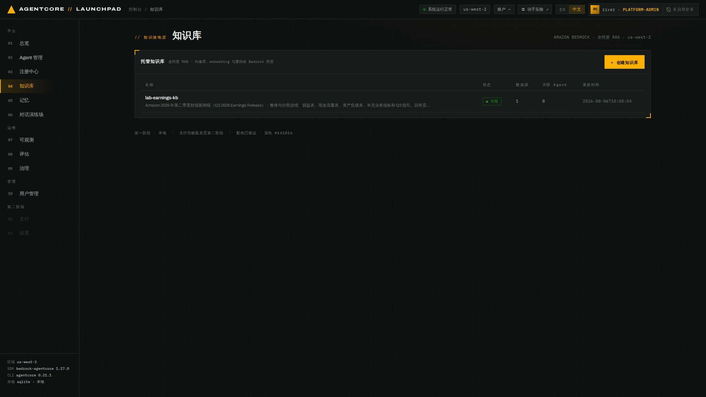
*图 4-1：托管知识库列表。图是本章建好之后的样子，刚进来时是空列表加一段说明。*

2. 点击 `+ 创建知识库`，填写：

   | 字段 | 取值 |
   |---|---|
   | 名称 | `lab-earnings-kb` |
   | 描述 | `Amazon 2026 年第二季度财报新闻稿（Q2 2026 Earnings Release）：整体与分部业绩、损益表、现金流量表、资产负债表、补充业务指标和 Q3 指引。回答亚马逊季度收入、利润、现金流、分部业绩或指引问题时查询。` |
   | 数据源 | `上传文件` |
   | 文件 | `AMZN-Q2-2026-Earnings-Release.pdf` |

   > 描述最多 200 个字符，并会拼进 Agent 的系统提示词，影响 Agent 何时查询这个知识库。
   > 写清楚资料范围和适用问题。

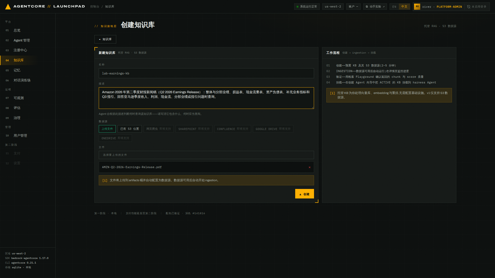
*图 4-2：创建表单。右侧「工作流程」说明四步：创建 → ingestion → Playground 验证 → 挂载。*

3. 点击 `▲ 创建`。

**预期结果**：KB 进入 `CREATING`，几分钟后变 `ACTIVE`。文件被上传到制品桶
`s3://launchpad-artifacts-<ACCT>-<AWS_REGION>/kb/<KB_ID>/`，数据源可用后自动触发 ingestion。

> **记录**：`<KB_ID>` 在 KB 详情页「概览」区的 `KB ID` 字段。

## 4.2 确认 ingestion 与文档索引状态

点击列表行打开 KB 详情页，页面分四块：概览、关联 Agent、数据源（含 ingestion 任务统计）、
检索 Playground。

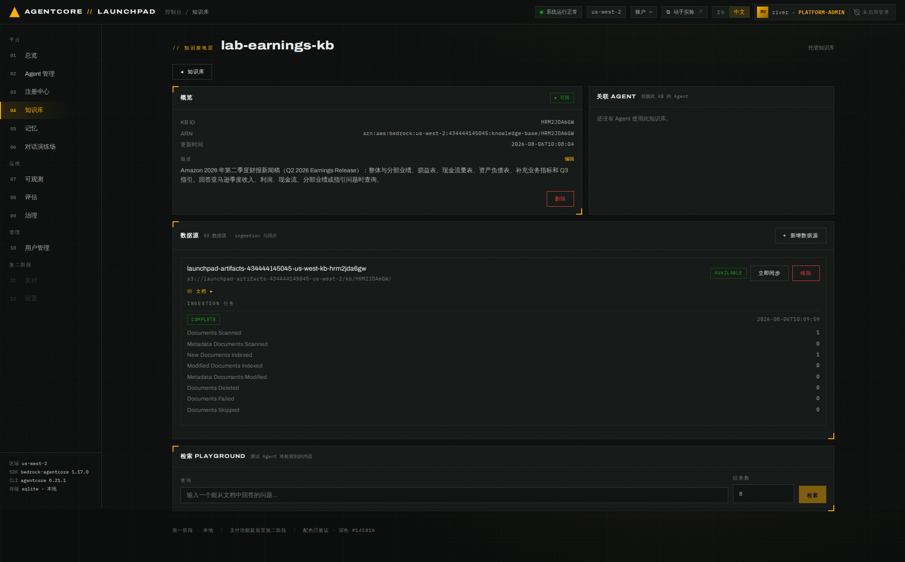
*图 4-3：KB 详情示例。ingestion 完成后列出扫描、新增索引和失败文档数。*

点击数据源行的 `▤ 文档 ▸` 展开逐文档的索引状态，这一层能区分「文档没上传」和
「上传了但没索引成功」：

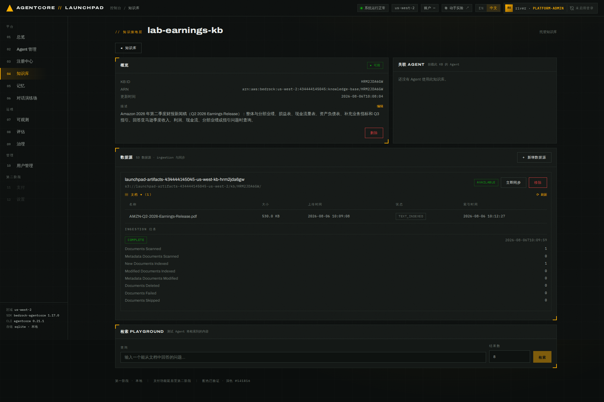
*图 4-4：逐文档视图列出文件名、大小、上传时间、索引状态和完成时间。*

> KB 创建与 ingestion 都是异步的。不要在 `CREATING` 状态挂载，挂载列表只显示 `ACTIVE`
> 的 KB。数据源也由后端异步创建，KB 已 `ACTIVE` 却没有数据源时，点击详情页的
> `补建数据源`，该操作可安全重试。

## 4.3 用检索 Playground 验证质量（挂载前必做）

在详情页底部「检索 PLAYGROUND」输入一个答案确定在财报里的问题，例如：

```
亚马逊 2026 年第二季度 AWS 分部的净销售额是多少？同比增长多少？经营利润呢？
```

点击 `检索`。

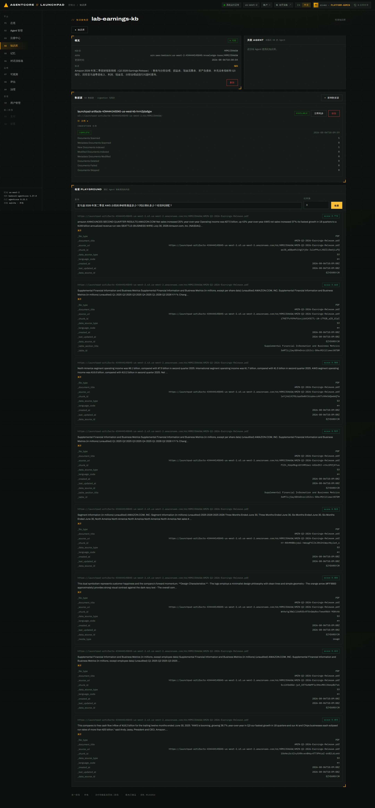
*图 4-5：检索结果。每个 chunk 带 `score` 与来源元数据（`_document_title`、`_chunk_id`、
`_source_uri` 等）。*

排名靠前的 chunk 应包含以下事实（PDF 原文是英文）：

```
Net sales increased 20% year-over-year
Operating income was $27.5 billion, up 43% year-over-year
AWS net sales increased 37%—its fastest growth in 18 quarters—to a $169 billion
annualized revenue run rate
```

**预期结果**：结果包含 AWS 分部的增速与整体业绩事实。中文提问可以跨语言检索到英文原文；
定向追问时使用财报中的英文指标名（如 `Free cash flow`、`Operating income`）能进一步缩小
范围。检索结果无关时，先检查上传文件和知识库描述，不要继续挂载。

## 4.4 注册一份技能到 AgentCore Registry

Registry 编目 A2A Agent、MCP 工具和 AGENT_SKILLS 技能。只有 `APPROVED` 记录能挂到 Agent 上。

1. 打开 `03 注册中心`。顶部三个计数按钮既是统计也是类型筛选器：
   `AGENT · A2A`、`MCP 工具`、`技能`。

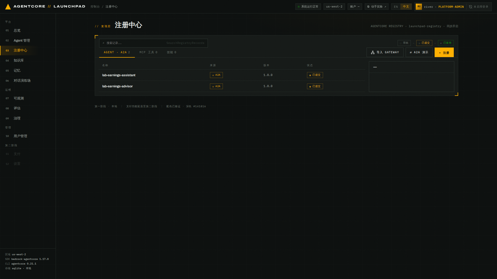
*图 4-6：注册中心。左上角图例 `○ 草稿 → ◍ 已提交 → ● 已发布` 是记录状态机。
第 02/03 章部署的两个 Agent 已自动登记为 A2A 记录。*

> 部署日志里写 `auto-submitted`，但 A2A 记录在列表里可能显示 `○ 草稿`。A2A 记录的审批
> 状态不影响后续章节，需要挂载的只有 4.5 节那条技能记录。

2. 点击 `+ 注册`，记录类型选 `AGENT_SKILLS · 技能`，来源选 `粘贴 SKILL.MD`，填写：

   - 名称：`lab-earnings-answering`
   - 描述：`亚马逊财报回答规范：要求说明指标、数值与单位、数据口径、同比基期、经营性与非经营性归因及来源边界。`
   - SKILL.MD 内容：

```markdown
---
name: earnings-answering
description: 规范亚马逊财报问答。当问题涉及收入、利润、现金流、分部业绩、业务指标或业绩指引时使用。
---

# 财报回答技能

回答财报问题时，按以下规则输出：

1. 明确写出指标名称、准确数值和单位。美元金额注明 billion/million 原文口径，并换算为亿美元。
2. 说明数据口径：单季（Q2 2026）、上半年、还是过去十二个月（TTM），不要混用。
3. 给出同比变化时注明比较基期；报告值与剔除汇率影响（ex-FX）口径不同时分别说明。
4. 区分经营性与非经营性损益。净利润中包含大额投资收益等一次性项目时必须明确指出。
5. 只使用挂载财报资料中的事实。资料没有覆盖时，明确说明「资料中未提供」，不要推测。
6. 引用业绩指引等前瞻性内容时，注明这是公司前瞻性陈述，实际结果可能存在重大差异。
```

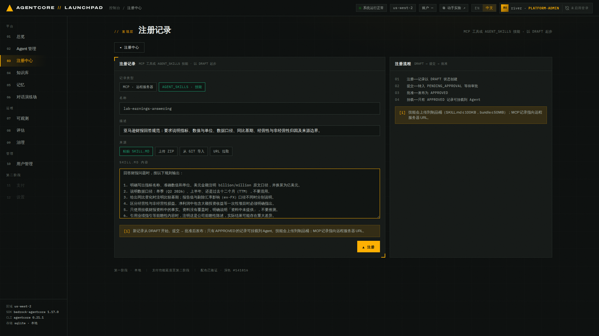
*图 4-7：登记表单。技能除了粘贴 SKILL.md，还支持上传 ZIP、从 git 导入和 URL 拉取。*

3. 点击 `▲ 注册`。

**预期结果**：记录以 `DRAFT` 创建，SKILL.md 被上传到
`s3://launchpad-artifacts-<ACCT>-<AWS_REGION>/skills/lab-earnings-answering/`。
在列表里点开这条记录，右侧详情面板给出「记录 ID」、版本 `1.0.0` 和状态 `○ 草稿`。
记录当前页面的记录 ID，第 12 章清理时会用到。

## 4.5 走完审批：提交 → 批准

1. 点击顶部 `技能` 按钮筛选，在列表里点开 `lab-earnings-answering`。

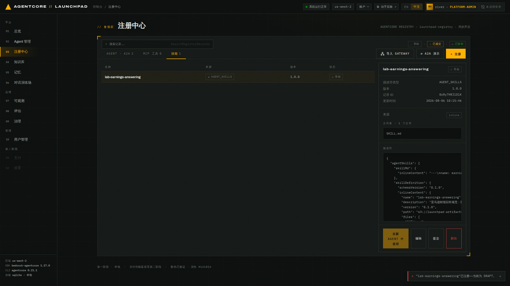
*图 4-7b：`技能` 筛选后只显示 AGENT_SKILLS 记录。*

2. 点击 `提交`，状态变 `PENDING_APPROVAL`，按钮换成 `批准 · 发布` 与 `驳回`。

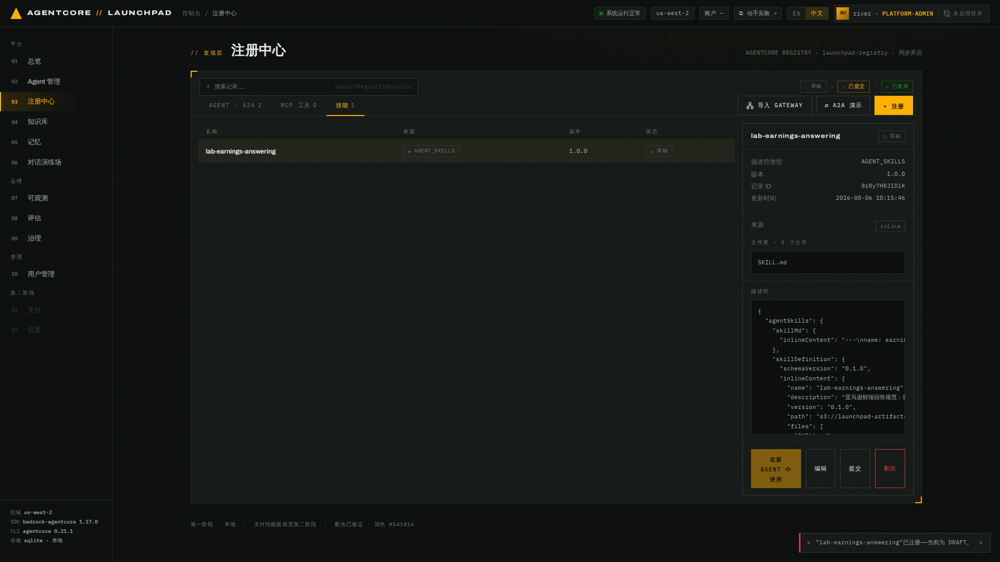
*图 4-8：记录详情。粘贴的 SKILL.md 被原样存进 Registry 记录，并生成 `skillDefinition`
（含 S3 路径与文件清单）。*


*图 4-9：`已提交` 状态下出现 `批准 · 发布` / `驳回` 两个审批动作。*

3. 点击 `批准 · 发布`。

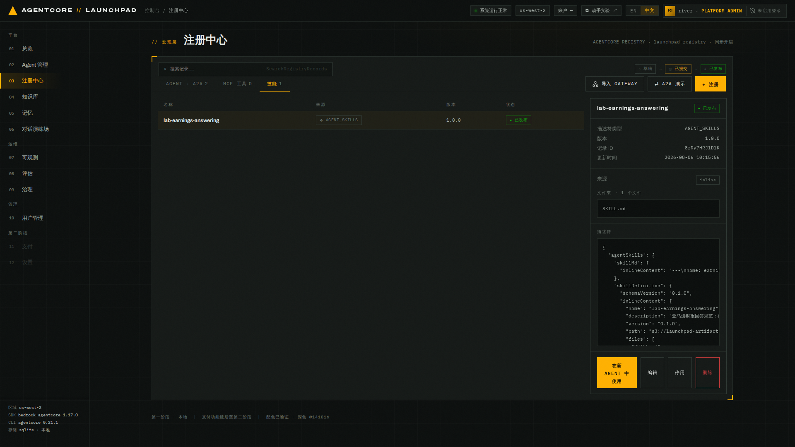
*图 4-10：记录状态变为 `● 已发布`（APPROVED），从这一刻起才会出现在创建/编辑 Agent 的
技能选择列表里。*

> **注意**：`DEPRECATED` 是终态，停用后不能再改回来。更新一条记录
> （`UpdateRegistryRecord`）会把状态重置回 DRAFT，需要重新走审批。

## 4.6 把知识库 + 技能挂到 Harness 并重新发布

1. 打开 `02 Agent 管理`，在「现有 AGENT」表里找到 `lab-earnings-advisor`，点击 **编辑**。
2. 勾选刚批准的技能 `lab-earnings-answering · skill` 与知识库 `lab-earnings-kb · kb`。

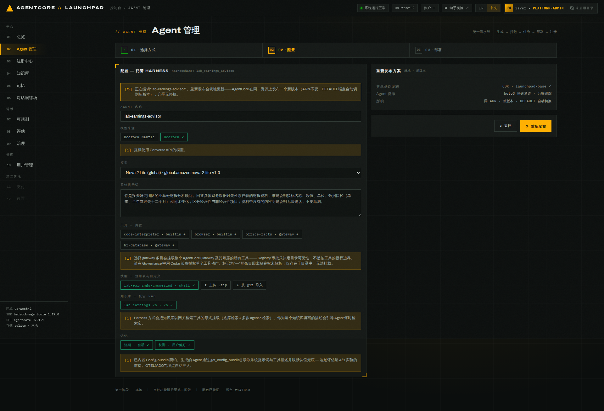
*图 4-11：两个 chip 变成绿色 ✓ 即为已选。右侧「重新发布方案」说明影响：同 ARN、新版本、
DEFAULT 端点自动切换，几乎无停机。*

3. 点击 `⟳ 重新发布`，在确认弹窗里再次确认。

**预期结果**：流水线再跑一遍（Harness 依旧跳过打包），`供给` 阶段多出 KB 网关工作，
`部署` 阶段变成 `UpdateHarness`。以下日志仅示意关键字段，核对自己输出中的状态、版本和 ID：

```json
{"stage":"provision","msg":"reusing existing execution role launchpad-agent-lab-earnings-advisor-<HASH>"}
{"stage":"provision","msg":"kb gateway ready · 1 knowledge base(s) mounted"}
{"stage":"provision","msg":"iam role · launchpad-agent-lab-earnings-advisor-<HASH> · kb targets ready (1)"}
{"stage":"deploy","msg":"UpdateHarness accepted · harnessId <HARNESS_ID> · new version 2"}
{"stage":"deploy","msg":"harness READY · …"}
{"stage":"register","msg":"a2a record refreshed · <A2A_RECORD_ID> · DRAFT"}
```

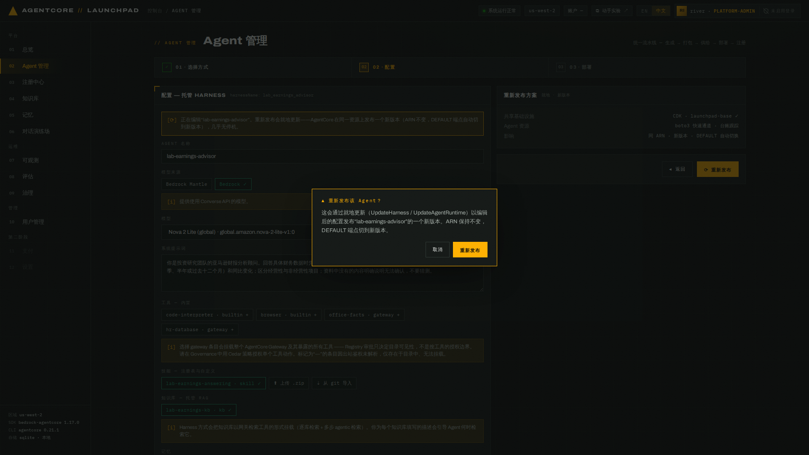
*图 4-12：重新发布前的二次确认。*

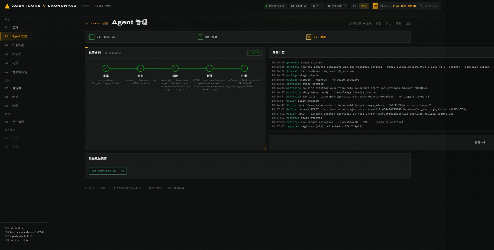
*图 4-13：重新发布完成示例。核对自己的 Harness 版本和状态。*

复核挂载结果，两处都在页面上：

- `02 Agent 管理` 的「现有 AGENT」里，`lab-earnings-advisor` 版本高于重新发布前、状态为
  `运行中`。
- `04 知识库` 里 `lab-earnings-kb` 的「关联 AGENT」区列出 `lab-earnings-advisor`；
  技能挂载结果在该 Agent 的「编辑」表单里看勾选状态。

> Harness 通过专用网关 `launchpad-kb-gw` 调用逐库检索和跨库多步检索。
> `lab-earnings-assistant` 保持不挂知识库，继续作为后续章节的基线。
> 重新发布会刷新 A2A 记录并把状态重置为 `DRAFT`（4.5 的 `UpdateRegistryRecord` 规则），
> 本实验不需要重新审批。

---

## 本章验证清单

- [ ] `lab-earnings-kb` 状态 `ACTIVE`，ingestion `COMPLETE`，文档级状态为 `INDEXED`
- [ ] 检索 Playground 能返回带 score 与来源元数据的相关 chunk（含 AWS 分部业绩）
- [ ] `lab-earnings-answering` 记录状态为 `APPROVED`
- [ ] `lab-earnings-advisor` 重新发布成功，版本高于之前，KB 详情页「关联 AGENT」列出该 Agent

## 常见问题

| 现象 | 原因 | 处理 |
|---|---|---|
| 创建 Agent 时看不到刚建的 KB | KB 还是 `CREATING`，或 ingestion 未完成 | 等到 `ACTIVE` 再刷新页面 |
| 创建 KB 返回 `HTTP 500` | 描述超过 Bedrock 的 200 字符上限 | 使用表格中的短描述后重试 |
| KB 已 `ACTIVE` 但数据源为 0 | 补齐数据源的后台任务没跑成 | 详情页橙色告警里点击 `补建数据源`，补建后 ingestion 自动开始 |
| 中文提问检索不到相关 chunk | 财报原文是英文，个别问法跨语言召回弱 | 在问题里带上英文指标名（如 `Free cash flow`）重试 |
| 技能不出现在挂载列表 | 状态还是 `DRAFT` / `PENDING_APPROVAL` | 必须先 `批准 · 发布` |
| 重新发布后旧对话还是旧行为 | AgentCore 把已有会话钉在首次服务它的版本上 | 开一个新会话验证（第 05 章会用到） |

---

上一章：[第 03 章 · 部署托管 Harness](../03-deploy-harness) ｜
下一章：[第 05 章 · 对话测试与记忆](../05-chat-memory)
