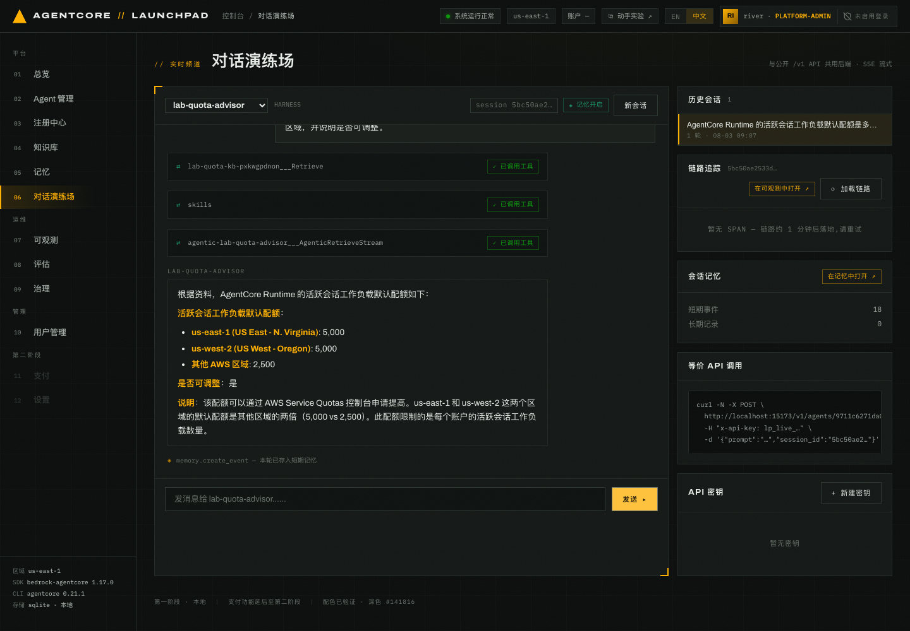
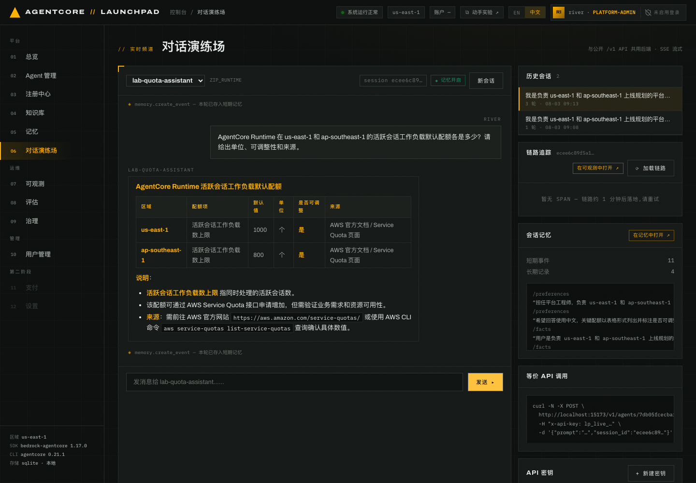
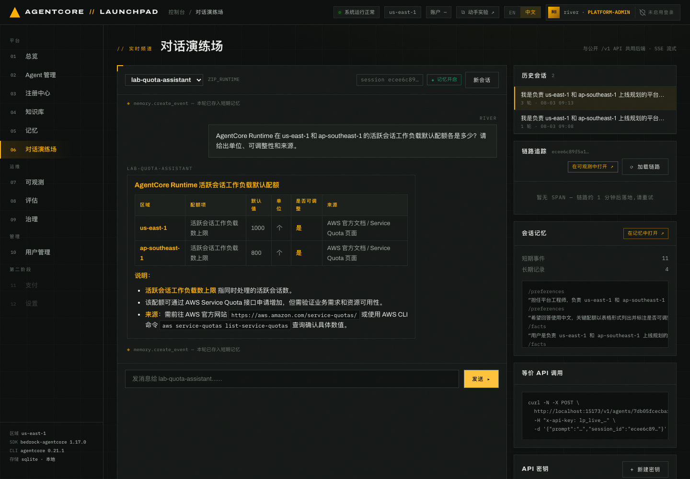
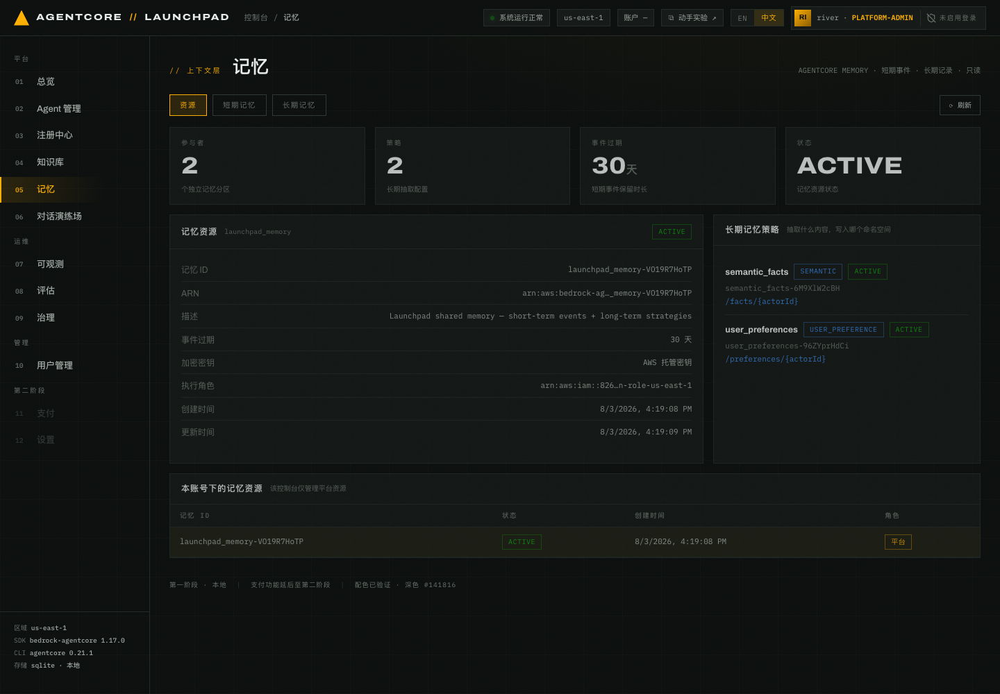
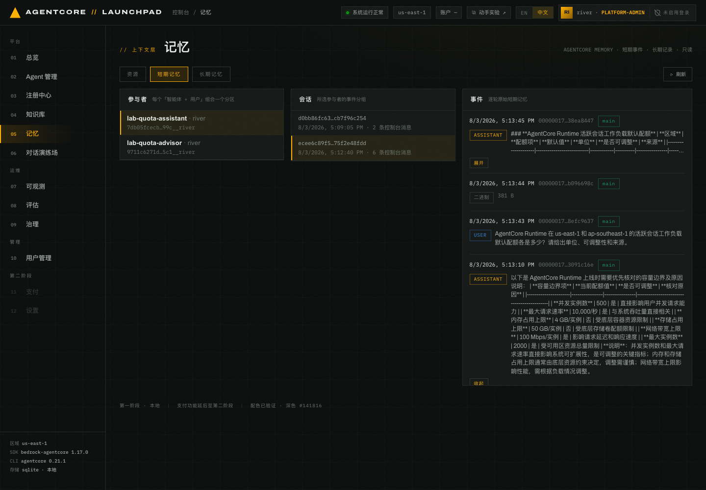
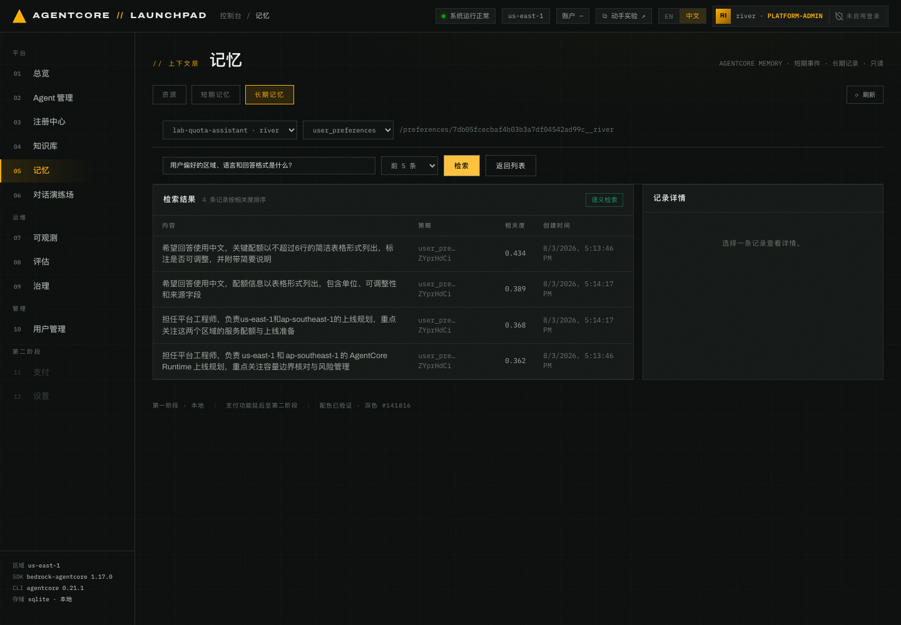

# 第 05 章 · 对话测试与记忆（Chat Playground + Memory 控制台）

> **目标**：比较有无知识库时的财报回答，确认技能生效，并查看短期事件、长期记录及其分区。
>
> **前置条件**：完成[第 04 章](../04-capabilities)。`lab-earnings-advisor` 已挂载 KB 和技能，
> 状态为 `运行中`。
>
> **预计耗时**：约 15 分钟。
>
> **本章将创建的 AWS 资源**：AgentCore Memory 中的短期事件与长期记录（写入共享
> `launchpad_memory`，按 Agent 分区）；不创建新的计算资源。

本章的两名 Agent 使用同一个模型（Nova 2 Lite），但创建方式和系统提示词不同，所以这里是
行为对照，不是只改变知识库的严格实验；重点是核对回答有没有资料依据。要记住那个结构性
事实：**这份财报发布于 2026 年 7 月 30 日，晚于模型训练截止时间**——无知识库的 Agent
给出的任何具体数字都不可能来自财报本身。

---

## 5.1 与「有知识库」的 Agent 对话

1. 打开 `06 对话演练场`，在顶部下拉里选 `lab-earnings-advisor`。
2. 提一个答案确定在财报里的问题：

```
亚马逊 2026 年第二季度的总净销售额和 AWS 分部收入分别是多少？同比增速如何？
```


*图 5-1：advisor 调用单知识库检索、技能与 agentic 检索后，按财报返回数值、口径与同比。*

检查自己页面中的工具轨迹和回答。回答应说明总净销售额 **2,006 亿美元（$200.6 billion）**、
同比增长 **20%**；AWS 分部收入 **422 亿美元（$42.2 billion）**、同比增长 **37%**（18 个
季度以来最快）。工具轨迹应出现 `agentic-lab-earnings-advisor___AgenticRetrieveStream`
或知识库的单库 `Retrieve`，并调用 `skills` 加载回答规范。

3. 继续用资料中的字段名做定向追问：

```
请检索 Free cash flow，说明过去十二个月的自由现金流是多少、方向如何、变化的主要原因是什么。
```

再次检查工具轨迹、数字和资料依据。正确事实是：TTM 自由现金流为**净流出 76 亿美元**
（上年同期为净流入 182 亿美元），转负的主要原因是物业与设备购置同比增加 **661 亿美元**，
主要反映对人工智能的投资。工具选择和措辞可能不同；如果开放问题漏掉某项，可用资料中的
英文指标名缩小检索范围。注意回答是否按技能要求注明了 **TTM 口径**和**方向（净流出）**
——把负值说成正值是财报问答里最危险的错误之一。

## 5.2 对照实验：与「无知识库」的 Agent 对话

切换到 `lab-earnings-assistant`，也就是第 02 章创建的 ZIP Runtime，没有挂知识库。

1. 第一轮先声明一个偏好：

```
我是覆盖亚马逊的行业分析师，主要关注 AWS 和广告业务。之后请用中文回答，关键指标用表格列出，并单独标注数据口径（单季、半年或 TTM）。本轮只回复“收到”。
```

2. 第二轮考它业务问题：

```
我们准备写亚马逊 2026 年 Q2 的财报点评。请用不超过 6 行的表格列出需要优先核对的关键指标，并简要说明原因。
```


*图 5-2：assistant 对话界面示例。检查它是否保留分析师的语言、表格和口径标注偏好，以及回答
是否给出可核查来源。截图中的回答只用于说明界面，数值仍要与财报核对。*

3. 第三轮追问同一个可核对的问题：

```
亚马逊 2026 年 Q2 的总净销售额和 AWS 分部收入分别是多少？请给出同比增速、单位和数据来源。
```

检查三轮回答是否保留中文、表格、关注领域和口径标注偏好，并记录它有没有给出可核查的资料
来源。**这一问就是本实验设计的坏例**：财报晚于模型训练截止，这个 Agent 只有三种可能——
如实说明无法确认（最好）、给出旧季度的数字（如 2025 年的 1,677 亿）、或编造一个看似合理
的数值。如果它给出数值，与财报中的 `净销售额 2,006 亿美元`、`AWS 422 亿美元` 比对。
与文档不符或没有可核查来源的具体数值应标记为无依据回答。无知识库 Agent 即使碰巧接近，
也不能把模型记忆当作来源。

| 核对项 | `lab-earnings-advisor`（有 KB + 技能） | `lab-earnings-assistant`（无 KB） |
|---|---|---|
| 工具轨迹 | 应出现 KB 检索工具；记录实际调用 | 记录是否只根据通用知识作答 |
| 整体业绩 | 净销售额 2,006 亿美元、同比 +20% | 如有数值，与财报比对；大概率是旧数据或编造 |
| AWS 分部 | 收入 422 亿美元、+37%、经营利润 166 亿美元 | 记录是拒答、给出来源，还是给出无依据数字 |
| 口径与归因 | 区分单季 / TTM；自由现金流标注净流出与原因 | 记录是否区分口径、是否给正负方向 |
| 数据依据 | 应使用已挂载的 Q2 2026 财报 | 财报晚于训练截止，不可能有真实依据 |
| 回答结构 | 应包含指标、数值与单位、口径、同比、归因 | 未挂载该技能，不作要求 |

> 第 08 章会用财报真值把这张定性对照表变成分数：同一个数据集、同一组评估器，分别评
> 无知识库基线和有知识库的 advisor，两者的接地得分应明显拉开。第 09 章再改用保留知识库的
> `lab-earnings-advisor-rt`，在同一 Runtime 上单独测试提示词变化。

## 5.3 右侧三条轨道：会话、追踪、记忆

对话页右侧有三块，是后面章节的入口：

- **历史会话**：同一个 Agent 的历史对话，按轮数与时间列出，可点回去继续。
- **链路追踪**：显示当前会话的 trace id 与 `在可观测中打开 ↗`。刚聊完常显示
  *「暂无 SPAN — 链路约 1 分钟后落地，请重试」*。CloudWatch Transaction Search 有摄取延迟，
  属正常，第 07 章详述。
- **会话记忆**：短期事件数、长期记录数，以及 `在记忆中打开 ↗` 深链到 Memory 控制台。
- 面板底部还给出等价 API 调用（`curl -N … /v1/agents/<id>/invoke-stream`），第 06 章会执行它。


*图 5-3：会话记忆轨道同时显示短期事件与长期记录。长期记录由服务端异步抽取，
刚聊完时数量可能暂未更新。*

记录自己页面上的短期事件数和长期记录数。计数会随调用方式、异步抽取进度和后续对话变化，
截图中的数值只用于说明界面。

> 每轮回答下方那行 `◈ memory.create_event — 本轮已存入短期记忆` 表示这一轮的
> USER/ASSISTANT 消息已写入一次 Memory。

## 5.4 Memory 控制台：资源概览

打开 `05 记忆`。这个控制台是只读的，后端没有实现写操作的包装函数，三个标签页：
`资源` / `短期记忆` / `长期记忆`。


*图 5-4：平台共享的 `launchpad_memory-<后缀>`：事件过期 30 天、AWS 托管密钥、执行角色，
以及两个长期策略：`semantic_facts`（SEMANTIC，命名空间 `/facts/{actorId}`）与
`user_preferences`（USER_PREFERENCE，命名空间 `/preferences/{actorId}`）。
下方还列出账号里其它 memory 资源，并标注哪个属于本平台（`平台` vs `外部`）。*

AgentCore 的命名空间模板没有 `{agentId}`，平台将 Agent id 写入 actor：
`<agent_id>__<human>`。不同 Agent 的记忆因此相互隔离。

## 5.5 短期记忆：参与者 → 会话 → 事件

先记下对话演练场显示的当前用户名，以下记作 `<USER_NAME>`。切到 `短期记忆` 标签。
左列「参与者」就是上面说的复合 actor，控制台把它解码成 `Agent 名 · 用户名` 显示。
选择 `lab-earnings-assistant · <USER_NAME>`，并确认 actor 符合
`<agent_id>__<USER_NAME>` 格式。

1. 点 `lab-earnings-assistant · <USER_NAME>`
2. 点刚才的三轮会话，确认消息数与自己的对话轮次对应
3. 右侧「事件」按轮次展开原始短期记忆


*图 5-5：短期记忆按参与者、会话和事件逐层展开。`ASSISTANT` 事件可查看完整原文，
非会话型 payload 只显示字节数。*

> 如果页面出现 `xxx 非智能体分区`，通常是直接以裸 actor 写入，或来自 `/v1` 调用等
> 非控制台入口。控制台按第一个 `__` 分隔符解码，解不出 Agent 的就标为非智能体分区。

## 5.6 长期记忆：策略、命名空间与记录详情

切到 `长期记忆` 标签，选参与者 `lab-earnings-assistant · <USER_NAME>`，策略选
`user_preferences`。


*图 5-6：服务端将命名空间解析为 `/preferences/<agent_id>__<USER_NAME>`，右侧可以展开
从该 Agent 对话中抽取的结构化偏好。*

展开自己页面中的记录，检查是否抽取出中文回答、表格呈现、关注 AWS 与广告业务或标注数据
口径等偏好，并记录当前数量。存法按策略类型分：`SEMANTIC` 存 `content.text`，
`USER_PREFERENCE` / `SUMMARIZATION` 存 JSON 对象。长期记录由 AgentCore Memory 异步抽取，
仍为 0 时见本章末尾的常见问题。

> `ListMemoryExtractionJobs` 只列出可重试的失败任务，不是抽取历史。排障时使用
> `GET /api/memory/extraction-jobs`。

---

## 本章验证清单

- [ ] `lab-earnings-advisor` 回答里出现 KB 检索工具调用（`…___Retrieve`）
- [ ] 回答包含技能要求的指标、数值与单位、数据口径、同比和归因
- [ ] 关键事实与财报一致（净销售额 2,006 亿 +20%；AWS 422 亿 +37%；TTM 自由现金流净流出 76 亿）
- [ ] `lab-earnings-assistant` 能遵守上一轮的格式偏好（多轮上下文生效）
- [ ] 已记录无知识库基线对第三轮问题的表现（拒答 / 旧数据 / 编造）
- [ ] 记忆轨道显示短期事件 > 0
- [ ] Memory 控制台能看到 `<agent_id>__<USER_NAME>` 形式的参与者分区
- [ ] 长期记忆里有 `/preferences/<agent_id>__<USER_NAME>` 命名空间下的记录
- [ ] （为第 08 章准备）`lab-earnings-advisor` 已被调用过，它的日志组现在才存在

## 常见问题

| 现象 | 原因 | 处理 |
|---|---|---|
| 长期记录一直是 0 | 服务侧抽取是异步的，且需要足够语义信息 | 多聊 1–2 轮，等一会儿再刷新 `长期记忆` 标签 |
| 追踪面板长时间「暂无 SPAN」 | Transaction Search 摄取延迟约 1 分钟起 | 等一会点 `⟳ 加载链路`；第 07 章统一看 |
| 重新发布后行为没变 | 已有会话被钉在旧版本 | 点 `新会话` 再验证 |
| advisor 没有调用检索就直接回答 | 问题太开放，或 KB 描述与问题不匹配 | 换成含「2026 年第二季度」「AWS 分部」等明确指向财报的问法 |

---

上一章：[第 04 章 · 挂载能力](../04-capabilities) ｜
下一章：[第 06 章 · 公共 /v1 API 调用](../06-public-api)（**可选支线**）｜
跳过：[第 07 章 · 可观测性](../07-observability)
