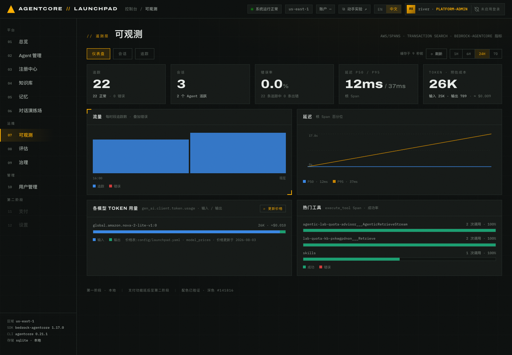
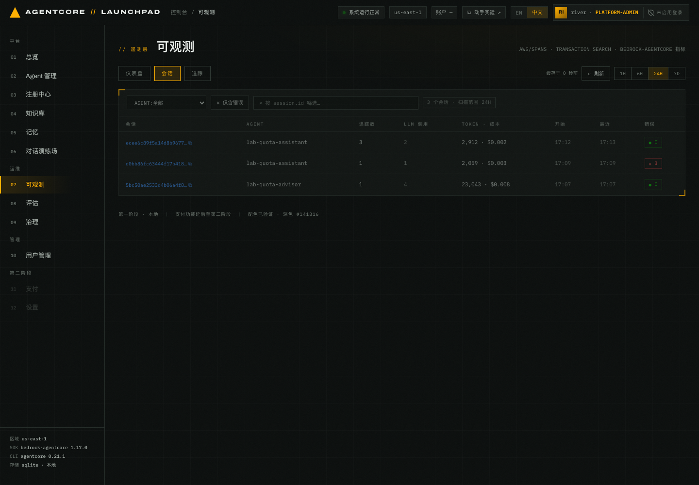
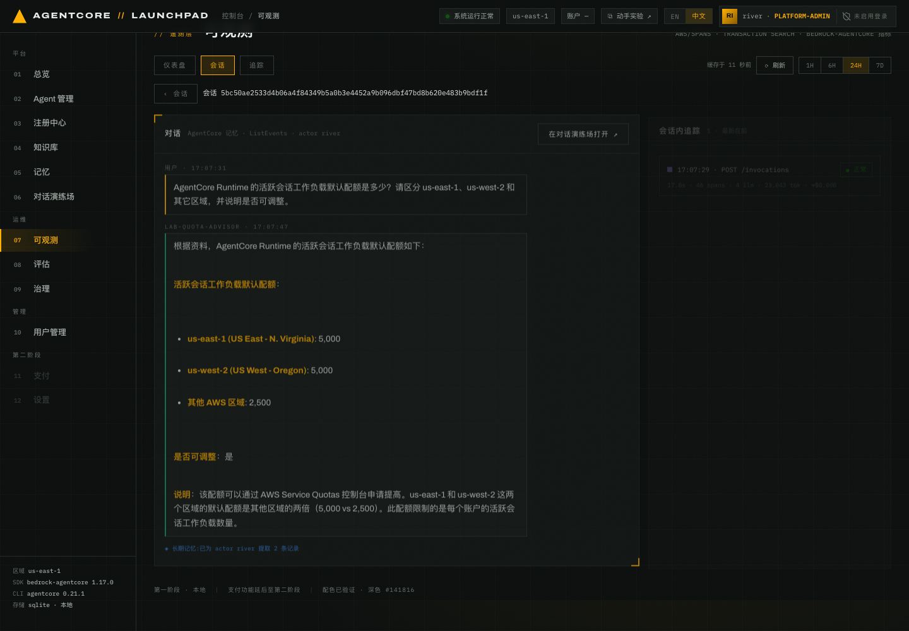
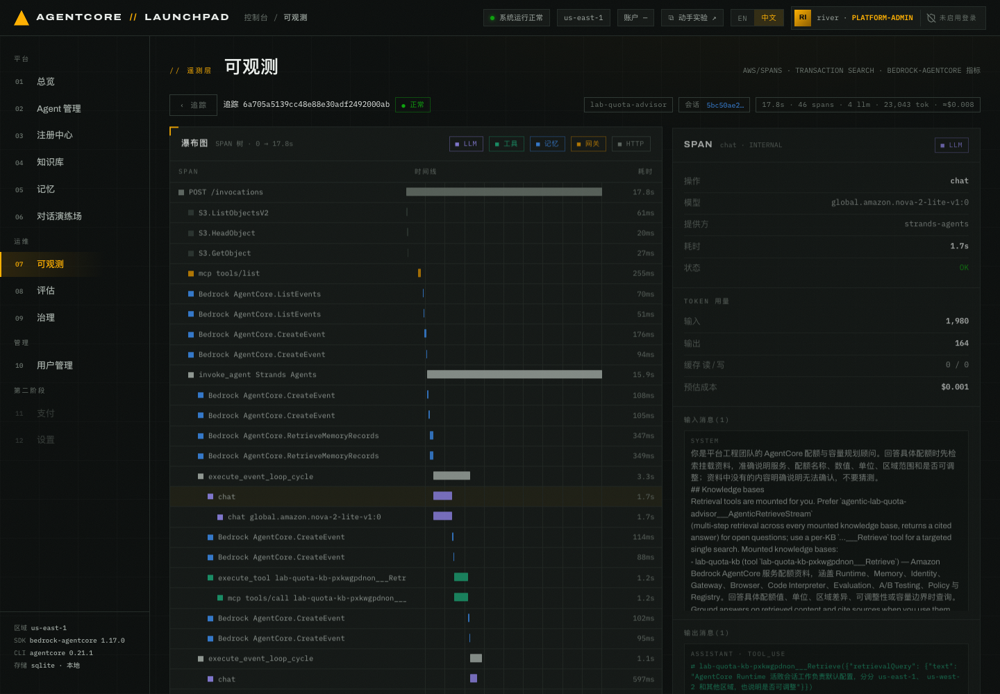
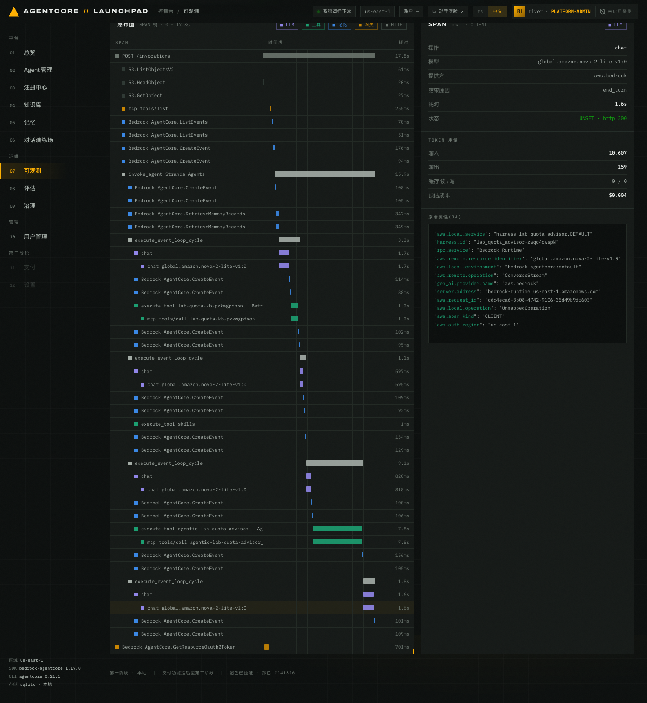

# 第 07 章 · 可观测性（Transaction Search · 追踪 · Token 与成本）

> **目标**：使用仪表盘、会话和追踪视图定位回答延迟与 token 成本。
>
> **前置条件**：完成第 05 章并产生真实流量。span 有摄取延迟，刚聊完请等 1–2 分钟。
>
> **预计耗时**：约 5 分钟。
>
> **本章将创建的 AWS 资源**：无（只读 CloudWatch Logs Insights 与 CloudWatch 指标；
> Logs Insights **按扫描量计费**）。

---

## 7.1 三个数据源，三个视图

| 视图 | 数据来自 | AgentCore/AWS 侧 |
|---|---|---|
| 仪表盘 | `aws/spans` 日志组 | CloudWatch Transaction Search（X-Ray → CloudWatch Logs） |
| 仪表盘的 Token 卡 | `bedrock-agentcore` 指标命名空间 | `ListMetrics` + `GetMetricData`（`gen_ai.client.token.usage`） |
| 会话对话还原 | AgentCore Memory `ListEvents` + 本地 ChatMessage 台账 | Memory 为主，台账用于修补滞后/不完整的分区 |

> 前置条件：账号需要开启 CloudWatch Transaction Search，也就是把 X-Ray trace segment 的
> 目的地设为 CloudWatch Logs。没开的话这一章所有视图都是空的。

## 7.2 仪表盘

打开 `07 可观测` → `仪表盘`，右上角选时间范围（`1H / 6H / 24H / 7D`）。


*图 7-1：仪表盘界面示例。请在覆盖自己测试流量的时间窗口内读取数据。*

先选择覆盖前面测试流量的时间范围，再从自己的页面记录追踪数、会话数、错误率、延迟分位数、
token 和预估成本：

| 指标 | 读取方式 |
|---|---|
| 追踪 | 所选窗口内采集到的全部 trace，并区分正常与错误 |
| 会话 | 确认 `lab-earnings-assistant` 与 `lab-earnings-advisor` 的测试会话都出现 |
| 错误率 | 非 0 时按错误筛选追踪并定位失败 span |
| 延迟 P50 / P95 | **根 span** 的延迟分位数；P50 是中位数，P95 表示 95% 的根 span 不超过该值 |
| Token · 预估成本 | 核对输入/输出 token、模型拆分和 `≈ / EST` 标记 |

实际数字取决于时间范围、对话轮数和模型调用。截图中的值只说明界面，不是验收答案。

「热门工具」面板应能反映第 04–05 章的工具调用。工具名结构如下，调用次数以自己的页面为准：

```
lab-earnings-kb-<kb_id 小写>___Retrieve    <N> 次调用
skills                                     <N> 次调用
```

> `<kb_id 小写>` 是第 04 章知识库的 id，每个账号都不同。请在自己的页面记录工具名和调用次数，
> 并确认知识库检索工具与前面的测试操作一致。

- **60 秒 TTL 缓存**：视图按 (视图, 时间范围) 缓存 60 秒，右上角显示 `缓存于 N 秒前`。
  Logs Insights 按扫描量计费，所以默认走缓存；点 `⟳ 刷新` 绕过。
- **成本是估算**：token 数 × `config/launchpad.yaml` 里的 `model_prices`（USD / 1M tokens），
  界面用 `≈ / EST` 标注。`⟳ 更新价格` 会从 litellm 公共价格表拉取账号见过的每个模型的价格，
  含区域溢价与缓存读写价。未知模型只显示 token 数，成本显示 `—`。
- **Token 只统计末端 LLM 调用**（`chat` / `text_completion` / `generate_content`）。
  Agent 级的 `invoke_agent` span 会重复其子 span 的 `gen_ai.usage.*`，一并累加会翻倍。

## 7.3 会话视图：业务视角

切到 `会话` 标签。可以按 Agent 过滤、只看含错误的会话。


*图 7-2：业务会话列表示例。每行显示追踪数、LLM 调用数、token、估算成本、起止时间与错误数。*

会话列表中的字段结构如下：

```
<SESSION_ID_A>  lab-earnings-assistant  <TRACE_COUNT> traces  <LLM_COUNT> LLM  <TOKENS> tokens  <EST_COST>
<SESSION_ID_B>  lab-earnings-advisor    <TRACE_COUNT> traces  <LLM_COUNT> LLM  <TOKENS> tokens  <EST_COST>
```

在相同时间范围内比较两个 Agent 的 LLM 调用数、token 和成本。检索结果和工具循环会扩大
上下文，因此挂载 KB 的 Agent 往往消耗更多 token；具体差值以你的会话为准。如果完成第 06 章，
公共 API 流量也会进入同一套遥测。

点开一个会话进入详情：


*图 7-3：advisor 会话详情示例。上半从 AgentCore Memory 还原对话，下半列出会话内追踪，
并可回跳到对话演练场。*

「会话内追踪」会显示以下字段：

```
POST /invocations · <状态> · <耗时> · <SPAN_COUNT> spans · <LLM_COUNT> LLM · <TOKENS> tokens
```

请从自己的会话详情记录每条追踪的状态、耗时、span 数、LLM 调用数和 token，再选择一条
包含知识库检索的追踪继续分析。

## 7.4 追踪视图：技术视角（span 瀑布图）

点任意一条「会话内追踪」卡片，或切到 `追踪` 标签选一条 trace。


*图 7-4：一条知识库检索追踪的瀑布图示例。span 数、LLM 调用数和耗时以自己的页面为准。*

选择第 05 章查询 AWS 分部收入或自由现金流的 trace。记录 trace ID、模型、根 span 耗时、
span 数、LLM 调用数、token 和成本。关键路径的结构通常如下：

```
POST /invocations                                           <ROOT_DURATION>
└─ invoke_agent Strands Agents                              <AGENT_DURATION>
   ├─ chat <SELECTED_MODEL_ID>                              <LLM_DURATION>
   ├─ execute_tool lab-earnings-kb-…___Retrieve             <RETRIEVAL_DURATION>
   └─ chat <SELECTED_MODEL_ID>                              <LLM_DURATION>
```

其余 span 记录 Memory、框架与网关操作。解读自己的瀑布图时，要结合 span 的父子关系与
起止时间，沿限制根 span 完成时间的最长依赖链找关键路径；并行或互为兄弟的 span 不能直接
相加。主要成本来自送入模型的上下文，不能只看检索 span 的耗时。

> 如果前面的测试同时包含开放问题和定向问题，可以比较两类 trace。Agent 通常对开放问题使用
> `AgenticRetrieveStream`，对明确的英文指标名（如 `Free cash flow`）使用单知识库 `Retrieve`。
> 第 04 章填写的 KB 描述会帮助 Agent 选择检索方式。

点某个 span 打开右侧抽屉：


*图 7-5：`chat` span 抽屉示例。请从自己的调用读取输入/输出 token、预估成本和首 token 延迟。*

抽屉底部的「原始属性」是 span 上的原始 OTel 属性，重点查看：

```
"aws.local.service":  "harness_lab_earnings_advisor.DEFAULT"
"harness.id":         "<HARNESS_ID>"
"aws.genai.span_kind": "LLM"
"gen_ai.provider.name": "strands-agents"
"gen_ai.request.model": "<SELECTED_MODEL_ID>"
"gen_ai.server.time_to_first_token": <MILLISECONDS>
"gen_ai.usage.input_tokens": <INPUT_TOKENS>
"gen_ai.usage.output_tokens": <OUTPUT_TOKENS>
```

在自己的 `chat` span 中记录模型、输入/输出 token 和首 token 延迟，并与 span 总耗时比较。

抽屉里的输入消息带着平台注入的系统提示词增量。知识库挂载生成的内容类似下面的示例：

```
## Knowledge bases
Retrieval tools are mounted for you. Prefer `agentic-lab-earnings-advisor___AgenticRetrieveStream`
(multi-step retrieval across every mounted knowledge base, returns a cited answer) for open
questions; use a per-KB `…___Retrieve` tool for a targeted single search.
Mounted knowledge bases:
- lab-earnings-kb (tool `lab-earnings-kb-<kb_id 小写>___Retrieve`) — Amazon 2026 年第二季度财报新闻稿…
Ground answers on retrieved content and cite sources when you use them.
```

> 第 04 章填写的 KB 描述会原样拼进系统提示词，Agent 靠它判断什么时候该检索。

## 7.5 交叉跳转

对话页和会话详情可以双向跳转，也可使用
`/observability?trace=<TRACE_ID>` 或 `/observability?session=<SESSION_ID>` 深链。

`service.name`（如 `lab_earnings_assistant_<后缀>.DEFAULT`、`harness_lab_earnings_advisor.DEFAULT`）
会通过台账映射回平台 Agent 名显示。所以列表里看到的是 `lab-earnings-advisor`，而 span 的
原始属性里是 `harness_lab_earnings_advisor.DEFAULT`。

## 7.6 两种创建方式的遥测差异

| 方式 | 遥测来源 |
|---|---|
| Strands ZIP | Strands 原生发射 gen_ai span |
| 托管 Harness | 内部 Strands 运行时，`service.name = harness_{name}.DEFAULT`，scope 为 `strands.telemetry.tracer` |

---

## 本章验证清单

- [ ] 仪表盘 5 个统计卡都有数据，并已记录所选时间范围、错误率、延迟、token 与成本
- [ ] 「热门工具」里出现自己的 `lab-earnings-kb-<kb_id 小写>___Retrieve`
- [ ] 会话列表能看到自己的 `lab-earnings-advisor` 与 `lab-earnings-assistant` 会话
- [ ] 会话详情能还原完整对话，并显示「会话内追踪」
- [ ] 追踪瀑布图能看到 `invoke_agent` → `execute_event_loop_cycle` → `chat` / `execute_tool` 层级
- [ ] span 抽屉能看到 token 用量与预估成本
- [ ] 对话页 ↔ 可观测的双向跳转可用

## 常见问题

| 现象 | 原因 | 处理 |
|---|---|---|
| 所有视图都空 | 账号没开 CloudWatch Transaction Search | 开启 X-Ray → CloudWatch Logs 的 trace segment 目的地 |
| 刚聊完看不到 trace | 摄取延迟（约 1 分钟起） | 等一会点 `⟳ 刷新` |
| 数字过一会儿才变 | 60 秒 TTL 缓存 | 点 `⟳ 刷新` 绕过 |
| 成本显示 `—` | 该模型不在价格表里 | 点 `⟳ 更新价格` |
| Token 数看起来偏小/偏大 | 只统计末端 LLM span（避免 `invoke_agent` 重复累加） | 属预期设计 |
| 只有 Agent 名而没有会话 | 该 Agent 的调用没带会话（如某些 `/v1` 无状态调用） | 正常 |

---

上一章：[第 06 章 · 公共 API（可选）](../06-public-api) ｜
下一章：[第 08 章 · 评估](../08-evaluation)
