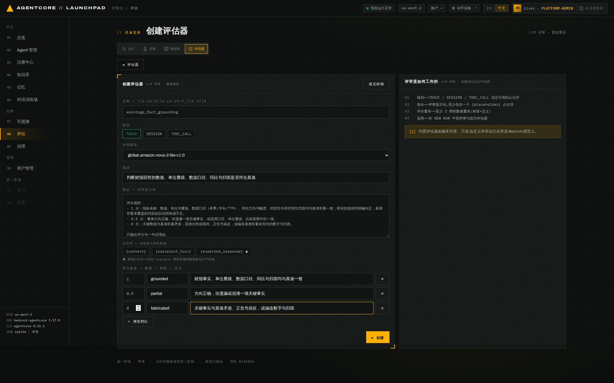
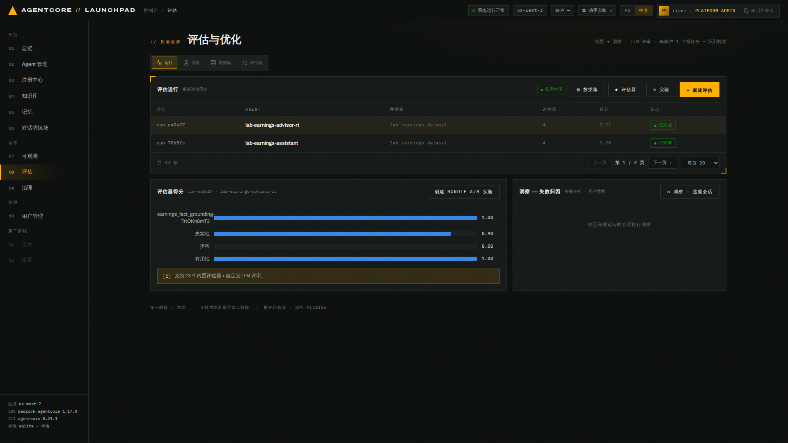

# 第 08 章 · 评估：数据集、评估器与双 Agent 对照批量评估

> **目标**：用带真值的数据集和自定义 LLM 评估器，把第 05 章观察到的「有依据 vs 无依据」
> 差距量化成分数——先给无知识库基线打分，再把带知识库的 advisor 转换为 Runtime 跑同一组
> 评估，得到一张可以并排对比的评分表。
>
> **前置条件**：完成第 05–07 章（被评估的 Agent 必须已经被调用过，否则没有遥测）。
>
> **预计耗时**：约 30 分钟（数据集和评估器约 10 分钟；两次批量评估串行执行、各需约 5 分钟，
> Harness 转换实测约 1.5 分钟，以页面状态为准）。
>
> **本章将创建的 AWS 资源**：1 个 AgentCore Dataset（同步产物）、1 个自定义 Evaluator、
> 1 个由 Harness 转换的 Runtime（`lab-earnings-advisor-rt`，第 09 章继续使用）、
> 2 次 BatchEvaluation 任务，以及回放数据集时产生的 Runtime 会话与遥测。

---

## 8.1 评估的三种范围（互斥）

一次运行的范围只能是三者之一：

| 范围 | 含义 | 会不会产生新调用 |
|---|---|---|
| **数据集** | 回放数据集条目，多轮场景在同一会话里顺序回放 | 会 |
| **会话 id** | 指定已有会话 | 不会 |
| **时间窗口** | 对既有流量做被动评估（`lookback_hours` 1–336） | 不会 |

本章使用数据集范围，因为要用真值核对具体答案。

> **注意**：Launchpad 通过账号级队列串行启动批量评估，一次只运行一个。这个实验平台约束
> 不等同于 AgentCore Batch Evaluation 的服务配额。页面顶部会显示 `● 队列空闲` 或排队中。

## 8.2 编写带真值的数据集

`08 评估` 页顶部有一排子导航：`运行` / `实验` / `数据集` / `评估器`，对应
`/evaluation`、`?view=experiment`、`?view=datasets`、`?view=evaluators`。右上角的
`▤ 数据集` / `◆ 评估器` / `⚗ 实验` 按钮指向同一批页面。

打开 `数据集`（`?view=datasets`）→ `+ 新建数据集`，切到 **JSON 导入** 模式。

粘贴下面这份 JSON。真值全部来自第 04 章上传的 Q2 2026 财报新闻稿，五条场景各埋了一个
财报分析里最容易出错的点：

```json
{"scenarios": [
  {"scenario_id": "overall-results",
   "description": "整体业绩：净销售额与经营利润",
   "turns": [{"input": "亚马逊 2026 年第二季度的净销售额和经营利润分别是多少？同比变化如何？",
              "expected_response": "2026 年第二季度净销售额为 2,006 亿美元（$200.6 billion），同比增长 20%（2025 年同期为 1,677 亿美元）；经营利润为 275 亿美元（$27.5 billion），同比增长 43%（2025 年同期为 192 亿美元）。"}],
   "assertions": ["净销售额为 2,006 亿美元（$200.6B）", "净销售额同比增长 20%", "经营利润为 275 亿美元（$27.5B）", "经营利润同比增长约 43%"]},
  {"scenario_id": "segment-results",
   "description": "分部业绩：区分收入金额相同的国际与 AWS 分部",
   "turns": [{"input": "请分别给出 2026 年 Q2 北美、国际和 AWS 三个分部的净销售额、同比增速和经营利润。",
              "expected_response": "北美分部净销售额 1,162 亿美元，同比增长 16%，经营利润 91 亿美元；国际分部净销售额 422 亿美元，同比增长 15%，经营利润 17 亿美元；AWS 分部净销售额 422 亿美元，同比增长 37%，经营利润 166 亿美元。国际与 AWS 两个分部本季收入金额恰好相同，但增速和利润差别很大，不能混淆。"}],
   "assertions": ["北美 1,162 亿美元、增长 16%", "国际 422 亿美元、增长 15%", "AWS 422 亿美元、增长 37%", "AWS 经营利润 166 亿美元，远高于国际分部的 17 亿美元"]},
  {"scenario_id": "net-income-attribution",
   "description": "净利润归因：识别非经营性投资收益",
   "turns": [{"input": "亚马逊 2026 年 Q2 净利润为什么同比暴涨？这说明主营业务盈利能力大幅提升吗？",
              "expected_response": "Q2 净利润为 626 亿美元，摊薄每股收益 5.75 美元（2025 年同期为 182 亿美元、1.68 美元）。同比暴涨主要因为计入了约 534 亿美元的非经营性税前其它收益，主要来自对 Anthropic 的投资。经营利润同比增长 43% 至 275 亿美元，主营业务确有改善，但净利润的暴涨主要由投资收益驱动，不能直接等同于主营业务盈利能力的提升。"}],
   "assertions": ["净利润 626 亿美元、摊薄 EPS 5.75 美元", "指出约 534 亿美元非经营性收益", "说明主要来自 Anthropic 投资", "明确区分经营利润增长与投资收益驱动"]},
  {"scenario_id": "cash-flow-sign",
   "description": "现金流：TTM 口径与自由现金流转负",
   "turns": [{"input": "亚马逊过去十二个月的经营现金流和自由现金流分别是多少？自由现金流变化的主要原因是什么？",
              "expected_response": "截至 2026 年 6 月 30 日的过去十二个月（TTM），经营现金流为 1,614 亿美元，同比增长 33%；自由现金流为净流出 76 亿美元（上年同期为净流入 182 亿美元）。转负的主要原因是物业与设备购置（扣除出售所得）同比增加 661 亿美元，主要反映对人工智能的投资。"}],
   "assertions": ["TTM 经营现金流 1,614 亿美元、增长 33%", "TTM 自由现金流为净流出 76 亿美元（负值）", "指出资本开支同比增加 661 亿美元并归因于 AI 投资", "明确 TTM 口径而非单季"]},
  {"scenario_id": "guidance-false-premise",
   "description": "纠正业绩指引的错误前提",
   "turns": [{"input": "公司给的 2026 年 Q3 指引意味着增长会继续加速到 20% 以上，而且已经把汇率的正面帮助算进去了，对吗？",
              "expected_response": "不对。Q3 2026 指引为净销售额 1,970 亿至 2,020 亿美元，同比增长 9% 至 12%，低于 Q2 的 20%，并不是继续加速；指引计入的是约 80 个基点的不利（而非有利）汇率影响。若剔除 2025 与 2026 年 Prime Day 时点的影响，指引增速约高出 400 个基点。经营利润指引为 225 亿至 265 亿美元。这些都是前瞻性陈述，实际结果可能存在重大差异。"}],
   "assertions": ["明确纠正错误前提", "指引区间 1,970–2,020 亿美元、增速 9%–12%", "汇率影响是约 80 个基点的不利影响", "提到剔除 Prime Day 影响约高 400 个基点，或指出前瞻性陈述属性"]}
]}
```

名称填 `lab-earnings-dataset`，描述填 `Amazon Q2 2026 财报的五条带真值场景（口径、归因、正负号与错误前提）`。


*图 8-1：JSON 导入模式。粘贴后界面实时提示 `已解析 5 条——可以提交`，`▸ 创建` 才会变为可点。*

**预期结果**：数据集创建成功，列表中这一行显示 5 条场景、`kind = predefined`、真值列 `◆`。
条目是 `turns` 结构而不是 `actor_profile` 人格，所以服务端把 `kind` 推断为 `predefined`。

五条场景埋的陷阱依次是：**量级与单位**（billion 与亿的换算）、**同额不同质**（国际与
AWS 本季收入都是 422 亿美元）、**利润归因**（净利润暴涨主要来自 Anthropic 投资收益，
不是经营改善）、**口径与正负号**（TTM 自由现金流是**净流出**）、**错误前提**（Q3 指引
是 9–12%，不是加速，汇率影响是不利的）。无知识库的 Agent 连数字都拿不到，更谈不上
这些细节——这正是接下来要量化的。

**真值的三种形态**，对应不同评估器：

| 真值字段 | 喂给谁 |
|---|---|
| `turns[].expected_response` | 内置 `正确性 Correctness` |
| `assertions` | 内置 `目标达成率 GoalSuccessRate` |
| `expected_trajectory` | 三个 `轨迹匹配 Trajectory*Match`，仅数据集运行且场景带该字段时才可选 |

平台通过 `StartBatchEvaluation` 的 `evaluationMetadata.sessionMetadata` 把它们注入当前评估。

### 同步为 AWS 数据集

选中数据集，点 `同步 AWS`。本地 SQLite 是唯一数据源，同步产生的是不可变的云端快照
（`AGENTCORE_EVALUATION_PREDEFINED_V1`）。


*图 8-2：数据集详情（scenario 编辑器）。列表行显示 `5 · predefined · ◆ 真值`，云端列
同步成功后变为 `ACTIVE`。*

同步成功后，在详情中核对以下字段：

```json
{"dataset_id": "<DATASET_ID>",
 "arn": "arn:aws:bedrock-agentcore:<REGION>:<ACCT>:dataset/<DATASET_ID>",
 "status": "ACTIVE", "synced_at": "<TIMESTAMP>"}
```

> 同步后运行列表里会多出一个 `☁ lab_earnings_dataset` 选项。云端数据集用
> `ListDatasetExamples` 回放，本地数据集直接读 SQLite。两者都能当运行范围，但云端副本不可编辑。

## 8.3 创建自定义 LLM 评估器

内置评估器有 13 个通用项（正确性、忠实性、有用性、拒答、简洁性、指令遵循、有害性……）
外加 3 个仅真值可用的轨迹匹配器。

「财报数值、单位量级、数据口径和归因必须有资料依据」这条规则需要自定义评估器：

- **复合口径**：要把数值、单位量级、期间口径、同比和归因合成一个「接地」分数，并明确规定
  拒答与转介记 0 分——没有交付事实就是没有接地。内置项做不到这种合成，`拒答` 检测器也只
  识别明确拒绝，不会把「请查阅官方财报」这类转介计为拒答。
- **自定的量表与标签**：`1=grounded / 0.5=partial / 0=ungrounded` 三档加一句话理由是内置项
  无法提供的，也可以作为长期追踪的单一指标。

打开 `评估器`（`?view=evaluators`）→ `+ 新建评估器`：

| 字段 | 取值 |
|---|---|
| 名称 | `earnings_fact_grounding`（正则 `^[a-zA-Z][a-zA-Z0-9_]{0,47}$`，不能用中文） |
| 级别 | `TRACE` |
| 评审模型 | 与部署 Agent 时同一个选项（见[第 01 章](../01-environment)「配置区域、凭证与模型访问」） |
| 描述 | `判断财报回答的数值、单位量级、数据口径、同比与归因是否符合真值；拒答与转介不计分` |

> **评审模型下拉默认选中 `global.anthropic.claude-sonnet-5`，不要未经确认就使用默认值。**
> 选择第 01 章确认可用的模型（本实验为 `global.amazon.nova-2-lite-v1:0`）。选错模型时创建
> 可能成功，但运行评估会报 `Role does not have access for model ...`。

指令，也就是评审提示词，包含三个可插入的占位符 `{context}` / `{assistant_turn}` /
`{expected_response}`。其中 `{expected_response}` 带 `◆` 标记，**仅在带真值的数据集运行中生效**：

```text
你是亚马逊财报问答的质量评审。请判断回答是否准确给出基准答案中的财报事实。

对话上下文：
{context}

助手回答：
{assistant_turn}

基准答案（真值）：
{expected_response}

评分规则：
- 1 分：指标名称、数值、单位与量级、数据口径（单季/半年/TTM）、同比方向与幅度、经营性与非经营性归因均与基准答案一致；错误前提得到明确纠正。
- 0.5 分：给出了基准答案中的多数关键数值且方向正确，但遗漏一项关键事实，或混淆口径、单位量级、比较基期中的一项。
- 0 分：关键数值与基准答案矛盾、正负号搞反、编造基准答案未支持的数字或归因；或没有给出基准答案中的关键数值（包括以「尚未发布」「无法提供」「请查阅官方财报」等方式拒答或转介）。

只输出评分与一句话理由。
```

最后那条 0 分规则是本评估器的关键设计：这里量的是**接地能力**——有没有把财报事实交付给
用户。无知识库的 Agent 如实转介是诚实的好行为，但它没有交付事实，接地记 0；诚实与否
另行结合回答原文判断。

评分量表（数值 / 标签 / 定义）三档：

| 数值 | 标签 | 定义 |
|---|---|---|
| 1 | `grounded` | 财报事实、单位量级、数据口径、同比与归因均与真值一致 |
| 0.5 | `partial` | 给出多数关键数值且方向正确，但遗漏或混淆一项关键事实 |
| 0 | `ungrounded` | 关键事实与真值矛盾或编造，或未给出真值中的关键数值（含拒答与转介） |


*图 8-3：`earnings_fact_grounding` 编辑页示例。保存后重新打开评估器，确认评审模型和
`1=grounded / 0.5=partial / 0=fabricated` 量表均已生效。新建页使用相同的占位符和量表控件。*

创建成功后，这个评估器会以 `custom` 来源出现在目录里，状态为 `ACTIVE`。平台会生成新的 id，
需要排障时从自己的评估器详情中复制。

> 编辑自定义评估器时注意：AWS 的 `UpdateEvaluator` 是整体替换语义，平台会把完整配置重新提交。

> **引用 `{expected_response}` 的评估器只能离线使用。** 引用它（或 `{assertions}`、
> `{expected_tool_trajectory}`）的自定义评估器无法参加第 09 章的在线评估：在线评估读实时
> trace，拿不到真值，平台会拒绝并报 `experiment.evaluator_unsupported`。第 09 章的主指标
> 因此改用无参考评估器，在那一章创建。

## 8.4 第一次运行：无知识库基线

打开 `08 评估` 主页 → `+ 新建评估`（早期版本这个按钮叫 `+ 新建运行`）：

| 字段 | 取值 |
|---|---|
| 模式 | `评估器 · 打分运行` |
| AGENT | `lab-earnings-assistant · zip_runtime` |
| 评估范围 | `数据集 · 回放条目` |
| 数据集 | `lab-earnings-dataset · 5 ◆`（语言标记以页面显示为准） |
| 评估器 | `有用性`、`忠实性`、`拒答`、`earnings_fact_grounding` |


*图 8-4：列表上的按钮叫 `+ 新建评估`，点进来这一页的标题仍是`新建运行`，提交按钮是
`▸ 启动运行`。右侧说明了四个阶段：INVOKING → WAITING → EVALUATING → COMPLETED。
底部提示所有已激活 Agent 都可评估，包括托管 Harness。绿色高亮的四个 chip 是当前选中的评估器。*

> **注意**：评估器 chip 是切换按钮，页面可能默认勾选若干项，点击已选中的项会取消它。
> 启动前核对绿色高亮的项目，只保留上表中的四项；`正确性` 若被默认选中，请取消。

**为什么先评这个 Agent**：`lab-earnings-assistant` 没有知识库，也是第 05 章暴露问题的那个
Agent。财报晚于模型训练截止，它对五条场景里的具体数字**必然**没有依据——这次运行给
坏例基线定一个分数。

点 `▸ 启动运行`。

## 8.5 四个阶段与结果


*图 8-5：运行进行中。数据集里每个场景对应一个 runtime 会话，逐个真实调用。页头此时显示
`◐ 批任务运行中 · 账户锁`，表示 Launchpad 正通过账号级队列串行执行任务。*

阶段含义：

| 阶段 | 平台在做什么 |
|---|---|
| `INVOKING` | 逐条回放数据集，真实调用 Agent，记录每条对应的 session id |
| `WAITING` | 等 span 落进 CloudWatch `aws/spans`，默认等 180 秒 |
| `EVALUATING` | `StartBatchEvaluation` 精确圈定这些 session，不会误评别的流量 |
| `COMPLETED` | 各评估器均分，或洞察树 |


*图 8-6：完成页示例。列表先显示四项指标的聚合值，展开后可查看忠实性、有用性、拒答和
自定义接地评估器各自的均分。图中的数值只用于说明界面，不是预期结果。*

状态变为 `COMPLETED` 后，从自己的运行详情记录以下信息：

| 项目 | 记录内容 |
|---|---|
| 运行标识 | 页面显示的运行名称或 id，便于排障 |
| 运行时间 | 从启动到完成的实际耗时 |
| 样本状态 | 成功会话数、失败会话数和 `error` |
| 逐项得分 | 忠实性、有用性、拒答、`earnings_fact_grounding` 的均分 |
| 聚合值 | 列表中的汇总值 |

## 8.6 转换 Harness，再跑对照运行

对照的对象是带知识库的 `lab-earnings-advisor`，但**托管 Harness 不能直接参加批量评估**：
AWS 评估服务解析不了 Harness 的 agent span，运行会在 `EVALUATING` 阶段以
`AgentSpanMappingException: Failed to parse user_query from agent-span` 让全部会话失败——
界面允许选择 Harness，失败要到运行结束才暴露。转换出的 Runtime 使用 Strands 原生埋点，
评估服务可以解析；转换还会植入 config-bundle 契约，正是第 09 章配置包实验的前置条件，
一步两用。

1. 打开 `02 Agent 管理`，找到 `lab-earnings-advisor`，点击行末的 `转换 ⇄ RT`。
2. 在确认框中核对说明后再次点击 `转换 ⇄ RT`。确认框标注 `约 5–15 分钟`，那是保守上限，
   实测约 1.5 分钟（导出代码、植入契约、打包 ZIP 并部署为新 Runtime）。
3. 等待新 Agent `lab-earnings-advisor-rt` 进入 `运行中`。转换保留系统提示词、记忆配置和
   知识库清单，不修改 `lab-earnings-advisor` 本身。

等第一次运行 `COMPLETED`、队列显示空闲后，点 `+ 新建评估`，只换 Agent，其余配置**完全
相同**：

| 字段 | 取值 |
|---|---|
| AGENT | `lab-earnings-advisor-rt · zip_runtime` |
| 评估范围 / 数据集 / 评估器 | 与 8.4 完全一致 |

完成后把两次运行的逐项得分抄进同一张表。下面第二、三列是一次参考实测（你的数值会不同）：

| 评估器 | `lab-earnings-assistant`（无 KB） | `lab-earnings-advisor-rt`（KB + 技能） |
|---|---:|---:|
| `earnings_fact_grounding` | **0.00** | **1.00** |
| 忠实性 | 0.80 | 0.90 |
| 有用性 | 0.33 | 1.00 |
| 拒答 | 0.00 | 0.00 |

主指标从 0 到 1 拉满：基线对每条问题都只能转介「请查阅官方财报」，接地记 0；挂知识库的
Runtime 检索后给出真值。这就是知识库接地价值的量化证据，也是「评估」相对于第 05 章
肉眼对照的增量：**可复现、可比较、可回归**。解读时按指标逐项看：

- **`earnings_fact_grounding`** 按 **0 / 0.5 / 1** 量表检查数值、单位量级、口径、同比与归因，
  拒答与转介记 0，是本章的主对照指标。
- **忠实性**只表示回答与自身上下文是否一致，不能单独证明财报事实正确——基线的转介式回答
  前后自洽，实测忠实性可以拿满分。这正是需要自定义真值评估器的原因。
- **有用性**关注信息完整度和可操作性，无知识库基线如果给出结构清晰的转介建议，
  这一项未必低。
- **拒答**是行为检测器，且只识别明确的拒绝。基线典型的「请查阅官方财报」属于转介而非
  拒绝，实测拒答分可能是 0——不能拿它当「基线没有回避」的证据，要结合回答原文判断。
- 列表聚合值是四项均分的算术平均。四项都在 0–1 范围内，但含义不同，不能把聚合值
  直接当成质量百分比。
- 与其它运行比较时，必须同时核对样本数和 `error`。

再回看第 05 章的对话结果，判断离线评分是否支持当时观察到的接地、编造或拒答行为。

> **记录**：记下两次运行的四个逐项分数和成功样本数。这两组分数是本实验的「优化前」证据；
> `lab-earnings-advisor-rt` 的这次运行同时为第 09 章的优化器提供了通话记录（数据就绪度），
> 那一章直接从它继续。A/B 阶段会换成两个无参考评估器，用途不同，结果不能与本章分数直接
> 横向比较。
>
> 若出现 `N of M sessions failed during batch evaluation`，分数只基于成功会话，
> 请按实际样本量解读，或重跑补齐。

### 可选：跑一次洞察（失败归因）

评分面板可对同一批会话运行失败分析、用户意图和执行摘要。通常需要 15–25 分钟，本实验不执行。

---

## 本章验证清单

- [ ] `lab-earnings-dataset` 创建成功，真值列显示 `◆`，`kind = predefined`
- [ ] 已同步为 AWS 数据集，云端状态为 `ACTIVE`
- [ ] `earnings_fact_grounding` 评估器状态 `ACTIVE`，评审模型为本账号可用模型
- [ ] 基线运行（assistant）走完 INVOKING → WAITING → EVALUATING → COMPLETED
- [ ] `lab-earnings-advisor-rt` 由 `lab-earnings-advisor` 转换而来，状态 `运行中`，
      详情仍显示原知识库，原 Harness 未被修改
- [ ] 对照运行（advisor-rt）也已 COMPLETED，且两次运行的数据集与评估器配置完全一致
- [ ] 已把两次运行的逐项得分抄进同一张对照表
- [ ] `earnings_fact_grounding` 两列拉开了明显差距，且方向与第 05 章观察一致
- [ ] 已核对两次运行的成功会话数和运行详情中的 `error`

## 常见问题

| 现象 | 原因 | 处理 |
|---|---|---|
| `同步 AWS` 返回 502 或 `AccessDeniedException` | 当前身份缺少 `bedrock-agentcore:CreateDataset` 等数据集权限 | 为当前身份补齐数据集权限后重试；本地数据集仍可用于批量评估 |
| 启动时报队列忙 | Launchpad 账号级队列已有批量评估在运行 | 等前一个结束，页面顶部有队列状态；两次运行必须串行 |
| 选 `lab-earnings-advisor · harness` 启动的运行整体 `failed`，全部会话失败 | AWS 评估服务解析不了托管 Harness 的 agent span（结果日志里是 `AgentSpanMappingException: Failed to parse user_query`） | 属服务限制，重跑无用；按 8.6 转换为 Runtime 后评估 |
| harness Agent 报 `eval.harness_no_telemetry` | 它从没被调用过，日志组不存在 | 先去对话演练场聊一轮；即使有遥测，Harness 也会命中上一行的限制 |
| `转换 ⇄ RT` 返回 502，提示 managed AgentCore CLI missing | 本地 `data/agentcore-cli/` 缺失（目录被 gitignore） | 重跑 `make bootstrap` 补装后重试 |
| 轨迹匹配器不可选 | 场景没写 `expected_trajectory` | 只有带该字段的数据集运行才可选 |
| 运行失败在 EVALUATING | 遥测没落地或 service.name 解析不到 | 看第 07 章确认该 Agent 有 trace；重跑 |
| 自定义评估器名称报错 | 名称正则限制 `^[a-zA-Z][a-zA-Z0-9_]{0,47}$` | 用英文下划线命名 |
| `{expected_response}` 没起作用 | 该运行范围没有真值（如时间窗口范围） | 用带真值的数据集范围 |
| 两次运行的接地分差距不明显 | 基线碰巧全部拒答且评审把「如实拒答」也给了高分，或对照 Agent 检索失败 | 展开逐场景得分和理由看评审原文；确认 advisor 的工具轨迹里有 KB 检索 |

---

上一章：[第 07 章 · 可观测性](../07-observability) ｜
下一章：[第 09 章 · 配置 A/B 实验](../09-experiment-ab)
