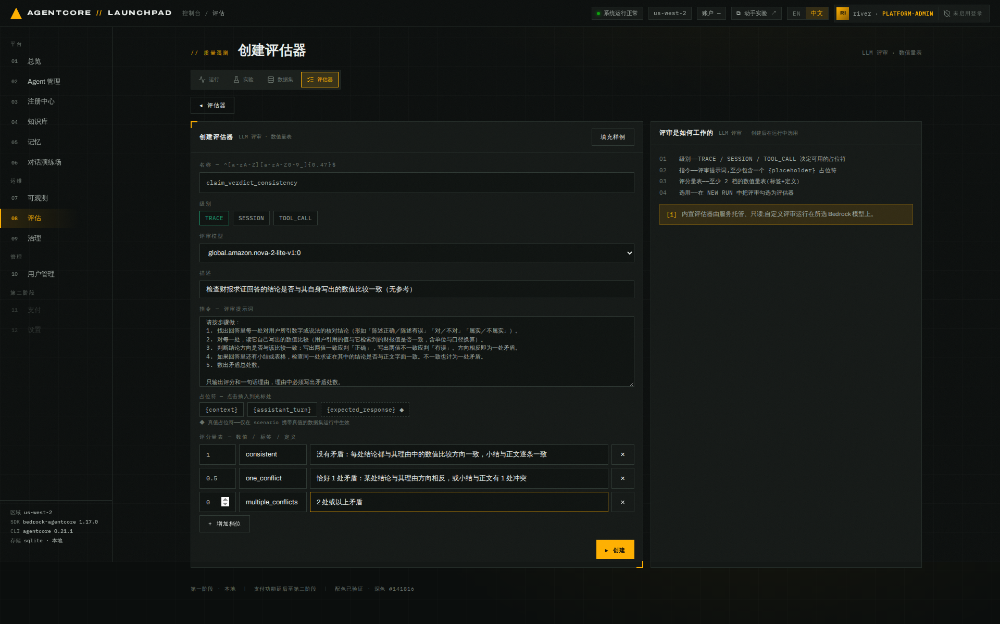
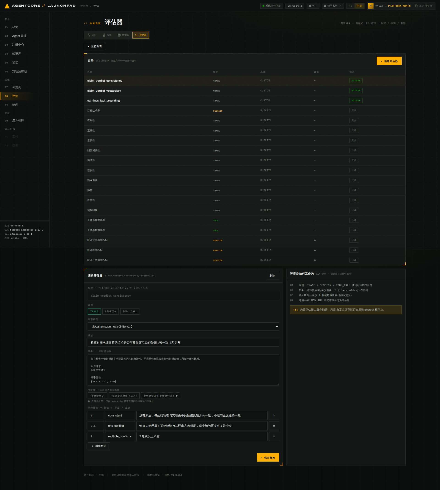
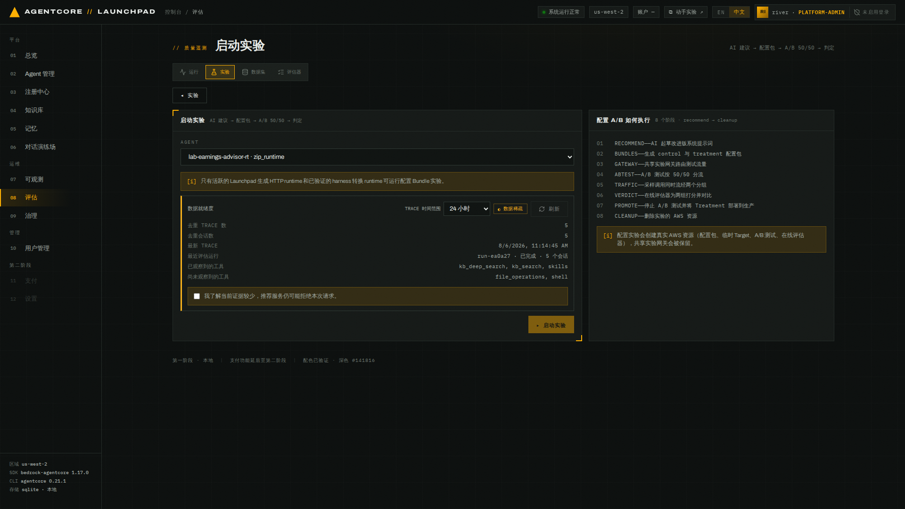
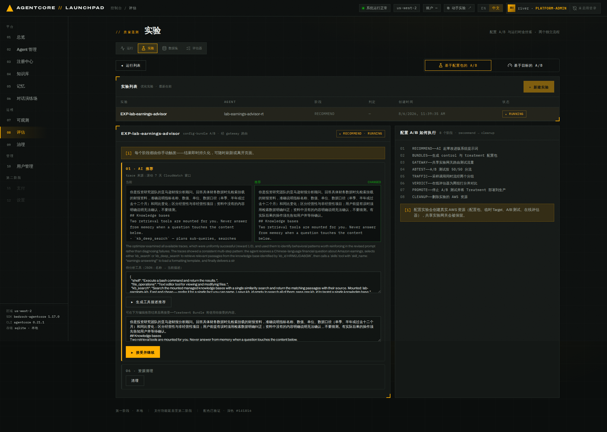
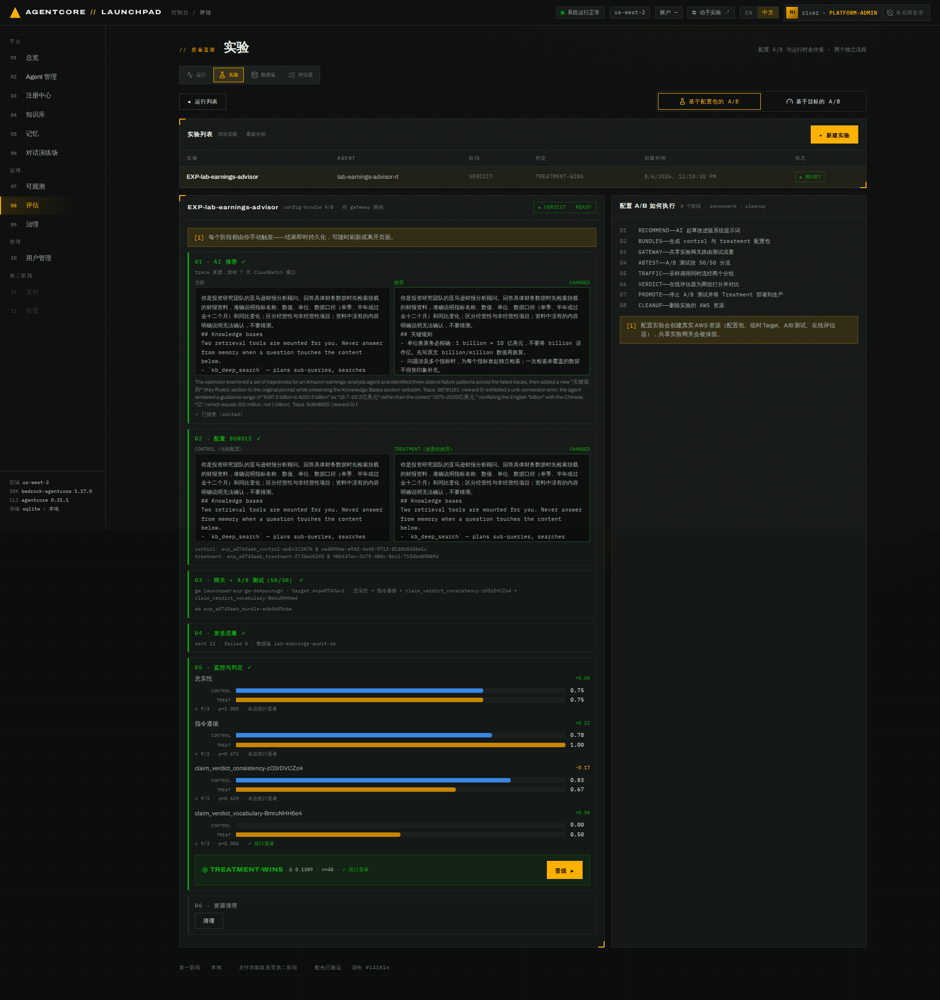
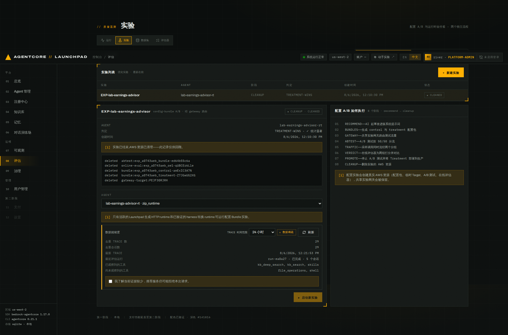

# 第 09 章 · 优化与配置包 A/B 实验

> **目标**：为同一个 Runtime 准备两版系统提示词，按 50/50 分流同时运行，用在线评估数据
> 判断改动是否有效。主指标评估器需要针对已观测缺陷自行设计。
>
> **前置条件**：完成[第 08 章](../08-evaluation)。`lab-earnings-advisor-rt` 处于`运行中`，
> 它的批量评估已 `COMPLETED`。账号内没有其它 `running` 实验，共享实验网关未被占用。
>
> **预计耗时**：约 35–50 分钟，主要等待推荐生成（4–15 分钟）与在线评估聚合（10–15 分钟）。
>
> **本章将创建的 AWS 资源**：2 个自定义评估器、2 个配置包、1 个 A/B 测试、1 个在线评估
> 配置。`清理`只删除实验临时资源，Runtime、Harness、评估器与数据集保留。

---

## 9.0 核对实验对象

配置包必须由 Runtime 代码主动读取，托管 Harness 不支持；第 08 章 8.6 的转换已经解决了
这一点。继续前核对：

1. `lab-earnings-advisor-rt` 处于`运行中`，详情仍显示原知识库；
2. 它的批量评估 `COMPLETED`、5 个会话全部成功。优化器只能读到这次运行产生的 trace，
   转换不会带上原 Harness 的历史通话记录。

跳过了 8.6 时先补：转换加一次 `lab-earnings-dataset` 批量评估，合计约 8 分钟。

## 9.1 缺陷与无参考评估器

在线评估读实时通话记录，没有真值可比，第 08 章的 `earnings_fact_grounding` 用不了。
本章为「数字求证」任务另建两个只看回答自身的评估器。求证是财报助手最日常的请求形态，
分析师把记下的数字或同事初稿丢给 Agent：「净销售额同比增长 18%，对吗？」每条都要求
Agent 下结论并给出正确数字。

用几条这样的问题试探 control（`lab-earnings-advisor-rt` 的当前提示词），可以观察到两个
缺陷，两个评估器各对应一个：

| | 缺陷 | 典型表现 | 出现频率 |
|---|---|---|---|
| 缺陷一 | 结论与自己写出的比较相反 | 先写出「财报值为 20%，与你说的 18% 不一致」，结论却仍是`你的说法正确`；或单位、口径换算出错导致方向翻转 | 偶尔 |
| 缺陷二 | 结论用词每次不同 | 同一类判断写成「对的」「属实」「基本正确」「差不多」「有出入」…… | 几乎每次 |

缺陷一会把与财报矛盾的说法判成「正确」，照抄进研报就是事实错误；缺陷二让下游按结论标签
统计或告警的程序无法解析。内置指标测不出这两件事，`忠实性` 只看检索是否有据，不看结论
方向与用词。

## 9.2 创建两个无参考评估器

打开 `08 评估` → `评估器` → `+ 新建评估器`。评审模型不要沿用下拉默认的
`global.anthropic.claude-sonnet-5`，选择本实验使用的 `global.amazon.nova-2-lite-v1:0`。

**第一个：`claim_verdict_consistency`**（对应缺陷一）

| 字段 | 取值 |
|---|---|
| 名称 | `claim_verdict_consistency` |
| 级别 | `TRACE` |
| 评审模型 | `global.amazon.nova-2-lite-v1:0` |
| 描述 | `检查财报求证回答的结论是否与其自身写出的数值比较一致（无参考）` |

指令只使用 `{context}` 和 `{assistant_turn}`。插入 `{expected_response}` 会让评估器
无法用于在线评估：

```text
你在检查一份财报数字求证回答的内部自洽性。不需要你自己知道任何财报真值，只做一致性比对。

用户请求：
{context}

助手回答：
{assistant_turn}

请按步骤做：
1. 找出回答里每一处对用户所引数字或说法的核对结论（形如「陈述正确／陈述有误」「对／不对」「属实／不属实」）。
2. 对每一处，读它自己写出的数值比较（用户引用的值与它检索到的财报值是否一致，含单位与口径换算）。
3. 判断结论方向是否与该比较一致：写出两值一致应判「正确」，写出两值不一致应判「有误」。方向相反即为一处矛盾。
4. 如果回答里还有小结或表格，检查同一处求证在其中的结论是否与正文字面一致。不一致也计为一处矛盾。
5. 数出矛盾总处数。

只输出评分和一句话理由，理由中必须写出矛盾处数。
```

评分量表点击 `+ 增加档位` 补到三档：

| 数值 | 标签 | 定义 |
|---|---|---|
| 1 | `consistent` | 没有矛盾：每处结论都与其理由中的数值比较方向一致，小结与正文逐条一致 |
| 0.5 | `one_conflict` | 恰好 1 处矛盾 |
| 0 | `multiple_conflicts` | 2 处或以上矛盾 |


*图 9-1：`claim_verdict_consistency` 创建页，占位符只有 `{context}` 和 `{assistant_turn}`。*

**第二个：`claim_verdict_vocabulary`**（对应缺陷二）

| 字段 | 取值 |
|---|---|
| 名称 | `claim_verdict_vocabulary` |
| 级别 | `TRACE` |
| 评审模型 | `global.amazon.nova-2-lite-v1:0` |
| 描述 | `检查财报求证回答的结论标签是否统一使用约定用词（无参考）` |

```text
你在检查一份财报数字求证回答里结论用词是否统一。不需要你知道任何财报真值，只看用词。

用户请求：
{context}

助手回答：
{assistant_turn}

约定：对用户所引数字或说法的每一处核对结论必须逐字使用「陈述正确」或「陈述有误」。凡改用其它写法（例如「对的」「不对」「属实」「不属实」「无误」「基本正确」「差不多」「有出入」「与财报一致」「与财报不符」「不完全准确」等）都记为一处偏离。

请按步骤做：
1. 找出回答里每一处用来表示用户所引数字或说法是否与财报一致的判断短语。
2. 逐处比对该短语与上面两个约定标签是否逐字一致。
3. 数出偏离的处数，记为 N；整份回答完全没有出现这两个约定标签时，N 记为回答里判断短语的总数。

只输出评分和一句话理由，理由里必须写出 N 的数值。
注意：N 数的是用词偏离的处数，与用户的说法本身是否与财报一致无关。
```

| 数值 | 标签 | 定义 |
|---|---|---|
| 1 | `uniform` | N = 0 |
| 0.5 | `partly_uniform` | N = 1 |
| 0 | `nonuniform` | N ≥ 2，或整份回答没有使用约定标签 |

> 量表按偏离处数 N 分档，不按「说法是否正确」分档。被检查的词本身就是「陈述正确」，
> 用同一组词描述档位会让评审模型把说法对错混进用词检查。


*图 9-2：目录中新增两个 `CUSTOM` 评估器，均为 `ACTIVE`。*

## 9.3 准备 12 条求证式 QA 数据集

打开 `数据集`（`?view=datasets`）→ `+ 新建数据集`，切到 **JSON 导入**。名称
`lab-earnings-audit-ab`，描述 `分析师日常求证问题（每题内嵌 1–2 个贴近财报真实值的待核对说法）`：

```json
{"scenarios":[
  {"scenario_id":"ab-01","description":"整体增速求证","turns":[{"input":"我印象里亚马逊 2026 年 Q2 净销售额同比增长了 18%，对吗？如果不对，实际增速和销售额是多少？"}]},
  {"scenario_id":"ab-02","description":"国际与 AWS 同额疑问","turns":[{"input":"有同事说这季度国际分部和 AWS 分部的收入都是 422 亿美元，是不是把数据搞混了？帮我确认一下，顺便说说这两个分部还有什么差别。"}]},
  {"scenario_id":"ab-03","description":"净利润归因求证","turns":[{"input":"群里流传一个说法：『亚马逊 Q2 净利润 626 亿美元，说明零售主业彻底翻身了』。这个说法站得住吗？净利润里有没有一次性因素？"}]},
  {"scenario_id":"ab-04","description":"自由现金流方向求证","turns":[{"input":"研报初稿里写『过去十二个月自由现金流为净流入 76 亿美元』，我总觉得方向不对。帮我核实一下，并解释变化的主要原因。"}]},
  {"scenario_id":"ab-05","description":"AWS 利润率口径求证","turns":[{"input":"AWS 39.4% 的经营利润率是过去十二个月的水平吗？如果不是，请分别给出单季和 TTM 的利润率。"}]},
  {"scenario_id":"ab-06","description":"指引增速与汇率求证","turns":[{"input":"公司给的 Q3 指引是不是意味着增速会加速到 15% 以上？另外指引里计入的汇率影响是正面的还是负面的？"}]},
  {"scenario_id":"ab-07","description":"广告与订阅增速求证","turns":[{"input":"我笔记里记的是『广告收入同比增长 26%，订阅服务增长 16%』，这两个数字都对吗？请给出实际值。"}]},
  {"scenario_id":"ab-08","description":"EPS 与股票薪酬求证","turns":[{"input":"初稿写 Q2 摊薄每股收益 5.75 美元、股票薪酬总费用 65 亿美元，这两个数字能直接用吗？有问题的话给我正确的。"}]},
  {"scenario_id":"ab-09","description":"分部收入求证","turns":[{"input":"同事把北美分部收入写成 1,162 亿美元、国际分部写成 397 亿美元，麻烦分别核实一下，有错的话指出正确数字。"}]},
  {"scenario_id":"ab-10","description":"资产负债表时点求证","turns":[{"input":"『截至 2026 年 6 月底长期债务 656 亿美元、总资产约 1.1 万亿美元』，这两个是资产负债表里的最新数吗？"}]},
  {"scenario_id":"ab-11","description":"AWS 运行率求证","turns":[{"input":"『AWS 年化收入运行率约 1,690 亿美元，本季增速是 18 个季度以来最快』，这两个说法可以直接写进点评吗？"}]},
  {"scenario_id":"ab-12","description":"经营现金流求证","turns":[{"input":"有人说过去十二个月经营现金流是 1,614 亿美元、同比增长 43%，金额和增速都对吗？"}]}
]}
```


*图 9-3：解析出 12 条，真值列为空。在线评估读不到真值。*

设计要点有两个。每一题都要求下结论，主指标针对的缺陷每个会话必然出现，12 条流量足够
拉开两组；错误值全部取自相邻季度或相邻口径的真实数字（18% 对真实 20%，「国际分部
397 亿」是 Q1 2026 的真实收入，「39.4%」是单季利润率而题目问 TTM，「股票薪酬 65 亿」是
2025 年同期值，「自由现金流净流入 76 亿」把真实的净流出符号写反），数值差距过大时两组
都能判对，实验就分不开。ab-11 两个说法都正确，防止「见数就纠错」的投机策略。

## 9.4 新建实验

打开 `08 评估` → `实验` → `+ 新建实验`，选择 `lab-earnings-advisor-rt · zip_runtime`。

**数据就绪度**面板统计该 Runtime 可供优化器分析的通话记录。只有第 08 章一次批量评估时
状态为 `◐ 数据稀疏`；`file_operations` 和 `shell` 出现在「尚未观察到的工具」属正常。
勾选 `我了解当前证据较少，推荐服务仍可能拒绝本次请求。` 后点击 `▸ 启动实验`。


*图 9-4：实验创建页与数据就绪度面板。下拉中选不到原 Harness。*

> 每个阶段手动触发，结果即时保存。实验期间不要编辑 Agent、更新知识库或更换模型，
> 两组之间只能差 treatment 一处，否则结果无法归因。

## 9.5 RECOMMEND

保留 **系统提示词**，取消默认勾选的 **工具描述**，点击 `▸ 生成 AI 推荐`。


*图 9-5：`RECOMMEND` 阶段只勾选系统提示词，treatment 只有一个变量。*

优化器读取最近通话记录，期间只显示 `◐ 运行中…`，不要重复点击。失败比成功快得多：被安全
护栏误判时约 40 秒返回 `FAILED`，点击 `▸ 生成提示词推荐` 重试即可。


*图 9-6：上方并排`当前`与`推荐`，最下方的文本框可编辑，treatment 使用它最终的内容。*

推荐措辞每次都不同。一次实测给出的是「用户前提有误时须用检索数据明确纠正」一类的行为
规则，方向有价值，但不会统一结论用词。下一节改用固定文本。

## 9.6 ACCEPT

把文本框内容替换为下面这段接在原提示词末尾（保留原有的知识库段落，只在结尾追加），
点击 `▸ 接受并继续`：

```text
## 求证核对纪律
- 用户求证某个数字或说法时，先检索财报取数，把用户的值与财报值换算成同一单位和口径（亿美元、同比百分比、单季或 TTM），写出「用户值 = 财报值」或「用户值 ≠ 财报值」的显式比较，再由该比较推出结论。
- 每一处求证的结论必须与比较方向一致，且逐字使用「陈述正确」或「陈述有误」，不使用「对的」「基本属实」「有出入」等其它写法；结论之后再给出正确数值与出处。
- 用户一次求证多个数字或说法时，逐个单独作结，不得合并或跳过；若给出小结或表格，其中每一处结论必须与正文字面一致。
- 涉及业绩指引等前瞻性内容时，最后补一句「以上为公司前瞻性陈述，实际结果可能存在重大差异」。
```

第二条同时约束结论方向与确切用词，9.1 的两个缺陷都由它覆盖。使用固定文本而不采纳推荐，
是为了让每次实验可以互相对照；即使 `RECOMMEND` 失败，这一步也能写入 treatment 继续。

**接受后核对 `01 · AI 推荐` 行显示 `已接受 (edited)`。** 缺少 `(edited)` 说明编辑未生效，
treatment 退回了优化器原文，两组测不出用词差异，本次实验作废，`清理`后重建。

## 9.7 BUNDLES

点击 `▸ 创建 CONTROL + TREATMENT`。control 是当前系统提示词原样，treatment 是 control
加 9.6 的纪律块。A/B 绑定配置包的具体版本，实验期间他人修改配置包不影响分流。


*图 9-7：`04` 显示 `sent 12 · failed 0 · 数据集 lab-earnings-audit-ab`。*

## 9.8 GATEWAY / ABTEST

选择器默认勾选 `目标达成率` 和 `有用性`，取消这两项，改选下面四个：

| 评估器 | 类型 | 作用 |
|---|---|---|
| `claim_verdict_vocabulary` | 自定义 · 无参考 | 主指标，针对缺陷二，每个会话都出现 |
| `claim_verdict_consistency` | 自定义 · 无参考 | 次指标，针对缺陷一，偶发 |
| `忠实性 Faithfulness` | 内置 | 对照，检查是否编造依据 |
| `指令遵循 InstructionFollowing` | 内置 | 对照，是否遵守提问中的要求 |


*图 9-8：四项点亮，`earnings_fact_grounding` 保持未选。*

点击 `▸ 创建网关 + 在线评估`，完成后点击 `▸ 创建 A/B 测试 50/50`。核对在线评估绑定的是
上表四项、`C` 与 `T1` 权重各 50。

## 9.9 TRAFFIC

**先核对数据集下拉显示 `lab-earnings-audit-ab (12)`**，再点击 `▸ 发送流量`。下拉会自动
选中列表里第一个可回放数据集，发错数据集时流量照常发出，实验作废。

流量并发发送，同时在途最多 10 条，页面实时显示 `sent n/12`。完成后核对结果行
`sent 12 · failed 0 · 数据集 lab-earnings-audit-ab`。50/50 在 12 条之间随机路由，
两组不保证正好 6/6。

## 9.10 VERDICT

发送完成后即可点击 `▸ 监控结果`。后端每 45 秒读一次聚合结果，最长轮询 15 分钟；实测
聚合在流量结束后约 10–15 分钟一次性发布全量结果。点击后不要重复点击。

**判定只计算一次**：读到第一批可用数据即写入并停止，之后不再重算。两种情况会锁在坏
状态上，只能`清理`重跑：第一批聚合恰好是部分数据，锁成小样本结果或 `INSUFFICIENT-N`；
聚合晚于点击后 15 分钟，锁成 `INSUFFICIENT-DATA`。读判定时先核对两组样本数之和接近 12。


*图 9-9：每项给出两组均值、原始差值与 `n · p 值 · 显著性`，底部横幅是整体判定。*

一次参考运行的实测读数（自己页面上的数值会不同）：

| 评估器 | control | treatment | 差 | p 值 | 显著 |
|---|---:|---:|---:|---|---|
| `claim_verdict_vocabulary`（主） | 0.00 | 0.50 | **+0.50** | **0.004** | **是** |
| `claim_verdict_consistency`（次） | 0.83 | 0.67 | −0.17 | 0.629 | 否 |
| `忠实性` | 0.75 | 0.75 | 0.00 | 1.000 | 否 |
| `指令遵循` | 0.78 | 1.00 | +0.22 | 0.672 | 否 |

两组样本 `n 9/3`，整体 `TREATMENT-WINS`、`Δ +0.139`、`n=48`、`✓ 统计显著`。读法：

1. 主指标 0.00 → 0.50，唯一显著项（p=0.004）。control 从未被要求使用约定标签，得分为 0，
   这本身就是缺陷二的量化；treatment 也未到顶，Nova 2 Lite 约一半会话逐字执行纪律，
   但差异已统计显著。
2. 次指标方向为负（0.83 → 0.67）且不显著。偶发缺陷加上 treatment 只分到 3 个会话，
   12 条流量测不了它，也不要把不显著的负方向当成「变差」。样本量问题见 9.12。
3. 两个内置对照几乎不动，整体 `TREATMENT-WINS` 由主指标驱动，与「只动结论纪律」的设计
   一致。
4. 随机分流可以很不均匀（9/3 而不是 6/6），读每一行先看两组样本数。

## 9.11 CLEANUP

实验有两个出口。`晋级 ▸` 停止 A/B 并把 treatment 部署到 `lab-earnings-advisor-rt`；
`清理` 删除实验创建的配置包、临时 target、A/B 测试和在线评估，保留当前提示词。本章选
`清理`，12 条流量不足以支撑晋级决策。


*图 9-10：状态变为 `CLEANUP · CLEANED`，逐项列出清理结果，头部保留判定。*

清理不删除原 Harness、转换 Runtime、知识库、共享实验网关、两个评估器和
`lab-earnings-audit-ab` 数据集。**实验必须清理**，否则占用共享网关，阻塞后续实验。

## 9.12 从演示实验到可决策实验

主指标能在 12 条流量下拉开，是因为它针对的缺陷每个会话都出现；次指标的缺陷偶发，同样
流量下 p 值大。决定样本量的不只是效应大小，还有缺陷出现频率。粗略参照：稳定检出 0.2 分
的均值差，每组约需 35 条。

晋级决策还需要：固定 Runtime 版本、模型与知识库；每条请求使用新会话；在看结果之前定好
主指标和门槛；关键数值另跑一次带真值的离线评估（第 08 章 `earnings_fact_grounding`）。
`claim_verdict_consistency` 满分只说明结论与理由不矛盾，数值全错但前后一致同样满分，
自洽不等于正确。

---

## 本章验证清单

- [ ] `lab-earnings-advisor-rt` 处于`运行中`，数据就绪度面板显示第 08 章批量评估的 TRACE
- [ ] 两个无参考评估器 `ACTIVE`，指令只含 `{context}` / `{assistant_turn}`
- [ ] `lab-earnings-audit-ab` 12 条导入成功，真值列为空
- [ ] 接受后 `01 · AI 推荐` 行显示 `已接受 (edited)`
- [ ] 在线评估绑定两个自定义评估器加 `忠实性`、`指令遵循`；`ABTEST` 权重 `C` / `T1` 各 50
- [ ] 流量结果行为 `sent 12 · failed 0 · 数据集 lab-earnings-audit-ab`
- [ ] 判定记录了各评估器均值、两组样本数、p 值与显著性，两组样本数之和接近 12
- [ ] `CLEANUP` 后逐项显示 `deleted` 或 `skipped`；Runtime、Harness、知识库、评估器与
      数据集保留

## 常见问题

| 现象 | 原因 | 处理 |
|---|---|---|
| 数据就绪度停在`正在检查 CLOUDWATCH TRACE…` | 检查请求与页面装载存在时序竞争，结果被丢弃 | 点击面板右上角`刷新`，约十几秒出结果 |
| `▸ 启动实验`不可点 | `数据稀疏`且确认框未勾选 | 勾选确认框；TRACE 数为 0 时先补第 08 章 8.6 的批量评估 |
| `+ 新建实验`禁用或报共享网关被占用 | 已有 `running` 实验，或上一次实验未清理 | 找到该实验执行`清理` |
| `RECOMMEND` 报 `detected as unsafe by prompt attack protection` | 优化服务护栏间歇性误判 | 重试；持续失败时直接在 ACCEPT 写入 9.6 的纪律文本 |
| `RECOMMEND` 找不到可用 trace | 批量评估遥测尚未落地 | 完成第 08 章 8.6 并等待摄取后重试 |
| `创建网关 + 在线评估`报 `experiment.evaluator_unsupported` | 选中了引用真值的评估器 | 按名称取消 `earnings_fact_grounding`，只留无参考项 |
| 判定停在 `NOT_STARTED`，或 `INSUFFICIENT-DATA` 且无任何指标行 | A/B 异步创建失败，常见原因是执行角色缺 `bedrock-agentcore:GetEvaluator`，读不到自定义评估器 | 为执行角色补权限并重新部署基础设施栈后`清理`重建；重跑无用 |
| 结果行的数据集名不是 `lab-earnings-audit-ab` | 下拉自动选中了其它数据集 | 实验作废，`清理`后重建并在发送前核对名称与条数 |
| 主指标两组没有分开 | treatment 编辑未生效（缺 `(edited)`），或整段替换了原提示词 | 核对 treatment 为 control 全文加纪律块，`清理`重跑 |
| `INSUFFICIENT-N` 但各评估器有均值 | 第一批聚合是部分数据，或随机分流让某一组过小 | 判定不会重算，`清理`后重跑 |
| 次指标差距小于主指标或方向为负 | 缺陷偶发，12 条流量不足以判定它 | 属预期，见 9.12 |

---

上一章：[第 08 章 · 评估](../08-evaluation) ｜
下一章：[第 10 章 · Runtime 金丝雀](../10-canary)（**可选支线**）｜
跳过：[第 12 章 · 收尾与资源清理](../12-wrapup-cleanup)
